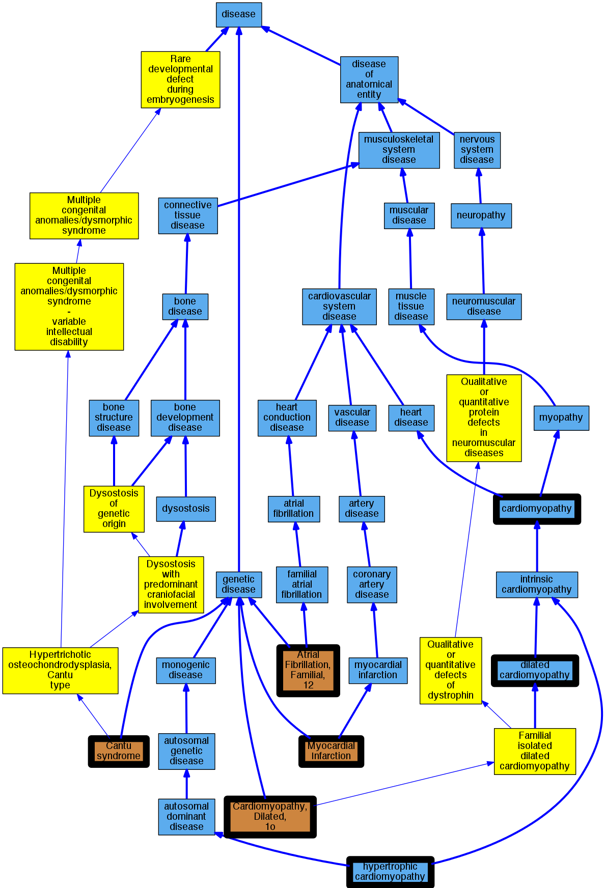

## GENE: ABCC9

[matched diseases visual](ABCC9.png)  <-- click on raw to zoom

### ATRIAL FIBRILLATION, FAMILIAL, 12
 * [OMIM:614050 Atrial Fibrillation, Familial, 12](http://beta.monarchinitiative.org/disease/OMIM:614050) Confidence: high
    * Syn: "ATFB12"
    * Syn: "ATRIAL FIBRILLATION, FAMILIAL, 12; ATFB12"

### Cardiomyopathy
 * [DOID:0050700 cardiomyopathy](http://beta.monarchinitiative.org/disease/DOID:0050700) Confidence: high
    * Equiv:[MESH:D009202 Cardiomyopathies](http://beta.monarchinitiative.org/disease/MESH:D009202)
    * Equiv:[Orphanet:167848 Cardiomyopathy](http://beta.monarchinitiative.org/disease/Orphanet:167848)
    * Syn: "Cardiomyopathies"
    * Syn: "Cardiomyopathies, Primary"
    * Syn: "Cardiomyopathies, Secondary"
    * Syn: "Cardiomyopathy"
    * Syn: "Cardiomyopathy, Primary"
    * Syn: "Cardiomyopathy, Secondary"
    * Syn: "Disease, Myocardial"
    * Syn: "Disease, Primary Myocardial"
    * Syn: "Disease, Secondary Myocardial"
    * Syn: "Diseases, Myocardial"
    * Syn: "Diseases, Primary Myocardial"
    * Syn: "Diseases, Secondary Myocardial"
    * Syn: "Myocardial Disease"
    * Syn: "Myocardial Disease, Primary"
    * Syn: "Myocardial Disease, Secondary"
    * Syn: "Myocardial Diseases"
    * Syn: "Myocardial Diseases, Primary"
    * Syn: "Myocardial Diseases, Secondary"
    * Syn: "Myocardiopathies"
    * Syn: "Myocardiopathy"
    * Syn: "Primary Cardiomyopathies"
    * Syn: "Primary Cardiomyopathy"
    * Syn: "Primary Myocardial Disease"
    * Syn: "Primary Myocardial Diseases"
    * Syn: "Secondary Cardiomyopathies"
    * Syn: "Secondary Cardiomyopathy"
    * Syn: "Secondary Myocardial Disease"
    * Syn: "Secondary Myocardial Diseases"

### Dilated Cardiomyopathy
 * [DOID:12930 dilated cardiomyopathy](http://beta.monarchinitiative.org/disease/DOID:12930) Confidence: high
    * Equiv:[Orphanet:217604 Dilated cardiomyopathy](http://beta.monarchinitiative.org/disease/Orphanet:217604)
    * Syn: "1A, Dilated cardiomyopathy"
    * Syn: "1As, Dilated cardiomyopathy"
    * Syn: "Cardiomyopathies, Congestive"
    * Syn: "Cardiomyopathies, Dilated"
    * Syn: "Cardiomyopathies, Familial Idiopathic"
    * Syn: "Cardiomyopathies, Idiopathic Dilated"
    * Syn: "cardiomyopathy 1A, Dilated"
    * Syn: "cardiomyopathy 1As, Dilated"
    * Syn: "Cardiomyopathy, Congestive"
    * Syn: "Cardiomyopathy, Dilated, 1a"
    * Syn: "Cardiomyopathy, Dilated, Autosomal Recessive"
    * Syn: "Cardiomyopathy, Dilated, CMD1A"
    * Syn: "Cardiomyopathy, Dilated, LMNA"
    * Syn: "Cardiomyopathy, Dilated, With Conduction Defect 1"
    * Syn: "Cardiomyopathy, Dilated, with Conduction Deffect1"
    * Syn: "Cardiomyopathy, Familial Idiopathic"
    * Syn: "Cardiomyopathy, Idiopathic Dilated"
    * Syn: "Congestive Cardiomyopathies"
    * Syn: "Congestive Cardiomyopathy"
    * Syn: "Congestive cardiomyopathy"
    * Syn: "Dilated Cardiomyopathies"
    * Syn: "Dilated Cardiomyopathies, Idiopathic"
    * Syn: "Dilated Cardiomyopathy"
    * Syn: "Dilated cardiomyopathy 1A"
    * Syn: "Dilated cardiomyopathy 1As"
    * Syn: "Dilated Cardiomyopathy, Idiopathic"
    * Syn: "Familial dilated cardiomyopathy"
    * Syn: "Familial Idiopathic Cardiomyopathies"
    * Syn: "Familial Idiopathic Cardiomyopathy"
    * Syn: "Idiopathic Cardiomyopathies, Familial"
    * Syn: "Idiopathic Cardiomyopathy, Familial"
    * Syn: "Idiopathic Dilated Cardiomyopathies"
    * Syn: "Idiopathic Dilated Cardiomyopathy"
    * Syn: "Idiopathic dilation cardiomyopathy"
    * Syn: "primary dilated cardiomyopathy"

### HYPERTRICHOTIC OSTEOCHONDRODYSPLASIA
 * [OMIM:239850 Hypertrichotic osteochondrodysplasia, Cantu type](http://beta.monarchinitiative.org/disease/OMIM:239850) Confidence: high
    * Equiv:[Orphanet:1517 Hypertrichotic osteochondrodysplasia, Cantu type](http://beta.monarchinitiative.org/disease/Orphanet:1517)
    * Equiv:[MESH:C535572 Cantu syndrome](http://beta.monarchinitiative.org/disease/MESH:C535572)
    * Syn: "CANTU SYNDROME"
    * Syn: "Hypertrichosis-Osteochondrodysplasia-Cardiomegaly Syndrome"
    * Syn: "Hypertrichotic Osteochondrodysplasia"
    * Syn: "Hypertrichotic osteochondrodysplasia"

### Primary familial hypertrophic cardiomyopathy
 * [DOID:11984 hypertrophic cardiomyopathy](http://beta.monarchinitiative.org/disease/DOID:11984) Confidence: low/0.1953125
    * Equiv:[MESH:D002312 Cardiomyopathy, Hypertrophic](http://beta.monarchinitiative.org/disease/MESH:D002312)
    * Equiv:[Orphanet:217569 Hypertrophic cardiomyopathy](http://beta.monarchinitiative.org/disease/Orphanet:217569)
    * Syn: "Cardiomyopathies, Hypertrophic"
    * Syn: "Cardiomyopathies, Hypertrophic Obstructive"
    * Syn: "Cardiomyopathy, Hypertrophic Obstructive"
    * Syn: "familial hypertrophic cardiomyopathy"
    * Syn: "Hypertrophic Cardiomyopathies"
    * Syn: "Hypertrophic Cardiomyopathy"
    * Syn: "Hypertrophic Obstructive Cardiomyopathies"
    * Syn: "Hypertrophic Obstructive Cardiomyopathy"
    * Syn: "hypertrophic obstructive cardiomyopathy"
    * Syn: "Hypertrophic subaortic stenosis"
    * Syn: "Obstructive Cardiomyopathies, Hypertrophic"
    * Syn: "Obstructive Cardiomyopathy, Hypertrophic"
    * Syn: "Obstructive hypertrophic cardiomyopathy"

### Cardiomyopathy
 * [DOID:0050700 cardiomyopathy](http://beta.monarchinitiative.org/disease/DOID:0050700) Confidence: high
    * Equiv:[MESH:D009202 Cardiomyopathies](http://beta.monarchinitiative.org/disease/MESH:D009202)
    * Equiv:[Orphanet:167848 Cardiomyopathy](http://beta.monarchinitiative.org/disease/Orphanet:167848)
    * Syn: "Cardiomyopathies"
    * Syn: "Cardiomyopathies, Primary"
    * Syn: "Cardiomyopathies, Secondary"
    * Syn: "Cardiomyopathy"
    * Syn: "Cardiomyopathy, Primary"
    * Syn: "Cardiomyopathy, Secondary"
    * Syn: "Disease, Myocardial"
    * Syn: "Disease, Primary Myocardial"
    * Syn: "Disease, Secondary Myocardial"
    * Syn: "Diseases, Myocardial"
    * Syn: "Diseases, Primary Myocardial"
    * Syn: "Diseases, Secondary Myocardial"
    * Syn: "Myocardial Disease"
    * Syn: "Myocardial Disease, Primary"
    * Syn: "Myocardial Disease, Secondary"
    * Syn: "Myocardial Diseases"
    * Syn: "Myocardial Diseases, Primary"
    * Syn: "Myocardial Diseases, Secondary"
    * Syn: "Myocardiopathies"
    * Syn: "Myocardiopathy"
    * Syn: "Primary Cardiomyopathies"
    * Syn: "Primary Cardiomyopathy"
    * Syn: "Primary Myocardial Disease"
    * Syn: "Primary Myocardial Diseases"
    * Syn: "Secondary Cardiomyopathies"
    * Syn: "Secondary Cardiomyopathy"
    * Syn: "Secondary Myocardial Disease"
    * Syn: "Secondary Myocardial Diseases"

### risk of Precocious Myocardial Infarction
 * [DOID:5844 myocardial infarction](http://beta.monarchinitiative.org/disease/DOID:5844) Confidence: low/0.14500000000000002
    * Equiv:[MESH:D009203 Myocardial Infarction](http://beta.monarchinitiative.org/disease/MESH:D009203)
    * Syn: "Cardiovascular Stroke"
    * Syn: "Cardiovascular Strokes"
    * Syn: "Heart Attack"
    * Syn: "heart attack"
    * Syn: "Heart Attacks"
    * Syn: "Infarct, Myocardial"
    * Syn: "Infarction, Myocardial"
    * Syn: "Infarctions, Myocardial"
    * Syn: "Infarcts, Myocardial"
    * Syn: "Myocardial Infarct"
    * Syn: "Myocardial infarct"
    * Syn: "Myocardial Infarctions"
    * Syn: "Myocardial Infarcts"
    * Syn: "Stroke, Cardiovascular"
    * Syn: "Strokes, Cardiovascular"

### Primary familial hypertrophic cardiomyopathy
 * [DOID:11984 hypertrophic cardiomyopathy](http://beta.monarchinitiative.org/disease/DOID:11984) Confidence: low/0.1953125
    * Equiv:[MESH:D002312 Cardiomyopathy, Hypertrophic](http://beta.monarchinitiative.org/disease/MESH:D002312)
    * Equiv:[Orphanet:217569 Hypertrophic cardiomyopathy](http://beta.monarchinitiative.org/disease/Orphanet:217569)
    * Syn: "Cardiomyopathies, Hypertrophic"
    * Syn: "Cardiomyopathies, Hypertrophic Obstructive"
    * Syn: "Cardiomyopathy, Hypertrophic Obstructive"
    * Syn: "familial hypertrophic cardiomyopathy"
    * Syn: "Hypertrophic Cardiomyopathies"
    * Syn: "Hypertrophic Cardiomyopathy"
    * Syn: "Hypertrophic Obstructive Cardiomyopathies"
    * Syn: "Hypertrophic Obstructive Cardiomyopathy"
    * Syn: "hypertrophic obstructive cardiomyopathy"
    * Syn: "Hypertrophic subaortic stenosis"
    * Syn: "Obstructive Cardiomyopathies, Hypertrophic"
    * Syn: "Obstructive Cardiomyopathy, Hypertrophic"
    * Syn: "Obstructive hypertrophic cardiomyopathy"

### CARDIOMYOPATHY, DILATED, 1O
 * [OMIM:608569 Cardiomyopathy, Dilated, 1O](http://beta.monarchinitiative.org/disease/OMIM:608569) Confidence: high
    * Equiv:[MESH:C563906 Cardiomyopathy, Dilated, 1o](http://beta.monarchinitiative.org/disease/MESH:C563906)
    * Syn: "CARDIOMYOPATHY, DILATED, 1O; CMD1O"
    * Syn: "Cardiomyopathy, Dilated, With Ventricular Tachycardia"
    * Syn: "Cardiomyopathy, Dilated, with Ventricular Tachycardia"
    * Syn: "CMD1O"

### Dilated Cardiomyopathy
 * [DOID:12930 dilated cardiomyopathy](http://beta.monarchinitiative.org/disease/DOID:12930) Confidence: high
    * Equiv:[Orphanet:217604 Dilated cardiomyopathy](http://beta.monarchinitiative.org/disease/Orphanet:217604)
    * Syn: "1A, Dilated cardiomyopathy"
    * Syn: "1As, Dilated cardiomyopathy"
    * Syn: "Cardiomyopathies, Congestive"
    * Syn: "Cardiomyopathies, Dilated"
    * Syn: "Cardiomyopathies, Familial Idiopathic"
    * Syn: "Cardiomyopathies, Idiopathic Dilated"
    * Syn: "cardiomyopathy 1A, Dilated"
    * Syn: "cardiomyopathy 1As, Dilated"
    * Syn: "Cardiomyopathy, Congestive"
    * Syn: "Cardiomyopathy, Dilated, 1a"
    * Syn: "Cardiomyopathy, Dilated, Autosomal Recessive"
    * Syn: "Cardiomyopathy, Dilated, CMD1A"
    * Syn: "Cardiomyopathy, Dilated, LMNA"
    * Syn: "Cardiomyopathy, Dilated, With Conduction Defect 1"
    * Syn: "Cardiomyopathy, Dilated, with Conduction Deffect1"
    * Syn: "Cardiomyopathy, Familial Idiopathic"
    * Syn: "Cardiomyopathy, Idiopathic Dilated"
    * Syn: "Congestive Cardiomyopathies"
    * Syn: "Congestive Cardiomyopathy"
    * Syn: "Congestive cardiomyopathy"
    * Syn: "Dilated Cardiomyopathies"
    * Syn: "Dilated Cardiomyopathies, Idiopathic"
    * Syn: "Dilated Cardiomyopathy"
    * Syn: "Dilated cardiomyopathy 1A"
    * Syn: "Dilated cardiomyopathy 1As"
    * Syn: "Dilated Cardiomyopathy, Idiopathic"
    * Syn: "Familial dilated cardiomyopathy"
    * Syn: "Familial Idiopathic Cardiomyopathies"
    * Syn: "Familial Idiopathic Cardiomyopathy"
    * Syn: "Idiopathic Cardiomyopathies, Familial"
    * Syn: "Idiopathic Cardiomyopathy, Familial"
    * Syn: "Idiopathic Dilated Cardiomyopathies"
    * Syn: "Idiopathic Dilated Cardiomyopathy"
    * Syn: "Idiopathic dilation cardiomyopathy"
    * Syn: "primary dilated cardiomyopathy"

### Myocardial infarction, association with
 * [DOID:5844 myocardial infarction](http://beta.monarchinitiative.org/disease/DOID:5844) Confidence: low/0.15625
    * Equiv:[MESH:D009203 Myocardial Infarction](http://beta.monarchinitiative.org/disease/MESH:D009203)
    * Syn: "Cardiovascular Stroke"
    * Syn: "Cardiovascular Strokes"
    * Syn: "Heart Attack"
    * Syn: "heart attack"
    * Syn: "Heart Attacks"
    * Syn: "Infarct, Myocardial"
    * Syn: "Infarction, Myocardial"
    * Syn: "Infarctions, Myocardial"
    * Syn: "Infarcts, Myocardial"
    * Syn: "Myocardial Infarct"
    * Syn: "Myocardial infarct"
    * Syn: "Myocardial Infarctions"
    * Syn: "Myocardial Infarcts"
    * Syn: "Stroke, Cardiovascular"
    * Syn: "Strokes, Cardiovascular"

### Primary familial hypertrophic cardiomyopathy
 * [DOID:11984 hypertrophic cardiomyopathy](http://beta.monarchinitiative.org/disease/DOID:11984) Confidence: low/0.1953125
    * Equiv:[MESH:D002312 Cardiomyopathy, Hypertrophic](http://beta.monarchinitiative.org/disease/MESH:D002312)
    * Equiv:[Orphanet:217569 Hypertrophic cardiomyopathy](http://beta.monarchinitiative.org/disease/Orphanet:217569)
    * Syn: "Cardiomyopathies, Hypertrophic"
    * Syn: "Cardiomyopathies, Hypertrophic Obstructive"
    * Syn: "Cardiomyopathy, Hypertrophic Obstructive"
    * Syn: "familial hypertrophic cardiomyopathy"
    * Syn: "Hypertrophic Cardiomyopathies"
    * Syn: "Hypertrophic Cardiomyopathy"
    * Syn: "Hypertrophic Obstructive Cardiomyopathies"
    * Syn: "Hypertrophic Obstructive Cardiomyopathy"
    * Syn: "hypertrophic obstructive cardiomyopathy"
    * Syn: "Hypertrophic subaortic stenosis"
    * Syn: "Obstructive Cardiomyopathies, Hypertrophic"
    * Syn: "Obstructive Cardiomyopathy, Hypertrophic"
    * Syn: "Obstructive hypertrophic cardiomyopathy"
