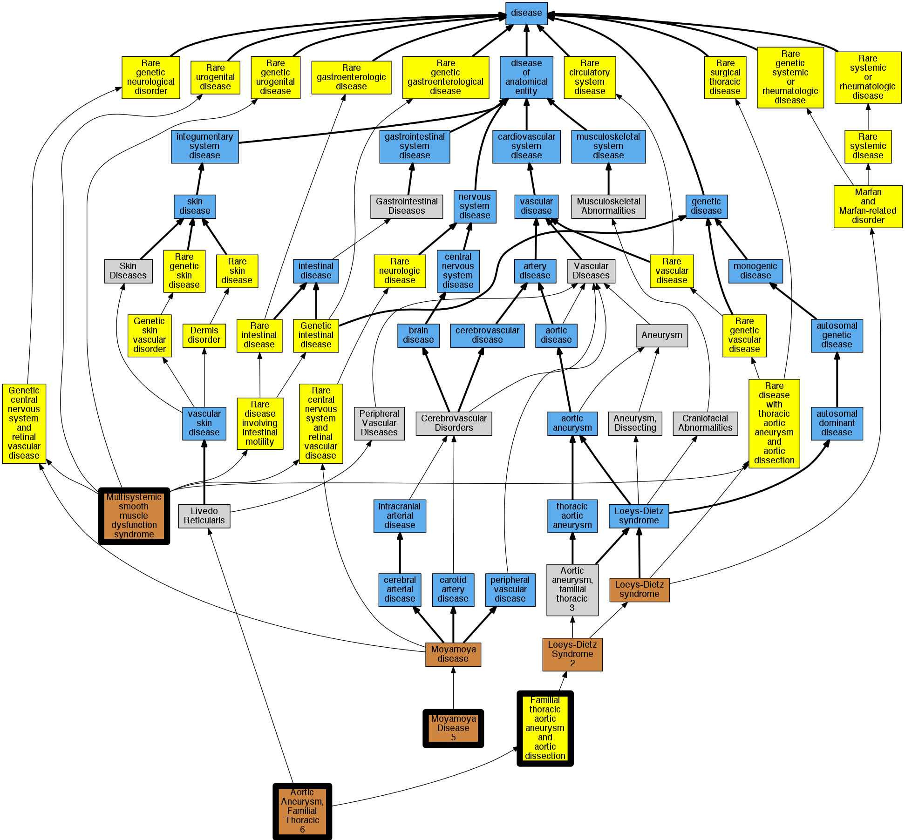

## GENE: ACTA2

[matched diseases visual](ACTA2.png)  <-- click on raw to zoom

### AORTIC ANEURYSM, FAMILIAL THORACIC 6
 * [OMIM:611788 Aortic Aneurysm, Familial Thoracic 6](http://beta.monarchinitiative.org/disease/OMIM:611788) Confidence: high
    * Equiv:[MESH:C567085 Aortic Aneurysm, Familial Thoracic 6](http://beta.monarchinitiative.org/disease/MESH:C567085)
    * Syn: "AAT6"
    * Syn: "Aat6"
    * Syn: "AORTIC ANEURYSM, FAMILIAL THORACIC 6; AAT6"
    * Syn: "Familial Thoracic Aortic Aneurysm With Livedo Reticularis And Iris Flocculi"
    * Syn: "Familial Thoracic Aortic Aneurysm With Livedo Reticularis and Iris Flocculi"

### MOYAMOYA DISEASE 5
 * [OMIM:614042 Moyamoya Disease 5](http://beta.monarchinitiative.org/disease/OMIM:614042) Confidence: high
    * Syn: "MOYAMOYA DISEASE 5; MYMY5"
    * Syn: "MYMY5"

### Aortic aneurysm, familial thoracic 6
 * [OMIM:611788 Aortic Aneurysm, Familial Thoracic 6](http://beta.monarchinitiative.org/disease/OMIM:611788) Confidence: high
    * Equiv:[MESH:C567085 Aortic Aneurysm, Familial Thoracic 6](http://beta.monarchinitiative.org/disease/MESH:C567085)
    * Syn: "AAT6"
    * Syn: "Aat6"
    * Syn: "AORTIC ANEURYSM, FAMILIAL THORACIC 6; AAT6"
    * Syn: "Familial Thoracic Aortic Aneurysm With Livedo Reticularis And Iris Flocculi"
    * Syn: "Familial Thoracic Aortic Aneurysm With Livedo Reticularis and Iris Flocculi"

### MULTISYSTEMIC SMOOTH MUSCLE DYSFUNCTION SYNDROME
 * [OMIM:613834 Multisystemic smooth muscle dysfunction syndrome](http://beta.monarchinitiative.org/disease/OMIM:613834) Confidence: high
    * Equiv:[Orphanet:404463 Multisystemic smooth muscle dysfunction syndrome](http://beta.monarchinitiative.org/disease/Orphanet:404463)
    * Syn: "MULTISYSTEMIC SMOOTH MUSCLE DYSFUNCTION SYNDROME"
    * Syn: "Mydriasis, Congenital, With Patent Ductus Arteriosus, Thoracic Aortic Aneurysm, and Vasculopathy"

### Thoracic aortic aneurysms and aortic dissections
 * [Orphanet:91387 Familial thoracic aortic aneurysm and aortic dissection](http://beta.monarchinitiative.org/disease/Orphanet:91387) Confidence: low/0.19097222222222224
    * Syn: "Familial TAAD"

### Thoracic aortic aneurysms and aortic dissections
 * [Orphanet:91387 Familial thoracic aortic aneurysm and aortic dissection](http://beta.monarchinitiative.org/disease/Orphanet:91387) Confidence: low/0.19097222222222224
    * Syn: "Familial TAAD"

### Aortopathy

### Thoracic aortic aneurysms and aortic dissections
 * [Orphanet:91387 Familial thoracic aortic aneurysm and aortic dissection](http://beta.monarchinitiative.org/disease/Orphanet:91387) Confidence: low/0.19097222222222224
    * Syn: "Familial TAAD"
