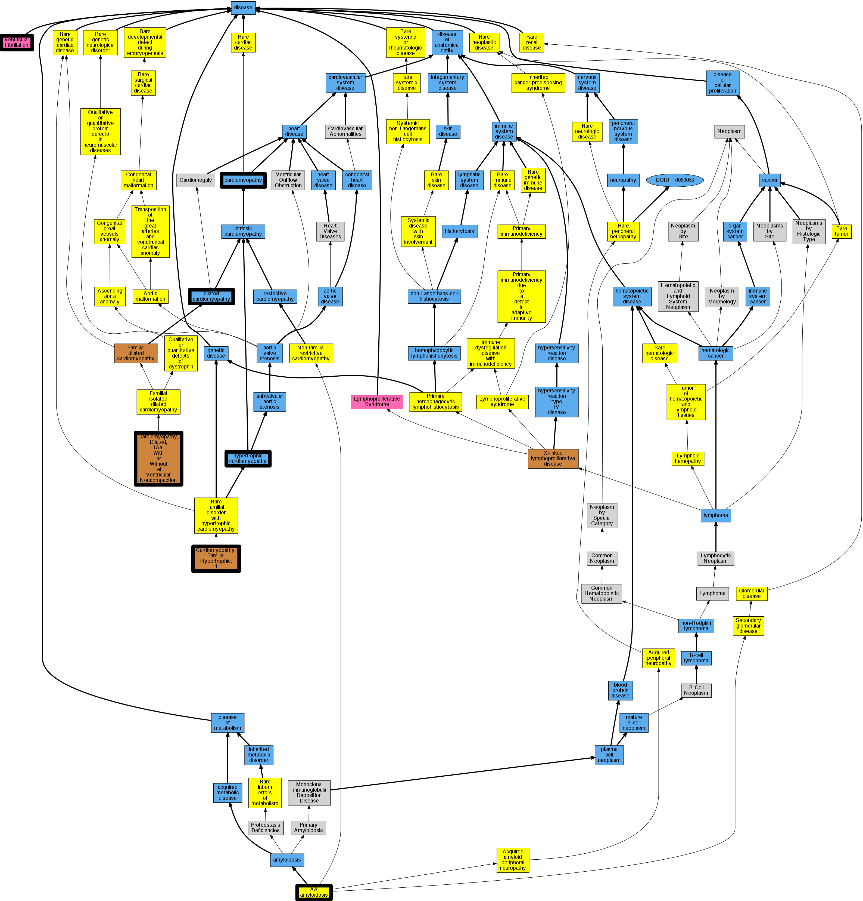

## GENE: ACTN2

[matched diseases visual](ACTN2.png)  <-- click on raw to zoom

### CARDIOMYOPATHY, FAMILIAL HYPERTROPHIC, 23
 * [DOID:13774 Addison's disease](http://beta.monarchinitiative.org/disease/DOID:13774) Confidence: low/0.0703125
    * Equiv:[MESH:D000224 Addison Disease](http://beta.monarchinitiative.org/disease/MESH:D000224)
    * Equiv:[Orphanet:85138 Addison disease](http://beta.monarchinitiative.org/disease/Orphanet:85138)
    * Syn: "Addison disease"
    * Syn: "Addison disease, chronic adrenal insufficiency"
    * Syn: "Addison's Disease"
    * Syn: "Addisons Disease"
    * Syn: "Adrenal Insufficiency, Primary"
    * Syn: "ADRENOCORTICAL HYPOFUNCTION, CHRONIC PRIMARY CONGENITAL "
    * Syn: "Adrenocortical Insufficiencies, Primary"
    * Syn: "Adrenocortical Insufficiency, Primary"
    * Syn: "Autoimmune Addison's disease"
    * Syn: "Autoimmune adrenalitis"
    * Syn: "Classic Addison's disease"
    * Syn: "Disease, Addison"
    * Syn: "Hypoadrenalism, Primary"
    * Syn: "Hypoadrenalisms, Primary"
    * Syn: "HYPOADRENOCORTICISM, FAMILIAL"
    * Syn: "Insufficiencies, Primary Adrenocortical"
    * Syn: "Insufficiency, Primary Adrenocortical"
    * Syn: "Primary Addison's disease"
    * Syn: "Primary Adrenal Insufficiency"
    * Syn: "Primary Adrenocortical Insufficiencies"
    * Syn: "Primary Adrenocortical Insufficiency"
    * Syn: "primary adrenocortical insufficiency (disorder)"
    * Syn: "Primary Hypoadrenalism"
    * Syn: "primary hypoadrenalism"

### Cardiomyopathy
 * [DOID:0050700 cardiomyopathy](http://beta.monarchinitiative.org/disease/DOID:0050700) Confidence: high
    * Equiv:[MESH:D009202 Cardiomyopathies](http://beta.monarchinitiative.org/disease/MESH:D009202)
    * Equiv:[Orphanet:167848 Cardiomyopathy](http://beta.monarchinitiative.org/disease/Orphanet:167848)
    * Syn: "Cardiomyopathies"
    * Syn: "Cardiomyopathies, Primary"
    * Syn: "Cardiomyopathies, Secondary"
    * Syn: "Cardiomyopathy"
    * Syn: "Cardiomyopathy, Primary"
    * Syn: "Cardiomyopathy, Secondary"
    * Syn: "Disease, Myocardial"
    * Syn: "Disease, Primary Myocardial"
    * Syn: "Disease, Secondary Myocardial"
    * Syn: "Diseases, Myocardial"
    * Syn: "Diseases, Primary Myocardial"
    * Syn: "Diseases, Secondary Myocardial"
    * Syn: "Myocardial Disease"
    * Syn: "Myocardial Disease, Primary"
    * Syn: "Myocardial Disease, Secondary"
    * Syn: "Myocardial Diseases"
    * Syn: "Myocardial Diseases, Primary"
    * Syn: "Myocardial Diseases, Secondary"
    * Syn: "Myocardiopathies"
    * Syn: "Myocardiopathy"
    * Syn: "Primary Cardiomyopathies"
    * Syn: "Primary Cardiomyopathy"
    * Syn: "Primary Myocardial Disease"
    * Syn: "Primary Myocardial Diseases"
    * Syn: "Secondary Cardiomyopathies"
    * Syn: "Secondary Cardiomyopathy"
    * Syn: "Secondary Myocardial Disease"
    * Syn: "Secondary Myocardial Diseases"

### Cardiomyopathy, hypertrophic
 * [DOID:11984 hypertrophic cardiomyopathy](http://beta.monarchinitiative.org/disease/DOID:11984) Confidence: high
    * Equiv:[MESH:D002312 Cardiomyopathy, Hypertrophic](http://beta.monarchinitiative.org/disease/MESH:D002312)
    * Equiv:[Orphanet:217569 Hypertrophic cardiomyopathy](http://beta.monarchinitiative.org/disease/Orphanet:217569)
    * Syn: "Cardiomyopathies, Hypertrophic"
    * Syn: "Cardiomyopathies, Hypertrophic Obstructive"
    * Syn: "Cardiomyopathy, Hypertrophic Obstructive"
    * Syn: "familial hypertrophic cardiomyopathy"
    * Syn: "Hypertrophic Cardiomyopathies"
    * Syn: "Hypertrophic Cardiomyopathy"
    * Syn: "Hypertrophic Obstructive Cardiomyopathies"
    * Syn: "Hypertrophic Obstructive Cardiomyopathy"
    * Syn: "hypertrophic obstructive cardiomyopathy"
    * Syn: "Hypertrophic subaortic stenosis"
    * Syn: "Obstructive Cardiomyopathies, Hypertrophic"
    * Syn: "Obstructive Cardiomyopathy, Hypertrophic"
    * Syn: "Obstructive hypertrophic cardiomyopathy"

### Familial hypertrophic cardiomyopathy 1
 * [OMIM:192600 Cardiomyopathy, Familial Hypertrophic, 1](http://beta.monarchinitiative.org/disease/OMIM:192600) Confidence: high
    * Equiv:[MESH:C566005 Cardiomyopathy, Familial Hypertrophic, 1](http://beta.monarchinitiative.org/disease/MESH:C566005)
    * Syn: "Asymmetric Septal Hypertrophy"
    * Syn: "CARDIOMYOPATHY, FAMILIAL HYPERTROPHIC, 1; CMH1"
    * Syn: "Cmh"
    * Syn: "CMH1"
    * Syn: "Hypertrophic Subaortic Stenosis, Idiopathic"
    * Syn: "Ventricular Hypertrophy, Hereditary"

### Hypertrophic cardiomyopathy
 * [DOID:11984 hypertrophic cardiomyopathy](http://beta.monarchinitiative.org/disease/DOID:11984) Confidence: high
    * Equiv:[MESH:D002312 Cardiomyopathy, Hypertrophic](http://beta.monarchinitiative.org/disease/MESH:D002312)
    * Equiv:[Orphanet:217569 Hypertrophic cardiomyopathy](http://beta.monarchinitiative.org/disease/Orphanet:217569)
    * Syn: "Cardiomyopathies, Hypertrophic"
    * Syn: "Cardiomyopathies, Hypertrophic Obstructive"
    * Syn: "Cardiomyopathy, Hypertrophic Obstructive"
    * Syn: "familial hypertrophic cardiomyopathy"
    * Syn: "Hypertrophic Cardiomyopathies"
    * Syn: "Hypertrophic Cardiomyopathy"
    * Syn: "Hypertrophic Obstructive Cardiomyopathies"
    * Syn: "Hypertrophic Obstructive Cardiomyopathy"
    * Syn: "hypertrophic obstructive cardiomyopathy"
    * Syn: "Hypertrophic subaortic stenosis"
    * Syn: "Obstructive Cardiomyopathies, Hypertrophic"
    * Syn: "Obstructive Cardiomyopathy, Hypertrophic"
    * Syn: "Obstructive hypertrophic cardiomyopathy"

### CARDIOMYOPATHY, DILATED, 1AA
 * [Orphanet:85445 AA amyloidosis](http://beta.monarchinitiative.org/disease/Orphanet:85445) Confidence: low/0.0703125
    * Syn: "Inflammatory amyloidosis"
    * Syn: "Reactive amyloidosis"
    * Syn: "Secondary amyloidosis"

### Hypertrophic cardiomyopathy
 * [DOID:11984 hypertrophic cardiomyopathy](http://beta.monarchinitiative.org/disease/DOID:11984) Confidence: high
    * Equiv:[MESH:D002312 Cardiomyopathy, Hypertrophic](http://beta.monarchinitiative.org/disease/MESH:D002312)
    * Equiv:[Orphanet:217569 Hypertrophic cardiomyopathy](http://beta.monarchinitiative.org/disease/Orphanet:217569)
    * Syn: "Cardiomyopathies, Hypertrophic"
    * Syn: "Cardiomyopathies, Hypertrophic Obstructive"
    * Syn: "Cardiomyopathy, Hypertrophic Obstructive"
    * Syn: "familial hypertrophic cardiomyopathy"
    * Syn: "Hypertrophic Cardiomyopathies"
    * Syn: "Hypertrophic Cardiomyopathy"
    * Syn: "Hypertrophic Obstructive Cardiomyopathies"
    * Syn: "Hypertrophic Obstructive Cardiomyopathy"
    * Syn: "hypertrophic obstructive cardiomyopathy"
    * Syn: "Hypertrophic subaortic stenosis"
    * Syn: "Obstructive Cardiomyopathies, Hypertrophic"
    * Syn: "Obstructive Cardiomyopathy, Hypertrophic"
    * Syn: "Obstructive hypertrophic cardiomyopathy"

### CARDIOMYOPATHY, DILATED, 1AA, WITH OR WITHOUT LEFT VENTRICULAR NONCOMPACTION
 * [OMIM:612158 Cardiomyopathy, Dilated, 1Aa, With or Without Left Ventricular Noncompaction](http://beta.monarchinitiative.org/disease/OMIM:612158) Confidence: high
    * Equiv:[MESH:C567407 Cardiomyopathy, Dilated, 1AA](http://beta.monarchinitiative.org/disease/MESH:C567407)
    * Syn: "CARDIOMYOPATHY, DILATED, 1AA, WITH OR WITHOUT LEFT VENTRICULAR NONCOMPACTION; CMD1AA"
    * Syn: "Cardiomyopathy, Familial Hypertrophic, 23, With or Without Ventricular Noncompaction"
    * Syn: "CMD1AA"

### Cardiomyopathy, dilated
 * [DOID:12930 dilated cardiomyopathy](http://beta.monarchinitiative.org/disease/DOID:12930) Confidence: high
    * Equiv:[Orphanet:217604 Dilated cardiomyopathy](http://beta.monarchinitiative.org/disease/Orphanet:217604)
    * Syn: "1A, Dilated cardiomyopathy"
    * Syn: "1As, Dilated cardiomyopathy"
    * Syn: "Cardiomyopathies, Congestive"
    * Syn: "Cardiomyopathies, Dilated"
    * Syn: "Cardiomyopathies, Familial Idiopathic"
    * Syn: "Cardiomyopathies, Idiopathic Dilated"
    * Syn: "cardiomyopathy 1A, Dilated"
    * Syn: "cardiomyopathy 1As, Dilated"
    * Syn: "Cardiomyopathy, Congestive"
    * Syn: "Cardiomyopathy, Dilated, 1a"
    * Syn: "Cardiomyopathy, Dilated, Autosomal Recessive"
    * Syn: "Cardiomyopathy, Dilated, CMD1A"
    * Syn: "Cardiomyopathy, Dilated, LMNA"
    * Syn: "Cardiomyopathy, Dilated, With Conduction Defect 1"
    * Syn: "Cardiomyopathy, Dilated, with Conduction Deffect1"
    * Syn: "Cardiomyopathy, Familial Idiopathic"
    * Syn: "Cardiomyopathy, Idiopathic Dilated"
    * Syn: "Congestive Cardiomyopathies"
    * Syn: "Congestive Cardiomyopathy"
    * Syn: "Congestive cardiomyopathy"
    * Syn: "Dilated Cardiomyopathies"
    * Syn: "Dilated Cardiomyopathies, Idiopathic"
    * Syn: "Dilated Cardiomyopathy"
    * Syn: "Dilated cardiomyopathy 1A"
    * Syn: "Dilated cardiomyopathy 1As"
    * Syn: "Dilated Cardiomyopathy, Idiopathic"
    * Syn: "Familial dilated cardiomyopathy"
    * Syn: "Familial Idiopathic Cardiomyopathies"
    * Syn: "Familial Idiopathic Cardiomyopathy"
    * Syn: "Idiopathic Cardiomyopathies, Familial"
    * Syn: "Idiopathic Cardiomyopathy, Familial"
    * Syn: "Idiopathic Dilated Cardiomyopathies"
    * Syn: "Idiopathic Dilated Cardiomyopathy"
    * Syn: "Idiopathic dilation cardiomyopathy"
    * Syn: "primary dilated cardiomyopathy"

### Cardiomyopathy, dilated
 * [DOID:12930 dilated cardiomyopathy](http://beta.monarchinitiative.org/disease/DOID:12930) Confidence: high
    * Equiv:[Orphanet:217604 Dilated cardiomyopathy](http://beta.monarchinitiative.org/disease/Orphanet:217604)
    * Syn: "1A, Dilated cardiomyopathy"
    * Syn: "1As, Dilated cardiomyopathy"
    * Syn: "Cardiomyopathies, Congestive"
    * Syn: "Cardiomyopathies, Dilated"
    * Syn: "Cardiomyopathies, Familial Idiopathic"
    * Syn: "Cardiomyopathies, Idiopathic Dilated"
    * Syn: "cardiomyopathy 1A, Dilated"
    * Syn: "cardiomyopathy 1As, Dilated"
    * Syn: "Cardiomyopathy, Congestive"
    * Syn: "Cardiomyopathy, Dilated, 1a"
    * Syn: "Cardiomyopathy, Dilated, Autosomal Recessive"
    * Syn: "Cardiomyopathy, Dilated, CMD1A"
    * Syn: "Cardiomyopathy, Dilated, LMNA"
    * Syn: "Cardiomyopathy, Dilated, With Conduction Defect 1"
    * Syn: "Cardiomyopathy, Dilated, with Conduction Deffect1"
    * Syn: "Cardiomyopathy, Familial Idiopathic"
    * Syn: "Cardiomyopathy, Idiopathic Dilated"
    * Syn: "Congestive Cardiomyopathies"
    * Syn: "Congestive Cardiomyopathy"
    * Syn: "Congestive cardiomyopathy"
    * Syn: "Dilated Cardiomyopathies"
    * Syn: "Dilated Cardiomyopathies, Idiopathic"
    * Syn: "Dilated Cardiomyopathy"
    * Syn: "Dilated cardiomyopathy 1A"
    * Syn: "Dilated cardiomyopathy 1As"
    * Syn: "Dilated Cardiomyopathy, Idiopathic"
    * Syn: "Familial dilated cardiomyopathy"
    * Syn: "Familial Idiopathic Cardiomyopathies"
    * Syn: "Familial Idiopathic Cardiomyopathy"
    * Syn: "Idiopathic Cardiomyopathies, Familial"
    * Syn: "Idiopathic Cardiomyopathy, Familial"
    * Syn: "Idiopathic Dilated Cardiomyopathies"
    * Syn: "Idiopathic Dilated Cardiomyopathy"
    * Syn: "Idiopathic dilation cardiomyopathy"
    * Syn: "primary dilated cardiomyopathy"

### Primary familial hypertrophic cardiomyopathy
 * [DOID:11984 hypertrophic cardiomyopathy](http://beta.monarchinitiative.org/disease/DOID:11984) Confidence: low/0.1953125
    * Equiv:[MESH:D002312 Cardiomyopathy, Hypertrophic](http://beta.monarchinitiative.org/disease/MESH:D002312)
    * Equiv:[Orphanet:217569 Hypertrophic cardiomyopathy](http://beta.monarchinitiative.org/disease/Orphanet:217569)
    * Syn: "Cardiomyopathies, Hypertrophic"
    * Syn: "Cardiomyopathies, Hypertrophic Obstructive"
    * Syn: "Cardiomyopathy, Hypertrophic Obstructive"
    * Syn: "familial hypertrophic cardiomyopathy"
    * Syn: "Hypertrophic Cardiomyopathies"
    * Syn: "Hypertrophic Cardiomyopathy"
    * Syn: "Hypertrophic Obstructive Cardiomyopathies"
    * Syn: "Hypertrophic Obstructive Cardiomyopathy"
    * Syn: "hypertrophic obstructive cardiomyopathy"
    * Syn: "Hypertrophic subaortic stenosis"
    * Syn: "Obstructive Cardiomyopathies, Hypertrophic"
    * Syn: "Obstructive Cardiomyopathy, Hypertrophic"
    * Syn: "Obstructive hypertrophic cardiomyopathy"

### CARDIOMYOPATHY, FAMILIAL HYPERTROPHIC, 23, WITH OR WITHOUT LEFT VENTRICULAR NONCOMPACTION
 * [OMIM:612158 Cardiomyopathy, Dilated, 1Aa, With or Without Left Ventricular Noncompaction](http://beta.monarchinitiative.org/disease/OMIM:612158) Confidence: low/0.09375
    * Equiv:[MESH:C567407 Cardiomyopathy, Dilated, 1AA](http://beta.monarchinitiative.org/disease/MESH:C567407)
    * Syn: "CARDIOMYOPATHY, DILATED, 1AA, WITH OR WITHOUT LEFT VENTRICULAR NONCOMPACTION; CMD1AA"
    * Syn: "Cardiomyopathy, Familial Hypertrophic, 23, With or Without Ventricular Noncompaction"
    * Syn: "CMD1AA"

### Cardiomyopathy
 * [DOID:0050700 cardiomyopathy](http://beta.monarchinitiative.org/disease/DOID:0050700) Confidence: high
    * Equiv:[MESH:D009202 Cardiomyopathies](http://beta.monarchinitiative.org/disease/MESH:D009202)
    * Equiv:[Orphanet:167848 Cardiomyopathy](http://beta.monarchinitiative.org/disease/Orphanet:167848)
    * Syn: "Cardiomyopathies"
    * Syn: "Cardiomyopathies, Primary"
    * Syn: "Cardiomyopathies, Secondary"
    * Syn: "Cardiomyopathy"
    * Syn: "Cardiomyopathy, Primary"
    * Syn: "Cardiomyopathy, Secondary"
    * Syn: "Disease, Myocardial"
    * Syn: "Disease, Primary Myocardial"
    * Syn: "Disease, Secondary Myocardial"
    * Syn: "Diseases, Myocardial"
    * Syn: "Diseases, Primary Myocardial"
    * Syn: "Diseases, Secondary Myocardial"
    * Syn: "Myocardial Disease"
    * Syn: "Myocardial Disease, Primary"
    * Syn: "Myocardial Disease, Secondary"
    * Syn: "Myocardial Diseases"
    * Syn: "Myocardial Diseases, Primary"
    * Syn: "Myocardial Diseases, Secondary"
    * Syn: "Myocardiopathies"
    * Syn: "Myocardiopathy"
    * Syn: "Primary Cardiomyopathies"
    * Syn: "Primary Cardiomyopathy"
    * Syn: "Primary Myocardial Disease"
    * Syn: "Primary Myocardial Diseases"
    * Syn: "Secondary Cardiomyopathies"
    * Syn: "Secondary Cardiomyopathy"
    * Syn: "Secondary Myocardial Disease"
    * Syn: "Secondary Myocardial Diseases"

### Primary familial hypertrophic cardiomyopathy
 * [DOID:11984 hypertrophic cardiomyopathy](http://beta.monarchinitiative.org/disease/DOID:11984) Confidence: low/0.1953125
    * Equiv:[MESH:D002312 Cardiomyopathy, Hypertrophic](http://beta.monarchinitiative.org/disease/MESH:D002312)
    * Equiv:[Orphanet:217569 Hypertrophic cardiomyopathy](http://beta.monarchinitiative.org/disease/Orphanet:217569)
    * Syn: "Cardiomyopathies, Hypertrophic"
    * Syn: "Cardiomyopathies, Hypertrophic Obstructive"
    * Syn: "Cardiomyopathy, Hypertrophic Obstructive"
    * Syn: "familial hypertrophic cardiomyopathy"
    * Syn: "Hypertrophic Cardiomyopathies"
    * Syn: "Hypertrophic Cardiomyopathy"
    * Syn: "Hypertrophic Obstructive Cardiomyopathies"
    * Syn: "Hypertrophic Obstructive Cardiomyopathy"
    * Syn: "hypertrophic obstructive cardiomyopathy"
    * Syn: "Hypertrophic subaortic stenosis"
    * Syn: "Obstructive Cardiomyopathies, Hypertrophic"
    * Syn: "Obstructive Cardiomyopathy, Hypertrophic"
    * Syn: "Obstructive hypertrophic cardiomyopathy"

### Primary familial hypertrophic cardiomyopathy
 * [DOID:11984 hypertrophic cardiomyopathy](http://beta.monarchinitiative.org/disease/DOID:11984) Confidence: low/0.1953125
    * Equiv:[MESH:D002312 Cardiomyopathy, Hypertrophic](http://beta.monarchinitiative.org/disease/MESH:D002312)
    * Equiv:[Orphanet:217569 Hypertrophic cardiomyopathy](http://beta.monarchinitiative.org/disease/Orphanet:217569)
    * Syn: "Cardiomyopathies, Hypertrophic"
    * Syn: "Cardiomyopathies, Hypertrophic Obstructive"
    * Syn: "Cardiomyopathy, Hypertrophic Obstructive"
    * Syn: "familial hypertrophic cardiomyopathy"
    * Syn: "Hypertrophic Cardiomyopathies"
    * Syn: "Hypertrophic Cardiomyopathy"
    * Syn: "Hypertrophic Obstructive Cardiomyopathies"
    * Syn: "Hypertrophic Obstructive Cardiomyopathy"
    * Syn: "hypertrophic obstructive cardiomyopathy"
    * Syn: "Hypertrophic subaortic stenosis"
    * Syn: "Obstructive Cardiomyopathies, Hypertrophic"
    * Syn: "Obstructive Cardiomyopathy, Hypertrophic"
    * Syn: "Obstructive hypertrophic cardiomyopathy"

### Ventricular fibrillation
 * [DC:0000692 Ventricular Fibrillation](http://beta.monarchinitiative.org/disease/DC:0000692) Confidence: high
