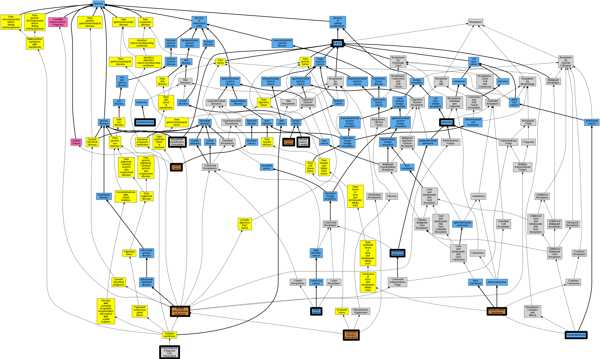

## GENE: APC

[matched diseases visual](APC.png)  <-- click on raw to zoom

### ADENOMA, PERIAMPULLARY, SOMATIC
 * [MESH:D000236 Adenoma](http://beta.monarchinitiative.org/disease/MESH:D000236) Confidence: low/0.1388888888888889

### ADENOMATOUS POLYPOSIS COLI WITH CONGENITAL CHOLESTEATOMA
 * [OMIM:604183 Cholesteatoma, Congenital](http://beta.monarchinitiative.org/disease/OMIM:604183) Confidence: low/0.1388888888888889
    * Equiv:[MESH:C562858 Cholesteatoma, Congenital](http://beta.monarchinitiative.org/disease/MESH:C562858)
    * Syn: "CHOLESTEATOMA, CONGENITAL"

### Adenomatous polyposis coli
 * [MESH:D011125 Adenomatous Polyposis Coli](http://beta.monarchinitiative.org/disease/MESH:D011125) Confidence: high

### BRAIN TUMOR-POLYPOSIS SYNDROME 2
 * [OMIM:175100 Adenomatous Polyposis Coli, Attenuated](http://beta.monarchinitiative.org/disease/OMIM:175100) Confidence: high
    * Equiv:[MESH:C538265 Attenuated familial adenomatous polyposis](http://beta.monarchinitiative.org/disease/MESH:C538265)
    * Equiv:[MESH:C566778 Adenomatous Polyposis Coli, Attenuated](http://beta.monarchinitiative.org/disease/MESH:C566778)
    * Equiv:[MESH:D005736 Gardner Syndrome](http://beta.monarchinitiative.org/disease/MESH:D005736)
    * Syn: "Adenomatous Polyposis Coli, Attenuated"
    * Syn: "Adenomatous Polyposis of the Colon"
    * Syn: "Brain Tumor-Polyposis Syndrome 2"
    * Syn: "FAMILIAL ADENOMATOUS POLYPOSIS 1; FAP1"
    * Syn: "Familial Adenomatous Polyposis, Attenuated"
    * Syn: "Familial Polyposis of the Colon"
    * Syn: "FAP1"
    * Syn: "Gardner Syndrome"
    * Syn: "Polyposis, Adenomatous Intestinal"

### BREAST CANCER, SUSCEPTIBILITY TO
 * [OMIM:114480 Breast Cancer, Familial](http://beta.monarchinitiative.org/disease/OMIM:114480) Confidence: low/0.15625
    * Equiv:[MESH:C562840 Breast Cancer, Familial](http://beta.monarchinitiative.org/disease/MESH:C562840)
    * Syn: "BREAST CANCER"
    * Syn: "Breast Cancer, Familial"
    * Syn: "Breast Cancer, Familial Male"

### COLORECTAL CANCER, SOMATIC
 * [OMIM:114500 Colorectal Cancer](http://beta.monarchinitiative.org/disease/OMIM:114500) Confidence: low/0.1388888888888889
    * Syn: "Colon Cancer"
    * Syn: "COLORECTAL CANCER; CRC"
    * Syn: "CRC"

### Colon cancer
 * [DOID:219 colon cancer](http://beta.monarchinitiative.org/disease/DOID:219) Confidence: high

### Colorectal adenoma
 * [DOID:0050860 colorectal adenoma](http://beta.monarchinitiative.org/disease/DOID:0050860) Confidence: high

### DESMOID DISEASE, HEREDITARY
 * [OMIM:135290 Desmoid disease, hereditary](http://beta.monarchinitiative.org/disease/OMIM:135290) Confidence: high
    * Equiv:[MESH:C535944 Desmoid disease, hereditary](http://beta.monarchinitiative.org/disease/MESH:C535944)
    * Syn: "DESMOID DISEASE, HEREDITARY"
    * Syn: "Desmoid Tumor Caused by Somatic Mutation"
    * Syn: "Fibromatosis, Familial Infiltrative"

### DESMOID TUMOR, SOMATIC
 * [Orphanet:873 Desmoid tumor](http://beta.monarchinitiative.org/disease/Orphanet:873) Confidence: low/0.18055555555555555

### FAMILIAL ADENOMATOUS POLYPOSIS 1
 * [OMIM:175100 Adenomatous Polyposis Coli, Attenuated](http://beta.monarchinitiative.org/disease/OMIM:175100) Confidence: low/0.18000000000000002
    * Equiv:[MESH:C538265 Attenuated familial adenomatous polyposis](http://beta.monarchinitiative.org/disease/MESH:C538265)
    * Equiv:[MESH:C566778 Adenomatous Polyposis Coli, Attenuated](http://beta.monarchinitiative.org/disease/MESH:C566778)
    * Equiv:[MESH:D005736 Gardner Syndrome](http://beta.monarchinitiative.org/disease/MESH:D005736)
    * Syn: "Adenomatous Polyposis Coli, Attenuated"
    * Syn: "Adenomatous Polyposis of the Colon"
    * Syn: "Brain Tumor-Polyposis Syndrome 2"
    * Syn: "FAMILIAL ADENOMATOUS POLYPOSIS 1; FAP1"
    * Syn: "Familial Adenomatous Polyposis, Attenuated"
    * Syn: "Familial Polyposis of the Colon"
    * Syn: "FAP1"
    * Syn: "Gardner Syndrome"
    * Syn: "Polyposis, Adenomatous Intestinal"

### FAMILIAL ADENOMATOUS POLYPOSIS 1, ATTENUATED
 * [OMIM:175100 Adenomatous Polyposis Coli, Attenuated](http://beta.monarchinitiative.org/disease/OMIM:175100) Confidence: low/0.18000000000000002
    * Equiv:[MESH:C538265 Attenuated familial adenomatous polyposis](http://beta.monarchinitiative.org/disease/MESH:C538265)
    * Equiv:[MESH:C566778 Adenomatous Polyposis Coli, Attenuated](http://beta.monarchinitiative.org/disease/MESH:C566778)
    * Equiv:[MESH:D005736 Gardner Syndrome](http://beta.monarchinitiative.org/disease/MESH:D005736)
    * Syn: "Adenomatous Polyposis Coli, Attenuated"
    * Syn: "Adenomatous Polyposis of the Colon"
    * Syn: "Brain Tumor-Polyposis Syndrome 2"
    * Syn: "FAMILIAL ADENOMATOUS POLYPOSIS 1; FAP1"
    * Syn: "Familial Adenomatous Polyposis, Attenuated"
    * Syn: "Familial Polyposis of the Colon"
    * Syn: "FAP1"
    * Syn: "Gardner Syndrome"
    * Syn: "Polyposis, Adenomatous Intestinal"

### FAMILIAL ADENOMATOUS POLYPOSIS 1, SUSCEPTIBILITY TO
 * [OMIM:175100 Adenomatous Polyposis Coli, Attenuated](http://beta.monarchinitiative.org/disease/OMIM:175100) Confidence: low/0.15555555555555556
    * Equiv:[MESH:C538265 Attenuated familial adenomatous polyposis](http://beta.monarchinitiative.org/disease/MESH:C538265)
    * Equiv:[MESH:C566778 Adenomatous Polyposis Coli, Attenuated](http://beta.monarchinitiative.org/disease/MESH:C566778)
    * Equiv:[MESH:D005736 Gardner Syndrome](http://beta.monarchinitiative.org/disease/MESH:D005736)
    * Syn: "Adenomatous Polyposis Coli, Attenuated"
    * Syn: "Adenomatous Polyposis of the Colon"
    * Syn: "Brain Tumor-Polyposis Syndrome 2"
    * Syn: "FAMILIAL ADENOMATOUS POLYPOSIS 1; FAP1"
    * Syn: "Familial Adenomatous Polyposis, Attenuated"
    * Syn: "Familial Polyposis of the Colon"
    * Syn: "FAP1"
    * Syn: "Gardner Syndrome"
    * Syn: "Polyposis, Adenomatous Intestinal"

### Familial Adenomatous Polyposis
 * [DOID:0050424 familial adenomatous polyposis](http://beta.monarchinitiative.org/disease/DOID:0050424) Confidence: high
    * Syn: "adenomatous polyposis of the colon"

### GARDNER SYNDROME
 * [Orphanet:79665 Gardner syndrome](http://beta.monarchinitiative.org/disease/Orphanet:79665) Confidence: high

### GASTRIC CANCER, SOMATIC
 * [OMIM:613659 Gastric Cancer](http://beta.monarchinitiative.org/disease/OMIM:613659) Confidence: low/0.18055555555555555
    * Syn: "GASTRIC CANCER"
    * Syn: "Gastric Cancer, Intestinal"

### HEPATOBLASTOMA, SOMATIC
 * [OMIM:114550 Hepatoblastoma Caused By Somatic Mutation](http://beta.monarchinitiative.org/disease/OMIM:114550) Confidence: low/0.15625
    * Equiv:[MESH:C567299 Hepatoblastoma Caused By Somatic Mutation](http://beta.monarchinitiative.org/disease/MESH:C567299)
    * Syn: "Cancer, Hepatocellular"
    * Syn: "Hcc"
    * Syn: "Hepatoblastoma"
    * Syn: "Hepatoblastoma Caused by Somatic Mutation"
    * Syn: "HEPATOCELLULAR CARCINOMA"
    * Syn: "Hepatoma"
    * Syn: "Liver Cancer"
    * Syn: "Liver Cell Carcinoma"

### HEPATOCELLULAR CARCINOMA, SOMATIC
 * [OMIM:114550 Hepatoblastoma Caused By Somatic Mutation](http://beta.monarchinitiative.org/disease/OMIM:114550) Confidence: low/0.18055555555555555
    * Equiv:[MESH:C567299 Hepatoblastoma Caused By Somatic Mutation](http://beta.monarchinitiative.org/disease/MESH:C567299)
    * Syn: "Cancer, Hepatocellular"
    * Syn: "Hcc"
    * Syn: "Hepatoblastoma"
    * Syn: "Hepatoblastoma Caused by Somatic Mutation"
    * Syn: "HEPATOCELLULAR CARCINOMA"
    * Syn: "Hepatoma"
    * Syn: "Liver Cancer"
    * Syn: "Liver Cell Carcinoma"

### Neoplastic Syndromes, Hereditary
 * [MESH:D009386 Neoplastic Syndromes, Hereditary](http://beta.monarchinitiative.org/disease/MESH:D009386) Confidence: high
