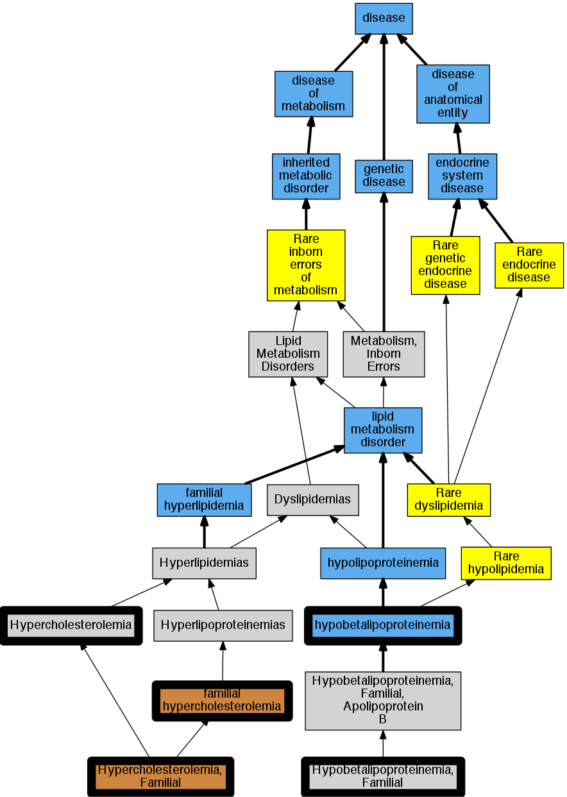

## GENE: APOB

[matched diseases visual](APOB.png)  <-- click on raw to zoom

### APOB POLYMORPHISM IN SIGNAL PEPTIDE
 * [results_in -](http://beta.monarchinitiative.org/disease/results_in) Confidence: low/0.0675

### Familial Hypercholesterolemia
 * [DOID:13810 familial hypercholesterolemia](http://beta.monarchinitiative.org/disease/DOID:13810) Confidence: high
    * Syn: "familial hyperbetalipoproteinaemia"
    * Syn: "familial hypercholesteremia"
    * Syn: "Fredrickson type IIa hyperlipoproteinemia"
    * Syn: "Fredrickson type IIa lipidaemia"
    * Syn: "hyperbetalipoproteinemia"
    * Syn: "type II hyperlipidemia"

### Familial hypercholesterolemia
 * [DOID:13810 familial hypercholesterolemia](http://beta.monarchinitiative.org/disease/DOID:13810) Confidence: high
    * Syn: "familial hyperbetalipoproteinaemia"
    * Syn: "familial hypercholesteremia"
    * Syn: "Fredrickson type IIa hyperlipoproteinemia"
    * Syn: "Fredrickson type IIa lipidaemia"
    * Syn: "hyperbetalipoproteinemia"
    * Syn: "type II hyperlipidemia"

### HYPERCHOLESTEROLEMIA DUE TO LIGAND-DEFECTIVE APOLIPOPROTEIN B100
 * [OMIM:143890 Hypercholesterolemia](http://beta.monarchinitiative.org/disease/OMIM:143890) Confidence: low/0.12755102040816327
    * Equiv:[MESH:D006937 Hypercholesterolemia](http://beta.monarchinitiative.org/disease/MESH:D006937)
    * Syn: "Fhc"
    * Syn: "Hyper-Low-Density-Lipoproteinemia"
    * Syn: "HYPERCHOLESTEROLEMIA, FAMILIAL"
    * Syn: "Hypercholesterolemic Xanthomatosis, Familial"
    * Syn: "Hyperlipoproteinemia, Type 2"
    * Syn: "Hyperlipoproteinemia, Type 2A"
    * Syn: "Ldl Receptor Disorder"
    * Syn: "Low Density Lipoprotein Cholesterol Level Quantitative Trait Locus 2"

### HYPOBETALIPOPROTEINEMIA, FAMILIAL
 * [MESH:C566267 Hypobetalipoproteinemia, Familial](http://beta.monarchinitiative.org/disease/MESH:C566267) Confidence: high

### HYPOBETALIPOPROTEINEMIA, FAMILIAL, ASSOCIATED WITH APOB31
 * [MESH:D006995 Hypobetalipoproteinemias](http://beta.monarchinitiative.org/disease/MESH:D006995) Confidence: low/0.13

### HYPOBETALIPOPROTEINEMIA, FAMILIAL, ASSOCIATED WITH APOB32
 * [MESH:D006995 Hypobetalipoproteinemias](http://beta.monarchinitiative.org/disease/MESH:D006995) Confidence: low/0.13

### HYPOBETALIPOPROTEINEMIA, FAMILIAL, ASSOCIATED WITH APOB39
 * [MESH:D006995 Hypobetalipoproteinemias](http://beta.monarchinitiative.org/disease/MESH:D006995) Confidence: low/0.13

### HYPOBETALIPOPROTEINEMIA, FAMILIAL, ASSOCIATED WITH APOB40
 * [MESH:D006995 Hypobetalipoproteinemias](http://beta.monarchinitiative.org/disease/MESH:D006995) Confidence: low/0.13

### HYPOBETALIPOPROTEINEMIA, FAMILIAL, ASSOCIATED WITH APOB46
 * [MESH:D006995 Hypobetalipoproteinemias](http://beta.monarchinitiative.org/disease/MESH:D006995) Confidence: low/0.13

### HYPOBETALIPOPROTEINEMIA, FAMILIAL, ASSOCIATED WITH APOB87
 * [MESH:D006995 Hypobetalipoproteinemias](http://beta.monarchinitiative.org/disease/MESH:D006995) Confidence: low/0.13

### HYPOBETALIPOPROTEINEMIA, FAMILIAL, ASSOCIATED WITH APOB90 OR APOB89
 * [MESH:D006995 Hypobetalipoproteinemias](http://beta.monarchinitiative.org/disease/MESH:D006995) Confidence: low/0.12755102040816327

### HYPOBETALIPOPROTEINEMIA, NORMOTRIGLYCERIDEMIC
 * [OMIM:615558 Hypobetalipoproteinemia, Familial, 1](http://beta.monarchinitiative.org/disease/OMIM:615558) Confidence: high
    * Syn: "Acanthocytosis With Hypobetalipoproteinemia"
    * Syn: "FHBL1"
    * Syn: "Hypobetalipoproteinemia, Familial"
    * Syn: "HYPOBETALIPOPROTEINEMIA, FAMILIAL, 1; FHBL1"
    * Syn: "Hypobetalipoproteinemia, Normotriglyceridemic"

### Hypercholesterolemia, autosomal dominant, type B
 * [OMIM:144010 Hypercholesterolemia due to arg3500 mutation of Apo B-100](http://beta.monarchinitiative.org/disease/OMIM:144010) Confidence: high
    * Equiv:[MESH:C536083 Hypercholesterolemia due to arg3500 mutation of Apo B-100](http://beta.monarchinitiative.org/disease/MESH:C536083)
    * Syn: "Apolipoprotein B-100, Familial Defective"
    * Syn: "Apolipoprotein B-100, Familial Ligand-Defective"
    * Syn: "HYPERCHOLESTEROLEMIA, AUTOSOMAL DOMINANT, TYPE B"
    * Syn: "Hypercholesterolemia, Familial, Due to Ligand-Defective Apolipoprotein B"
