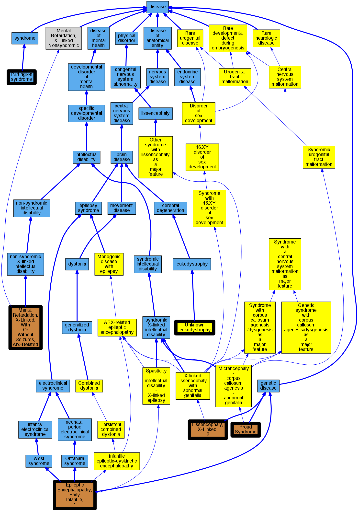

## GENE: ARX

[matched diseases visual](ARX.png)  <-- click on raw to zoom

### HYDRANENCEPHALY WITH ABNORMAL GENITALIA
 * [occurs_with -](http://beta.monarchinitiative.org/disease/occurs_with) Confidence: low/0.0703125

### LISSENCEPHALY, X-LINKED, 2
 * [Orphanet:64753 Spinocerebellar ataxia with axonal neuropathy type 2](http://beta.monarchinitiative.org/disease/Orphanet:64753) Confidence: low/0.0703125
    * Syn: "AOA2"
    * Syn: "Ataxia - oculomotor apraxia type 2"
    * Syn: "SCAN 2"
    * Syn: "SCAR1"

### EPILEPTIC ENCEPHALOPATHY, EARLY INFANTILE, 1
 * [DOID:0050709 Ohtahara syndrome](http://beta.monarchinitiative.org/disease/DOID:0050709) Confidence: low/0.18000000000000002
    * Equiv:[Orphanet:1934 Early infantile epileptic encephalopathy](http://beta.monarchinitiative.org/disease/Orphanet:1934)
    * Syn: "Early Infantile Epileptic Encephalopathy "
    * Syn: "Early Infantile Epileptic Encephalopathy with Burst-Suppression"
    * Syn: "Early infantile epileptic encephalopathy with suppression-bursts"
    * Syn: "EIEE"
    * Syn: "EPILEPTIC ENCEPHALOPATHY, EARLY INFANTILE, 15"
    * Syn: "Ohtahara syndrome"

### Epileptic encephalopathy, early infantile, 1
 * [DOID:2481 infantile epileptic encephalopathy](http://beta.monarchinitiative.org/disease/DOID:2481) Confidence: low/0.20500000000000002
    * Equiv:[MESH:D013036 Spasms, Infantile](http://beta.monarchinitiative.org/disease/MESH:D013036)
    * Syn: "Attack, Lightning"
    * Syn: "Attacks, Lightning"
    * Syn: "Attacks, Salaam"
    * Syn: "Cryptogenic Infantile Spasm"
    * Syn: "Cryptogenic Infantile Spasms"
    * Syn: "Cryptogenic West Syndrome"
    * Syn: "epileptic encephalopathy, early infantile"
    * Syn: "epileptic encephalopathy, infantile"
    * Syn: "Hypsarrhythmia"
    * Syn: "Hypsarrhythmias"
    * Syn: "Infantile Spasm"
    * Syn: "infantile spasm"
    * Syn: "Infantile Spasm, Cryptogenic"
    * Syn: "Infantile Spasm, Symptomatic"
    * Syn: "Infantile Spasms"
    * Syn: "Infantile Spasms, Cryptogenic"
    * Syn: "Infantile Spasms, Symptomatic"
    * Syn: "Jackknife Seizure"
    * Syn: "Jackknife Seizures"
    * Syn: "Lightning Attack"
    * Syn: "Lightning Attacks"
    * Syn: "Nodding Spasm"
    * Syn: "Nodding Spasms"
    * Syn: "Salaam Attacks"
    * Syn: "Salaam Seizures"
    * Syn: "Seizure, Jackknife"
    * Syn: "Seizures, Jackknife"
    * Syn: "Seizures, Salaam"
    * Syn: "Spasm, Cryptogenic Infantile"
    * Syn: "Spasm, Nodding"
    * Syn: "Spasm, Symptomatic Infantile"
    * Syn: "Spasms, Cryptogenic Infantile"
    * Syn: "Spasms, Nodding"
    * Syn: "Spasms, Symptomatic Infantile"
    * Syn: "Spasmus Nutans"
    * Syn: "Symptomatic Infantile Spasm"
    * Syn: "Symptomatic Infantile Spasms"
    * Syn: "Symptomatic West Syndrome"
    * Syn: "Syndrome, Cryptogenic West"
    * Syn: "Syndrome, Symptomatic West"
    * Syn: "Syndrome, West"
    * Syn: "West Syndrome"
    * Syn: "West Syndrome, Cryptogenic"
    * Syn: "West Syndrome, Symptomatic"

### RECLASSIFIED - VARIANT OF UNKNOWN SIGNIFICANCE
 * [Orphanet:84096 Unknown leukodystrophy](http://beta.monarchinitiative.org/disease/Orphanet:84096) Confidence: low/0.0675

### RECLASSIFIED - VARIANT OF UNKNOWN SIGNIFICANCE
 * [Orphanet:84096 Unknown leukodystrophy](http://beta.monarchinitiative.org/disease/Orphanet:84096) Confidence: low/0.0675

### RECLASSIFIED - VARIANT OF UNKNOWN SIGNIFICANCE
 * [Orphanet:84096 Unknown leukodystrophy](http://beta.monarchinitiative.org/disease/Orphanet:84096) Confidence: low/0.0675

### RECLASSIFIED - VARIANT OF UNKNOWN SIGNIFICANCE
 * [Orphanet:84096 Unknown leukodystrophy](http://beta.monarchinitiative.org/disease/Orphanet:84096) Confidence: low/0.0675

### CORPUS CALLOSUM, AGENESIS OF, WITH ABNORMAL GENITALIA
 * [MESH:C563110 Proud Syndrome](http://beta.monarchinitiative.org/disease/MESH:C563110) Confidence: high
    * Syn: "ACC With Abnormal Genitalia"
    * Syn: "Corpus Callosum, Agenesis of, with Abnormal Genitalia"

### RECLASSIFIED - VARIANT OF UNKNOWN SIGNIFICANCE
 * [Orphanet:84096 Unknown leukodystrophy](http://beta.monarchinitiative.org/disease/Orphanet:84096) Confidence: low/0.0675

### RECLASSIFIED - VARIANT OF UNKNOWN SIGNIFICANCE
 * [Orphanet:84096 Unknown leukodystrophy](http://beta.monarchinitiative.org/disease/Orphanet:84096) Confidence: low/0.0675

### lissencephaly, X-linked, 2
 * [DOID:0050453 lissencephaly](http://beta.monarchinitiative.org/disease/DOID:0050453) Confidence: low/0.1328125
    * Equiv:[MESH:D054082 Lissencephaly](http://beta.monarchinitiative.org/disease/MESH:D054082)
    * Equiv:[Orphanet:48471 Lissencephaly](http://beta.monarchinitiative.org/disease/Orphanet:48471)
    * Syn: "Agyria"
    * Syn: "Agyrias"
    * Syn: "Broad Gyri of Cerebrum"
    * Syn: "Large Gyri of Cerebrum"
    * Syn: "Lissencephalia"
    * Syn: "Lissencephalias"
    * Syn: "Lissencephalies"
    * Syn: "Macrogyria"
    * Syn: "Macrogyrias"
    * Syn: "Pachygyria"
    * Syn: "Pachygyrias"

### MENTAL RETARDATION, X-LINKED, WITH OR WITHOUT SEIZURES, ARX-RELATED
 * [OMIM:300419 Mental Retardation, X-Linked, With or Without Seizures, Arx-Related](http://beta.monarchinitiative.org/disease/OMIM:300419) Confidence: high
    * Equiv:[MESH:C563150 Mental Retardation, X-Linked, With Or Without Seizures, Arx-Related](http://beta.monarchinitiative.org/disease/MESH:C563150)
    * Syn: "Mental Retardation, X-Linked 29"
    * Syn: "Mental Retardation, X-Linked 32"
    * Syn: "Mental Retardation, X-Linked 33"
    * Syn: "Mental Retardation, X-Linked 38"
    * Syn: "Mental Retardation, X-Linked 43"
    * Syn: "Mental Retardation, X-Linked 54"
    * Syn: "Mental Retardation, X-Linked 76"
    * Syn: "Mental Retardation, X-Linked 87"
    * Syn: "MENTAL RETARDATION, X-LINKED, WITH OR WITHOUT SEIZURES, ARX-RELATED; MRXARX"
    * Syn: "Mrx29"
    * Syn: "Mrx32"
    * Syn: "Mrx33"
    * Syn: "Mrx38"
    * Syn: "Mrx43"
    * Syn: "Mrx54"
    * Syn: "Mrx76"
    * Syn: "Mrx87"
    * Syn: "MRXARX"

### PARTINGTON SYNDROME
 * [OMIM:312780 Partington syndrome](http://beta.monarchinitiative.org/disease/OMIM:312780) Confidence: high
    * Equiv:[DOID:14744 Partington syndrome](http://beta.monarchinitiative.org/disease/DOID:14744)
    * Equiv:[MESH:C562446 Russell-Silver Syndrome, X-Linked](http://beta.monarchinitiative.org/disease/MESH:C562446)
    * Syn: "Partington Syndrome"
    * Syn: "Partington-Mulley syndrome"
    * Syn: "RUSSELL-SILVER SYNDROME, X-LINKED"
    * Syn: "Russell-Silver-Like Syndrome With Skin Pigmentation"
    * Syn: "Russell-Silver-Like Syndrome with Skin Pigmentation"
    * Syn: "X-linked intellectual disability - dystonia - dysarthria"
    * Syn: "X-linked Russell-Silver syndrome"

### RECLASSIFIED - VARIANT OF UNKNOWN SIGNIFICANCE
 * [Orphanet:84096 Unknown leukodystrophy](http://beta.monarchinitiative.org/disease/Orphanet:84096) Confidence: low/0.0675

### RECLASSIFIED - VARIANT OF UNKNOWN SIGNIFICANCE
 * [Orphanet:84096 Unknown leukodystrophy](http://beta.monarchinitiative.org/disease/Orphanet:84096) Confidence: low/0.0675

### RECLASSIFIED - VARIANT OF UNKNOWN SIGNIFICANCE
 * [Orphanet:84096 Unknown leukodystrophy](http://beta.monarchinitiative.org/disease/Orphanet:84096) Confidence: low/0.0675

### RECLASSIFIED - VARIANT OF UNKNOWN SIGNIFICANCE
 * [Orphanet:84096 Unknown leukodystrophy](http://beta.monarchinitiative.org/disease/Orphanet:84096) Confidence: low/0.0675

### RECLASSIFIED - VARIANT OF UNKNOWN SIGNIFICANCE
 * [Orphanet:84096 Unknown leukodystrophy](http://beta.monarchinitiative.org/disease/Orphanet:84096) Confidence: low/0.0675

### epileptic encephalopathy, early infanitle, 1
 * [DOID:2481 infantile epileptic encephalopathy](http://beta.monarchinitiative.org/disease/DOID:2481) Confidence: low/0.13874999999999998
    * Equiv:[MESH:D013036 Spasms, Infantile](http://beta.monarchinitiative.org/disease/MESH:D013036)
    * Syn: "Attack, Lightning"
    * Syn: "Attacks, Lightning"
    * Syn: "Attacks, Salaam"
    * Syn: "Cryptogenic Infantile Spasm"
    * Syn: "Cryptogenic Infantile Spasms"
    * Syn: "Cryptogenic West Syndrome"
    * Syn: "epileptic encephalopathy, early infantile"
    * Syn: "epileptic encephalopathy, infantile"
    * Syn: "Hypsarrhythmia"
    * Syn: "Hypsarrhythmias"
    * Syn: "Infantile Spasm"
    * Syn: "infantile spasm"
    * Syn: "Infantile Spasm, Cryptogenic"
    * Syn: "Infantile Spasm, Symptomatic"
    * Syn: "Infantile Spasms"
    * Syn: "Infantile Spasms, Cryptogenic"
    * Syn: "Infantile Spasms, Symptomatic"
    * Syn: "Jackknife Seizure"
    * Syn: "Jackknife Seizures"
    * Syn: "Lightning Attack"
    * Syn: "Lightning Attacks"
    * Syn: "Nodding Spasm"
    * Syn: "Nodding Spasms"
    * Syn: "Salaam Attacks"
    * Syn: "Salaam Seizures"
    * Syn: "Seizure, Jackknife"
    * Syn: "Seizures, Jackknife"
    * Syn: "Seizures, Salaam"
    * Syn: "Spasm, Cryptogenic Infantile"
    * Syn: "Spasm, Nodding"
    * Syn: "Spasm, Symptomatic Infantile"
    * Syn: "Spasms, Cryptogenic Infantile"
    * Syn: "Spasms, Nodding"
    * Syn: "Spasms, Symptomatic Infantile"
    * Syn: "Spasmus Nutans"
    * Syn: "Symptomatic Infantile Spasm"
    * Syn: "Symptomatic Infantile Spasms"
    * Syn: "Symptomatic West Syndrome"
    * Syn: "Syndrome, Cryptogenic West"
    * Syn: "Syndrome, Symptomatic West"
    * Syn: "Syndrome, West"
    * Syn: "West Syndrome"
    * Syn: "West Syndrome, Cryptogenic"
    * Syn: "West Syndrome, Symptomatic"
