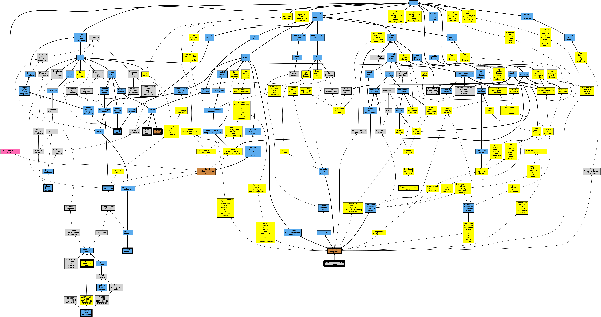

## GENE: ATM

[matched diseases visual](ATM.png)  <-- click on raw to zoom

### ATAXIA TELANGIECTASIA
 * [DOID:12704 ataxia telangiectasia](http://beta.monarchinitiative.org/disease/DOID:12704) Confidence: high
    * Syn: "Boder-Sedgwick syndrome"
    * Syn: "Louis Bar syndrome"

### ATAXIA-TELANGIECTASIA
 * [DOID:12704 ataxia telangiectasia](http://beta.monarchinitiative.org/disease/DOID:12704) Confidence: high
    * Syn: "Boder-Sedgwick syndrome"
    * Syn: "Louis Bar syndrome"

### ATAXIA-TELANGIECTASIA VARIANT
 * [MESH:C566865 Ataxia-Telangiectasia Variant](http://beta.monarchinitiative.org/disease/MESH:C566865) Confidence: high

### ATAXIA-TELANGIECTASIA WITHOUT IMMUNODEFICIENCY
 * [OMIM:208900 Ataxia Telangiectasia](http://beta.monarchinitiative.org/disease/OMIM:208900) Confidence: low/0.15625
    * Equiv:[MESH:D001260 Ataxia Telangiectasia](http://beta.monarchinitiative.org/disease/MESH:D001260)
    * Syn: "AT"
    * Syn: "At, Complementation Group a"
    * Syn: "At, Complementation Group C"
    * Syn: "At, Complementation Group D"
    * Syn: "At, Complementation Group E"
    * Syn: "At1"
    * Syn: "Ataxia-Telangiectasia Variant"
    * Syn: "ATAXIA-TELANGIECTASIA; AT"
    * Syn: "Louis-Bar Syndrome"

### ATAXIA-TELANGIECTASIA, COMPLEMENTATION GROUP A
 * [OMIM:208900 Ataxia Telangiectasia](http://beta.monarchinitiative.org/disease/OMIM:208900) Confidence: low/0.14500000000000002
    * Equiv:[MESH:D001260 Ataxia Telangiectasia](http://beta.monarchinitiative.org/disease/MESH:D001260)
    * Syn: "AT"
    * Syn: "At, Complementation Group a"
    * Syn: "At, Complementation Group C"
    * Syn: "At, Complementation Group D"
    * Syn: "At, Complementation Group E"
    * Syn: "At1"
    * Syn: "Ataxia-Telangiectasia Variant"
    * Syn: "ATAXIA-TELANGIECTASIA; AT"
    * Syn: "Louis-Bar Syndrome"

### ATAXIA-TELANGIECTASIA, COMPLEMENTATION GROUP D
 * [OMIM:208900 Ataxia Telangiectasia](http://beta.monarchinitiative.org/disease/OMIM:208900) Confidence: low/0.14500000000000002
    * Equiv:[MESH:D001260 Ataxia Telangiectasia](http://beta.monarchinitiative.org/disease/MESH:D001260)
    * Syn: "AT"
    * Syn: "At, Complementation Group a"
    * Syn: "At, Complementation Group C"
    * Syn: "At, Complementation Group D"
    * Syn: "At, Complementation Group E"
    * Syn: "At1"
    * Syn: "Ataxia-Telangiectasia Variant"
    * Syn: "ATAXIA-TELANGIECTASIA; AT"
    * Syn: "Louis-Bar Syndrome"

### ATAXIA-TELANGIECTASIA, COMPLEMENTATION GROUP E
 * [OMIM:208900 Ataxia Telangiectasia](http://beta.monarchinitiative.org/disease/OMIM:208900) Confidence: low/0.14500000000000002
    * Equiv:[MESH:D001260 Ataxia Telangiectasia](http://beta.monarchinitiative.org/disease/MESH:D001260)
    * Syn: "AT"
    * Syn: "At, Complementation Group a"
    * Syn: "At, Complementation Group C"
    * Syn: "At, Complementation Group D"
    * Syn: "At, Complementation Group E"
    * Syn: "At1"
    * Syn: "Ataxia-Telangiectasia Variant"
    * Syn: "ATAXIA-TELANGIECTASIA; AT"
    * Syn: "Louis-Bar Syndrome"

### ATAXIA-TELANGIECTASIA, FRESNO VARIANT
 * [Orphanet:370109 Ataxia-telangiectasia variant](http://beta.monarchinitiative.org/disease/Orphanet:370109) Confidence: low/0.1953125

### Ataxia-telangiectasia syndrome
 * [OMIM:208900 Ataxia Telangiectasia](http://beta.monarchinitiative.org/disease/OMIM:208900) Confidence: low/0.18055555555555555
    * Equiv:[MESH:D001260 Ataxia Telangiectasia](http://beta.monarchinitiative.org/disease/MESH:D001260)
    * Syn: "AT"
    * Syn: "At, Complementation Group a"
    * Syn: "At, Complementation Group C"
    * Syn: "At, Complementation Group D"
    * Syn: "At, Complementation Group E"
    * Syn: "At1"
    * Syn: "Ataxia-Telangiectasia Variant"
    * Syn: "ATAXIA-TELANGIECTASIA; AT"
    * Syn: "Louis-Bar Syndrome"

### B-CELL NON-HODGKIN LYMPHOMA, SOMATIC
 * [Orphanet:171915 B-cell non-Hodgkin lymphoma](http://beta.monarchinitiative.org/disease/Orphanet:171915) Confidence: low/0.21180555555555558

### BREAST CANCER, FAMILIAL
 * [OMIM:114480 Breast Cancer, Familial](http://beta.monarchinitiative.org/disease/OMIM:114480) Confidence: high
    * Equiv:[MESH:C562840 Breast Cancer, Familial](http://beta.monarchinitiative.org/disease/MESH:C562840)
    * Syn: "BREAST CANCER"
    * Syn: "Breast Cancer, Familial"
    * Syn: "Breast Cancer, Familial Male"

### BREAST CANCER, SUSCEPTIBILITY TO
 * [OMIM:114480 Breast Cancer, Familial](http://beta.monarchinitiative.org/disease/OMIM:114480) Confidence: low/0.15625
    * Equiv:[MESH:C562840 Breast Cancer, Familial](http://beta.monarchinitiative.org/disease/MESH:C562840)
    * Syn: "BREAST CANCER"
    * Syn: "Breast Cancer, Familial"
    * Syn: "Breast Cancer, Familial Male"

### KIDNEY CANCER
 * [DOID:263 kidney cancer](http://beta.monarchinitiative.org/disease/DOID:263) Confidence: high
    * Equiv:[MESH:D007680 Kidney Neoplasms](http://beta.monarchinitiative.org/disease/MESH:D007680)
    * Syn: "malignant neoplasm of kidney except pelvis"
    * Syn: "malignant tumour of kidney"
    * Syn: "renal cancer"

### MANTLE CELL LYMPHOMA
 * [DOID:0050746 mantle cell lymphoma](http://beta.monarchinitiative.org/disease/DOID:0050746) Confidence: high
    * Equiv:[MESH:D020522 Lymphoma, Mantle-Cell](http://beta.monarchinitiative.org/disease/MESH:D020522)

### MANTLE CELL LYMPHOMA, SOMATIC
 * [DOID:0060058 lymphoma](http://beta.monarchinitiative.org/disease/DOID:0060058) Confidence: low/0.1328125
    * Equiv:[MESH:D008223 Lymphoma](http://beta.monarchinitiative.org/disease/MESH:D008223)
    * Syn: "lymphoid cancer"

### Neoplastic Syndromes, Hereditary
 * [MESH:D009386 Neoplastic Syndromes, Hereditary](http://beta.monarchinitiative.org/disease/MESH:D009386) Confidence: high

### T-CELL PROLYMPHOCYTIC LEUKEMIA, SOMATIC
 * [DOID:715 T-cell leukemia](http://beta.monarchinitiative.org/disease/DOID:715) Confidence: low/0.16999999999999998
    * Equiv:[MESH:D015458 Leukemia, T-Cell](http://beta.monarchinitiative.org/disease/MESH:D015458)
