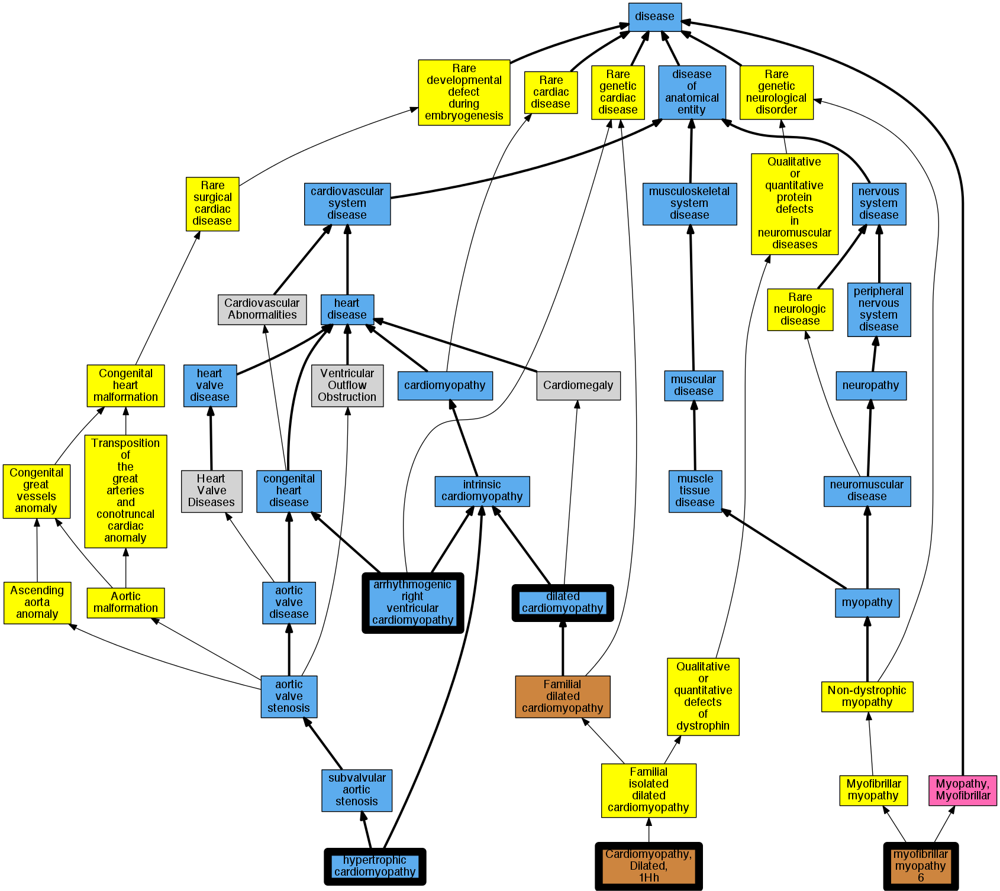

## GENE: BAG3

[matched diseases visual](BAG3.png)  <-- click on raw to zoom

### Cardiomyopathy, arrhythmogenic right ventricular dysplasia
 * [DOID:0050431 arrhythmogenic right ventricular cardiomyopathy](http://beta.monarchinitiative.org/disease/DOID:0050431) Confidence: high
    * Equiv:[MESH:D019571 Arrhythmogenic Right Ventricular Dysplasia](http://beta.monarchinitiative.org/disease/MESH:D019571)
    * Equiv:[Orphanet:247 Arrhythmogenic right ventricular dysplasia](http://beta.monarchinitiative.org/disease/Orphanet:247)
    * Syn: "Arrhythmogenic Right Ventricular Cardiomyopathy"
    * Syn: "Arrhythmogenic Right Ventricular Cardiomyopathy Dysplasia"
    * Syn: "Arrhythmogenic Right Ventricular Cardiomyopathy-Dysplasia"
    * Syn: "Arrhythmogenic right ventricular dysplasia"
    * Syn: "arrhythmogenic right ventricular dysplasia"
    * Syn: "Arrhythmogenic Right Ventricular Dysplasia-Cardiomyopathy"
    * Syn: "arrhythmogenic right ventricular dysplasia/cardiomyopathy"
    * Syn: "ARVC"
    * Syn: "ARVC cardiomyopathy"
    * Syn: "ARVD"
    * Syn: "Right Ventricular Dysplasia, Arrhythmogenic"
    * Syn: "Ventricular Dysplasia, Right, Arrhythmogenic"

### Cardiomyopathy, dilated, 1HH
 * [OMIM:613881 Cardiomyopathy, Dilated, 1Hh](http://beta.monarchinitiative.org/disease/OMIM:613881) Confidence: high
    * Syn: "CARDIOMYOPATHY, DILATED, 1HH; CMD1HH"
    * Syn: "CMD1HH"

### Primary dilated cardiomyopathy
 * [DOID:12930 dilated cardiomyopathy](http://beta.monarchinitiative.org/disease/DOID:12930) Confidence: high
    * Equiv:[Orphanet:217604 Dilated cardiomyopathy](http://beta.monarchinitiative.org/disease/Orphanet:217604)
    * Syn: "1A, Dilated cardiomyopathy"
    * Syn: "1As, Dilated cardiomyopathy"
    * Syn: "Cardiomyopathies, Congestive"
    * Syn: "Cardiomyopathies, Dilated"
    * Syn: "Cardiomyopathies, Familial Idiopathic"
    * Syn: "Cardiomyopathies, Idiopathic Dilated"
    * Syn: "cardiomyopathy 1A, Dilated"
    * Syn: "cardiomyopathy 1As, Dilated"
    * Syn: "Cardiomyopathy, Congestive"
    * Syn: "Cardiomyopathy, Dilated, 1a"
    * Syn: "Cardiomyopathy, Dilated, Autosomal Recessive"
    * Syn: "Cardiomyopathy, Dilated, CMD1A"
    * Syn: "Cardiomyopathy, Dilated, LMNA"
    * Syn: "Cardiomyopathy, Dilated, With Conduction Defect 1"
    * Syn: "Cardiomyopathy, Dilated, with Conduction Deffect1"
    * Syn: "Cardiomyopathy, Familial Idiopathic"
    * Syn: "Cardiomyopathy, Idiopathic Dilated"
    * Syn: "Congestive Cardiomyopathies"
    * Syn: "Congestive Cardiomyopathy"
    * Syn: "Congestive cardiomyopathy"
    * Syn: "Dilated Cardiomyopathies"
    * Syn: "Dilated Cardiomyopathies, Idiopathic"
    * Syn: "Dilated Cardiomyopathy"
    * Syn: "Dilated cardiomyopathy 1A"
    * Syn: "Dilated cardiomyopathy 1As"
    * Syn: "Dilated Cardiomyopathy, Idiopathic"
    * Syn: "Familial dilated cardiomyopathy"
    * Syn: "Familial Idiopathic Cardiomyopathies"
    * Syn: "Familial Idiopathic Cardiomyopathy"
    * Syn: "Idiopathic Cardiomyopathies, Familial"
    * Syn: "Idiopathic Cardiomyopathy, Familial"
    * Syn: "Idiopathic Dilated Cardiomyopathies"
    * Syn: "Idiopathic Dilated Cardiomyopathy"
    * Syn: "Idiopathic dilation cardiomyopathy"
    * Syn: "primary dilated cardiomyopathy"

### Primary familial hypertrophic cardiomyopathy
 * [DOID:11984 hypertrophic cardiomyopathy](http://beta.monarchinitiative.org/disease/DOID:11984) Confidence: low/0.1953125
    * Equiv:[MESH:D002312 Cardiomyopathy, Hypertrophic](http://beta.monarchinitiative.org/disease/MESH:D002312)
    * Equiv:[Orphanet:217569 Hypertrophic cardiomyopathy](http://beta.monarchinitiative.org/disease/Orphanet:217569)
    * Syn: "Cardiomyopathies, Hypertrophic"
    * Syn: "Cardiomyopathies, Hypertrophic Obstructive"
    * Syn: "Cardiomyopathy, Hypertrophic Obstructive"
    * Syn: "familial hypertrophic cardiomyopathy"
    * Syn: "Hypertrophic Cardiomyopathies"
    * Syn: "Hypertrophic Cardiomyopathy"
    * Syn: "Hypertrophic Obstructive Cardiomyopathies"
    * Syn: "Hypertrophic Obstructive Cardiomyopathy"
    * Syn: "hypertrophic obstructive cardiomyopathy"
    * Syn: "Hypertrophic subaortic stenosis"
    * Syn: "Obstructive Cardiomyopathies, Hypertrophic"
    * Syn: "Obstructive Cardiomyopathy, Hypertrophic"
    * Syn: "Obstructive hypertrophic cardiomyopathy"

### Primary dilated cardiomyopathy
 * [DOID:12930 dilated cardiomyopathy](http://beta.monarchinitiative.org/disease/DOID:12930) Confidence: high
    * Equiv:[Orphanet:217604 Dilated cardiomyopathy](http://beta.monarchinitiative.org/disease/Orphanet:217604)
    * Syn: "1A, Dilated cardiomyopathy"
    * Syn: "1As, Dilated cardiomyopathy"
    * Syn: "Cardiomyopathies, Congestive"
    * Syn: "Cardiomyopathies, Dilated"
    * Syn: "Cardiomyopathies, Familial Idiopathic"
    * Syn: "Cardiomyopathies, Idiopathic Dilated"
    * Syn: "cardiomyopathy 1A, Dilated"
    * Syn: "cardiomyopathy 1As, Dilated"
    * Syn: "Cardiomyopathy, Congestive"
    * Syn: "Cardiomyopathy, Dilated, 1a"
    * Syn: "Cardiomyopathy, Dilated, Autosomal Recessive"
    * Syn: "Cardiomyopathy, Dilated, CMD1A"
    * Syn: "Cardiomyopathy, Dilated, LMNA"
    * Syn: "Cardiomyopathy, Dilated, With Conduction Defect 1"
    * Syn: "Cardiomyopathy, Dilated, with Conduction Deffect1"
    * Syn: "Cardiomyopathy, Familial Idiopathic"
    * Syn: "Cardiomyopathy, Idiopathic Dilated"
    * Syn: "Congestive Cardiomyopathies"
    * Syn: "Congestive Cardiomyopathy"
    * Syn: "Congestive cardiomyopathy"
    * Syn: "Dilated Cardiomyopathies"
    * Syn: "Dilated Cardiomyopathies, Idiopathic"
    * Syn: "Dilated Cardiomyopathy"
    * Syn: "Dilated cardiomyopathy 1A"
    * Syn: "Dilated cardiomyopathy 1As"
    * Syn: "Dilated Cardiomyopathy, Idiopathic"
    * Syn: "Familial dilated cardiomyopathy"
    * Syn: "Familial Idiopathic Cardiomyopathies"
    * Syn: "Familial Idiopathic Cardiomyopathy"
    * Syn: "Idiopathic Cardiomyopathies, Familial"
    * Syn: "Idiopathic Cardiomyopathy, Familial"
    * Syn: "Idiopathic Dilated Cardiomyopathies"
    * Syn: "Idiopathic Dilated Cardiomyopathy"
    * Syn: "Idiopathic dilation cardiomyopathy"
    * Syn: "primary dilated cardiomyopathy"

### Primary dilated cardiomyopathy
 * [DOID:12930 dilated cardiomyopathy](http://beta.monarchinitiative.org/disease/DOID:12930) Confidence: high
    * Equiv:[Orphanet:217604 Dilated cardiomyopathy](http://beta.monarchinitiative.org/disease/Orphanet:217604)
    * Syn: "1A, Dilated cardiomyopathy"
    * Syn: "1As, Dilated cardiomyopathy"
    * Syn: "Cardiomyopathies, Congestive"
    * Syn: "Cardiomyopathies, Dilated"
    * Syn: "Cardiomyopathies, Familial Idiopathic"
    * Syn: "Cardiomyopathies, Idiopathic Dilated"
    * Syn: "cardiomyopathy 1A, Dilated"
    * Syn: "cardiomyopathy 1As, Dilated"
    * Syn: "Cardiomyopathy, Congestive"
    * Syn: "Cardiomyopathy, Dilated, 1a"
    * Syn: "Cardiomyopathy, Dilated, Autosomal Recessive"
    * Syn: "Cardiomyopathy, Dilated, CMD1A"
    * Syn: "Cardiomyopathy, Dilated, LMNA"
    * Syn: "Cardiomyopathy, Dilated, With Conduction Defect 1"
    * Syn: "Cardiomyopathy, Dilated, with Conduction Deffect1"
    * Syn: "Cardiomyopathy, Familial Idiopathic"
    * Syn: "Cardiomyopathy, Idiopathic Dilated"
    * Syn: "Congestive Cardiomyopathies"
    * Syn: "Congestive Cardiomyopathy"
    * Syn: "Congestive cardiomyopathy"
    * Syn: "Dilated Cardiomyopathies"
    * Syn: "Dilated Cardiomyopathies, Idiopathic"
    * Syn: "Dilated Cardiomyopathy"
    * Syn: "Dilated cardiomyopathy 1A"
    * Syn: "Dilated cardiomyopathy 1As"
    * Syn: "Dilated Cardiomyopathy, Idiopathic"
    * Syn: "Familial dilated cardiomyopathy"
    * Syn: "Familial Idiopathic Cardiomyopathies"
    * Syn: "Familial Idiopathic Cardiomyopathy"
    * Syn: "Idiopathic Cardiomyopathies, Familial"
    * Syn: "Idiopathic Cardiomyopathy, Familial"
    * Syn: "Idiopathic Dilated Cardiomyopathies"
    * Syn: "Idiopathic Dilated Cardiomyopathy"
    * Syn: "Idiopathic dilation cardiomyopathy"
    * Syn: "primary dilated cardiomyopathy"

### Primary familial hypertrophic cardiomyopathy
 * [DOID:11984 hypertrophic cardiomyopathy](http://beta.monarchinitiative.org/disease/DOID:11984) Confidence: low/0.1953125
    * Equiv:[MESH:D002312 Cardiomyopathy, Hypertrophic](http://beta.monarchinitiative.org/disease/MESH:D002312)
    * Equiv:[Orphanet:217569 Hypertrophic cardiomyopathy](http://beta.monarchinitiative.org/disease/Orphanet:217569)
    * Syn: "Cardiomyopathies, Hypertrophic"
    * Syn: "Cardiomyopathies, Hypertrophic Obstructive"
    * Syn: "Cardiomyopathy, Hypertrophic Obstructive"
    * Syn: "familial hypertrophic cardiomyopathy"
    * Syn: "Hypertrophic Cardiomyopathies"
    * Syn: "Hypertrophic Cardiomyopathy"
    * Syn: "Hypertrophic Obstructive Cardiomyopathies"
    * Syn: "Hypertrophic Obstructive Cardiomyopathy"
    * Syn: "hypertrophic obstructive cardiomyopathy"
    * Syn: "Hypertrophic subaortic stenosis"
    * Syn: "Obstructive Cardiomyopathies, Hypertrophic"
    * Syn: "Obstructive Cardiomyopathy, Hypertrophic"
    * Syn: "Obstructive hypertrophic cardiomyopathy"

### Primary familial hypertrophic cardiomyopathy
 * [DOID:11984 hypertrophic cardiomyopathy](http://beta.monarchinitiative.org/disease/DOID:11984) Confidence: low/0.1953125
    * Equiv:[MESH:D002312 Cardiomyopathy, Hypertrophic](http://beta.monarchinitiative.org/disease/MESH:D002312)
    * Equiv:[Orphanet:217569 Hypertrophic cardiomyopathy](http://beta.monarchinitiative.org/disease/Orphanet:217569)
    * Syn: "Cardiomyopathies, Hypertrophic"
    * Syn: "Cardiomyopathies, Hypertrophic Obstructive"
    * Syn: "Cardiomyopathy, Hypertrophic Obstructive"
    * Syn: "familial hypertrophic cardiomyopathy"
    * Syn: "Hypertrophic Cardiomyopathies"
    * Syn: "Hypertrophic Cardiomyopathy"
    * Syn: "Hypertrophic Obstructive Cardiomyopathies"
    * Syn: "Hypertrophic Obstructive Cardiomyopathy"
    * Syn: "hypertrophic obstructive cardiomyopathy"
    * Syn: "Hypertrophic subaortic stenosis"
    * Syn: "Obstructive Cardiomyopathies, Hypertrophic"
    * Syn: "Obstructive Cardiomyopathy, Hypertrophic"
    * Syn: "Obstructive hypertrophic cardiomyopathy"

### MYOPATHY, MYOFIBRILLAR, 6
 * [OMIM:612954 myofibrillar myopathy 6](http://beta.monarchinitiative.org/disease/OMIM:612954) Confidence: high
    * Equiv:[Orphanet:199340 Muscular dystrophy, Selcen type](http://beta.monarchinitiative.org/disease/Orphanet:199340)
    * Equiv:[DOID:0080097 -](http://beta.monarchinitiative.org/disease/DOID:0080097)
    * Syn: "BAG3-related myofibrillar myopathy"
    * Syn: "MFM6"
    * Syn: "MYOPATHY, MYOFIBRILLAR, 6; MFM6"
    * Syn: "Myopathy, Myofibrillar, Bag3-Related"

### Primary dilated cardiomyopathy
 * [DOID:12930 dilated cardiomyopathy](http://beta.monarchinitiative.org/disease/DOID:12930) Confidence: high
    * Equiv:[Orphanet:217604 Dilated cardiomyopathy](http://beta.monarchinitiative.org/disease/Orphanet:217604)
    * Syn: "1A, Dilated cardiomyopathy"
    * Syn: "1As, Dilated cardiomyopathy"
    * Syn: "Cardiomyopathies, Congestive"
    * Syn: "Cardiomyopathies, Dilated"
    * Syn: "Cardiomyopathies, Familial Idiopathic"
    * Syn: "Cardiomyopathies, Idiopathic Dilated"
    * Syn: "cardiomyopathy 1A, Dilated"
    * Syn: "cardiomyopathy 1As, Dilated"
    * Syn: "Cardiomyopathy, Congestive"
    * Syn: "Cardiomyopathy, Dilated, 1a"
    * Syn: "Cardiomyopathy, Dilated, Autosomal Recessive"
    * Syn: "Cardiomyopathy, Dilated, CMD1A"
    * Syn: "Cardiomyopathy, Dilated, LMNA"
    * Syn: "Cardiomyopathy, Dilated, With Conduction Defect 1"
    * Syn: "Cardiomyopathy, Dilated, with Conduction Deffect1"
    * Syn: "Cardiomyopathy, Familial Idiopathic"
    * Syn: "Cardiomyopathy, Idiopathic Dilated"
    * Syn: "Congestive Cardiomyopathies"
    * Syn: "Congestive Cardiomyopathy"
    * Syn: "Congestive cardiomyopathy"
    * Syn: "Dilated Cardiomyopathies"
    * Syn: "Dilated Cardiomyopathies, Idiopathic"
    * Syn: "Dilated Cardiomyopathy"
    * Syn: "Dilated cardiomyopathy 1A"
    * Syn: "Dilated cardiomyopathy 1As"
    * Syn: "Dilated Cardiomyopathy, Idiopathic"
    * Syn: "Familial dilated cardiomyopathy"
    * Syn: "Familial Idiopathic Cardiomyopathies"
    * Syn: "Familial Idiopathic Cardiomyopathy"
    * Syn: "Idiopathic Cardiomyopathies, Familial"
    * Syn: "Idiopathic Cardiomyopathy, Familial"
    * Syn: "Idiopathic Dilated Cardiomyopathies"
    * Syn: "Idiopathic Dilated Cardiomyopathy"
    * Syn: "Idiopathic dilation cardiomyopathy"
    * Syn: "primary dilated cardiomyopathy"

### CARDIOMYOPATHY, DILATED, 1HH
 * [OMIM:613881 Cardiomyopathy, Dilated, 1Hh](http://beta.monarchinitiative.org/disease/OMIM:613881) Confidence: high
    * Syn: "CARDIOMYOPATHY, DILATED, 1HH; CMD1HH"
    * Syn: "CMD1HH"
