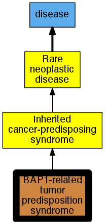

## GENE: BAP1

[matched diseases visual](BAP1.png)  <-- click on raw to zoom

### TUMOR PREDISPOSITION SYNDROME
 * [OMIM:614327 BAP1-related tumor predisposition syndrome](http://beta.monarchinitiative.org/disease/OMIM:614327) Confidence: low/0.08203125
    * Equiv:[Orphanet:289539 BAP1-related tumor predisposition syndrome](http://beta.monarchinitiative.org/disease/Orphanet:289539)
    * Syn: "TPDS"
    * Syn: "TUMOR PREDISPOSITION SYNDROME; TPDS"
    * Syn: "Tumor susceptibility linked to germline BAP1 mutations"
