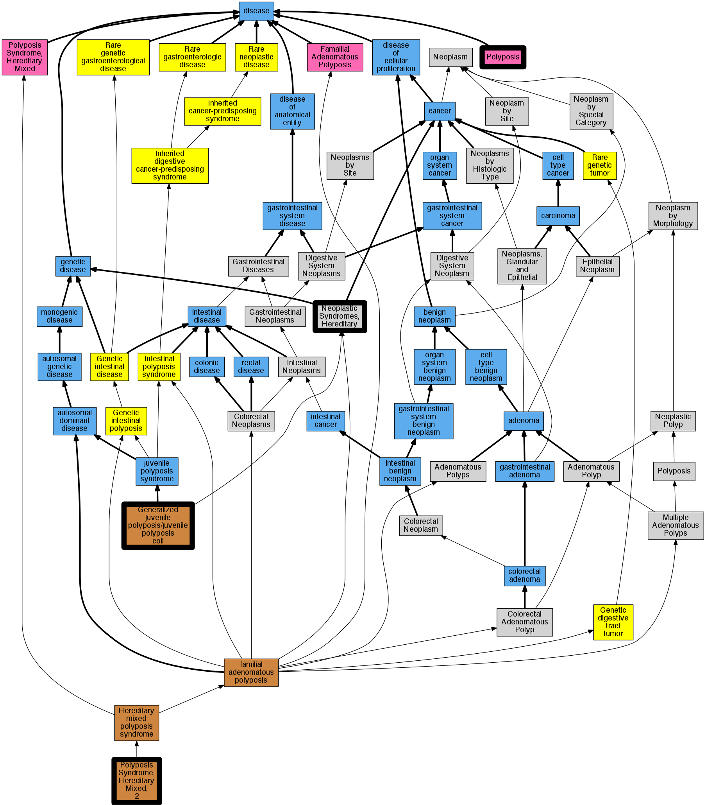

## GENE: BMPR1A

[matched diseases visual](BMPR1A.png)  <-- click on raw to zoom

### Gastrointestinal polyposis
 * [DC:0000587 Polyposis](http://beta.monarchinitiative.org/disease/DC:0000587) Confidence: low/0.15625

### JUVENILE POLYPOSIS OF INFANCY
 * [OMIM:612242 Juvenile polyposis of infancy](http://beta.monarchinitiative.org/disease/OMIM:612242) Confidence: high
    * Equiv:[Orphanet:79076 Juvenile polyposis of infancy](http://beta.monarchinitiative.org/disease/Orphanet:79076)
    * Equiv:[MESH:C567385 Chromosome 10q23 Deletion Syndrome](http://beta.monarchinitiative.org/disease/MESH:C567385)
    * Syn: "CHROMOSOME 10q23 DELETION SYNDROME"
    * Syn: "Juvenile Polyposis of Infancy"
    * Syn: "Juvenile Polyposis, Infantile"

### JUVENILE POLYPOSIS SYNDROME
 * [DOID:0050787 juvenile polyposis syndrome](http://beta.monarchinitiative.org/disease/DOID:0050787) Confidence: high

### Juvenile polyposis syndrome
 * [DOID:0050787 juvenile polyposis syndrome](http://beta.monarchinitiative.org/disease/DOID:0050787) Confidence: high

### Neoplastic Syndromes, Hereditary
 * [MESH:D009386 Neoplastic Syndromes, Hereditary](http://beta.monarchinitiative.org/disease/MESH:D009386) Confidence: high

### POLYPOSIS SYNDROME, HEREDITARY MIXED, 2
 * [OMIM:610069 Polyposis Syndrome, Hereditary Mixed, 2](http://beta.monarchinitiative.org/disease/OMIM:610069) Confidence: high
    * Equiv:[MESH:C566451 Polyposis Syndrome, Hereditary Mixed, 2](http://beta.monarchinitiative.org/disease/MESH:C566451)
    * Syn: "HMPS2"
    * Syn: "POLYPOSIS SYNDROME, HEREDITARY MIXED, 2; HMPS2"

### Polyposis, juvenile intestinal
 * [OMIM:174900 Juvenile polyposis syndrome](http://beta.monarchinitiative.org/disease/OMIM:174900) Confidence: high
    * Equiv:[MESH:C537702 Juvenile polyposis syndrome](http://beta.monarchinitiative.org/disease/MESH:C537702)
    * Syn: "JPS"
    * Syn: "Juvenile Intestinal Polyposis"
    * Syn: "Juvenile Polyposis Coli"
    * Syn: "Juvenile Polyposis of Stomach"
    * Syn: "JUVENILE POLYPOSIS SYNDROME; JPS"
    * Syn: "Polyposis, Familial, of Entire Gastrointestinal Tract"
    * Syn: "Polyposis, Juvenile Intestinal"
