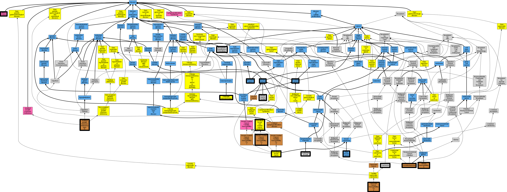

## GENE: BRCA2

[matched diseases visual](BRCA2.png)  <-- click on raw to zoom

### Breast-ovarian cancer, familial
 * [Orphanet:227535 Hereditary breast cancer](http://beta.monarchinitiative.org/disease/Orphanet:227535) Confidence: low/0.1953125
    * Syn: "Familial breast cancer"
    * Syn: "Familial breast carcinoma"
    * Syn: "Hereditary breast carcinoma"

### PRE-B-CELL ACUTE LYMPHOBLASTIC LEUKEMIA
 * [MESH:D015448 Leukemia, B-Cell](http://beta.monarchinitiative.org/disease/MESH:D015448) Confidence: low/0.15625
    * Syn: "B Cell Leukemia"
    * Syn: "B Lymphocytic Leukemia"
    * Syn: "B-Cell Leukemia"
    * Syn: "B-Cell Leukemias"
    * Syn: "B-Cell Lymphocytic Leukemia"
    * Syn: "B-Cell Lymphocytic Leukemias"
    * Syn: "B-Lymphocytic Leukemia"
    * Syn: "B-Lymphocytic Leukemias"
    * Syn: "Leukemia, B Cell"
    * Syn: "Leukemia, B-Cell Lymphocytic"
    * Syn: "Leukemia, B-Lymphocytic"
    * Syn: "Leukemia, Lymphocytic, B Cell"
    * Syn: "Leukemia, Lymphocytic, B-Cell"
    * Syn: "Leukemias, B-Cell"
    * Syn: "Leukemias, B-Cell Lymphocytic"
    * Syn: "Leukemias, B-Lymphocytic"
    * Syn: "Lymphocytic Leukemia, B Cell"
    * Syn: "Lymphocytic Leukemia, B-Cell"
    * Syn: "Lymphocytic Leukemias, B-Cell"

### RECLASSIFIED - VARIANT OF UNKNOWN SIGNIFICANCE
 * [Orphanet:84096 Unknown leukodystrophy](http://beta.monarchinitiative.org/disease/Orphanet:84096) Confidence: low/0.0675

### RECLASSIFIED - VARIANT OF UNKNOWN SIGNIFICANCE
 * [Orphanet:84096 Unknown leukodystrophy](http://beta.monarchinitiative.org/disease/Orphanet:84096) Confidence: low/0.0675

### hereditary breast and ovarian cancer, BROVCA2
 * [Orphanet:145 Hereditary breast and ovarian cancer syndrome](http://beta.monarchinitiative.org/disease/Orphanet:145) Confidence: low/0.19097222222222224

### BREAST-OVARIAN CANCER, FAMILIAL, SUSCEPTIBILITY TO, 2
 * [OMIM:612555 Breast-Ovarian Cancer, Familial, Susceptibility To, 2](http://beta.monarchinitiative.org/disease/OMIM:612555) Confidence: high
    * Syn: "Breast Cancer, Familial, Susceptibility To, 2"
    * Syn: "BREAST-OVARIAN CANCER, FAMILIAL, SUSCEPTIBILITY TO, 2; BROVCA2"
    * Syn: "BROVCA2"
    * Syn: "Ovarian Cancer, Familial, Susceptibility To, 2"

### Oesophageal carcinoma
 * [MESH:D002277 Carcinoma](http://beta.monarchinitiative.org/disease/MESH:D002277) Confidence: low/0.15625
    * Syn: "Anaplastic Carcinoma"
    * Syn: "Anaplastic Carcinomas"
    * Syn: "Carcinoma, Anaplastic"
    * Syn: "Carcinoma, Spindle Cell"
    * Syn: "Carcinoma, Spindle-Cell"
    * Syn: "Carcinoma, Undifferentiated"
    * Syn: "Carcinomas"
    * Syn: "Carcinomas, Anaplastic"
    * Syn: "Carcinomas, Spindle-Cell"
    * Syn: "Carcinomas, Undifferentiated"
    * Syn: "Carcinomatoses"
    * Syn: "Carcinomatosis"
    * Syn: "Epithelial Neoplasm, Malignant"
    * Syn: "Epithelial Neoplasms, Malignant"
    * Syn: "Epithelial Tumor, Malignant"
    * Syn: "Epithelial Tumors, Malignant"
    * Syn: "Epithelioma"
    * Syn: "Epitheliomas"
    * Syn: "Malignant Epithelial Neoplasm"
    * Syn: "Malignant Epithelial Neoplasms"
    * Syn: "Malignant Epithelial Tumor"
    * Syn: "Malignant Epithelial Tumors"
    * Syn: "Neoplasm, Malignant Epithelial"
    * Syn: "Neoplasms, Malignant Epithelial"
    * Syn: "Spindle-Cell Carcinoma"
    * Syn: "Spindle-Cell Carcinomas"
    * Syn: "Tumor, Malignant Epithelial"
    * Syn: "Tumors, Malignant Epithelial"
    * Syn: "Undifferentiated Carcinoma"
    * Syn: "Undifferentiated Carcinomas"

### RECLASSIFIED - VARIANT OF UNKNOWN SIGNIFICANCE
 * [Orphanet:84096 Unknown leukodystrophy](http://beta.monarchinitiative.org/disease/Orphanet:84096) Confidence: low/0.0675

### RECLASSIFIED - VARIANT OF UNKNOWN SIGNIFICANCE
 * [Orphanet:84096 Unknown leukodystrophy](http://beta.monarchinitiative.org/disease/Orphanet:84096) Confidence: low/0.0675

### BRCA1 and BRCA2 Hereditary Breast and Ovarian Cancer
 * [Orphanet:145 Hereditary breast and ovarian cancer syndrome](http://beta.monarchinitiative.org/disease/Orphanet:145) Confidence: low/0.1679421768707483

### Breast cancer
 * [DOID:1612 breast cancer](http://beta.monarchinitiative.org/disease/DOID:1612) Confidence: high
    * Equiv:[MESH:D001943 Breast Neoplasms](http://beta.monarchinitiative.org/disease/MESH:D001943)
    * Syn: "Breast Cancer"
    * Syn: "Breast Carcinoma"
    * Syn: "Breast Neoplasm"
    * Syn: "Breast Tumor"
    * Syn: "breast tumor"
    * Syn: "Breast Tumors"
    * Syn: "Cancer of Breast"
    * Syn: "Cancer of the Breast"
    * Syn: "Cancer, Breast"
    * Syn: "Carcinoma, Human Mammary"
    * Syn: "Carcinomas, Human Mammary"
    * Syn: "Human Mammary Carcinoma"
    * Syn: "Human Mammary Carcinomas"
    * Syn: "Human Mammary Neoplasm"
    * Syn: "Human Mammary Neoplasms"
    * Syn: "Malignant Neoplasm of Breast"
    * Syn: "malignant neoplasm of breast"
    * Syn: "Malignant Tumor of Breast"
    * Syn: "malignant tumor of the breast"
    * Syn: "Mammary Cancer"
    * Syn: "mammary cancer"
    * Syn: "Mammary Carcinoma, Human"
    * Syn: "Mammary Carcinomas, Human"
    * Syn: "mammary neoplasm"
    * Syn: "Mammary Neoplasm, Human"
    * Syn: "Mammary Neoplasms, Human"
    * Syn: "mammary tumor"
    * Syn: "Neoplasm, Breast"
    * Syn: "Neoplasm, Human Mammary"
    * Syn: "Neoplasms, Breast"
    * Syn: "Neoplasms, Human Mammary"
    * Syn: "primary breast cancer"
    * Syn: "Tumor, Breast"
    * Syn: "Tumors, Breast"

### Breast cancer, male
 * [DOID:1614 male breast cancer](http://beta.monarchinitiative.org/disease/DOID:1614) Confidence: high
    * Equiv:[MESH:D018567 Breast Neoplasms, Male](http://beta.monarchinitiative.org/disease/MESH:D018567)
    * Syn: "Breast Cancer, Male"
    * Syn: "Breast Carcinoma, Male"
    * Syn: "Breast Neoplasm, Male"
    * Syn: "Breast Tumor, Male"
    * Syn: "Breast Tumors, Male"
    * Syn: "Cancer, Male Breast"
    * Syn: "Carcinoma, Male Breast"
    * Syn: "Male Breast Cancer"
    * Syn: "Male Breast Carcinoma"
    * Syn: "Male Breast Neoplasm"
    * Syn: "Male Breast Neoplasms"
    * Syn: "Male Breast Tumor"
    * Syn: "Male Breast Tumors"
    * Syn: "malignant neoplasm of male breast"
    * Syn: "neoplasm of male breast (disorder)"
    * Syn: "Neoplasm, Male Breast"
    * Syn: "Neoplasms, Breast, Male"
    * Syn: "Neoplasms, Male Breast"
    * Syn: "Tumor, Male Breast"
    * Syn: "Tumors, Breast, Male"
    * Syn: "Tumors, Male Breast"

### Breast-ovarian cancer, familial 2
 * [Orphanet:227535 Hereditary breast cancer](http://beta.monarchinitiative.org/disease/Orphanet:227535) Confidence: low/0.16999999999999998
    * Syn: "Familial breast cancer"
    * Syn: "Familial breast carcinoma"
    * Syn: "Hereditary breast carcinoma"

### FANCONI ANEMIA, COMPLEMENTATION GROUP D1
 * [DOID:13636 Fanconi's anemia](http://beta.monarchinitiative.org/disease/DOID:13636) Confidence: low/0.14500000000000002
    * Equiv:[MESH:D005199 Fanconi Anemia](http://beta.monarchinitiative.org/disease/MESH:D005199)
    * Equiv:[Orphanet:84 Fanconi anemia](http://beta.monarchinitiative.org/disease/Orphanet:84)
    * Syn: "Anemia, Fanconi"
    * Syn: "Anemia, Fanconi's"
    * Syn: "Anemias, Fanconi"
    * Syn: "Fanconi anemia"
    * Syn: "Fanconi Anemias"
    * Syn: "Fanconi Hypoplastic Anemia"
    * Syn: "Fanconi Pancytopenia"
    * Syn: "Fanconi pancytopenia"
    * Syn: "Fanconi Panmyelopathy"
    * Syn: "Fanconi panmyelopathy"
    * Syn: "Fanconi's Anemia"

### Familial Breast cancer
 * [MESH:C562840 Breast Cancer, Familial](http://beta.monarchinitiative.org/disease/MESH:C562840) Confidence: high

### MEDULLOBLASTOMA
 * [OMIM:155255 medulloblastoma](http://beta.monarchinitiative.org/disease/OMIM:155255) Confidence: high
    * Equiv:[MESH:D008527 Medulloblastoma](http://beta.monarchinitiative.org/disease/MESH:D008527)
    * Syn: "Adult Medulloblastoma"
    * Syn: "Adult Medulloblastomas"
    * Syn: "Arachnoidal Cerebellar Sarcoma, Circumscribed"
    * Syn: "brain medulloblastoma"
    * Syn: "Childhood Medulloblastoma"
    * Syn: "Childhood Medulloblastomas"
    * Syn: "CNS PNET"
    * Syn: "CPNET"
    * Syn: "Desmoplastic Medulloblastoma"
    * Syn: "Desmoplastic Medulloblastomas"
    * Syn: "infratentorial primitive neuroectodermal tumor "
    * Syn: "localized primitive neuroectodermal tumor"
    * Syn: "MDB"
    * Syn: "Medulloblastoma With Extensive Nodularity"
    * Syn: "Medulloblastoma, Adult"
    * Syn: "Medulloblastoma, Childhood"
    * Syn: "Medulloblastoma, Desmoplastic"
    * Syn: "Medulloblastoma, Melanocytic"
    * Syn: "MEDULLOBLASTOMA; MDB"
    * Syn: "Medulloblastomas"
    * Syn: "Medulloblastomas, Adult"
    * Syn: "Medulloblastomas, Childhood"
    * Syn: "Medulloblastomas, Desmoplastic"
    * Syn: "Medulloblastomas, Melanocytic"
    * Syn: "Medullomyoblastoma"
    * Syn: "Medullomyoblastomas"
    * Syn: "Melanocytic Medulloblastoma"
    * Syn: "Melanocytic Medulloblastomas"
    * Syn: "Sarcoma, Cerebellar, Circumscribed Arachnoidal"

### PROSTATE CANCER
 * [DOID:10283 prostate cancer](http://beta.monarchinitiative.org/disease/DOID:10283) Confidence: high
    * Equiv:[MESH:D011471 Prostatic Neoplasms](http://beta.monarchinitiative.org/disease/MESH:D011471)
    * Syn: "Cancer of Prostate"
    * Syn: "Cancer of the Prostate"
    * Syn: "Cancer, Prostate"
    * Syn: "Cancer, Prostatic"
    * Syn: "Cancers, Prostate"
    * Syn: "Cancers, Prostatic"
    * Syn: "hereditary prostate cancer"
    * Syn: "malignant tumor of the prostate"
    * Syn: "Neoplasm, Prostate"
    * Syn: "Neoplasm, Prostatic"
    * Syn: "Neoplasms, Prostate"
    * Syn: "Neoplasms, Prostatic"
    * Syn: "NGP - new growth of prostate"
    * Syn: "Prostate Cancer"
    * Syn: "prostate cancer, familial"
    * Syn: "Prostate Cancers"
    * Syn: "Prostate Neoplasm"
    * Syn: "prostate neoplasm"
    * Syn: "Prostate Neoplasms"
    * Syn: "Prostatic Cancer"
    * Syn: "prostatic cancer"
    * Syn: "Prostatic Cancers"
    * Syn: "Prostatic Neoplasm"
    * Syn: "prostatic neoplasm"
    * Syn: "tumor of the prostate"

### Primordial Dwarfism
 * [OMIM:262400 Isolated Growth Hormone Deficiency, Type 1A](http://beta.monarchinitiative.org/disease/OMIM:262400) Confidence: high
    * Equiv:[MESH:C537404 Pituitary dwarfism 1](http://beta.monarchinitiative.org/disease/MESH:C537404)
    * Syn: "Growth Hormone Deficiency, Isolated, Autosomal Recessive"
    * Syn: "Growth hormone deficiency, isolated, autosomal recessive"
    * Syn: "Ighd 1A"
    * Syn: "IGHD1A"
    * Syn: "Illig-Type Growth Hormone Deficiency"
    * Syn: "Isolated growth hormone deficiency, type 1b"
    * Syn: "Isolated Growth Hormone Deficiency, Type IA"
    * Syn: "ISOLATED GROWTH HORMONE DEFICIENCY, TYPE IA; IGHD1A"
    * Syn: "Nanism due to growth hormone isolated deficiency"
    * Syn: "Pituitary Dwarfism 1"
    * Syn: "Pituitary Dwarfism I"
    * Syn: "Primordial Dwarfism"
    * Syn: "Sexual Ateleiotic Dwarfism"
    * Syn: "Sexual ateleiotic dwarfism"

### RECLASSIFIED - VARIANT OF UNKNOWN SIGNIFICANCE
 * [Orphanet:84096 Unknown leukodystrophy](http://beta.monarchinitiative.org/disease/Orphanet:84096) Confidence: low/0.0675

### RECLASSIFIED - VARIANT OF UNKNOWN SIGNIFICANCE
 * [Orphanet:84096 Unknown leukodystrophy](http://beta.monarchinitiative.org/disease/Orphanet:84096) Confidence: low/0.0675

### RECLASSIFIED - VARIANT OF UNKNOWN SIGNIFICANCE
 * [Orphanet:84096 Unknown leukodystrophy](http://beta.monarchinitiative.org/disease/Orphanet:84096) Confidence: low/0.0675

### WILMS TUMOR
 * [DC:0000457 Wilms Tumor](http://beta.monarchinitiative.org/disease/DC:0000457) Confidence: high

### Breast and/or ovarian cancer
 * [Orphanet:145 Hereditary breast and ovarian cancer syndrome](http://beta.monarchinitiative.org/disease/Orphanet:145) Confidence: low/0.1388888888888889

### Familial cancer of breast
 * [MESH:C562840 Breast Cancer, Familial](http://beta.monarchinitiative.org/disease/MESH:C562840) Confidence: high

### GLIOMA SUSCEPTIBILITY 3
 * [OMIM:613029 Glioma Susceptibility 3](http://beta.monarchinitiative.org/disease/OMIM:613029) Confidence: high
    * Syn: "GLIOMA SUSCEPTIBILITY 3; GLM3"
    * Syn: "GLM3"

### Neoplastic Syndromes, Hereditary
 * [MESH:D009386 Neoplastic Syndromes, Hereditary](http://beta.monarchinitiative.org/disease/MESH:D009386) Confidence: high
    * Syn: "Cancer Syndrome, Hereditary"
    * Syn: "Cancer Syndromes, Hereditary"
    * Syn: "Hereditary Cancer Syndrome"
    * Syn: "Hereditary Cancer Syndromes"
    * Syn: "Hereditary Neoplastic Syndrome"
    * Syn: "Hereditary Neoplastic Syndromes"
    * Syn: "Neoplastic Syndrome, Hereditary"
    * Syn: "Syndrome, Hereditary Cancer"
    * Syn: "Syndrome, Hereditary Neoplastic"
    * Syn: "Syndromes, Hereditary Cancer"
    * Syn: "Syndromes, Hereditary Neoplastic"

### Ovarian cancer
 * [DOID:2394 ovarian cancer](http://beta.monarchinitiative.org/disease/DOID:2394) Confidence: high
    * Equiv:[MESH:D010051 Ovarian Neoplasms](http://beta.monarchinitiative.org/disease/MESH:D010051)
    * Equiv:[Orphanet:213500 Rare ovarian cancer](http://beta.monarchinitiative.org/disease/Orphanet:213500)
    * Syn: "Cancer of Ovary"
    * Syn: "Cancer of the Ovary"
    * Syn: "Cancer, Ovarian"
    * Syn: "Cancer, Ovary"
    * Syn: "Cancers, Ovarian"
    * Syn: "Cancers, Ovary"
    * Syn: "malignant Ovarian tumor"
    * Syn: "malignant tumour of ovary"
    * Syn: "Neoplasm, Ovarian"
    * Syn: "Neoplasm, Ovary"
    * Syn: "Neoplasms, Ovarian"
    * Syn: "Neoplasms, Ovary"
    * Syn: "Ovarian Cancer"
    * Syn: "Ovarian Cancers"
    * Syn: "Ovarian malignant tumor"
    * Syn: "Ovarian Neoplasm"
    * Syn: "ovarian neoplasm"
    * Syn: "Ovary Cancer"
    * Syn: "Ovary Cancers"
    * Syn: "Ovary Neoplasm"
    * Syn: "ovary neoplasm"
    * Syn: "Ovary Neoplasms"
    * Syn: "primary ovarian cancer"
    * Syn: "tumor of the Ovary"

### PANCREATIC CANCER, SUSCEPTIBILITY TO, 2
 * [OMIM:613347 Pancreatic Cancer, Susceptibility To, 2](http://beta.monarchinitiative.org/disease/OMIM:613347) Confidence: high
    * Syn: "PANCREATIC CANCER, SUSCEPTIBILITY TO, 2"
    * Syn: "Pnca2"

### RECLASSIFIED - VARIANT OF UNKNOWN SIGNIFICANCE
 * [Orphanet:84096 Unknown leukodystrophy](http://beta.monarchinitiative.org/disease/Orphanet:84096) Confidence: low/0.0675

### RECLASSIFIED - VARIANT OF UNKNOWN SIGNIFICANCE
 * [Orphanet:84096 Unknown leukodystrophy](http://beta.monarchinitiative.org/disease/Orphanet:84096) Confidence: low/0.0675

### RECLASSIFIED - VARIANT OF UNKNOWN SIGNIFICANCE
 * [Orphanet:84096 Unknown leukodystrophy](http://beta.monarchinitiative.org/disease/Orphanet:84096) Confidence: low/0.0675

### RECLASSIFIED - VARIANT OF UNKNOWN SIGNIFICANCE
 * [Orphanet:84096 Unknown leukodystrophy](http://beta.monarchinitiative.org/disease/Orphanet:84096) Confidence: low/0.0675
