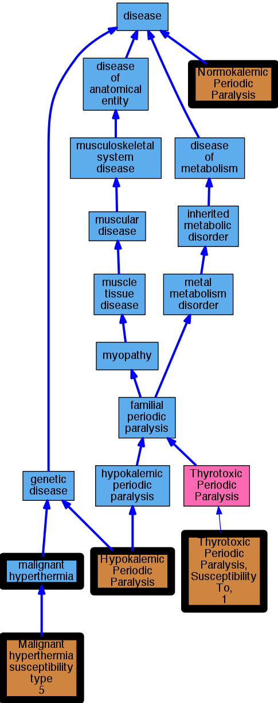

## GENE: CACNA1S

[matched diseases visual](CACNA1S.png)  <-- click on raw to zoom

### HYPOKALEMIC PERIODIC PARALYSIS, TYPE 1
 * [OMIM:170400 Hypokalemic Periodic Paralysis, Type 1](http://beta.monarchinitiative.org/disease/OMIM:170400) Confidence: high
    * Syn: "HOKPP1"
    * Syn: "Hypokalemic Periodic Paralysis"
    * Syn: "HYPOKALEMIC PERIODIC PARALYSIS, TYPE 1; HOKPP1"

### Hypokalemic periodic paralysis 1
 * [DOID:14452 hypokalemic periodic paralysis](http://beta.monarchinitiative.org/disease/DOID:14452) Confidence: low/0.1953125
    * Equiv:[MESH:D020514 Hypokalemic Periodic Paralysis](http://beta.monarchinitiative.org/disease/MESH:D020514)
    * Equiv:[Orphanet:681 Hypokalemic periodic paralysis](http://beta.monarchinitiative.org/disease/Orphanet:681)
    * Syn: "Familial Hypokalemic Periodic Paralysis"
    * Syn: "familial hypokalemic periodic paralysis (disorder)"
    * Syn: "familial periodic paralysis (& [hypokalaemic])"
    * Syn: "Hypokalemic familial periodic paralysis"
    * Syn: "Hypokalemic periodic paralysis (disorder)"
    * Syn: "Hypokalemic Periodic Paralysis, Familial"
    * Syn: "Paralysis, Hypokalemic Periodic"
    * Syn: "periodic hypokalemic paralysis"
    * Syn: "Periodic Paralysis Hypokalemic"
    * Syn: "Periodic paralysis I"
    * Syn: "Periodic Paralysis, Hypokalemic"
    * Syn: "Periodic Paralysis- Hypokalemic"
    * Syn: "Periodic Paralysis- Hypokalemics"
    * Syn: "Primary Hypokalemic Periodic Paralysis"
    * Syn: "Westphall Disease"
    * Syn: "Westphall disease"

### MALIGNANT HYPERTHERMIA, SUSCEPTIBILITY TO, 5
 * [OMIM:601887 Malignant Hyperthermia, Susceptibility To, 5](http://beta.monarchinitiative.org/disease/OMIM:601887) Confidence: high
    * Equiv:[MESH:C535698 Malignant hyperthermia susceptibility type 5](http://beta.monarchinitiative.org/disease/MESH:C535698)
    * Syn: "Malignant hyperpyrexia susceptibility type 5"
    * Syn: "MALIGNANT HYPERTHERMIA, SUSCEPTIBILITY TO, 5"
    * Syn: "Mhs5"

### Malignant hyperthermia
 * [DOID:8545 malignant hyperthermia](http://beta.monarchinitiative.org/disease/DOID:8545) Confidence: high
    * Equiv:[MESH:D008305 Malignant Hyperthermia](http://beta.monarchinitiative.org/disease/MESH:D008305)
    * Equiv:[Orphanet:423 Malignant hyperthermia](http://beta.monarchinitiative.org/disease/Orphanet:423)
    * Syn: "Anesthesia Hyperthermia"
    * Syn: "Anesthesia Hyperthermias"
    * Syn: "Anesthesia Related Hyperthermia"
    * Syn: "anesthesia related hyperthermia"
    * Syn: "Anesthesia Related Hyperthermias"
    * Syn: "Hyperpyrexia, Malignant"
    * Syn: "Hyperpyrexias, Malignant"
    * Syn: "Hyperthermia of Anesthesia"
    * Syn: "Hyperthermia of anesthesia"
    * Syn: "Hyperthermia, Anesthesia Related"
    * Syn: "Hyperthermia, Malignant"
    * Syn: "Hyperthermias, Anesthesia Related"
    * Syn: "Malignant Hyperpyrexia"
    * Syn: "Malignant hyperpyrexia"
    * Syn: "malignant hyperpyrexia due to anesthesia"
    * Syn: "Malignant Hyperpyrexias"
    * Syn: "Malignant Hyperthermias"
    * Syn: "Related Hyperthermia, Anesthesia"
    * Syn: "Related Hyperthermias, Anesthesia"

### Hypokalaemic periodic paralysis
 * [Orphanet:79102 Thyrotoxic periodic paralysis](http://beta.monarchinitiative.org/disease/Orphanet:79102) Confidence: low/0.1388888888888889
    * Syn: "Thyrotoxic hypokalemic periodic paralysis"

### THYROTOXIC PERIODIC PARALYSIS, SUSCEPTIBILITY TO, 1
 * [OMIM:188580 Thyrotoxic Periodic Paralysis, Susceptibility To, 1](http://beta.monarchinitiative.org/disease/OMIM:188580) Confidence: high
    * Syn: "THYROTOXIC PERIODIC PARALYSIS, SUSCEPTIBILITY TO, 1; TTPP1"
    * Syn: "TTPP1"
