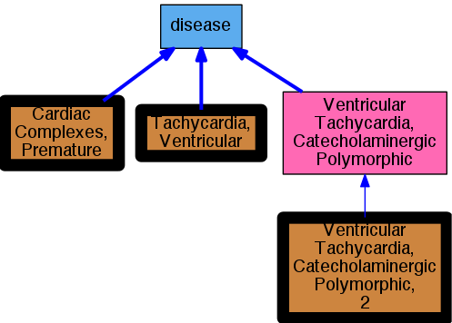

## GENE: CASQ2

[matched diseases visual](CASQ2.png)  <-- click on raw to zoom

### Arrhythmia
 * [MESH:D001145 Arrhythmias, Cardiac](http://beta.monarchinitiative.org/disease/MESH:D001145) Confidence: high
    * Syn: "Arrhythmia"
    * Syn: "Arrhythmia, Cardiac"
    * Syn: "Arrythmia"
    * Syn: "Cardiac Arrhythmia"
    * Syn: "Cardiac Arrhythmias"
    * Syn: "Cardiac Dysrhythmia"
    * Syn: "Dysrhythmia, Cardiac"

### VENTRICULAR TACHYCARDIA, CATECHOLAMINERGIC POLYMORPHIC, 2
 * [OMIM:611938 Ventricular Tachycardia, Catecholaminergic Polymorphic, 2](http://beta.monarchinitiative.org/disease/OMIM:611938) Confidence: high
    * Syn: "CPVT2"
    * Syn: "VENTRICULAR TACHYCARDIA, CATECHOLAMINERGIC POLYMORPHIC, 2; CPVT2"
    * Syn: "Ventricular Tachycardia, Stress-Induced Polymorphic"

### Ventricular tachycardia, catecholaminergic polymorphic, 2
 * [OMIM:611938 Ventricular Tachycardia, Catecholaminergic Polymorphic, 2](http://beta.monarchinitiative.org/disease/OMIM:611938) Confidence: high
    * Syn: "CPVT2"
    * Syn: "VENTRICULAR TACHYCARDIA, CATECHOLAMINERGIC POLYMORPHIC, 2; CPVT2"
    * Syn: "Ventricular Tachycardia, Stress-Induced Polymorphic"

### Ventricular tachycardia, polymorphic
 * [MESH:D017180 Tachycardia, Ventricular](http://beta.monarchinitiative.org/disease/MESH:D017180) Confidence: low/0.18055555555555555
    * Syn: "Tachycardias, Ventricular"
    * Syn: "Ventricular Tachycardia"
    * Syn: "Ventricular Tachycardias"
