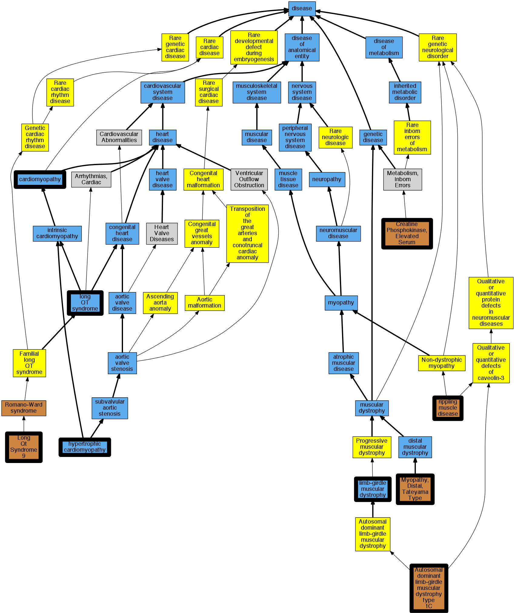

## GENE: CAV3

[matched diseases visual](CAV3.png)  <-- click on raw to zoom

### CARDIOMYOPATHY, FAMILIAL HYPERTROPHIC
 * [DOID:11984 hypertrophic cardiomyopathy](http://beta.monarchinitiative.org/disease/DOID:11984) Confidence: high
    * Equiv:[MESH:D002312 Cardiomyopathy, Hypertrophic](http://beta.monarchinitiative.org/disease/MESH:D002312)
    * Equiv:[MESH:D024741 Cardiomyopathy, Hypertrophic, Familial](http://beta.monarchinitiative.org/disease/MESH:D024741)
    * Syn: "familial hypertrophic cardiomyopathy"
    * Syn: "hypertrophic obstructive cardiomyopathy"

### CREATINE PHOSPHOKINASE, ELEVATED SERUM
 * [OMIM:123320 Creatine Phosphokinase, Elevated Serum](http://beta.monarchinitiative.org/disease/OMIM:123320) Confidence: high
    * Syn: "Cpk, Elevated Serum"
    * Syn: "CREATINE PHOSPHOKINASE, ELEVATED SERUM"
    * Syn: "Hyperckemia, Idiopathic"

### Cardiomyopathy
 * [DOID:0050700 cardiomyopathy](http://beta.monarchinitiative.org/disease/DOID:0050700) Confidence: high
    * Equiv:[MESH:D009202 Cardiomyopathies](http://beta.monarchinitiative.org/disease/MESH:D009202)
    * Syn: "Cardiomyopathies"

### Isolated hyperCKaemia,Long QT syndrome
 * [DOID:2843 long QT syndrome](http://beta.monarchinitiative.org/disease/DOID:2843) Confidence: low/0.16999999999999998
    * Equiv:[MESH:D008133 Long QT Syndrome](http://beta.monarchinitiative.org/disease/MESH:D008133)
    * Syn: "long Q-T syndrome"
    * Syn: "LQT"
    * Syn: "Romano-Ward syndrome"
    * Syn: "Romano-Ward syndrome (disorder)"

### LONG QT SYNDROME 2/9, DIGENIC
 * [OMIM:611818 Long Qt Syndrome 9](http://beta.monarchinitiative.org/disease/OMIM:611818) Confidence: high
    * Equiv:[MESH:C567515 Long Qt Syndrome 9](http://beta.monarchinitiative.org/disease/MESH:C567515)
    * Syn: "Long Qt Syndrome 2/9, Digenic"
    * Syn: "Long Qt Syndrome 9, Acquired, Susceptibility to"
    * Syn: "LONG QT SYNDROME 9; LQT9"
    * Syn: "LQT9"

### LONG QT SYNDROME 9
 * [OMIM:611818 Long Qt Syndrome 9](http://beta.monarchinitiative.org/disease/OMIM:611818) Confidence: high
    * Equiv:[MESH:C567515 Long Qt Syndrome 9](http://beta.monarchinitiative.org/disease/MESH:C567515)
    * Syn: "Long Qt Syndrome 2/9, Digenic"
    * Syn: "Long Qt Syndrome 9, Acquired, Susceptibility to"
    * Syn: "LONG QT SYNDROME 9; LQT9"
    * Syn: "LQT9"

### LONG QT SYNDROME 9, ACQUIRED, SUSCEPTIBILITY TO
 * [OMIM:611818 Long Qt Syndrome 9](http://beta.monarchinitiative.org/disease/OMIM:611818) Confidence: high
    * Equiv:[MESH:C567515 Long Qt Syndrome 9](http://beta.monarchinitiative.org/disease/MESH:C567515)
    * Syn: "Long Qt Syndrome 2/9, Digenic"
    * Syn: "Long Qt Syndrome 9, Acquired, Susceptibility to"
    * Syn: "LONG QT SYNDROME 9; LQT9"
    * Syn: "LQT9"

### Long QT syndrome
 * [DOID:2843 long QT syndrome](http://beta.monarchinitiative.org/disease/DOID:2843) Confidence: high
    * Equiv:[MESH:D008133 Long QT Syndrome](http://beta.monarchinitiative.org/disease/MESH:D008133)
    * Syn: "long Q-T syndrome"
    * Syn: "LQT"
    * Syn: "Romano-Ward syndrome"
    * Syn: "Romano-Ward syndrome (disorder)"

### MUSCULAR DYSTROPHY, LIMB-GIRDLE, TYPE 1C
 * [OMIM:607801 Muscular Dystrophy, Limb-Girdle, Type 1C](http://beta.monarchinitiative.org/disease/OMIM:607801) Confidence: high
    * Equiv:[MESH:C563362 Muscular Dystrophy, Limb-Girdle, Type 1C](http://beta.monarchinitiative.org/disease/MESH:C563362)
    * Syn: "LGMD1C"
    * Syn: "MUSCULAR DYSTROPHY, LIMB-GIRDLE, TYPE 1C; LGMD1C"

### MUSCULAR DYSTROPHY, LIMB-GIRDLE, TYPE 1C, AUTOSOMAL RECESSIVE
 * [OMIM:607801 Muscular Dystrophy, Limb-Girdle, Type 1C](http://beta.monarchinitiative.org/disease/OMIM:607801) Confidence: low/0.1849922839506173
    * Equiv:[MESH:C563362 Muscular Dystrophy, Limb-Girdle, Type 1C](http://beta.monarchinitiative.org/disease/MESH:C563362)
    * Syn: "LGMD1C"
    * Syn: "MUSCULAR DYSTROPHY, LIMB-GIRDLE, TYPE 1C; LGMD1C"

### MYOPATHY, DISTAL, TATEYAMA TYPE
 * [OMIM:614321 Myopathy, Distal, Tateyama Type](http://beta.monarchinitiative.org/disease/OMIM:614321) Confidence: high
    * Syn: "MPDT"
    * Syn: "MYOPATHY, DISTAL, TATEYAMA TYPE; MPDT"

### Muscular dystrophy, limb girdle
 * [DOID:11724 limb-girdle muscular dystrophy](http://beta.monarchinitiative.org/disease/DOID:11724) Confidence: high
    * Equiv:[MESH:D049288 Muscular Dystrophies, Limb-Girdle](http://beta.monarchinitiative.org/disease/MESH:D049288)
    * Syn: "Erb's muscular dystrophy"
    * Syn: "Leyden-Mbius muscular dystrophy"
    * Syn: "limb girdle muscular dystrophy"

### Primary familial hypertrophic cardiomyopathy
 * [DOID:11984 hypertrophic cardiomyopathy](http://beta.monarchinitiative.org/disease/DOID:11984) Confidence: low/0.1953125
    * Equiv:[MESH:D002312 Cardiomyopathy, Hypertrophic](http://beta.monarchinitiative.org/disease/MESH:D002312)
    * Equiv:[MESH:D024741 Cardiomyopathy, Hypertrophic, Familial](http://beta.monarchinitiative.org/disease/MESH:D024741)
    * Syn: "familial hypertrophic cardiomyopathy"
    * Syn: "hypertrophic obstructive cardiomyopathy"

### RIPPLING MUSCLE DISEASE 2
 * [OMIM:606072 Rippling Muscle Disease](http://beta.monarchinitiative.org/disease/OMIM:606072) Confidence: high
    * Syn: "Rippling Muscle Disease 2"
    * Syn: "RIPPLING MUSCLE DISEASE; RMD"
    * Syn: "RMD"

### RIPPLING MUSCLE DISEASE 2, AUTOSOMAL RECESSIVE
 * [OMIM:606072 Rippling Muscle Disease](http://beta.monarchinitiative.org/disease/OMIM:606072) Confidence: low/0.125
    * Syn: "Rippling Muscle Disease 2"
    * Syn: "RIPPLING MUSCLE DISEASE; RMD"
    * Syn: "RMD"
