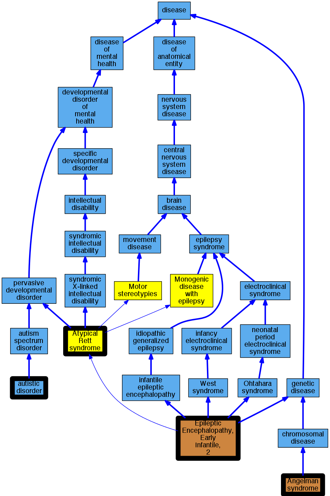

## GENE: CDKL5

[matched diseases visual](CDKL5.png)  <-- click on raw to zoom

### EPILEPTIC ENCEPHALOPATHY, EARLY INFANTILE, 2
 * [OMIM:300672 Epileptic Encephalopathy, Early Infantile, 2](http://beta.monarchinitiative.org/disease/OMIM:300672) Confidence: high
    * Equiv:[MESH:C564064 Epileptic Encephalopathy, Early Infantile, 2](http://beta.monarchinitiative.org/disease/MESH:C564064)
    * Syn: "EIEE2"
    * Syn: "EPILEPTIC ENCEPHALOPATHY, EARLY INFANTILE, 2; EIEE2"
    * Syn: "Infantile Spasm Syndrome, X-Linked 2"
    * Syn: "Rett Syndrome, Atypical, Cdkl5-Related"
    * Syn: "Rett Syndrome, Variant, With Infantile Spasms"

### Early infantile epileptic encephalopathy 2
 * [OMIM:300672 Epileptic Encephalopathy, Early Infantile, 2](http://beta.monarchinitiative.org/disease/OMIM:300672) Confidence: high
    * Equiv:[MESH:C564064 Epileptic Encephalopathy, Early Infantile, 2](http://beta.monarchinitiative.org/disease/MESH:C564064)
    * Syn: "EIEE2"
    * Syn: "EPILEPTIC ENCEPHALOPATHY, EARLY INFANTILE, 2; EIEE2"
    * Syn: "Infantile Spasm Syndrome, X-Linked 2"
    * Syn: "Rett Syndrome, Atypical, Cdkl5-Related"
    * Syn: "Rett Syndrome, Variant, With Infantile Spasms"

### Atypical Rett syndrome
 * [MESH:C567576 Rett Syndrome, Atypical](http://beta.monarchinitiative.org/disease/MESH:C567576) Confidence: high

### Epileptic encephalopathy, early infantile, 2
 * [OMIM:300672 Epileptic Encephalopathy, Early Infantile, 2](http://beta.monarchinitiative.org/disease/OMIM:300672) Confidence: high
    * Equiv:[MESH:C564064 Epileptic Encephalopathy, Early Infantile, 2](http://beta.monarchinitiative.org/disease/MESH:C564064)
    * Syn: "EIEE2"
    * Syn: "EPILEPTIC ENCEPHALOPATHY, EARLY INFANTILE, 2; EIEE2"
    * Syn: "Infantile Spasm Syndrome, X-Linked 2"
    * Syn: "Rett Syndrome, Atypical, Cdkl5-Related"
    * Syn: "Rett Syndrome, Variant, With Infantile Spasms"

### Angelman syndrome-like
 * [OMIM:105830 Angelman syndrome](http://beta.monarchinitiative.org/disease/OMIM:105830) Confidence: low/0.18055555555555555
    * Equiv:[Orphanet:72 Angelman syndrome](http://beta.monarchinitiative.org/disease/Orphanet:72)
    * Equiv:[DOID:1932 Angelman syndrome](http://beta.monarchinitiative.org/disease/DOID:1932)
    * Equiv:[MESH:D017204 Angelman Syndrome](http://beta.monarchinitiative.org/disease/MESH:D017204)
    * Syn: "Angelman Syndrome Chromosome Region"
    * Syn: "ANGELMAN SYNDROME; AS"
    * Syn: "AS"
    * Syn: "Children, Puppet"
    * Syn: "Happy Puppet Syndrome"
    * Syn: "happy puppet syndrome"
    * Syn: "Happy Puppet Syndrome, Formerly"
    * Syn: "Puppet Children"
    * Syn: "puppetlike syndrome"
    * Syn: "Syndrome, Angelman"
    * Syn: "Syndrome, Happy Puppet"

### Autism
 * [OMIM:209850 Autism](http://beta.monarchinitiative.org/disease/OMIM:209850) Confidence: high
    * Syn: "AUTISM"
    * Syn: "Autism Spectrum Disorder"
    * Syn: "Autism, Susceptibility To, 1"
    * Syn: "Autistic Disorder"
