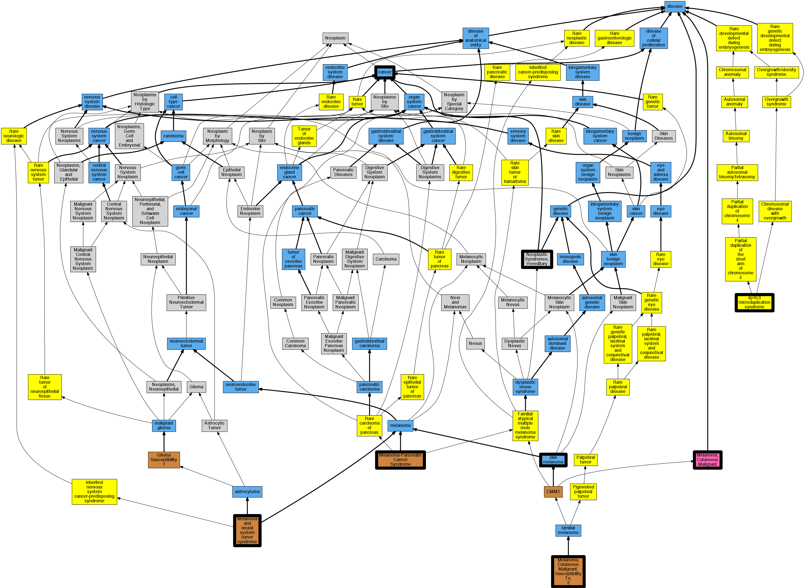

## GENE: CDKN2A

[matched diseases visual](CDKN2A.png)  <-- click on raw to zoom

### Hereditary cutaneous melanoma
 * [DOID:8923 skin melanoma](http://beta.monarchinitiative.org/disease/DOID:8923) Confidence: low/0.18055555555555555
    * Syn: "cutaneous melanoma"
    * Syn: "malignant ear melanoma"
    * Syn: "malignant lip melanoma"
    * Syn: "malignant lower limb melanoma"
    * Syn: "malignant melanoma of ear and/or external auricular canal"
    * Syn: "malignant melanoma of skin of lower limb"
    * Syn: "malignant melanoma of skin of trunk except scrotum"
    * Syn: "malignant melanoma of skin of upper limb"
    * Syn: "malignant neck melanoma"
    * Syn: "malignant scalp melanoma"
    * Syn: "malignant trunk melanoma"
    * Syn: "malignant upper limb melanoma"

### MELANOMA, CUTANEOUS MALIGNANT, SUSCEPTIBILITY TO , 2
 * [OMIM:155601 Melanoma, Cutaneous Malignant, Susceptibility To, 2](http://beta.monarchinitiative.org/disease/OMIM:155601) Confidence: high
    * Syn: "CMM2"
    * Syn: "MELANOMA, CUTANEOUS MALIGNANT, SUSCEPTIBILITY TO, 2; CMM2"

### Neoplastic Syndromes, Hereditary
 * [MESH:D009386 Neoplastic Syndromes, Hereditary](http://beta.monarchinitiative.org/disease/MESH:D009386) Confidence: high

### p16-LEIDEN
 * [Orphanet:96072 4p16.3 microduplication syndrome](http://beta.monarchinitiative.org/disease/Orphanet:96072) Confidence: low/0.030000000000000002

### Cutaneous malignant melanoma 1
 * [OMIM:155600 Melanoma](http://beta.monarchinitiative.org/disease/OMIM:155600) Confidence: low/0.1953125
    * Equiv:[MESH:C562393 Melanoma, Cutaneous Malignant](http://beta.monarchinitiative.org/disease/MESH:C562393)
    * Equiv:[MESH:D008545 Melanoma](http://beta.monarchinitiative.org/disease/MESH:D008545)
    * Syn: "B-K Mole Syndrome"
    * Syn: "CMM1"
    * Syn: "Dysplastic Nevus Syndrome, Hereditary"
    * Syn: "Familial Atypical Mole-Malignant Melanoma Syndrome"
    * Syn: "Melanoma, Cutaneous Malignant"
    * Syn: "MELANOMA, CUTANEOUS MALIGNANT, SUSCEPTIBILITY TO, 1; CMM1"
    * Syn: "Melanoma, Familial"
    * Syn: "Melanoma, Malignant"

### MELANOMA AND NEURAL SYSTEM TUMOR SYNDROME
 * [OMIM:155755 Melanoma and neural system tumor syndrome](http://beta.monarchinitiative.org/disease/OMIM:155755) Confidence: high
    * Equiv:[Orphanet:252206 Melanoma and neural system tumor syndrome](http://beta.monarchinitiative.org/disease/Orphanet:252206)
    * Equiv:[MESH:C536149 Melanoma astrocytoma syndrome](http://beta.monarchinitiative.org/disease/MESH:C536149)
    * Syn: "Melanoma and Neural System Tumor Syndrome"
    * Syn: "MELANOMA-ASTROCYTOMA SYNDROME"

### MELANOMA, CUTANEOUS MALIGNANT, SUSCEPTIBILITY TO, 2
 * [OMIM:155601 Melanoma, Cutaneous Malignant, Susceptibility To, 2](http://beta.monarchinitiative.org/disease/OMIM:155601) Confidence: high
    * Syn: "CMM2"
    * Syn: "MELANOMA, CUTANEOUS MALIGNANT, SUSCEPTIBILITY TO, 2; CMM2"

### MELANOMA-PANCREATIC CANCER SYNDROME
 * [OMIM:606719 Melanoma-pancreatic cancer syndrome](http://beta.monarchinitiative.org/disease/OMIM:606719) Confidence: high
    * Equiv:[Orphanet:51013 Melanoma-pancreatic cancer syndrome](http://beta.monarchinitiative.org/disease/Orphanet:51013)
    * Equiv:[MESH:C563985 Melanoma-Pancreatic Cancer Syndrome](http://beta.monarchinitiative.org/disease/MESH:C563985)
    * Syn: "Familial Atypical Multiple Mole Melanoma-Pancreatic Carcinoma Syndrome"
    * Syn: "MELANOMA-PANCREATIC CANCER SYNDROME"

### OROLARYNGEAL CANCER, MULTIPLE
 * [DOID:162 cancer](http://beta.monarchinitiative.org/disease/DOID:162) Confidence: low/0.1388888888888889
    * Syn: "malignant neoplasm"
    * Syn: "malignant tumor "
    * Syn: "primary cancer"
