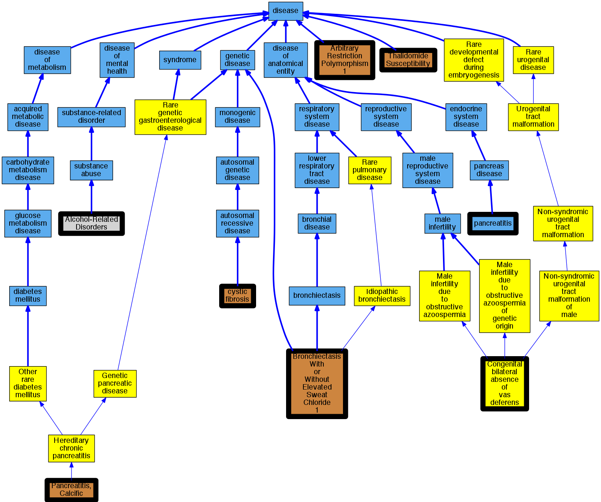

## GENE: CFTR

[matched diseases visual](CFTR.png)  <-- click on raw to zoom

### CFTR-related disorders
 * [http://www.ncbi.nlm.nih.gov/gene/389841195 CFTR](http://beta.monarchinitiative.org/disease/http://www.ncbi.nlm.nih.gov/gene/389841195) Confidence: low/0.1388888888888889

### Hereditary pancreatitis
 * [OMIM:167800 Hereditary chronic pancreatitis](http://beta.monarchinitiative.org/disease/OMIM:167800) Confidence: high
    * Equiv:[Orphanet:676 Hereditary chronic pancreatitis](http://beta.monarchinitiative.org/disease/Orphanet:676)
    * Equiv:[MESH:C537262 Hereditary pancreatitis](http://beta.monarchinitiative.org/disease/MESH:C537262)
    * Syn: "Autosomal Dominant Hereditary Pancreatitis"
    * Syn: "Familial Pancreatitis"
    * Syn: "Hereditary Chronic Pancreatitis"
    * Syn: "Hp"
    * Syn: "Hpc"
    * Syn: "Pancreatitis, Calcific"
    * Syn: "Pancreatitis, Chronic"
    * Syn: "Pancreatitis, Chronic, Protection Against"
    * Syn: "Pancreatitis, Chronic, Susceptibility to"
    * Syn: "Pancreatitis, Hereditary"
    * Syn: "PANCREATITIS, HEREDITARY; PCTT"
    * Syn: "PCTT"

### BRONCHIECTASIS WITH OR WITHOUT ELEVATED SWEAT CHLORIDE 1, MODIFIER OF
 * [OMIM:211400 Bronchiectasis With or Without Elevated Sweat Chloride 1](http://beta.monarchinitiative.org/disease/OMIM:211400) Confidence: low/0.09555555555555556
    * Equiv:[MESH:C567618 Bronchiectasis With Or Without Elevated Sweat Chloride 1](http://beta.monarchinitiative.org/disease/MESH:C567618)
    * Syn: "BESC1"
    * Syn: "BRONCHIECTASIS WITH OR WITHOUT ELEVATED SWEAT CHLORIDE 1; BESC1"
    * Syn: "Cystic Fibrosis-Like Syndrome"

### Bronchiectasis
 * [DOID:9563 bronchiectasis](http://beta.monarchinitiative.org/disease/DOID:9563) Confidence: high
    * Equiv:[MESH:D001987 Bronchiectasis](http://beta.monarchinitiative.org/disease/MESH:D001987)
    * Syn: "Bronchiectases"
    * Syn: "Polynesian bronchiectasis"

### CFTR POLYMORPHISM
 * [http://www.ncbi.nlm.nih.gov/gene/389841195 CFTR](http://beta.monarchinitiative.org/disease/http://www.ncbi.nlm.nih.gov/gene/389841195) Confidence: low/0.15625

### Classic Cystic Fibrosis
 * [OMIM:219700 cystic fibrosis](http://beta.monarchinitiative.org/disease/OMIM:219700) Confidence: low/0.18055555555555555
    * Equiv:[Orphanet:586 Cystic fibrosis](http://beta.monarchinitiative.org/disease/Orphanet:586)
    * Equiv:[DOID:1485 cystic fibrosis](http://beta.monarchinitiative.org/disease/DOID:1485)
    * Equiv:[MESH:D003550 Cystic Fibrosis](http://beta.monarchinitiative.org/disease/MESH:D003550)
    * Syn: "CF"
    * Syn: "CF"
    * Syn: "Cystic Fibrosis of Pancreas"
    * Syn: "Cystic Fibrosis, Pancreatic"
    * Syn: "Cystic Fibrosis, Pulmonary"
    * Syn: "CYSTIC FIBROSIS; CF"
    * Syn: "Fibrocystic Disease of Pancreas"
    * Syn: "Fibrosis, Cystic"
    * Syn: "Mucoviscidosis"
    * Syn: "Mucoviscidosis"
    * Syn: "mucoviscidosis"
    * Syn: "Pancreas Fibrocystic Disease"
    * Syn: "Pancreas Fibrocystic Diseases"
    * Syn: "Pancreatic Cystic Fibrosis"
    * Syn: "Pulmonary Cystic Fibrosis"

### Cystic Fibrosis
 * [OMIM:219700 cystic fibrosis](http://beta.monarchinitiative.org/disease/OMIM:219700) Confidence: high
    * Equiv:[Orphanet:586 Cystic fibrosis](http://beta.monarchinitiative.org/disease/Orphanet:586)
    * Equiv:[DOID:1485 cystic fibrosis](http://beta.monarchinitiative.org/disease/DOID:1485)
    * Equiv:[MESH:D003550 Cystic Fibrosis](http://beta.monarchinitiative.org/disease/MESH:D003550)
    * Syn: "CF"
    * Syn: "CF"
    * Syn: "Cystic Fibrosis of Pancreas"
    * Syn: "Cystic Fibrosis, Pancreatic"
    * Syn: "Cystic Fibrosis, Pulmonary"
    * Syn: "CYSTIC FIBROSIS; CF"
    * Syn: "Fibrocystic Disease of Pancreas"
    * Syn: "Fibrosis, Cystic"
    * Syn: "Mucoviscidosis"
    * Syn: "Mucoviscidosis"
    * Syn: "mucoviscidosis"
    * Syn: "Pancreas Fibrocystic Disease"
    * Syn: "Pancreas Fibrocystic Diseases"
    * Syn: "Pancreatic Cystic Fibrosis"
    * Syn: "Pulmonary Cystic Fibrosis"

### Cystic fibrosis
 * [OMIM:219700 cystic fibrosis](http://beta.monarchinitiative.org/disease/OMIM:219700) Confidence: high
    * Equiv:[Orphanet:586 Cystic fibrosis](http://beta.monarchinitiative.org/disease/Orphanet:586)
    * Equiv:[DOID:1485 cystic fibrosis](http://beta.monarchinitiative.org/disease/DOID:1485)
    * Equiv:[MESH:D003550 Cystic Fibrosis](http://beta.monarchinitiative.org/disease/MESH:D003550)
    * Syn: "CF"
    * Syn: "CF"
    * Syn: "Cystic Fibrosis of Pancreas"
    * Syn: "Cystic Fibrosis, Pancreatic"
    * Syn: "Cystic Fibrosis, Pulmonary"
    * Syn: "CYSTIC FIBROSIS; CF"
    * Syn: "Fibrocystic Disease of Pancreas"
    * Syn: "Fibrosis, Cystic"
    * Syn: "Mucoviscidosis"
    * Syn: "Mucoviscidosis"
    * Syn: "mucoviscidosis"
    * Syn: "Pancreas Fibrocystic Disease"
    * Syn: "Pancreas Fibrocystic Diseases"
    * Syn: "Pancreatic Cystic Fibrosis"
    * Syn: "Pulmonary Cystic Fibrosis"

### heritable chronic pancreatitis
 * [MESH:D050500 Pancreatitis, Chronic](http://beta.monarchinitiative.org/disease/MESH:D050500) Confidence: low/0.18055555555555555
    * Syn: "Chronic Pancreatitis"

### Congenital bilateral absence of the vas deferens
 * [OMIM:277180 Congenital bilateral absence of vas deferens](http://beta.monarchinitiative.org/disease/OMIM:277180) Confidence: high
    * Equiv:[Orphanet:48 Congenital bilateral absence of vas deferens](http://beta.monarchinitiative.org/disease/Orphanet:48)
    * Equiv:[MESH:C535984 Congenital bilateral aplasia of vas deferens](http://beta.monarchinitiative.org/disease/MESH:C535984)
    * Syn: "Absence of Vas Deferens"
    * Syn: "Absent Vasa"
    * Syn: "Cavd"
    * Syn: "CBAVD"
    * Syn: "Congenital Absence of Vas Deferens"
    * Syn: "Congenital Aplasia of Vas Deferens"
    * Syn: "Congenital bilateral absence of the vas deferens"
    * Syn: "Congenital Bilateral Absence of Vas Deferens"
    * Syn: "Congenital bilateral agenesis of vas deferens"
    * Syn: "Congenital bilateral aplasia of vas deferens"
    * Syn: "Vas Deferens, Congenital Bilateral Aplasia Of"
    * Syn: "VAS DEFERENS, CONGENITAL BILATERAL APLASIA OF; CBAVD"

### Cystic Fibrosis
 * [OMIM:219700 cystic fibrosis](http://beta.monarchinitiative.org/disease/OMIM:219700) Confidence: high
    * Equiv:[Orphanet:586 Cystic fibrosis](http://beta.monarchinitiative.org/disease/Orphanet:586)
    * Equiv:[DOID:1485 cystic fibrosis](http://beta.monarchinitiative.org/disease/DOID:1485)
    * Equiv:[MESH:D003550 Cystic Fibrosis](http://beta.monarchinitiative.org/disease/MESH:D003550)
    * Syn: "CF"
    * Syn: "CF"
    * Syn: "Cystic Fibrosis of Pancreas"
    * Syn: "Cystic Fibrosis, Pancreatic"
    * Syn: "Cystic Fibrosis, Pulmonary"
    * Syn: "CYSTIC FIBROSIS; CF"
    * Syn: "Fibrocystic Disease of Pancreas"
    * Syn: "Fibrosis, Cystic"
    * Syn: "Mucoviscidosis"
    * Syn: "Mucoviscidosis"
    * Syn: "mucoviscidosis"
    * Syn: "Pancreas Fibrocystic Disease"
    * Syn: "Pancreas Fibrocystic Diseases"
    * Syn: "Pancreatic Cystic Fibrosis"
    * Syn: "Pulmonary Cystic Fibrosis"

### HYPERTRYPSINEMIA, NEONATAL, SUSCEPTIBILITY TO
 * [DOID:11244 neonatal anemia](http://beta.monarchinitiative.org/disease/DOID:11244) Confidence: low/0.0703125
    * Equiv:[MESH:D000751 Anemia, Neonatal](http://beta.monarchinitiative.org/disease/MESH:D000751)
    * Syn: "ANEMIA NEONATAL"
    * Syn: "Anemia Neonatorum"
    * Syn: "Anemias, Neonatal"
    * Syn: "Neonatal Anemia"
    * Syn: "Neonatal anemia (disorder)"
    * Syn: "Neonatal anemia, NOS"
    * Syn: "Neonatal anemia, NOS"
    * Syn: "Neonatal anemia, NOS"
    * Syn: "Neonatal Anemias"

### PANCREATITIS, IDIOPATHIC, SUSCEPTIBILITY TO
 * [DOID:2913 acute pancreatitis](http://beta.monarchinitiative.org/disease/DOID:2913) Confidence: low/0.0703125
    * Syn: "acute necrotizing pancreatitis"
    * Syn: "acute necrotizing pancreatitis (disorder)"
    * Syn: "acute pancreatitis (disorder)"
    * Syn: "acute pancreatitis (disorder) [Ambiguous]"
    * Syn: "acute pancreatitis NOS"
    * Syn: "acute pancreatitis NOS (disorder)"
    * Syn: "acute pancreatitis unspecified (disorder)"
    * Syn: "PANCREATITIS NECROTIZING"

### VAS DEFERENS, CONGENITAL BILATERAL ABSENCE OF
 * [OMIM:277180 Congenital bilateral absence of vas deferens](http://beta.monarchinitiative.org/disease/OMIM:277180) Confidence: high
    * Equiv:[Orphanet:48 Congenital bilateral absence of vas deferens](http://beta.monarchinitiative.org/disease/Orphanet:48)
    * Equiv:[MESH:C535984 Congenital bilateral aplasia of vas deferens](http://beta.monarchinitiative.org/disease/MESH:C535984)
    * Syn: "Absence of Vas Deferens"
    * Syn: "Absent Vasa"
    * Syn: "Cavd"
    * Syn: "CBAVD"
    * Syn: "Congenital Absence of Vas Deferens"
    * Syn: "Congenital Aplasia of Vas Deferens"
    * Syn: "Congenital bilateral absence of the vas deferens"
    * Syn: "Congenital Bilateral Absence of Vas Deferens"
    * Syn: "Congenital bilateral agenesis of vas deferens"
    * Syn: "Congenital bilateral aplasia of vas deferens"
    * Syn: "Vas Deferens, Congenital Bilateral Aplasia Of"
    * Syn: "VAS DEFERENS, CONGENITAL BILATERAL APLASIA OF; CBAVD"

### CYSTIC FIBROSIS
 * [OMIM:219700 cystic fibrosis](http://beta.monarchinitiative.org/disease/OMIM:219700) Confidence: high
    * Equiv:[Orphanet:586 Cystic fibrosis](http://beta.monarchinitiative.org/disease/Orphanet:586)
    * Equiv:[DOID:1485 cystic fibrosis](http://beta.monarchinitiative.org/disease/DOID:1485)
    * Equiv:[MESH:D003550 Cystic Fibrosis](http://beta.monarchinitiative.org/disease/MESH:D003550)
    * Syn: "CF"
    * Syn: "CF"
    * Syn: "Cystic Fibrosis of Pancreas"
    * Syn: "Cystic Fibrosis, Pancreatic"
    * Syn: "Cystic Fibrosis, Pulmonary"
    * Syn: "CYSTIC FIBROSIS; CF"
    * Syn: "Fibrocystic Disease of Pancreas"
    * Syn: "Fibrosis, Cystic"
    * Syn: "Mucoviscidosis"
    * Syn: "Mucoviscidosis"
    * Syn: "mucoviscidosis"
    * Syn: "Pancreas Fibrocystic Disease"
    * Syn: "Pancreas Fibrocystic Diseases"
    * Syn: "Pancreatic Cystic Fibrosis"
    * Syn: "Pulmonary Cystic Fibrosis"

### Congenital Bilateral Absence of the Vas Deferens
 * [OMIM:277180 Congenital bilateral absence of vas deferens](http://beta.monarchinitiative.org/disease/OMIM:277180) Confidence: high
    * Equiv:[Orphanet:48 Congenital bilateral absence of vas deferens](http://beta.monarchinitiative.org/disease/Orphanet:48)
    * Equiv:[MESH:C535984 Congenital bilateral aplasia of vas deferens](http://beta.monarchinitiative.org/disease/MESH:C535984)
    * Syn: "Absence of Vas Deferens"
    * Syn: "Absent Vasa"
    * Syn: "Cavd"
    * Syn: "CBAVD"
    * Syn: "Congenital Absence of Vas Deferens"
    * Syn: "Congenital Aplasia of Vas Deferens"
    * Syn: "Congenital bilateral absence of the vas deferens"
    * Syn: "Congenital Bilateral Absence of Vas Deferens"
    * Syn: "Congenital bilateral agenesis of vas deferens"
    * Syn: "Congenital bilateral aplasia of vas deferens"
    * Syn: "Vas Deferens, Congenital Bilateral Aplasia Of"
    * Syn: "VAS DEFERENS, CONGENITAL BILATERAL APLASIA OF; CBAVD"

### Congenital Bilateral Absence of the Vas Deferens
 * [OMIM:277180 Congenital bilateral absence of vas deferens](http://beta.monarchinitiative.org/disease/OMIM:277180) Confidence: high
    * Equiv:[Orphanet:48 Congenital bilateral absence of vas deferens](http://beta.monarchinitiative.org/disease/Orphanet:48)
    * Equiv:[MESH:C535984 Congenital bilateral aplasia of vas deferens](http://beta.monarchinitiative.org/disease/MESH:C535984)
    * Syn: "Absence of Vas Deferens"
    * Syn: "Absent Vasa"
    * Syn: "Cavd"
    * Syn: "CBAVD"
    * Syn: "Congenital Absence of Vas Deferens"
    * Syn: "Congenital Aplasia of Vas Deferens"
    * Syn: "Congenital bilateral absence of the vas deferens"
    * Syn: "Congenital Bilateral Absence of Vas Deferens"
    * Syn: "Congenital bilateral agenesis of vas deferens"
    * Syn: "Congenital bilateral aplasia of vas deferens"
    * Syn: "Vas Deferens, Congenital Bilateral Aplasia Of"
    * Syn: "VAS DEFERENS, CONGENITAL BILATERAL APLASIA OF; CBAVD"

### Non-classic Cystic Fibrosis
 * [OMIM:219700 cystic fibrosis](http://beta.monarchinitiative.org/disease/OMIM:219700) Confidence: low/0.15625
    * Equiv:[Orphanet:586 Cystic fibrosis](http://beta.monarchinitiative.org/disease/Orphanet:586)
    * Equiv:[DOID:1485 cystic fibrosis](http://beta.monarchinitiative.org/disease/DOID:1485)
    * Equiv:[MESH:D003550 Cystic Fibrosis](http://beta.monarchinitiative.org/disease/MESH:D003550)
    * Syn: "CF"
    * Syn: "CF"
    * Syn: "Cystic Fibrosis of Pancreas"
    * Syn: "Cystic Fibrosis, Pancreatic"
    * Syn: "Cystic Fibrosis, Pulmonary"
    * Syn: "CYSTIC FIBROSIS; CF"
    * Syn: "Fibrocystic Disease of Pancreas"
    * Syn: "Fibrosis, Cystic"
    * Syn: "Mucoviscidosis"
    * Syn: "Mucoviscidosis"
    * Syn: "mucoviscidosis"
    * Syn: "Pancreas Fibrocystic Disease"
    * Syn: "Pancreas Fibrocystic Diseases"
    * Syn: "Pancreatic Cystic Fibrosis"
    * Syn: "Pulmonary Cystic Fibrosis"

### SWEAT CHLORIDE ELEVATION WITHOUT CYSTIC FIBROSIS
 * [OMIM:612951 Cystic leukoencephalopathy without megalencephaly](http://beta.monarchinitiative.org/disease/OMIM:612951) Confidence: low/0.0763888888888889
    * Equiv:[Orphanet:85136 Cystic leukoencephalopathy without megalencephaly](http://beta.monarchinitiative.org/disease/Orphanet:85136)
    * Equiv:[MESH:C567845 Leukoencephalopathy, Cystic, Without Megalencephaly](http://beta.monarchinitiative.org/disease/MESH:C567845)
    * Syn: "CLWM"
    * Syn: "LEUKOENCEPHALOPATHY, CYSTIC, WITHOUT MEGALENCEPHALY"
