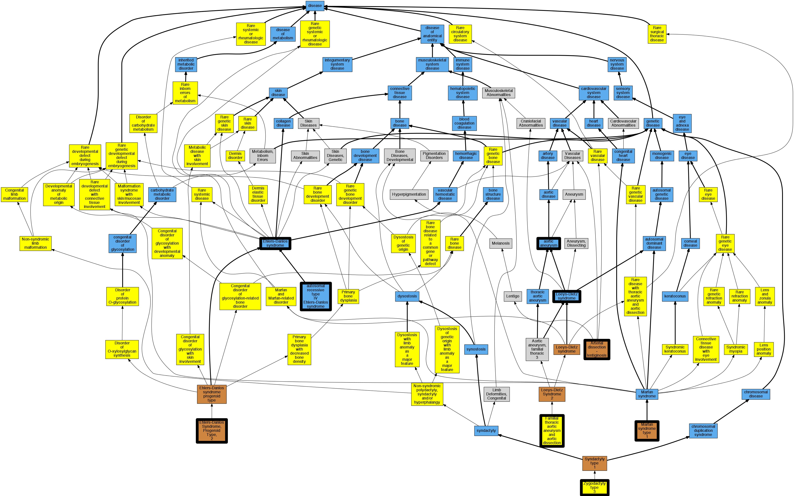

## GENE: COL3A1

[matched diseases visual](COL3A1.png)  <-- click on raw to zoom

### Aortic aneurysm
 * [DOID:3627 aortic aneurysm](http://beta.monarchinitiative.org/disease/DOID:3627) Confidence: high
    * Equiv:[MESH:D001014 Aortic Aneurysm](http://beta.monarchinitiative.org/disease/MESH:D001014)
    * Equiv:[MESH:D001019 Aortic Rupture](http://beta.monarchinitiative.org/disease/MESH:D001019)
    * Syn: "abdominal aortic aneurysm, ruptured"
    * Syn: "Aortic aneurysm of unspecified site, ruptured"
    * Syn: "Aortic aneurysm of unspecified site, ruptured (disorder)"
    * Syn: "Ruptured abdominal Aortic Aneurysm"
    * Syn: "ruptured abdominal aortic aneurysm"
    * Syn: "Ruptured abdominal aortic aneurysm (disorder)"
    * Syn: "Ruptured Aortic Aneurysm"
    * Syn: "ruptured aortic aneurysm"
    * Syn: "Ruptured aortic aneurysm (disorder)"
    * Syn: "Ruptured aortic aneurysm NOS"
    * Syn: "Ruptured aortic aneurysm NOS (disorder)"
    * Syn: "Ruptured Thoracic Aneurysm"
    * Syn: "ruptured thoracic aortic aneurysm"
    * Syn: "Ruptured thoracic aortic aneurysm (disorder)"
    * Syn: "ruptured thoracoabdominal aortic aneurysm"
    * Syn: "Thoracic aortic aneurysm which has ruptured (disorder)"
    * Syn: "Thoracic aortic aneurysm, ruptured"
    * Syn: "Thoracoabdominal aortic aneurysm, ruptured (disorder)"

### Aortopathy

### Arterial dissection
 * [OMIM:600459 Arterial dissection - lentiginosis](http://beta.monarchinitiative.org/disease/OMIM:600459) Confidence: low/0.1388888888888889
    * Equiv:[Orphanet:1682 Arterial dissection - lentiginosis](http://beta.monarchinitiative.org/disease/Orphanet:1682)
    * Equiv:[MESH:C563937 Arterial Dissection with Lentiginosis](http://beta.monarchinitiative.org/disease/MESH:C563937)
    * Syn: "ARTERIAL DISSECTION WITH LENTIGINOSIS"

### COLLAGEN TYPE III POLYMORPHISM
 * [Orphanet:84087 Collagen type III glomerulopathy](http://beta.monarchinitiative.org/disease/Orphanet:84087) Confidence: low/0.1640625

### EHLERS-DANLOS SYNDROME, TYPE IV
 * [OMIM:305200 Ehlers-Danlos syndrome type 5](http://beta.monarchinitiative.org/disease/OMIM:305200) Confidence: low/0.18000000000000002
    * Equiv:[MESH:C536197 Ehlers-Danlos syndrome type 5](http://beta.monarchinitiative.org/disease/MESH:C536197)
    * Syn: "Eds 5"
    * Syn: "Eds5"
    * Syn: "EHLERS-DANLOS SYNDROME, TYPE V"

### EHLERS-DANLOS SYNDROME, TYPE IV, AUTOSOMAL RECESSIVE
 * [DOID:14759 autosomal recessive type IV Ehlers-Danlos syndrome](http://beta.monarchinitiative.org/disease/DOID:14759) Confidence: high
    * Syn: "Ehlers-Danlos syndrome, recessive type 4 (disorder)"

### EHLERS-DANLOS SYNDROME, TYPE IV, NONVASCULAR VARIANT
 * [OMIM:130050 autosomal dominant type IV Ehlers-Danlos syndrome](http://beta.monarchinitiative.org/disease/OMIM:130050) Confidence: low/0.15306122448979592
    * Equiv:[Orphanet:286 Ehlers-Danlos syndrome, vascular type](http://beta.monarchinitiative.org/disease/Orphanet:286)
    * Equiv:[DOID:14756 autosomal dominant type IV Ehlers-Danlos syndrome](http://beta.monarchinitiative.org/disease/DOID:14756)
    * Syn: "Eds 4"
    * Syn: "Ehlers-Danlos Syndrome, Arterial Type"
    * Syn: "Ehlers-Danlos Syndrome, Ecchymotic Type"
    * Syn: "Ehlers-Danlos Syndrome, Sack-Barabas Type"
    * Syn: "EHLERS-DANLOS SYNDROME, TYPE IV, AUTOSOMAL DOMINANT"
    * Syn: "Ehlers-Danlos Syndrome, Vascular Type"

### EHLERS-DANLOS SYNDROME, TYPE IV, VARIANT
 * [OMIM:305200 Ehlers-Danlos syndrome type 5](http://beta.monarchinitiative.org/disease/OMIM:305200) Confidence: low/0.15555555555555556
    * Equiv:[MESH:C536197 Ehlers-Danlos syndrome type 5](http://beta.monarchinitiative.org/disease/MESH:C536197)
    * Syn: "Eds 5"
    * Syn: "Eds5"
    * Syn: "EHLERS-DANLOS SYNDROME, TYPE V"

### Ehlers-Danlos syndrome, type 4
 * [Orphanet:90318 Ehlers-Danlos syndrome type 2](http://beta.monarchinitiative.org/disease/Orphanet:90318) Confidence: low/0.18000000000000002

### Ehlers-Danlos syndrome, vascular-type
 * [OMIM:130050 autosomal dominant type IV Ehlers-Danlos syndrome](http://beta.monarchinitiative.org/disease/OMIM:130050) Confidence: high
    * Equiv:[Orphanet:286 Ehlers-Danlos syndrome, vascular type](http://beta.monarchinitiative.org/disease/Orphanet:286)
    * Equiv:[DOID:14756 autosomal dominant type IV Ehlers-Danlos syndrome](http://beta.monarchinitiative.org/disease/DOID:14756)
    * Syn: "Eds 4"
    * Syn: "Ehlers-Danlos Syndrome, Arterial Type"
    * Syn: "Ehlers-Danlos Syndrome, Ecchymotic Type"
    * Syn: "Ehlers-Danlos Syndrome, Sack-Barabas Type"
    * Syn: "EHLERS-DANLOS SYNDROME, TYPE IV, AUTOSOMAL DOMINANT"
    * Syn: "Ehlers-Danlos Syndrome, Vascular Type"

### Loeys-Dietz syndrome
 * [DOID:0050466 Loeys-Dietz syndrome](http://beta.monarchinitiative.org/disease/DOID:0050466) Confidence: high

### Marfan's syndrome
 * [DOID:14323 Marfan syndrome](http://beta.monarchinitiative.org/disease/DOID:14323) Confidence: high
    * Syn: "Marfan's syndrome"

### Thoracic aortic aneurysms and aortic dissections
 * [Orphanet:91387 Familial thoracic aortic aneurysm and aortic dissection](http://beta.monarchinitiative.org/disease/Orphanet:91387) Confidence: low/0.19097222222222224
