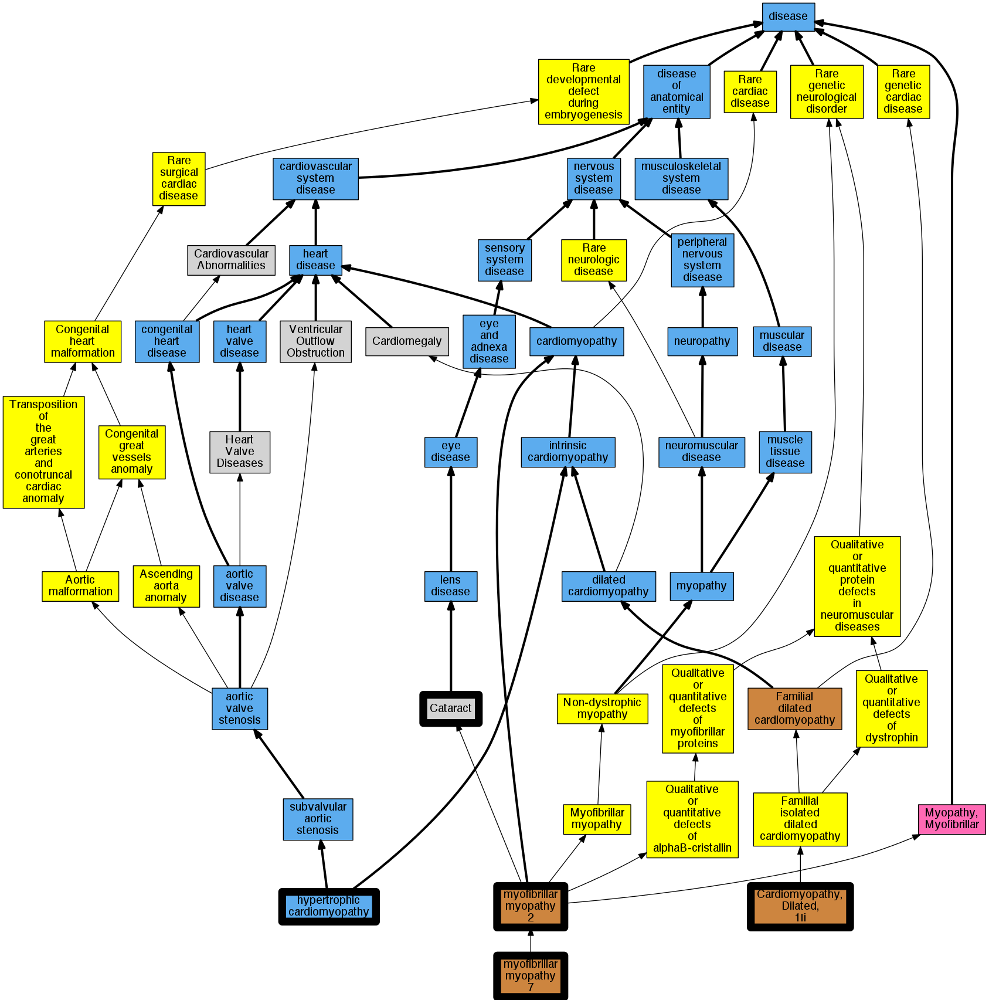

## GENE: CRYAB

[matched diseases visual](CRYAB.png)  <-- click on raw to zoom

### CATARACT 16, CONGENITAL LAMELLAR
 * [MESH:D002386 Cataract](http://beta.monarchinitiative.org/disease/MESH:D002386) Confidence: low/0.1328125
    * Syn: "Cataract, Membranous"
    * Syn: "Cataracts"
    * Syn: "Cataracts, Membranous"
    * Syn: "Lens Opacities"
    * Syn: "Lens Opacity"
    * Syn: "Membranous Cataract"
    * Syn: "Membranous Cataracts"
    * Syn: "Opacities, Lens"
    * Syn: "Opacity, Lens"
    * Syn: "Pseudoaphakia"
    * Syn: "Pseudoaphakias"

### MYOPATHY, MYOFIBRILLAR, FATAL INFANTILE HYPERTONIC, ALPHA-B CRYSTALLIN-RELATED
 * [OMIM:613869 myofibrillar myopathy 7](http://beta.monarchinitiative.org/disease/OMIM:613869) Confidence: medium
    * Equiv:[Orphanet:280553 Fatal infantile hypertonic myofibrillar myopathy](http://beta.monarchinitiative.org/disease/Orphanet:280553)
    * Equiv:[DOID:0080098 -](http://beta.monarchinitiative.org/disease/DOID:0080098)
    * Syn: "alpha-b crystalin-related fatal infantile hypertonic myofibrillar myopathy"
    * Syn: "Mfm, Fatal Infantile Hypertonic, Alpha-B Crystallin-Related"
    * Syn: "MYOPATHY, MYOFIBRILLAR, FATAL INFANTILE HYPERTONIC, ALPHA-B CRYSTALLIN-RELATED"

### CARDIOMYOPATHY, DILATED, 1II
 * [OMIM:615184 Cardiomyopathy, Dilated, 1Ii](http://beta.monarchinitiative.org/disease/OMIM:615184) Confidence: high
    * Syn: "CARDIOMYOPATHY, DILATED, 1II; CMD1II"
    * Syn: "CMD1II"

### CATARACT 16, POSTERIOR POLAR
 * [MESH:D002386 Cataract](http://beta.monarchinitiative.org/disease/MESH:D002386) Confidence: low/0.1328125
    * Syn: "Cataract, Membranous"
    * Syn: "Cataracts"
    * Syn: "Cataracts, Membranous"
    * Syn: "Lens Opacities"
    * Syn: "Lens Opacity"
    * Syn: "Membranous Cataract"
    * Syn: "Membranous Cataracts"
    * Syn: "Opacities, Lens"
    * Syn: "Opacity, Lens"
    * Syn: "Pseudoaphakia"
    * Syn: "Pseudoaphakias"

### MYOPATHY, MYOFIBRILLAR, 2
 * [OMIM:608810 myofibrillar myopathy 2](http://beta.monarchinitiative.org/disease/OMIM:608810) Confidence: high
    * Equiv:[DOID:0080093 -](http://beta.monarchinitiative.org/disease/DOID:0080093)
    * Syn: "Alpha-B Crystallinopathy"
    * Syn: "alpha-b crystallinopathy"
    * Syn: "MFM2"
    * Syn: "Myopathy, Desmin-Related, Associated With Mutation 1N the Cryab Gene"
    * Syn: "MYOPATHY, MYOFIBRILLAR, 2; MFM2"
    * Syn: "Myopathy, Myofibrillar, Alpha-B Crystallin-Related"
    * Syn: "Myopathy, Myofibrillar, With or Without Cataract And/Or Cardiomyopathy"

### Myopathy, myofibrillar, fatal infantile hypertrophy, alpha-B crystallin-related
 * [OMIM:613869 myofibrillar myopathy 7](http://beta.monarchinitiative.org/disease/OMIM:613869) Confidence: low/0.1728395061728395
    * Equiv:[Orphanet:280553 Fatal infantile hypertonic myofibrillar myopathy](http://beta.monarchinitiative.org/disease/Orphanet:280553)
    * Equiv:[DOID:0080098 -](http://beta.monarchinitiative.org/disease/DOID:0080098)
    * Syn: "alpha-b crystalin-related fatal infantile hypertonic myofibrillar myopathy"
    * Syn: "Mfm, Fatal Infantile Hypertonic, Alpha-B Crystallin-Related"
    * Syn: "MYOPATHY, MYOFIBRILLAR, FATAL INFANTILE HYPERTONIC, ALPHA-B CRYSTALLIN-RELATED"

### Primary familial hypertrophic cardiomyopathy
 * [DOID:11984 hypertrophic cardiomyopathy](http://beta.monarchinitiative.org/disease/DOID:11984) Confidence: low/0.1953125
    * Equiv:[MESH:D002312 Cardiomyopathy, Hypertrophic](http://beta.monarchinitiative.org/disease/MESH:D002312)
    * Equiv:[Orphanet:217569 Hypertrophic cardiomyopathy](http://beta.monarchinitiative.org/disease/Orphanet:217569)
    * Syn: "Cardiomyopathies, Hypertrophic"
    * Syn: "Cardiomyopathies, Hypertrophic Obstructive"
    * Syn: "Cardiomyopathy, Hypertrophic Obstructive"
    * Syn: "familial hypertrophic cardiomyopathy"
    * Syn: "Hypertrophic Cardiomyopathies"
    * Syn: "Hypertrophic Cardiomyopathy"
    * Syn: "Hypertrophic Obstructive Cardiomyopathies"
    * Syn: "Hypertrophic Obstructive Cardiomyopathy"
    * Syn: "hypertrophic obstructive cardiomyopathy"
    * Syn: "Hypertrophic subaortic stenosis"
    * Syn: "Obstructive Cardiomyopathies, Hypertrophic"
    * Syn: "Obstructive Cardiomyopathy, Hypertrophic"
    * Syn: "Obstructive hypertrophic cardiomyopathy"

### CATARACT, JUVENILE
 * [MESH:D002386 Cataract](http://beta.monarchinitiative.org/disease/MESH:D002386) Confidence: low/0.15625
    * Syn: "Cataract, Membranous"
    * Syn: "Cataracts"
    * Syn: "Cataracts, Membranous"
    * Syn: "Lens Opacities"
    * Syn: "Lens Opacity"
    * Syn: "Membranous Cataract"
    * Syn: "Membranous Cataracts"
    * Syn: "Opacities, Lens"
    * Syn: "Opacity, Lens"
    * Syn: "Pseudoaphakia"
    * Syn: "Pseudoaphakias"

### Primary familial hypertrophic cardiomyopathy
 * [DOID:11984 hypertrophic cardiomyopathy](http://beta.monarchinitiative.org/disease/DOID:11984) Confidence: low/0.1953125
    * Equiv:[MESH:D002312 Cardiomyopathy, Hypertrophic](http://beta.monarchinitiative.org/disease/MESH:D002312)
    * Equiv:[Orphanet:217569 Hypertrophic cardiomyopathy](http://beta.monarchinitiative.org/disease/Orphanet:217569)
    * Syn: "Cardiomyopathies, Hypertrophic"
    * Syn: "Cardiomyopathies, Hypertrophic Obstructive"
    * Syn: "Cardiomyopathy, Hypertrophic Obstructive"
    * Syn: "familial hypertrophic cardiomyopathy"
    * Syn: "Hypertrophic Cardiomyopathies"
    * Syn: "Hypertrophic Cardiomyopathy"
    * Syn: "Hypertrophic Obstructive Cardiomyopathies"
    * Syn: "Hypertrophic Obstructive Cardiomyopathy"
    * Syn: "hypertrophic obstructive cardiomyopathy"
    * Syn: "Hypertrophic subaortic stenosis"
    * Syn: "Obstructive Cardiomyopathies, Hypertrophic"
    * Syn: "Obstructive Cardiomyopathy, Hypertrophic"
    * Syn: "Obstructive hypertrophic cardiomyopathy"

### Primary familial hypertrophic cardiomyopathy
 * [DOID:11984 hypertrophic cardiomyopathy](http://beta.monarchinitiative.org/disease/DOID:11984) Confidence: low/0.1953125
    * Equiv:[MESH:D002312 Cardiomyopathy, Hypertrophic](http://beta.monarchinitiative.org/disease/MESH:D002312)
    * Equiv:[Orphanet:217569 Hypertrophic cardiomyopathy](http://beta.monarchinitiative.org/disease/Orphanet:217569)
    * Syn: "Cardiomyopathies, Hypertrophic"
    * Syn: "Cardiomyopathies, Hypertrophic Obstructive"
    * Syn: "Cardiomyopathy, Hypertrophic Obstructive"
    * Syn: "familial hypertrophic cardiomyopathy"
    * Syn: "Hypertrophic Cardiomyopathies"
    * Syn: "Hypertrophic Cardiomyopathy"
    * Syn: "Hypertrophic Obstructive Cardiomyopathies"
    * Syn: "Hypertrophic Obstructive Cardiomyopathy"
    * Syn: "hypertrophic obstructive cardiomyopathy"
    * Syn: "Hypertrophic subaortic stenosis"
    * Syn: "Obstructive Cardiomyopathies, Hypertrophic"
    * Syn: "Obstructive Cardiomyopathy, Hypertrophic"
    * Syn: "Obstructive hypertrophic cardiomyopathy"
