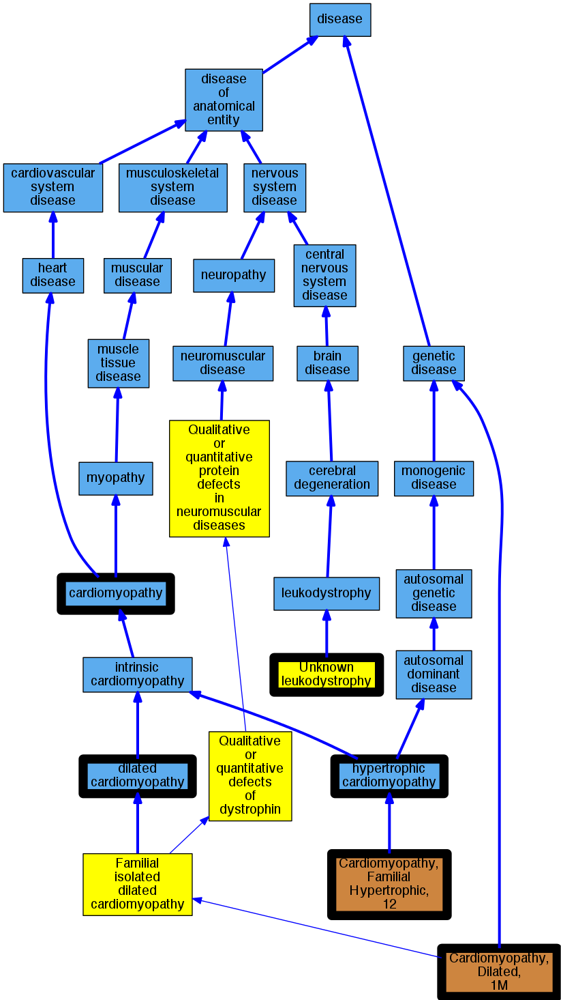

## GENE: CSRP3

[matched diseases visual](CSRP3.png)  <-- click on raw to zoom

### CARDIOMYOPATHY, DILATED, 1M (1 family)
 * [OMIM:607482 Cardiomyopathy, Dilated, 1M](http://beta.monarchinitiative.org/disease/OMIM:607482) Confidence: low/0.16581632653061223
    * Equiv:[MESH:C564390 Cardiomyopathy, Dilated, 1M](http://beta.monarchinitiative.org/disease/MESH:C564390)
    * Syn: "CARDIOMYOPATHY, DILATED, 1M; CMD1M"
    * Syn: "CMD1M"

### CARDIOMYOPATHY, FAMILIAL HYPERTROPHIC, 12
 * [OMIM:612124 Cardiomyopathy, Familial Hypertrophic, 12](http://beta.monarchinitiative.org/disease/OMIM:612124) Confidence: high
    * Syn: "CARDIOMYOPATHY, FAMILIAL HYPERTROPHIC, 12; CMH12"
    * Syn: "CMH12"

### Cardiomyopathy
 * [DOID:0050700 cardiomyopathy](http://beta.monarchinitiative.org/disease/DOID:0050700) Confidence: high
    * Equiv:[MESH:D009202 Cardiomyopathies](http://beta.monarchinitiative.org/disease/MESH:D009202)
    * Syn: "Cardiomyopathies"

### Cardiomyopathy, dilated
 * [DOID:12930 dilated cardiomyopathy](http://beta.monarchinitiative.org/disease/DOID:12930) Confidence: high
    * Syn: "Congestive cardiomyopathy"
    * Syn: "Familial dilated cardiomyopathy"
    * Syn: "Idiopathic dilation cardiomyopathy"
    * Syn: "primary dilated cardiomyopathy"

### Cardiomyopathy, dilated, 1M
 * [OMIM:607482 Cardiomyopathy, Dilated, 1M](http://beta.monarchinitiative.org/disease/OMIM:607482) Confidence: high
    * Equiv:[MESH:C564390 Cardiomyopathy, Dilated, 1M](http://beta.monarchinitiative.org/disease/MESH:C564390)
    * Syn: "CARDIOMYOPATHY, DILATED, 1M; CMD1M"
    * Syn: "CMD1M"

### Cardiomyopathy, hypertrophic
 * [DOID:11984 hypertrophic cardiomyopathy](http://beta.monarchinitiative.org/disease/DOID:11984) Confidence: high
    * Equiv:[MESH:D002312 Cardiomyopathy, Hypertrophic](http://beta.monarchinitiative.org/disease/MESH:D002312)
    * Equiv:[MESH:D024741 Cardiomyopathy, Hypertrophic, Familial](http://beta.monarchinitiative.org/disease/MESH:D024741)
    * Syn: "familial hypertrophic cardiomyopathy"
    * Syn: "hypertrophic obstructive cardiomyopathy"

### Primary familial hypertrophic cardiomyopathy
 * [DOID:11984 hypertrophic cardiomyopathy](http://beta.monarchinitiative.org/disease/DOID:11984) Confidence: low/0.1953125
    * Equiv:[MESH:D002312 Cardiomyopathy, Hypertrophic](http://beta.monarchinitiative.org/disease/MESH:D002312)
    * Equiv:[MESH:D024741 Cardiomyopathy, Hypertrophic, Familial](http://beta.monarchinitiative.org/disease/MESH:D024741)
    * Syn: "familial hypertrophic cardiomyopathy"
    * Syn: "hypertrophic obstructive cardiomyopathy"

### RECLASSIFIED - VARIANT OF UNKNOWN SIGNIFICANCE
 * [Orphanet:84096 Unknown leukodystrophy](http://beta.monarchinitiative.org/disease/Orphanet:84096) Confidence: low/0.0675
