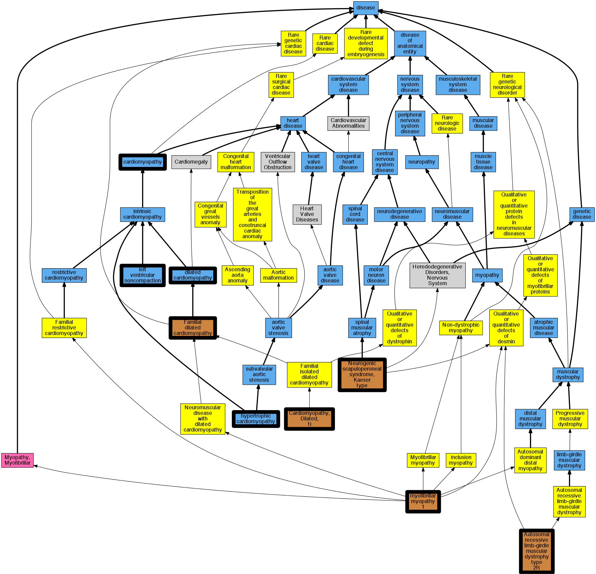

## GENE: DES

[matched diseases visual](DES.png)  <-- click on raw to zoom

### Cardiomyopathy, dilated, 1I
 * [OMIM:604765 Cardiomyopathy, Dilated, 1i](http://beta.monarchinitiative.org/disease/OMIM:604765) Confidence: high
    * Equiv:[MESH:C565752 Cardiomyopathy, Dilated, 1i](http://beta.monarchinitiative.org/disease/MESH:C565752)
    * Syn: "CARDIOMYOPATHY, DILATED, 1I; CMD1I"
    * Syn: "CMD1I"

### Hypertrophic cardiomyopathy
 * [DOID:11984 hypertrophic cardiomyopathy](http://beta.monarchinitiative.org/disease/DOID:11984) Confidence: high
    * Equiv:[MESH:D002312 Cardiomyopathy, Hypertrophic](http://beta.monarchinitiative.org/disease/MESH:D002312)
    * Equiv:[MESH:D024741 Cardiomyopathy, Hypertrophic, Familial](http://beta.monarchinitiative.org/disease/MESH:D024741)
    * Syn: "familial hypertrophic cardiomyopathy"
    * Syn: "hypertrophic obstructive cardiomyopathy"

### MUSCULAR DYSTROPHY, LIMB-GIRDLE, TYPE 2R (1 family)
 * [OMIM:615325 Muscular Dystrophy, Limb-Girdle, Type 2R](http://beta.monarchinitiative.org/disease/OMIM:615325) Confidence: low/0.1756198347107438
    * Syn: "LGMD2R"
    * Syn: "MUSCULAR DYSTROPHY, LIMB-GIRDLE, TYPE 2R; LGMD2R"

### Primary dilated cardiomyopathy
 * [DOID:12930 dilated cardiomyopathy](http://beta.monarchinitiative.org/disease/DOID:12930) Confidence: high
    * Syn: "Congestive cardiomyopathy"
    * Syn: "Familial dilated cardiomyopathy"
    * Syn: "Idiopathic dilation cardiomyopathy"
    * Syn: "primary dilated cardiomyopathy"

### Primary familial hypertrophic cardiomyopathy
 * [DOID:11984 hypertrophic cardiomyopathy](http://beta.monarchinitiative.org/disease/DOID:11984) Confidence: low/0.1953125
    * Equiv:[MESH:D002312 Cardiomyopathy, Hypertrophic](http://beta.monarchinitiative.org/disease/MESH:D002312)
    * Equiv:[MESH:D024741 Cardiomyopathy, Hypertrophic, Familial](http://beta.monarchinitiative.org/disease/MESH:D024741)
    * Syn: "familial hypertrophic cardiomyopathy"
    * Syn: "hypertrophic obstructive cardiomyopathy"

### Cardiomyopathy
 * [DOID:0050700 cardiomyopathy](http://beta.monarchinitiative.org/disease/DOID:0050700) Confidence: high
    * Equiv:[MESH:D009202 Cardiomyopathies](http://beta.monarchinitiative.org/disease/MESH:D009202)
    * Syn: "Cardiomyopathies"

### Cardiomyopathy
 * [DOID:0050700 cardiomyopathy](http://beta.monarchinitiative.org/disease/DOID:0050700) Confidence: high
    * Equiv:[MESH:D009202 Cardiomyopathies](http://beta.monarchinitiative.org/disease/MESH:D009202)
    * Syn: "Cardiomyopathies"

### Cardiomyopathy, dilated
 * [DOID:12930 dilated cardiomyopathy](http://beta.monarchinitiative.org/disease/DOID:12930) Confidence: high
    * Syn: "Congestive cardiomyopathy"
    * Syn: "Familial dilated cardiomyopathy"
    * Syn: "Idiopathic dilation cardiomyopathy"
    * Syn: "primary dilated cardiomyopathy"

### Cardiomyopathy, dilated
 * [DOID:12930 dilated cardiomyopathy](http://beta.monarchinitiative.org/disease/DOID:12930) Confidence: high
    * Syn: "Congestive cardiomyopathy"
    * Syn: "Familial dilated cardiomyopathy"
    * Syn: "Idiopathic dilation cardiomyopathy"
    * Syn: "primary dilated cardiomyopathy"

### Left ventricular noncompaction cardiomyopathy
 * [DC:0000237 Left Ventricular Noncompaction](http://beta.monarchinitiative.org/disease/DC:0000237) Confidence: low/0.1953125

### Primary dilated cardiomyopathy
 * [DOID:12930 dilated cardiomyopathy](http://beta.monarchinitiative.org/disease/DOID:12930) Confidence: high
    * Syn: "Congestive cardiomyopathy"
    * Syn: "Familial dilated cardiomyopathy"
    * Syn: "Idiopathic dilation cardiomyopathy"
    * Syn: "primary dilated cardiomyopathy"

### Primary familial hypertrophic cardiomyopathy
 * [DOID:11984 hypertrophic cardiomyopathy](http://beta.monarchinitiative.org/disease/DOID:11984) Confidence: low/0.1953125
    * Equiv:[MESH:D002312 Cardiomyopathy, Hypertrophic](http://beta.monarchinitiative.org/disease/MESH:D002312)
    * Equiv:[MESH:D024741 Cardiomyopathy, Hypertrophic, Familial](http://beta.monarchinitiative.org/disease/MESH:D024741)
    * Syn: "familial hypertrophic cardiomyopathy"
    * Syn: "hypertrophic obstructive cardiomyopathy"

### Primary dilated cardiomyopathy
 * [DOID:12930 dilated cardiomyopathy](http://beta.monarchinitiative.org/disease/DOID:12930) Confidence: high
    * Syn: "Congestive cardiomyopathy"
    * Syn: "Familial dilated cardiomyopathy"
    * Syn: "Idiopathic dilation cardiomyopathy"
    * Syn: "primary dilated cardiomyopathy"

### SCAPULOPERONEAL SYNDROME, NEUROGENIC, KAESER TYPE
 * [OMIM:181400 Scapuloperoneal Syndrome, Neurogenic, Kaeser Type](http://beta.monarchinitiative.org/disease/OMIM:181400) Confidence: high
    * Equiv:[MESH:C566695 Scapuloperoneal Syndrome, Neurogenic, Kaeser Type](http://beta.monarchinitiative.org/disease/MESH:C566695)
    * Syn: "Kaeser Syndrome"
    * Syn: "Scapuloperoneal Syndrome, Neurogenic Type, of Kaeser"
    * Syn: "SCAPULOPERONEAL SYNDROME, NEUROGENIC, KAESER TYPE; SCPNK"
    * Syn: "SCPNK"
    * Syn: "Stark-Kaeser Syndrome"

### CARDIOMYOPATHY, DILATED, 1I (1 family)
 * [OMIM:604765 Cardiomyopathy, Dilated, 1i](http://beta.monarchinitiative.org/disease/OMIM:604765) Confidence: low/0.16581632653061223
    * Equiv:[MESH:C565752 Cardiomyopathy, Dilated, 1i](http://beta.monarchinitiative.org/disease/MESH:C565752)
    * Syn: "CARDIOMYOPATHY, DILATED, 1I; CMD1I"
    * Syn: "CMD1I"

### Desminopathy
 * [Orphanet:98909 Desminopathy](http://beta.monarchinitiative.org/disease/Orphanet:98909) Confidence: high

### Hypertrophic cardiomyopathy
 * [DOID:11984 hypertrophic cardiomyopathy](http://beta.monarchinitiative.org/disease/DOID:11984) Confidence: high
    * Equiv:[MESH:D002312 Cardiomyopathy, Hypertrophic](http://beta.monarchinitiative.org/disease/MESH:D002312)
    * Equiv:[MESH:D024741 Cardiomyopathy, Hypertrophic, Familial](http://beta.monarchinitiative.org/disease/MESH:D024741)
    * Syn: "familial hypertrophic cardiomyopathy"
    * Syn: "hypertrophic obstructive cardiomyopathy"

### MYOPATHY, MYOFIBRILLAR, 1
 * [OMIM:601419 Myopathy, Myofibrillar, Desmin-Related](http://beta.monarchinitiative.org/disease/OMIM:601419) Confidence: low/0.1640625
    * Equiv:[MESH:C563319 Myopathy, Myofibrillar, Desmin-Related](http://beta.monarchinitiative.org/disease/MESH:C563319)
    * Syn: "Arrhythmogenic Right Ventricular Cardiomyopathy 7, Formerly"
    * Syn: "Arrhythmogenic Right Ventricular Dysplasia, Familial, 7, Formerly"
    * Syn: "Cardiomyopathy, Dilated, 1F and Limb-Girdle Muscular Dystrophy Type 1D, Formerly"
    * Syn: "Cardiomyopathy, Dilated, With Conduction Defect and Muscular Dystrophy"
    * Syn: "Cmd1F and Lgmd1D, Formerly"
    * Syn: "Desmin-Related Myopathy"
    * Syn: "Desmin-Related Myopathy With Arrhythmogenic Right Ventricular Cardiomyopathy"
    * Syn: "Desminopathy, Primary"
    * Syn: "Inclusion Body Myopathy 1, Autosomal Dominant, Formerly"
    * Syn: "MFM1"
    * Syn: "Myofibrillar Myopathy With Arrhythmogenic Right Ventricular Cardiomyopathy"
    * Syn: "MYOPATHY, MYOFIBRILLAR, 1; MFM1"
    * Syn: "Myopathy, Myofibrillar, Desmin-Related"

### Myofibrillar myopathy 1
 * [MESH:C580316 Myofibrillar Myopathy](http://beta.monarchinitiative.org/disease/MESH:C580316) Confidence: low/0.18055555555555555
    * Equiv:[DC:0000305 -](http://beta.monarchinitiative.org/disease/DC:0000305)

### Myopathy, myofibrillar, 1
 * [MESH:C580316 Myofibrillar Myopathy](http://beta.monarchinitiative.org/disease/MESH:C580316) Confidence: low/0.18055555555555555
    * Equiv:[DC:0000305 -](http://beta.monarchinitiative.org/disease/DC:0000305)

### Primary dilated cardiomyopathy
 * [DOID:12930 dilated cardiomyopathy](http://beta.monarchinitiative.org/disease/DOID:12930) Confidence: high
    * Syn: "Congestive cardiomyopathy"
    * Syn: "Familial dilated cardiomyopathy"
    * Syn: "Idiopathic dilation cardiomyopathy"
    * Syn: "primary dilated cardiomyopathy"

### Primary familial hypertrophic cardiomyopathy
 * [DOID:11984 hypertrophic cardiomyopathy](http://beta.monarchinitiative.org/disease/DOID:11984) Confidence: low/0.1953125
    * Equiv:[MESH:D002312 Cardiomyopathy, Hypertrophic](http://beta.monarchinitiative.org/disease/MESH:D002312)
    * Equiv:[MESH:D024741 Cardiomyopathy, Hypertrophic, Familial](http://beta.monarchinitiative.org/disease/MESH:D024741)
    * Syn: "familial hypertrophic cardiomyopathy"
    * Syn: "hypertrophic obstructive cardiomyopathy"
