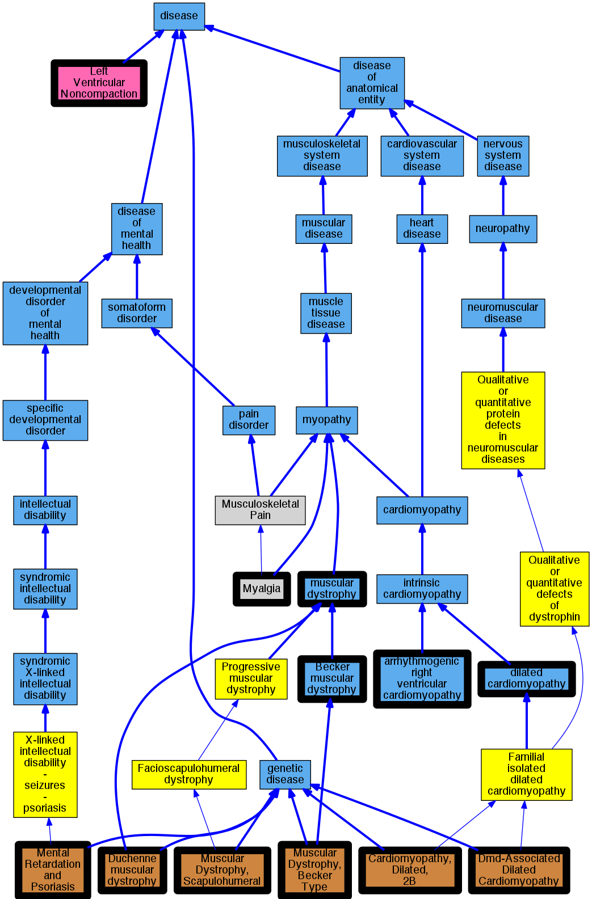

## GENE: DMD

[matched diseases visual](DMD.png)  <-- click on raw to zoom

### Cardiomyopathy, dilated
 * [DOID:12930 dilated cardiomyopathy](http://beta.monarchinitiative.org/disease/DOID:12930) Confidence: high
    * Equiv:[Orphanet:217604 Dilated cardiomyopathy](http://beta.monarchinitiative.org/disease/Orphanet:217604)
    * Syn: "1A, Dilated cardiomyopathy"
    * Syn: "1As, Dilated cardiomyopathy"
    * Syn: "Cardiomyopathies, Congestive"
    * Syn: "Cardiomyopathies, Dilated"
    * Syn: "Cardiomyopathies, Familial Idiopathic"
    * Syn: "Cardiomyopathies, Idiopathic Dilated"
    * Syn: "cardiomyopathy 1A, Dilated"
    * Syn: "cardiomyopathy 1As, Dilated"
    * Syn: "Cardiomyopathy, Congestive"
    * Syn: "Cardiomyopathy, Dilated, 1a"
    * Syn: "Cardiomyopathy, Dilated, Autosomal Recessive"
    * Syn: "Cardiomyopathy, Dilated, CMD1A"
    * Syn: "Cardiomyopathy, Dilated, LMNA"
    * Syn: "Cardiomyopathy, Dilated, With Conduction Defect 1"
    * Syn: "Cardiomyopathy, Dilated, with Conduction Deffect1"
    * Syn: "Cardiomyopathy, Familial Idiopathic"
    * Syn: "Cardiomyopathy, Idiopathic Dilated"
    * Syn: "Congestive Cardiomyopathies"
    * Syn: "Congestive Cardiomyopathy"
    * Syn: "Congestive cardiomyopathy"
    * Syn: "Dilated Cardiomyopathies"
    * Syn: "Dilated Cardiomyopathies, Idiopathic"
    * Syn: "Dilated Cardiomyopathy"
    * Syn: "Dilated cardiomyopathy 1A"
    * Syn: "Dilated cardiomyopathy 1As"
    * Syn: "Dilated Cardiomyopathy, Idiopathic"
    * Syn: "Familial dilated cardiomyopathy"
    * Syn: "Familial Idiopathic Cardiomyopathies"
    * Syn: "Familial Idiopathic Cardiomyopathy"
    * Syn: "Idiopathic Cardiomyopathies, Familial"
    * Syn: "Idiopathic Cardiomyopathy, Familial"
    * Syn: "Idiopathic Dilated Cardiomyopathies"
    * Syn: "Idiopathic Dilated Cardiomyopathy"
    * Syn: "Idiopathic dilation cardiomyopathy"
    * Syn: "primary dilated cardiomyopathy"

### Cardiomyopathy, dilated
 * [DOID:12930 dilated cardiomyopathy](http://beta.monarchinitiative.org/disease/DOID:12930) Confidence: high
    * Equiv:[Orphanet:217604 Dilated cardiomyopathy](http://beta.monarchinitiative.org/disease/Orphanet:217604)
    * Syn: "1A, Dilated cardiomyopathy"
    * Syn: "1As, Dilated cardiomyopathy"
    * Syn: "Cardiomyopathies, Congestive"
    * Syn: "Cardiomyopathies, Dilated"
    * Syn: "Cardiomyopathies, Familial Idiopathic"
    * Syn: "Cardiomyopathies, Idiopathic Dilated"
    * Syn: "cardiomyopathy 1A, Dilated"
    * Syn: "cardiomyopathy 1As, Dilated"
    * Syn: "Cardiomyopathy, Congestive"
    * Syn: "Cardiomyopathy, Dilated, 1a"
    * Syn: "Cardiomyopathy, Dilated, Autosomal Recessive"
    * Syn: "Cardiomyopathy, Dilated, CMD1A"
    * Syn: "Cardiomyopathy, Dilated, LMNA"
    * Syn: "Cardiomyopathy, Dilated, With Conduction Defect 1"
    * Syn: "Cardiomyopathy, Dilated, with Conduction Deffect1"
    * Syn: "Cardiomyopathy, Familial Idiopathic"
    * Syn: "Cardiomyopathy, Idiopathic Dilated"
    * Syn: "Congestive Cardiomyopathies"
    * Syn: "Congestive Cardiomyopathy"
    * Syn: "Congestive cardiomyopathy"
    * Syn: "Dilated Cardiomyopathies"
    * Syn: "Dilated Cardiomyopathies, Idiopathic"
    * Syn: "Dilated Cardiomyopathy"
    * Syn: "Dilated cardiomyopathy 1A"
    * Syn: "Dilated cardiomyopathy 1As"
    * Syn: "Dilated Cardiomyopathy, Idiopathic"
    * Syn: "Familial dilated cardiomyopathy"
    * Syn: "Familial Idiopathic Cardiomyopathies"
    * Syn: "Familial Idiopathic Cardiomyopathy"
    * Syn: "Idiopathic Cardiomyopathies, Familial"
    * Syn: "Idiopathic Cardiomyopathy, Familial"
    * Syn: "Idiopathic Dilated Cardiomyopathies"
    * Syn: "Idiopathic Dilated Cardiomyopathy"
    * Syn: "Idiopathic dilation cardiomyopathy"
    * Syn: "primary dilated cardiomyopathy"

### DUCHENNE MUSCULAR DYSTROPHY
 * [DOID:11723 Duchenne muscular dystrophy](http://beta.monarchinitiative.org/disease/DOID:11723) Confidence: high
    * Equiv:[MESH:D020388 Muscular Dystrophy, Duchenne](http://beta.monarchinitiative.org/disease/MESH:D020388)
    * Equiv:[Orphanet:98896 Duchenne muscular dystrophy](http://beta.monarchinitiative.org/disease/Orphanet:98896)
    * Syn: "Becker Muscular Dystrophy"
    * Syn: "Becker's Muscular Dystrophy"
    * Syn: "Cardiomyopathy, Dilated, 3B"
    * Syn: "Cardiomyopathy, Dilated, X-Linked"
    * Syn: "Childhood Muscular Dystrophy, Pseudohypertrophic"
    * Syn: "Childhood Pseudohypertrophic Muscular Dystrophy"
    * Syn: "DMD"
    * Syn: "Duchenne and Becker Muscular Dystrophy"
    * Syn: "Duchenne Becker Muscular Dystrophy"
    * Syn: "Duchenne Muscular Dystrophy"
    * Syn: "Duchenne Type Progressive Muscular Dystrophy"
    * Syn: "Duchenne-Becker Muscular Dystrophy"
    * Syn: "Duchenne-Type Progressive Muscular Dystrophy"
    * Syn: "Muscular Dystrophy Pseudohypertrophic Progressive, Becker Type"
    * Syn: "Muscular Dystrophy, Becker"
    * Syn: "Muscular Dystrophy, Becker Type"
    * Syn: "Muscular Dystrophy, Becker's"
    * Syn: "Muscular Dystrophy, Childhood, Pseudohypertrophic"
    * Syn: "Muscular dystrophy, Duchenne"
    * Syn: "Muscular Dystrophy, Duchenne and Becker Types"
    * Syn: "Muscular Dystrophy, Duchenne Type"
    * Syn: "Muscular Dystrophy, Duchenne-Becker"
    * Syn: "Muscular Dystrophy, Pseudohypertrophic"
    * Syn: "Muscular Dystrophy, Pseudohypertrophic Progressive, Becker Type"
    * Syn: "Muscular Dystrophy, Pseudohypertrophic Progressive, Duchenne Type"
    * Syn: "Muscular Dystrophy, Pseudohypertrophic, Childhood"
    * Syn: "Progressive Muscular Dystrophy, Duchenne Type"
    * Syn: "Pseudohypertrophic Childhood Muscular Dystrophy"
    * Syn: "Pseudohypertrophic Muscular Dystrophy"
    * Syn: "Pseudohypertrophic Muscular Dystrophy, Childhood"
    * Syn: "Severe dystrophinopathy, Duchenne type"

### Exertional myalgia, muscle stiffness & myoglobinuria
 * [MESH:D063806 Myalgia](http://beta.monarchinitiative.org/disease/MESH:D063806) Confidence: low/0.1284722222222222
    * Syn: "Muscle Pain"
    * Syn: "Muscle Soreness"
    * Syn: "Muscle Sorenesses"
    * Syn: "Muscle Tenderness"
    * Syn: "Pain, Muscle"
    * Syn: "Pains, Muscle"
    * Syn: "Soreness, Muscle"
    * Syn: "Tenderness, Muscle"

### INTERMEDIATE MUSCULAR DYSTROPHY
 * [Orphanet:71864 Muscular channelopathy](http://beta.monarchinitiative.org/disease/Orphanet:71864) Confidence: low/0.0763888888888889

### Muscular dystrophy, Becker
 * [OMIM:300376 Becker muscular dystrophy](http://beta.monarchinitiative.org/disease/OMIM:300376) Confidence: high
    * Equiv:[Orphanet:98895 Becker muscular dystrophy](http://beta.monarchinitiative.org/disease/Orphanet:98895)
    * Equiv:[DOID:9883 Becker muscular dystrophy](http://beta.monarchinitiative.org/disease/DOID:9883)
    * Syn: "Becker dystrophinopathy"
    * Syn: "Becker Muscular Dystrophy"
    * Syn: "benign congenital myopathy"
    * Syn: "Benign pseudohypertrophic muscular dystrophy"
    * Syn: "BMD"
    * Syn: "BMD"
    * Syn: "MUSCULAR DYSTROPHY, BECKER TYPE; BMD"
    * Syn: "Muscular Dystrophy, Pseudohypertrophic Progressive, Becker Type"

### Arrhythmogenic right ventricular cardiomyopathy
 * [DOID:0050431 arrhythmogenic right ventricular cardiomyopathy](http://beta.monarchinitiative.org/disease/DOID:0050431) Confidence: high
    * Equiv:[MESH:D019571 Arrhythmogenic Right Ventricular Dysplasia](http://beta.monarchinitiative.org/disease/MESH:D019571)
    * Equiv:[Orphanet:247 Arrhythmogenic right ventricular dysplasia](http://beta.monarchinitiative.org/disease/Orphanet:247)
    * Syn: "Arrhythmogenic Right Ventricular Cardiomyopathy"
    * Syn: "Arrhythmogenic Right Ventricular Cardiomyopathy Dysplasia"
    * Syn: "Arrhythmogenic Right Ventricular Cardiomyopathy-Dysplasia"
    * Syn: "Arrhythmogenic right ventricular dysplasia"
    * Syn: "arrhythmogenic right ventricular dysplasia"
    * Syn: "Arrhythmogenic Right Ventricular Dysplasia-Cardiomyopathy"
    * Syn: "arrhythmogenic right ventricular dysplasia/cardiomyopathy"
    * Syn: "ARVC"
    * Syn: "ARVC cardiomyopathy"
    * Syn: "ARVD"
    * Syn: "Right Ventricular Dysplasia, Arrhythmogenic"
    * Syn: "Ventricular Dysplasia, Right, Arrhythmogenic"

### DUCHENNE MUSCULAR DYSTROPHY
 * [DOID:11723 Duchenne muscular dystrophy](http://beta.monarchinitiative.org/disease/DOID:11723) Confidence: high
    * Equiv:[MESH:D020388 Muscular Dystrophy, Duchenne](http://beta.monarchinitiative.org/disease/MESH:D020388)
    * Equiv:[Orphanet:98896 Duchenne muscular dystrophy](http://beta.monarchinitiative.org/disease/Orphanet:98896)
    * Syn: "Becker Muscular Dystrophy"
    * Syn: "Becker's Muscular Dystrophy"
    * Syn: "Cardiomyopathy, Dilated, 3B"
    * Syn: "Cardiomyopathy, Dilated, X-Linked"
    * Syn: "Childhood Muscular Dystrophy, Pseudohypertrophic"
    * Syn: "Childhood Pseudohypertrophic Muscular Dystrophy"
    * Syn: "DMD"
    * Syn: "Duchenne and Becker Muscular Dystrophy"
    * Syn: "Duchenne Becker Muscular Dystrophy"
    * Syn: "Duchenne Muscular Dystrophy"
    * Syn: "Duchenne Type Progressive Muscular Dystrophy"
    * Syn: "Duchenne-Becker Muscular Dystrophy"
    * Syn: "Duchenne-Type Progressive Muscular Dystrophy"
    * Syn: "Muscular Dystrophy Pseudohypertrophic Progressive, Becker Type"
    * Syn: "Muscular Dystrophy, Becker"
    * Syn: "Muscular Dystrophy, Becker Type"
    * Syn: "Muscular Dystrophy, Becker's"
    * Syn: "Muscular Dystrophy, Childhood, Pseudohypertrophic"
    * Syn: "Muscular dystrophy, Duchenne"
    * Syn: "Muscular Dystrophy, Duchenne and Becker Types"
    * Syn: "Muscular Dystrophy, Duchenne Type"
    * Syn: "Muscular Dystrophy, Duchenne-Becker"
    * Syn: "Muscular Dystrophy, Pseudohypertrophic"
    * Syn: "Muscular Dystrophy, Pseudohypertrophic Progressive, Becker Type"
    * Syn: "Muscular Dystrophy, Pseudohypertrophic Progressive, Duchenne Type"
    * Syn: "Muscular Dystrophy, Pseudohypertrophic, Childhood"
    * Syn: "Progressive Muscular Dystrophy, Duchenne Type"
    * Syn: "Pseudohypertrophic Childhood Muscular Dystrophy"
    * Syn: "Pseudohypertrophic Muscular Dystrophy"
    * Syn: "Pseudohypertrophic Muscular Dystrophy, Childhood"
    * Syn: "Severe dystrophinopathy, Duchenne type"

### DUCHENNE MUSCULAR DYSTROPHY, MENTAL RETARDATION, AND ABSENCE OF ERG B-WAVE
 * [OMIM:264500 Pseudouridinuria and Mental Defect](http://beta.monarchinitiative.org/disease/OMIM:264500) Confidence: low/0.06663223140495868
    * Equiv:[MESH:C564864 Pseudouridinuria and Mental Defect](http://beta.monarchinitiative.org/disease/MESH:C564864)
    * Syn: "PSEUDOURIDINURIA AND MENTAL DEFECT"

### Dilated cardiomyopathy 3B
 * [OMIM:302045 Cardiomyopathy, Dilated, 3B](http://beta.monarchinitiative.org/disease/OMIM:302045) Confidence: high
    * Syn: "CARDIOMYOPATHY, DILATED, 3B; CMD3B"
    * Syn: "Cardiomyopathy, Dilated, X-Linked"
    * Syn: "CMD3B"

### Duchenne muscular dystrophy
 * [DOID:11723 Duchenne muscular dystrophy](http://beta.monarchinitiative.org/disease/DOID:11723) Confidence: high
    * Equiv:[MESH:D020388 Muscular Dystrophy, Duchenne](http://beta.monarchinitiative.org/disease/MESH:D020388)
    * Equiv:[Orphanet:98896 Duchenne muscular dystrophy](http://beta.monarchinitiative.org/disease/Orphanet:98896)
    * Syn: "Becker Muscular Dystrophy"
    * Syn: "Becker's Muscular Dystrophy"
    * Syn: "Cardiomyopathy, Dilated, 3B"
    * Syn: "Cardiomyopathy, Dilated, X-Linked"
    * Syn: "Childhood Muscular Dystrophy, Pseudohypertrophic"
    * Syn: "Childhood Pseudohypertrophic Muscular Dystrophy"
    * Syn: "DMD"
    * Syn: "Duchenne and Becker Muscular Dystrophy"
    * Syn: "Duchenne Becker Muscular Dystrophy"
    * Syn: "Duchenne Muscular Dystrophy"
    * Syn: "Duchenne Type Progressive Muscular Dystrophy"
    * Syn: "Duchenne-Becker Muscular Dystrophy"
    * Syn: "Duchenne-Type Progressive Muscular Dystrophy"
    * Syn: "Muscular Dystrophy Pseudohypertrophic Progressive, Becker Type"
    * Syn: "Muscular Dystrophy, Becker"
    * Syn: "Muscular Dystrophy, Becker Type"
    * Syn: "Muscular Dystrophy, Becker's"
    * Syn: "Muscular Dystrophy, Childhood, Pseudohypertrophic"
    * Syn: "Muscular dystrophy, Duchenne"
    * Syn: "Muscular Dystrophy, Duchenne and Becker Types"
    * Syn: "Muscular Dystrophy, Duchenne Type"
    * Syn: "Muscular Dystrophy, Duchenne-Becker"
    * Syn: "Muscular Dystrophy, Pseudohypertrophic"
    * Syn: "Muscular Dystrophy, Pseudohypertrophic Progressive, Becker Type"
    * Syn: "Muscular Dystrophy, Pseudohypertrophic Progressive, Duchenne Type"
    * Syn: "Muscular Dystrophy, Pseudohypertrophic, Childhood"
    * Syn: "Progressive Muscular Dystrophy, Duchenne Type"
    * Syn: "Pseudohypertrophic Childhood Muscular Dystrophy"
    * Syn: "Pseudohypertrophic Muscular Dystrophy"
    * Syn: "Pseudohypertrophic Muscular Dystrophy, Childhood"
    * Syn: "Severe dystrophinopathy, Duchenne type"

### Muscular dystrophy
 * [DOID:9884 muscular dystrophy](http://beta.monarchinitiative.org/disease/DOID:9884) Confidence: high
    * Equiv:[MESH:D009136 Muscular Dystrophies](http://beta.monarchinitiative.org/disease/MESH:D009136)
    * Equiv:[Orphanet:98473 Muscular dystrophy](http://beta.monarchinitiative.org/disease/Orphanet:98473)
    * Syn: "Dystrophies, Muscular"
    * Syn: "Dystrophy, Muscular"
    * Syn: "Muscular Dystrophy"
    * Syn: "Myodystrophica"
    * Syn: "Myodystrophicas"
    * Syn: "Myodystrophies"
    * Syn: "Myodystrophy"

### Primary dilated cardiomyopathy
 * [DOID:12930 dilated cardiomyopathy](http://beta.monarchinitiative.org/disease/DOID:12930) Confidence: high
    * Equiv:[Orphanet:217604 Dilated cardiomyopathy](http://beta.monarchinitiative.org/disease/Orphanet:217604)
    * Syn: "1A, Dilated cardiomyopathy"
    * Syn: "1As, Dilated cardiomyopathy"
    * Syn: "Cardiomyopathies, Congestive"
    * Syn: "Cardiomyopathies, Dilated"
    * Syn: "Cardiomyopathies, Familial Idiopathic"
    * Syn: "Cardiomyopathies, Idiopathic Dilated"
    * Syn: "cardiomyopathy 1A, Dilated"
    * Syn: "cardiomyopathy 1As, Dilated"
    * Syn: "Cardiomyopathy, Congestive"
    * Syn: "Cardiomyopathy, Dilated, 1a"
    * Syn: "Cardiomyopathy, Dilated, Autosomal Recessive"
    * Syn: "Cardiomyopathy, Dilated, CMD1A"
    * Syn: "Cardiomyopathy, Dilated, LMNA"
    * Syn: "Cardiomyopathy, Dilated, With Conduction Defect 1"
    * Syn: "Cardiomyopathy, Dilated, with Conduction Deffect1"
    * Syn: "Cardiomyopathy, Familial Idiopathic"
    * Syn: "Cardiomyopathy, Idiopathic Dilated"
    * Syn: "Congestive Cardiomyopathies"
    * Syn: "Congestive Cardiomyopathy"
    * Syn: "Congestive cardiomyopathy"
    * Syn: "Dilated Cardiomyopathies"
    * Syn: "Dilated Cardiomyopathies, Idiopathic"
    * Syn: "Dilated Cardiomyopathy"
    * Syn: "Dilated cardiomyopathy 1A"
    * Syn: "Dilated cardiomyopathy 1As"
    * Syn: "Dilated Cardiomyopathy, Idiopathic"
    * Syn: "Familial dilated cardiomyopathy"
    * Syn: "Familial Idiopathic Cardiomyopathies"
    * Syn: "Familial Idiopathic Cardiomyopathy"
    * Syn: "Idiopathic Cardiomyopathies, Familial"
    * Syn: "Idiopathic Cardiomyopathy, Familial"
    * Syn: "Idiopathic Dilated Cardiomyopathies"
    * Syn: "Idiopathic Dilated Cardiomyopathy"
    * Syn: "Idiopathic dilation cardiomyopathy"
    * Syn: "primary dilated cardiomyopathy"

### BECKER MUSCULAR DYSTROPHY, ATYPICAL
 * [OMIM:300376 Becker muscular dystrophy](http://beta.monarchinitiative.org/disease/OMIM:300376) Confidence: low/0.11458333333333333
    * Equiv:[Orphanet:98895 Becker muscular dystrophy](http://beta.monarchinitiative.org/disease/Orphanet:98895)
    * Equiv:[DOID:9883 Becker muscular dystrophy](http://beta.monarchinitiative.org/disease/DOID:9883)
    * Syn: "Becker dystrophinopathy"
    * Syn: "Becker Muscular Dystrophy"
    * Syn: "benign congenital myopathy"
    * Syn: "Benign pseudohypertrophic muscular dystrophy"
    * Syn: "BMD"
    * Syn: "BMD"
    * Syn: "MUSCULAR DYSTROPHY, BECKER TYPE; BMD"
    * Syn: "Muscular Dystrophy, Pseudohypertrophic Progressive, Becker Type"

### Becker muscular dystrophy
 * [OMIM:300376 Becker muscular dystrophy](http://beta.monarchinitiative.org/disease/OMIM:300376) Confidence: high
    * Equiv:[Orphanet:98895 Becker muscular dystrophy](http://beta.monarchinitiative.org/disease/Orphanet:98895)
    * Equiv:[DOID:9883 Becker muscular dystrophy](http://beta.monarchinitiative.org/disease/DOID:9883)
    * Syn: "Becker dystrophinopathy"
    * Syn: "Becker Muscular Dystrophy"
    * Syn: "benign congenital myopathy"
    * Syn: "Benign pseudohypertrophic muscular dystrophy"
    * Syn: "BMD"
    * Syn: "BMD"
    * Syn: "MUSCULAR DYSTROPHY, BECKER TYPE; BMD"
    * Syn: "Muscular Dystrophy, Pseudohypertrophic Progressive, Becker Type"

### CARDIOMYOPATHY, DILATED, 3B
 * [OMIM:302045 Cardiomyopathy, Dilated, 3B](http://beta.monarchinitiative.org/disease/OMIM:302045) Confidence: high
    * Syn: "CARDIOMYOPATHY, DILATED, 3B; CMD3B"
    * Syn: "Cardiomyopathy, Dilated, X-Linked"
    * Syn: "CMD3B"

### Left ventricular noncompaction cardiomyopathy
 * [DOID:0060480 left ventricular noncompaction](http://beta.monarchinitiative.org/disease/DOID:0060480) Confidence: low/0.1953125
    * Equiv:[Orphanet:54260 Left ventricular noncompaction](http://beta.monarchinitiative.org/disease/Orphanet:54260)
    * Syn: "Left ventricular hypertrabeculation"
    * Syn: "left ventricular hypertrabeculation"
    * Syn: "LVNC"
    * Syn: "Spongy myocardium"

### Primary dilated cardiomyopathy
 * [DOID:12930 dilated cardiomyopathy](http://beta.monarchinitiative.org/disease/DOID:12930) Confidence: high
    * Equiv:[Orphanet:217604 Dilated cardiomyopathy](http://beta.monarchinitiative.org/disease/Orphanet:217604)
    * Syn: "1A, Dilated cardiomyopathy"
    * Syn: "1As, Dilated cardiomyopathy"
    * Syn: "Cardiomyopathies, Congestive"
    * Syn: "Cardiomyopathies, Dilated"
    * Syn: "Cardiomyopathies, Familial Idiopathic"
    * Syn: "Cardiomyopathies, Idiopathic Dilated"
    * Syn: "cardiomyopathy 1A, Dilated"
    * Syn: "cardiomyopathy 1As, Dilated"
    * Syn: "Cardiomyopathy, Congestive"
    * Syn: "Cardiomyopathy, Dilated, 1a"
    * Syn: "Cardiomyopathy, Dilated, Autosomal Recessive"
    * Syn: "Cardiomyopathy, Dilated, CMD1A"
    * Syn: "Cardiomyopathy, Dilated, LMNA"
    * Syn: "Cardiomyopathy, Dilated, With Conduction Defect 1"
    * Syn: "Cardiomyopathy, Dilated, with Conduction Deffect1"
    * Syn: "Cardiomyopathy, Familial Idiopathic"
    * Syn: "Cardiomyopathy, Idiopathic Dilated"
    * Syn: "Congestive Cardiomyopathies"
    * Syn: "Congestive Cardiomyopathy"
    * Syn: "Congestive cardiomyopathy"
    * Syn: "Dilated Cardiomyopathies"
    * Syn: "Dilated Cardiomyopathies, Idiopathic"
    * Syn: "Dilated Cardiomyopathy"
    * Syn: "Dilated cardiomyopathy 1A"
    * Syn: "Dilated cardiomyopathy 1As"
    * Syn: "Dilated Cardiomyopathy, Idiopathic"
    * Syn: "Familial dilated cardiomyopathy"
    * Syn: "Familial Idiopathic Cardiomyopathies"
    * Syn: "Familial Idiopathic Cardiomyopathy"
    * Syn: "Idiopathic Cardiomyopathies, Familial"
    * Syn: "Idiopathic Cardiomyopathy, Familial"
    * Syn: "Idiopathic Dilated Cardiomyopathies"
    * Syn: "Idiopathic Dilated Cardiomyopathy"
    * Syn: "Idiopathic dilation cardiomyopathy"
    * Syn: "primary dilated cardiomyopathy"

### Primary dilated cardiomyopathy
 * [DOID:12930 dilated cardiomyopathy](http://beta.monarchinitiative.org/disease/DOID:12930) Confidence: high
    * Equiv:[Orphanet:217604 Dilated cardiomyopathy](http://beta.monarchinitiative.org/disease/Orphanet:217604)
    * Syn: "1A, Dilated cardiomyopathy"
    * Syn: "1As, Dilated cardiomyopathy"
    * Syn: "Cardiomyopathies, Congestive"
    * Syn: "Cardiomyopathies, Dilated"
    * Syn: "Cardiomyopathies, Familial Idiopathic"
    * Syn: "Cardiomyopathies, Idiopathic Dilated"
    * Syn: "cardiomyopathy 1A, Dilated"
    * Syn: "cardiomyopathy 1As, Dilated"
    * Syn: "Cardiomyopathy, Congestive"
    * Syn: "Cardiomyopathy, Dilated, 1a"
    * Syn: "Cardiomyopathy, Dilated, Autosomal Recessive"
    * Syn: "Cardiomyopathy, Dilated, CMD1A"
    * Syn: "Cardiomyopathy, Dilated, LMNA"
    * Syn: "Cardiomyopathy, Dilated, With Conduction Defect 1"
    * Syn: "Cardiomyopathy, Dilated, with Conduction Deffect1"
    * Syn: "Cardiomyopathy, Familial Idiopathic"
    * Syn: "Cardiomyopathy, Idiopathic Dilated"
    * Syn: "Congestive Cardiomyopathies"
    * Syn: "Congestive Cardiomyopathy"
    * Syn: "Congestive cardiomyopathy"
    * Syn: "Dilated Cardiomyopathies"
    * Syn: "Dilated Cardiomyopathies, Idiopathic"
    * Syn: "Dilated Cardiomyopathy"
    * Syn: "Dilated cardiomyopathy 1A"
    * Syn: "Dilated cardiomyopathy 1As"
    * Syn: "Dilated Cardiomyopathy, Idiopathic"
    * Syn: "Familial dilated cardiomyopathy"
    * Syn: "Familial Idiopathic Cardiomyopathies"
    * Syn: "Familial Idiopathic Cardiomyopathy"
    * Syn: "Idiopathic Cardiomyopathies, Familial"
    * Syn: "Idiopathic Cardiomyopathy, Familial"
    * Syn: "Idiopathic Dilated Cardiomyopathies"
    * Syn: "Idiopathic Dilated Cardiomyopathy"
    * Syn: "Idiopathic dilation cardiomyopathy"
    * Syn: "primary dilated cardiomyopathy"

### BECKER MUSCULAR DYSTROPHY
 * [OMIM:300376 Becker muscular dystrophy](http://beta.monarchinitiative.org/disease/OMIM:300376) Confidence: high
    * Equiv:[Orphanet:98895 Becker muscular dystrophy](http://beta.monarchinitiative.org/disease/Orphanet:98895)
    * Equiv:[DOID:9883 Becker muscular dystrophy](http://beta.monarchinitiative.org/disease/DOID:9883)
    * Syn: "Becker dystrophinopathy"
    * Syn: "Becker Muscular Dystrophy"
    * Syn: "benign congenital myopathy"
    * Syn: "Benign pseudohypertrophic muscular dystrophy"
    * Syn: "BMD"
    * Syn: "BMD"
    * Syn: "MUSCULAR DYSTROPHY, BECKER TYPE; BMD"
    * Syn: "Muscular Dystrophy, Pseudohypertrophic Progressive, Becker Type"

### Primary dilated cardiomyopathy
 * [DOID:12930 dilated cardiomyopathy](http://beta.monarchinitiative.org/disease/DOID:12930) Confidence: high
    * Equiv:[Orphanet:217604 Dilated cardiomyopathy](http://beta.monarchinitiative.org/disease/Orphanet:217604)
    * Syn: "1A, Dilated cardiomyopathy"
    * Syn: "1As, Dilated cardiomyopathy"
    * Syn: "Cardiomyopathies, Congestive"
    * Syn: "Cardiomyopathies, Dilated"
    * Syn: "Cardiomyopathies, Familial Idiopathic"
    * Syn: "Cardiomyopathies, Idiopathic Dilated"
    * Syn: "cardiomyopathy 1A, Dilated"
    * Syn: "cardiomyopathy 1As, Dilated"
    * Syn: "Cardiomyopathy, Congestive"
    * Syn: "Cardiomyopathy, Dilated, 1a"
    * Syn: "Cardiomyopathy, Dilated, Autosomal Recessive"
    * Syn: "Cardiomyopathy, Dilated, CMD1A"
    * Syn: "Cardiomyopathy, Dilated, LMNA"
    * Syn: "Cardiomyopathy, Dilated, With Conduction Defect 1"
    * Syn: "Cardiomyopathy, Dilated, with Conduction Deffect1"
    * Syn: "Cardiomyopathy, Familial Idiopathic"
    * Syn: "Cardiomyopathy, Idiopathic Dilated"
    * Syn: "Congestive Cardiomyopathies"
    * Syn: "Congestive Cardiomyopathy"
    * Syn: "Congestive cardiomyopathy"
    * Syn: "Dilated Cardiomyopathies"
    * Syn: "Dilated Cardiomyopathies, Idiopathic"
    * Syn: "Dilated Cardiomyopathy"
    * Syn: "Dilated cardiomyopathy 1A"
    * Syn: "Dilated cardiomyopathy 1As"
    * Syn: "Dilated Cardiomyopathy, Idiopathic"
    * Syn: "Familial dilated cardiomyopathy"
    * Syn: "Familial Idiopathic Cardiomyopathies"
    * Syn: "Familial Idiopathic Cardiomyopathy"
    * Syn: "Idiopathic Cardiomyopathies, Familial"
    * Syn: "Idiopathic Cardiomyopathy, Familial"
    * Syn: "Idiopathic Dilated Cardiomyopathies"
    * Syn: "Idiopathic Dilated Cardiomyopathy"
    * Syn: "Idiopathic dilation cardiomyopathy"
    * Syn: "primary dilated cardiomyopathy"
