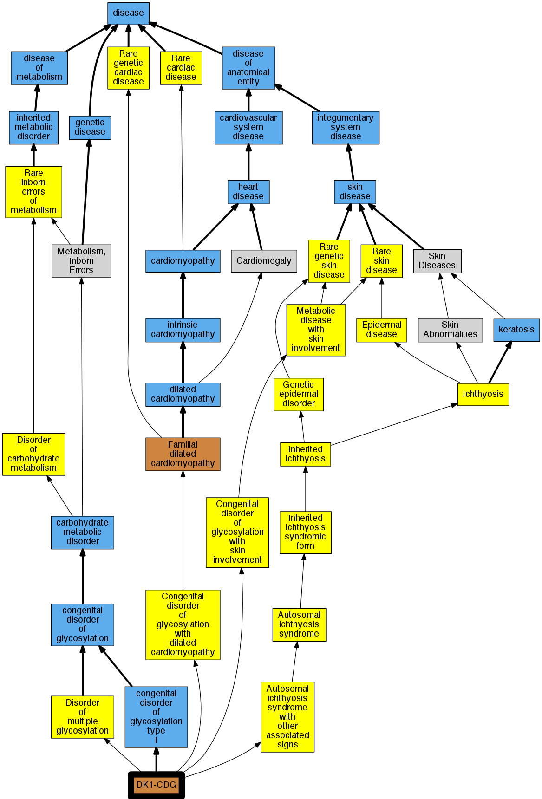

## GENE: DOLK

[matched diseases visual](DOLK.png)  <-- click on raw to zoom

### CONGENITAL DISORDER OF GLYCOSYLATION, TYPE Im
 * [OMIM:610768 Congenital Disorder Of Glycosylation, Type Im](http://beta.monarchinitiative.org/disease/OMIM:610768) Confidence: high
    * Equiv:[MESH:C563666 Congenital Disorder Of Glycosylation, Type Im](http://beta.monarchinitiative.org/disease/MESH:C563666)
    * Syn: "Cdg Im"
    * Syn: "CDG1M"
    * Syn: "CONGENITAL DISORDER OF GLYCOSYLATION, TYPE Im; CDG1M"
    * Syn: "Dk1 Deficiency"
    * Syn: "Dolichol Kinase Deficiency"
