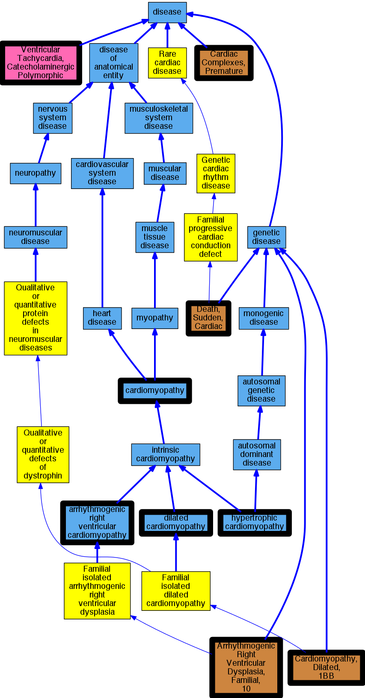

## GENE: DSG2

[matched diseases visual](DSG2.png)  <-- click on raw to zoom

### ARRHYTHMOGENIC RIGHT VENTRICULAR DYSPLASIA, FAMILIAL, 10
 * [OMIM:610193 Arrhythmogenic Right Ventricular Dysplasia, Familial, 10](http://beta.monarchinitiative.org/disease/OMIM:610193) Confidence: high
    * Equiv:[MESH:C565707 Arrhythmogenic Right Ventricular Dysplasia, Familial, 10](http://beta.monarchinitiative.org/disease/MESH:C565707)
    * Syn: "Arrhythmogenic Right Ventricular Cardiomyopathy 10"
    * Syn: "ARRHYTHMOGENIC RIGHT VENTRICULAR DYSPLASIA, FAMILIAL, 10; ARVD10"
    * Syn: "ARVD10"

### Arrhythmia
 * [OMIM:115000 Cardiac Complexes, Premature](http://beta.monarchinitiative.org/disease/OMIM:115000) Confidence: low/0.09375
    * Equiv:[MESH:D001145 Arrhythmias, Cardiac](http://beta.monarchinitiative.org/disease/MESH:D001145)
    * Equiv:[MESH:D005117 Cardiac Complexes, Premature](http://beta.monarchinitiative.org/disease/MESH:D005117)
    * Syn: "CARDIAC ARRHYTHMIA"
    * Syn: "Extrasystoles"

### Arrhythmogenic Right Ventricular Dysplasia/Cardiomyopathy
 * [DOID:0050431 arrhythmogenic right ventricular cardiomyopathy](http://beta.monarchinitiative.org/disease/DOID:0050431) Confidence: high
    * Equiv:[MESH:D019571 Arrhythmogenic Right Ventricular Dysplasia](http://beta.monarchinitiative.org/disease/MESH:D019571)
    * Syn: "arrhythmogenic right ventricular dysplasia"
    * Syn: "arrhythmogenic right ventricular dysplasia/cardiomyopathy"
    * Syn: "ARVC"
    * Syn: "ARVC cardiomyopathy"
    * Syn: "ARVD"

### Arrhythmogenic right ventricular cardiomyopathy
 * [DOID:0050431 arrhythmogenic right ventricular cardiomyopathy](http://beta.monarchinitiative.org/disease/DOID:0050431) Confidence: high
    * Equiv:[MESH:D019571 Arrhythmogenic Right Ventricular Dysplasia](http://beta.monarchinitiative.org/disease/MESH:D019571)
    * Syn: "arrhythmogenic right ventricular dysplasia"
    * Syn: "arrhythmogenic right ventricular dysplasia/cardiomyopathy"
    * Syn: "ARVC"
    * Syn: "ARVC cardiomyopathy"
    * Syn: "ARVD"

### Arrhythmogenic right ventricular cardiomyopathy 10
 * [OMIM:610193 Arrhythmogenic Right Ventricular Dysplasia, Familial, 10](http://beta.monarchinitiative.org/disease/OMIM:610193) Confidence: high
    * Equiv:[MESH:C565707 Arrhythmogenic Right Ventricular Dysplasia, Familial, 10](http://beta.monarchinitiative.org/disease/MESH:C565707)
    * Syn: "Arrhythmogenic Right Ventricular Cardiomyopathy 10"
    * Syn: "ARRHYTHMOGENIC RIGHT VENTRICULAR DYSPLASIA, FAMILIAL, 10; ARVD10"
    * Syn: "ARVD10"

### Arrhythmogenic right ventricular cardiomyopathy, type 10
 * [OMIM:610193 Arrhythmogenic Right Ventricular Dysplasia, Familial, 10](http://beta.monarchinitiative.org/disease/OMIM:610193) Confidence: low/0.21180555555555558
    * Equiv:[MESH:C565707 Arrhythmogenic Right Ventricular Dysplasia, Familial, 10](http://beta.monarchinitiative.org/disease/MESH:C565707)
    * Syn: "Arrhythmogenic Right Ventricular Cardiomyopathy 10"
    * Syn: "ARRHYTHMOGENIC RIGHT VENTRICULAR DYSPLASIA, FAMILIAL, 10; ARVD10"
    * Syn: "ARVD10"

### Arrhythmogenic right ventricular dysplasia/cardiomyopathy ?
 * [DOID:0050431 arrhythmogenic right ventricular cardiomyopathy](http://beta.monarchinitiative.org/disease/DOID:0050431) Confidence: low/0.1679421768707483
    * Equiv:[MESH:D019571 Arrhythmogenic Right Ventricular Dysplasia](http://beta.monarchinitiative.org/disease/MESH:D019571)
    * Syn: "arrhythmogenic right ventricular dysplasia"
    * Syn: "arrhythmogenic right ventricular dysplasia/cardiomyopathy"
    * Syn: "ARVC"
    * Syn: "ARVC cardiomyopathy"
    * Syn: "ARVD"

### CARDIOMYOPATHY, DILATED, 1BB, SUSCEPTIBILITY TO
 * [OMIM:612877 Cardiomyopathy, Dilated, 1BB](http://beta.monarchinitiative.org/disease/OMIM:612877) Confidence: low/0.15555555555555556
    * Equiv:[MESH:C567877 Cardiomyopathy, Dilated, 1BB](http://beta.monarchinitiative.org/disease/MESH:C567877)
    * Syn: "CARDIOMYOPATHY, DILATED, 1BB; CMD1BB"
    * Syn: "CMD1BB"

### Cardiomyopathy
 * [DOID:0050700 cardiomyopathy](http://beta.monarchinitiative.org/disease/DOID:0050700) Confidence: high
    * Equiv:[MESH:D009202 Cardiomyopathies](http://beta.monarchinitiative.org/disease/MESH:D009202)
    * Syn: "Cardiomyopathies"

### Cardiomyopathy, arrhythmogenic right ventricular
 * [DOID:0050431 arrhythmogenic right ventricular cardiomyopathy](http://beta.monarchinitiative.org/disease/DOID:0050431) Confidence: high
    * Equiv:[MESH:D019571 Arrhythmogenic Right Ventricular Dysplasia](http://beta.monarchinitiative.org/disease/MESH:D019571)
    * Syn: "arrhythmogenic right ventricular dysplasia"
    * Syn: "arrhythmogenic right ventricular dysplasia/cardiomyopathy"
    * Syn: "ARVC"
    * Syn: "ARVC cardiomyopathy"
    * Syn: "ARVD"

### Cardiomyopathy, dilated
 * [DOID:12930 dilated cardiomyopathy](http://beta.monarchinitiative.org/disease/DOID:12930) Confidence: high
    * Syn: "Congestive cardiomyopathy"
    * Syn: "Familial dilated cardiomyopathy"
    * Syn: "Idiopathic dilation cardiomyopathy"
    * Syn: "primary dilated cardiomyopathy"

### Catecholaminergic polymorphic ventricular tachycardia
 * [DC:0000665 Ventricular Tachycardia, Catecholaminergic Polymorphic](http://beta.monarchinitiative.org/disease/DC:0000665) Confidence: high

### Dysplasia, arrhythmogenic right ventricular
 * [DOID:0050431 arrhythmogenic right ventricular cardiomyopathy](http://beta.monarchinitiative.org/disease/DOID:0050431) Confidence: high
    * Equiv:[MESH:D019571 Arrhythmogenic Right Ventricular Dysplasia](http://beta.monarchinitiative.org/disease/MESH:D019571)
    * Syn: "arrhythmogenic right ventricular dysplasia"
    * Syn: "arrhythmogenic right ventricular dysplasia/cardiomyopathy"
    * Syn: "ARVC"
    * Syn: "ARVC cardiomyopathy"
    * Syn: "ARVD"

### Primary dilated cardiomyopathy
 * [DOID:12930 dilated cardiomyopathy](http://beta.monarchinitiative.org/disease/DOID:12930) Confidence: high
    * Syn: "Congestive cardiomyopathy"
    * Syn: "Familial dilated cardiomyopathy"
    * Syn: "Idiopathic dilation cardiomyopathy"
    * Syn: "primary dilated cardiomyopathy"

### Primary familial hypertrophic cardiomyopathy
 * [DOID:11984 hypertrophic cardiomyopathy](http://beta.monarchinitiative.org/disease/DOID:11984) Confidence: low/0.1953125
    * Equiv:[MESH:D002312 Cardiomyopathy, Hypertrophic](http://beta.monarchinitiative.org/disease/MESH:D002312)
    * Equiv:[MESH:D024741 Cardiomyopathy, Hypertrophic, Familial](http://beta.monarchinitiative.org/disease/MESH:D024741)
    * Syn: "familial hypertrophic cardiomyopathy"
    * Syn: "hypertrophic obstructive cardiomyopathy"

### Sudden cardiac death
 * [OMIM:115080 Death, Sudden, Cardiac](http://beta.monarchinitiative.org/disease/OMIM:115080) Confidence: high
    * Equiv:[MESH:C562490 Cardiac Conduction Defect](http://beta.monarchinitiative.org/disease/MESH:C562490)
    * Equiv:[MESH:C566172 Familial Sudden Death](http://beta.monarchinitiative.org/disease/MESH:C566172)
    * Equiv:[MESH:D003645 Death, Sudden](http://beta.monarchinitiative.org/disease/MESH:D003645)
    * Equiv:[MESH:D016757 Death, Sudden, Cardiac](http://beta.monarchinitiative.org/disease/MESH:D016757)
    * Syn: "CARDIAC CONDUCTION DEFECT"
    * Syn: "Familial Sudden Death"
    * Syn: "Sudden Cardiac Death"
