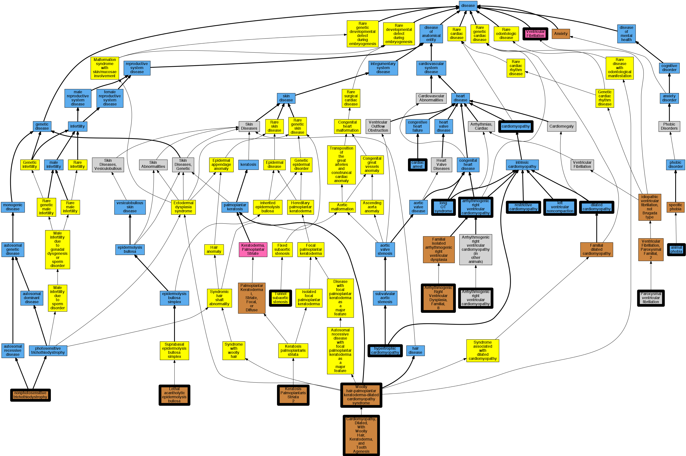

## GENE: DSP

[matched diseases visual](DSP.png)  <-- click on raw to zoom

### ARRHYTHMOGENIC RIGHT VENTRICULAR DYSPLASIA, FAMILIAL, 8
 * [OMIM:607450 Arrhythmogenic Right Ventricular Dysplasia, Familial, 8](http://beta.monarchinitiative.org/disease/OMIM:607450) Confidence: high
    * Equiv:[MESH:C564400 Arrhythmogenic Right Ventricular Dysplasia, Familial, 8](http://beta.monarchinitiative.org/disease/MESH:C564400)
    * Syn: "Arrhythmogenic Right Ventricular Cardiomyopathy 8"
    * Syn: "ARRHYTHMOGENIC RIGHT VENTRICULAR DYSPLASIA, FAMILIAL, 8; ARVD8"
    * Syn: "ARVD8"

### Arrhythmogenic right ventricular cardiomyopathy
 * [DOID:0050431 arrhythmogenic right ventricular cardiomyopathy](http://beta.monarchinitiative.org/disease/DOID:0050431) Confidence: high
    * Equiv:[MESH:D019571 Arrhythmogenic Right Ventricular Dysplasia](http://beta.monarchinitiative.org/disease/MESH:D019571)
    * Syn: "arrhythmogenic right ventricular dysplasia"
    * Syn: "arrhythmogenic right ventricular dysplasia/cardiomyopathy"
    * Syn: "ARVC"
    * Syn: "ARVC cardiomyopathy"
    * Syn: "ARVD"

### Arrhythmogenic right ventricular cardiomyopathy 8
 * [OMIM:607450 Arrhythmogenic Right Ventricular Dysplasia, Familial, 8](http://beta.monarchinitiative.org/disease/OMIM:607450) Confidence: high
    * Equiv:[MESH:C564400 Arrhythmogenic Right Ventricular Dysplasia, Familial, 8](http://beta.monarchinitiative.org/disease/MESH:C564400)
    * Syn: "Arrhythmogenic Right Ventricular Cardiomyopathy 8"
    * Syn: "ARRHYTHMOGENIC RIGHT VENTRICULAR DYSPLASIA, FAMILIAL, 8; ARVD8"
    * Syn: "ARVD8"

### Cardiomyopathy
 * [DOID:0050700 cardiomyopathy](http://beta.monarchinitiative.org/disease/DOID:0050700) Confidence: high
    * Equiv:[MESH:D009202 Cardiomyopathies](http://beta.monarchinitiative.org/disease/MESH:D009202)
    * Syn: "Cardiomyopathies"

### Primary dilated cardiomyopathy
 * [DOID:12930 dilated cardiomyopathy](http://beta.monarchinitiative.org/disease/DOID:12930) Confidence: high
    * Syn: "Congestive cardiomyopathy"
    * Syn: "Familial dilated cardiomyopathy"
    * Syn: "Idiopathic dilation cardiomyopathy"
    * Syn: "primary dilated cardiomyopathy"

### Primary dilated cardiomyopathy
 * [DOID:12930 dilated cardiomyopathy](http://beta.monarchinitiative.org/disease/DOID:12930) Confidence: high
    * Syn: "Congestive cardiomyopathy"
    * Syn: "Familial dilated cardiomyopathy"
    * Syn: "Idiopathic dilation cardiomyopathy"
    * Syn: "primary dilated cardiomyopathy"

### Primary familial hypertrophic cardiomyopathy
 * [DOID:11984 hypertrophic cardiomyopathy](http://beta.monarchinitiative.org/disease/DOID:11984) Confidence: low/0.1953125
    * Equiv:[MESH:D002312 Cardiomyopathy, Hypertrophic](http://beta.monarchinitiative.org/disease/MESH:D002312)
    * Equiv:[MESH:D024741 Cardiomyopathy, Hypertrophic, Familial](http://beta.monarchinitiative.org/disease/MESH:D024741)
    * Syn: "familial hypertrophic cardiomyopathy"
    * Syn: "hypertrophic obstructive cardiomyopathy"

### Cardiomyopathy, arrhythmogenic right ventricular
 * [DOID:0050431 arrhythmogenic right ventricular cardiomyopathy](http://beta.monarchinitiative.org/disease/DOID:0050431) Confidence: high
    * Equiv:[MESH:D019571 Arrhythmogenic Right Ventricular Dysplasia](http://beta.monarchinitiative.org/disease/MESH:D019571)
    * Syn: "arrhythmogenic right ventricular dysplasia"
    * Syn: "arrhythmogenic right ventricular dysplasia/cardiomyopathy"
    * Syn: "ARVC"
    * Syn: "ARVC cardiomyopathy"
    * Syn: "ARVD"

### Cardiomyopathy, dilated
 * [DOID:12930 dilated cardiomyopathy](http://beta.monarchinitiative.org/disease/DOID:12930) Confidence: high
    * Syn: "Congestive cardiomyopathy"
    * Syn: "Familial dilated cardiomyopathy"
    * Syn: "Idiopathic dilation cardiomyopathy"
    * Syn: "primary dilated cardiomyopathy"

### Cardiomyopathy, restrictive
 * [DOID:397 restrictive cardiomyopathy](http://beta.monarchinitiative.org/disease/DOID:397) Confidence: high
    * Equiv:[MESH:D002313 Cardiomyopathy, Restrictive](http://beta.monarchinitiative.org/disease/MESH:D002313)
    * Syn: "Cardiomyopathy, constrictive"
    * Syn: "Familial restrictive cardiomyopathy"
    * Syn: "primary restrictive cardiomyopathy (disorder)"
    * Syn: "Restrictive cardiomyopathy"
    * Syn: "Restrictive cardiomyopathy (disorder)"

### Collapse (finding)
 * [DOID:600 animal phobia](http://beta.monarchinitiative.org/disease/DOID:600) Confidence: low/0.1640625
    * Syn: "Fear of animals (finding)"
    * Syn: "Zoophobia (finding)"

### Dilated cardiomyopathy
 * [DOID:12930 dilated cardiomyopathy](http://beta.monarchinitiative.org/disease/DOID:12930) Confidence: high
    * Syn: "Congestive cardiomyopathy"
    * Syn: "Familial dilated cardiomyopathy"
    * Syn: "Idiopathic dilation cardiomyopathy"
    * Syn: "primary dilated cardiomyopathy"

### Dilated cardiomyopathy
 * [DOID:12930 dilated cardiomyopathy](http://beta.monarchinitiative.org/disease/DOID:12930) Confidence: high
    * Syn: "Congestive cardiomyopathy"
    * Syn: "Familial dilated cardiomyopathy"
    * Syn: "Idiopathic dilation cardiomyopathy"
    * Syn: "primary dilated cardiomyopathy"

### EPIDERMOLYSIS BULLOSA, LETHAL ACANTHOLYTIC
 * [OMIM:609638 Lethal acantholytic epidermolysis bullosa](http://beta.monarchinitiative.org/disease/OMIM:609638) Confidence: high
    * Equiv:[Orphanet:158687 Lethal acantholytic epidermolysis bullosa](http://beta.monarchinitiative.org/disease/Orphanet:158687)
    * Equiv:[MESH:C535493 Epidermolysis bullosa, lethal acantholytic](http://beta.monarchinitiative.org/disease/MESH:C535493)
    * Syn: "EBLA"
    * Syn: "EPIDERMOLYSIS BULLOSA, LETHAL ACANTHOLYTIC; EBLA"
    * Syn: "Lethal Acantholytic Epidermolysis Bullosa"

### KERATOSIS PALMOPLANTARIS STRIATA II
 * [OMIM:612908 Keratosis Palmoplantaris Striata II](http://beta.monarchinitiative.org/disease/OMIM:612908) Confidence: high
    * Equiv:[MESH:C565102 Keratosis Palmoplantaris Striata II](http://beta.monarchinitiative.org/disease/MESH:C565102)
    * Syn: "Keratoderma, Palmoplantar, Striate Form 2"
    * Syn: "KERATOSIS PALMOPLANTARIS STRIATA II; PPKS2"
    * Syn: "PPKS2"
    * Syn: "Striate Palmoplantar Keratoderma 2"

### Left ventricular noncompaction cardiomyopathy
 * [DC:0000237 Left Ventricular Noncompaction](http://beta.monarchinitiative.org/disease/DC:0000237) Confidence: low/0.1953125

### Long QT syndrome
 * [DOID:2843 long QT syndrome](http://beta.monarchinitiative.org/disease/DOID:2843) Confidence: high
    * Equiv:[MESH:D008133 Long QT Syndrome](http://beta.monarchinitiative.org/disease/MESH:D008133)
    * Syn: "long Q-T syndrome"
    * Syn: "LQT"
    * Syn: "Romano-Ward syndrome"
    * Syn: "Romano-Ward syndrome (disorder)"

### Paroxysmal familial ventricular fibrillation
 * [OMIM:612956 Paroxysmal ventricular fibrillation](http://beta.monarchinitiative.org/disease/OMIM:612956) Confidence: low/0.1953125
    * Equiv:[MESH:C537182 Paroxysmal ventricular fibrillation](http://beta.monarchinitiative.org/disease/MESH:C537182)
    * Equiv:[MESH:C567841 Ventricular Fibrillation, Paroxysmal Familial, 2](http://beta.monarchinitiative.org/disease/MESH:C567841)
    * Syn: "VENTRICULAR FIBRILLATION, PAROXYSMAL FAMILIAL, 2; VF2"
    * Syn: "VF2"

### Primary dilated cardiomyopathy
 * [DOID:12930 dilated cardiomyopathy](http://beta.monarchinitiative.org/disease/DOID:12930) Confidence: high
    * Syn: "Congestive cardiomyopathy"
    * Syn: "Familial dilated cardiomyopathy"
    * Syn: "Idiopathic dilation cardiomyopathy"
    * Syn: "primary dilated cardiomyopathy"

### Primary familial hypertrophic cardiomyopathy
 * [DOID:11984 hypertrophic cardiomyopathy](http://beta.monarchinitiative.org/disease/DOID:11984) Confidence: low/0.1953125
    * Equiv:[MESH:D002312 Cardiomyopathy, Hypertrophic](http://beta.monarchinitiative.org/disease/MESH:D002312)
    * Equiv:[MESH:D024741 Cardiomyopathy, Hypertrophic, Familial](http://beta.monarchinitiative.org/disease/MESH:D024741)
    * Syn: "familial hypertrophic cardiomyopathy"
    * Syn: "hypertrophic obstructive cardiomyopathy"

### Ventricular fibrillation
 * [MESH:D014693 Ventricular Fibrillation](http://beta.monarchinitiative.org/disease/MESH:D014693) Confidence: high
    * Equiv:[DC:0000692 -](http://beta.monarchinitiative.org/disease/DC:0000692)

### Arrhythmogenic right ventricular dysplasia/cardiomyopathy
 * [DOID:0050431 arrhythmogenic right ventricular cardiomyopathy](http://beta.monarchinitiative.org/disease/DOID:0050431) Confidence: high
    * Equiv:[MESH:D019571 Arrhythmogenic Right Ventricular Dysplasia](http://beta.monarchinitiative.org/disease/MESH:D019571)
    * Syn: "arrhythmogenic right ventricular dysplasia"
    * Syn: "arrhythmogenic right ventricular dysplasia/cardiomyopathy"
    * Syn: "ARVC"
    * Syn: "ARVC cardiomyopathy"
    * Syn: "ARVD"

### CARDIOMYOPATHY, DILATED, WITH WOOLLY HAIR AND KERATODERMA
 * [OMIM:605676 Cardiomyopathy dilated with Woolly hair and keratoderma](http://beta.monarchinitiative.org/disease/OMIM:605676) Confidence: high
    * Equiv:[MESH:C535581 Cardiomyopathy dilated with Woolly hair and keratoderma](http://beta.monarchinitiative.org/disease/MESH:C535581)
    * Syn: "CARDIOMYOPATHY, DILATED, WITH WOOLLY HAIR AND KERATODERMA; DCWHK"
    * Syn: "Carvajal Syndrome"
    * Syn: "DCWHK"
    * Syn: "Palmoplantar Keratoderma With Left Ventricular Cardiomyopathy and Woolly Hair"

### Cardiac Arrest
 * [DOID:0060319 cardiac arrest](http://beta.monarchinitiative.org/disease/DOID:0060319) Confidence: high
    * Equiv:[MESH:D006323 Heart Arrest](http://beta.monarchinitiative.org/disease/MESH:D006323)
    * Syn: "cardiopulmonary arrest"
    * Syn: "circulatory arrest"

### Cardiomyopathy
 * [DOID:0050700 cardiomyopathy](http://beta.monarchinitiative.org/disease/DOID:0050700) Confidence: high
    * Equiv:[MESH:D009202 Cardiomyopathies](http://beta.monarchinitiative.org/disease/MESH:D009202)
    * Syn: "Cardiomyopathies"

### Cardiomyopathy dilated with woolly hair and keratoderma
 * [OMIM:605676 Cardiomyopathy dilated with Woolly hair and keratoderma](http://beta.monarchinitiative.org/disease/OMIM:605676) Confidence: high
    * Equiv:[MESH:C535581 Cardiomyopathy dilated with Woolly hair and keratoderma](http://beta.monarchinitiative.org/disease/MESH:C535581)
    * Syn: "CARDIOMYOPATHY, DILATED, WITH WOOLLY HAIR AND KERATODERMA; DCWHK"
    * Syn: "Carvajal Syndrome"
    * Syn: "DCWHK"
    * Syn: "Palmoplantar Keratoderma With Left Ventricular Cardiomyopathy and Woolly Hair"

### Cardiomyopathy, restrictive
 * [DOID:397 restrictive cardiomyopathy](http://beta.monarchinitiative.org/disease/DOID:397) Confidence: high
    * Equiv:[MESH:D002313 Cardiomyopathy, Restrictive](http://beta.monarchinitiative.org/disease/MESH:D002313)
    * Syn: "Cardiomyopathy, constrictive"
    * Syn: "Familial restrictive cardiomyopathy"
    * Syn: "primary restrictive cardiomyopathy (disorder)"
    * Syn: "Restrictive cardiomyopathy"
    * Syn: "Restrictive cardiomyopathy (disorder)"

### Cardiomyopathy, restrictive
 * [DOID:397 restrictive cardiomyopathy](http://beta.monarchinitiative.org/disease/DOID:397) Confidence: high
    * Equiv:[MESH:D002313 Cardiomyopathy, Restrictive](http://beta.monarchinitiative.org/disease/MESH:D002313)
    * Syn: "Cardiomyopathy, constrictive"
    * Syn: "Familial restrictive cardiomyopathy"
    * Syn: "primary restrictive cardiomyopathy (disorder)"
    * Syn: "Restrictive cardiomyopathy"
    * Syn: "Restrictive cardiomyopathy (disorder)"

### Dilated cardiomyopathy, woolly hair, keratoderma
 * [Orphanet:65282 Woolly hair-palmoplantar keratoderma-dilated cardiomyopathy syndrome](http://beta.monarchinitiative.org/disease/Orphanet:65282) Confidence: low/0.15306122448979592

### Paroxysmal familial ventricular fibrillation
 * [OMIM:612956 Paroxysmal ventricular fibrillation](http://beta.monarchinitiative.org/disease/OMIM:612956) Confidence: low/0.1953125
    * Equiv:[MESH:C537182 Paroxysmal ventricular fibrillation](http://beta.monarchinitiative.org/disease/MESH:C537182)
    * Equiv:[MESH:C567841 Ventricular Fibrillation, Paroxysmal Familial, 2](http://beta.monarchinitiative.org/disease/MESH:C567841)
    * Syn: "VENTRICULAR FIBRILLATION, PAROXYSMAL FAMILIAL, 2; VF2"
    * Syn: "VF2"

### Subaortic stenosis
 * [Orphanet:99053 Tunnel subaortic stenosis](http://beta.monarchinitiative.org/disease/Orphanet:99053) Confidence: low/0.1388888888888889

### Arrhythmogenic Right Ventricular Dysplasia/Cardiomyopathy
 * [DOID:0050431 arrhythmogenic right ventricular cardiomyopathy](http://beta.monarchinitiative.org/disease/DOID:0050431) Confidence: high
    * Equiv:[MESH:D019571 Arrhythmogenic Right Ventricular Dysplasia](http://beta.monarchinitiative.org/disease/MESH:D019571)
    * Syn: "arrhythmogenic right ventricular dysplasia"
    * Syn: "arrhythmogenic right ventricular dysplasia/cardiomyopathy"
    * Syn: "ARVC"
    * Syn: "ARVC cardiomyopathy"
    * Syn: "ARVD"

### Arrhythmogenic right ventricular cardiomyopathy, type 8
 * [OMIM:607450 Arrhythmogenic Right Ventricular Dysplasia, Familial, 8](http://beta.monarchinitiative.org/disease/OMIM:607450) Confidence: low/0.21180555555555558
    * Equiv:[MESH:C564400 Arrhythmogenic Right Ventricular Dysplasia, Familial, 8](http://beta.monarchinitiative.org/disease/MESH:C564400)
    * Syn: "Arrhythmogenic Right Ventricular Cardiomyopathy 8"
    * Syn: "ARRHYTHMOGENIC RIGHT VENTRICULAR DYSPLASIA, FAMILIAL, 8; ARVD8"
    * Syn: "ARVD8"

### Arrhythmogenic right ventricular dysplasia 8
 * [DOID:0050431 arrhythmogenic right ventricular cardiomyopathy](http://beta.monarchinitiative.org/disease/DOID:0050431) Confidence: low/0.20500000000000002
    * Equiv:[MESH:D019571 Arrhythmogenic Right Ventricular Dysplasia](http://beta.monarchinitiative.org/disease/MESH:D019571)
    * Syn: "arrhythmogenic right ventricular dysplasia"
    * Syn: "arrhythmogenic right ventricular dysplasia/cardiomyopathy"
    * Syn: "ARVC"
    * Syn: "ARVC cardiomyopathy"
    * Syn: "ARVD"

### CARDIOMYOPATHY, DILATED, WITH WOOLLY HAIR, KERATODERMA, AND TOOTH AGENESIS
 * [OMIM:615821 Cardiomyopathy, Dilated, With Woolly Hair, Keratoderma, and Tooth Agenesis](http://beta.monarchinitiative.org/disease/OMIM:615821) Confidence: high
    * Syn: "CARDIOMYOPATHY, DILATED, WITH WOOLLY HAIR, KERATODERMA, AND TOOTH AGENESIS; DCWHKTA"
    * Syn: "DCWHKTA"

### Cardiomyopathy, dilated
 * [DOID:12930 dilated cardiomyopathy](http://beta.monarchinitiative.org/disease/DOID:12930) Confidence: high
    * Syn: "Congestive cardiomyopathy"
    * Syn: "Familial dilated cardiomyopathy"
    * Syn: "Idiopathic dilation cardiomyopathy"
    * Syn: "primary dilated cardiomyopathy"

### Collapse (finding)
 * [DOID:600 animal phobia](http://beta.monarchinitiative.org/disease/DOID:600) Confidence: low/0.1640625
    * Syn: "Fear of animals (finding)"
    * Syn: "Zoophobia (finding)"

### Dysplasia, arrhythmogenic right ventricular
 * [DOID:0050431 arrhythmogenic right ventricular cardiomyopathy](http://beta.monarchinitiative.org/disease/DOID:0050431) Confidence: high
    * Equiv:[MESH:D019571 Arrhythmogenic Right Ventricular Dysplasia](http://beta.monarchinitiative.org/disease/MESH:D019571)
    * Syn: "arrhythmogenic right ventricular dysplasia"
    * Syn: "arrhythmogenic right ventricular dysplasia/cardiomyopathy"
    * Syn: "ARVC"
    * Syn: "ARVC cardiomyopathy"
    * Syn: "ARVD"

### Long QT syndrome
 * [DOID:2843 long QT syndrome](http://beta.monarchinitiative.org/disease/DOID:2843) Confidence: high
    * Equiv:[MESH:D008133 Long QT Syndrome](http://beta.monarchinitiative.org/disease/MESH:D008133)
    * Syn: "long Q-T syndrome"
    * Syn: "LQT"
    * Syn: "Romano-Ward syndrome"
    * Syn: "Romano-Ward syndrome (disorder)"

### Long QT syndrome
 * [DOID:2843 long QT syndrome](http://beta.monarchinitiative.org/disease/DOID:2843) Confidence: high
    * Equiv:[MESH:D008133 Long QT Syndrome](http://beta.monarchinitiative.org/disease/MESH:D008133)
    * Syn: "long Q-T syndrome"
    * Syn: "LQT"
    * Syn: "Romano-Ward syndrome"
    * Syn: "Romano-Ward syndrome (disorder)"

### Primary dilated cardiomyopathy
 * [DOID:12930 dilated cardiomyopathy](http://beta.monarchinitiative.org/disease/DOID:12930) Confidence: high
    * Syn: "Congestive cardiomyopathy"
    * Syn: "Familial dilated cardiomyopathy"
    * Syn: "Idiopathic dilation cardiomyopathy"
    * Syn: "primary dilated cardiomyopathy"

### Primary familial hypertrophic cardiomyopathy
 * [DOID:11984 hypertrophic cardiomyopathy](http://beta.monarchinitiative.org/disease/DOID:11984) Confidence: low/0.1953125
    * Equiv:[MESH:D002312 Cardiomyopathy, Hypertrophic](http://beta.monarchinitiative.org/disease/MESH:D002312)
    * Equiv:[MESH:D024741 Cardiomyopathy, Hypertrophic, Familial](http://beta.monarchinitiative.org/disease/MESH:D024741)
    * Syn: "familial hypertrophic cardiomyopathy"
    * Syn: "hypertrophic obstructive cardiomyopathy"

### SKIN FRAGILITY-WOOLLY HAIR SYNDROME
 * [OMIM:607655 Skin Fragility-Woolly Hair Syndrome](http://beta.monarchinitiative.org/disease/OMIM:607655) Confidence: high
    * Equiv:[MESH:C564359 Skin Fragility-Woolly Hair Syndrome](http://beta.monarchinitiative.org/disease/MESH:C564359)
    * Syn: "SFWHS"
    * Syn: "SKIN FRAGILITY-WOOLLY HAIR SYNDROME; SFWHS"
