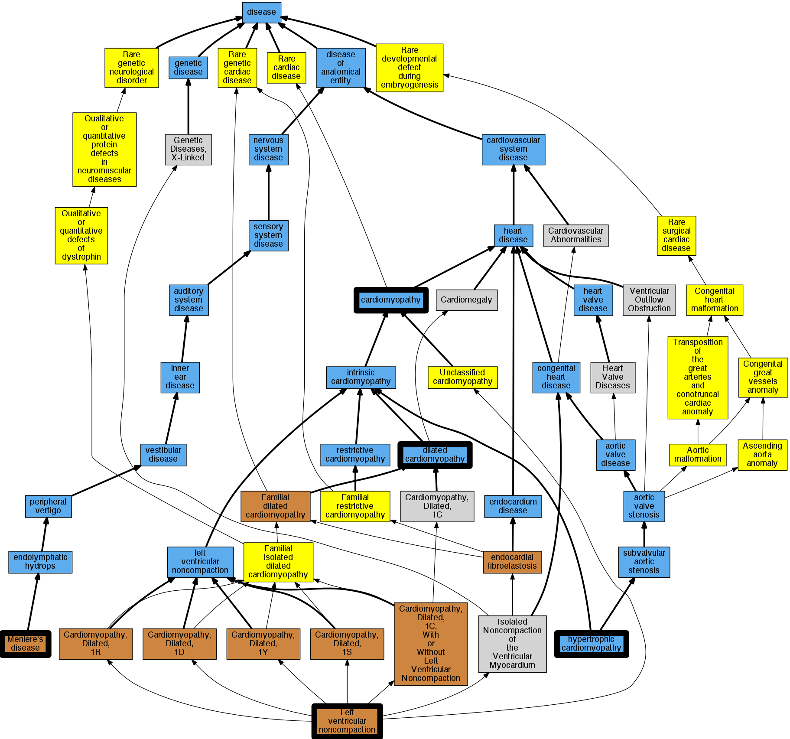

## GENE: DTNA

[matched diseases visual](DTNA.png)  <-- click on raw to zoom

### Cardiomyopathy
 * [DOID:0050700 cardiomyopathy](http://beta.monarchinitiative.org/disease/DOID:0050700) Confidence: high
    * Equiv:[MESH:D009202 Cardiomyopathies](http://beta.monarchinitiative.org/disease/MESH:D009202)
    * Syn: "Cardiomyopathies"

### LEFT VENTRICULAR NONCOMPACTION 1
 * [OMIM:604169 Left Ventricular Noncompaction 1](http://beta.monarchinitiative.org/disease/OMIM:604169) Confidence: high
    * Syn: "Left Ventricular Noncompaction 1 With or Without Congenital Heart Defects"
    * Syn: "LEFT VENTRICULAR NONCOMPACTION 1; LVNC1"
    * Syn: "LVNC1"

### MENIERE DISEASE
 * [OMIM:156000 Meniere Disease](http://beta.monarchinitiative.org/disease/OMIM:156000) Confidence: high
    * Equiv:[MESH:D008575 Meniere Disease](http://beta.monarchinitiative.org/disease/MESH:D008575)
    * Syn: "MENIERE DISEASE"

### Primary dilated cardiomyopathy
 * [DOID:12930 dilated cardiomyopathy](http://beta.monarchinitiative.org/disease/DOID:12930) Confidence: high
    * Syn: "Congestive cardiomyopathy"
    * Syn: "Familial dilated cardiomyopathy"
    * Syn: "Idiopathic dilation cardiomyopathy"
    * Syn: "primary dilated cardiomyopathy"

### Primary familial hypertrophic cardiomyopathy
 * [DOID:11984 hypertrophic cardiomyopathy](http://beta.monarchinitiative.org/disease/DOID:11984) Confidence: low/0.1953125
    * Equiv:[MESH:D002312 Cardiomyopathy, Hypertrophic](http://beta.monarchinitiative.org/disease/MESH:D002312)
    * Equiv:[MESH:D024741 Cardiomyopathy, Hypertrophic, Familial](http://beta.monarchinitiative.org/disease/MESH:D024741)
    * Syn: "familial hypertrophic cardiomyopathy"
    * Syn: "hypertrophic obstructive cardiomyopathy"
