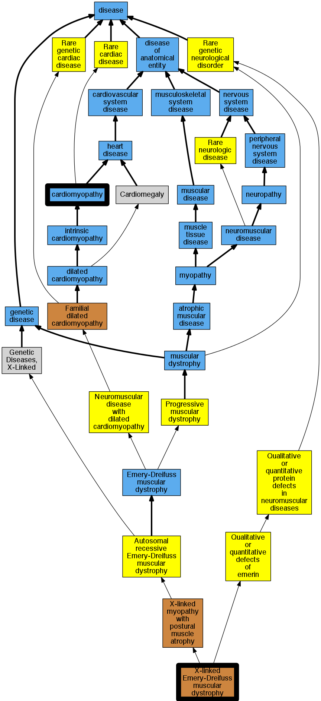

## GENE: EMD

[matched diseases visual](EMD.png)  <-- click on raw to zoom

### Cardiomyopathy
 * [DOID:0050700 cardiomyopathy](http://beta.monarchinitiative.org/disease/DOID:0050700) Confidence: high
    * Equiv:[MESH:D009202 Cardiomyopathies](http://beta.monarchinitiative.org/disease/MESH:D009202)
    * Syn: "Cardiomyopathies"

### Cardiomyopathy
 * [DOID:0050700 cardiomyopathy](http://beta.monarchinitiative.org/disease/DOID:0050700) Confidence: high
    * Equiv:[MESH:D009202 Cardiomyopathies](http://beta.monarchinitiative.org/disease/MESH:D009202)
    * Syn: "Cardiomyopathies"

### EMERY-DREIFUSS MUSCULAR DYSTROPHY, X-LINKED
 * [Orphanet:98863 X-linked Emery-Dreifuss muscular dystrophy](http://beta.monarchinitiative.org/disease/Orphanet:98863) Confidence: high

### Emery-Dreifuss muscular dystrophy 1, X-linked
 * [Orphanet:98863 X-linked Emery-Dreifuss muscular dystrophy](http://beta.monarchinitiative.org/disease/Orphanet:98863) Confidence: low/0.21683673469387754
