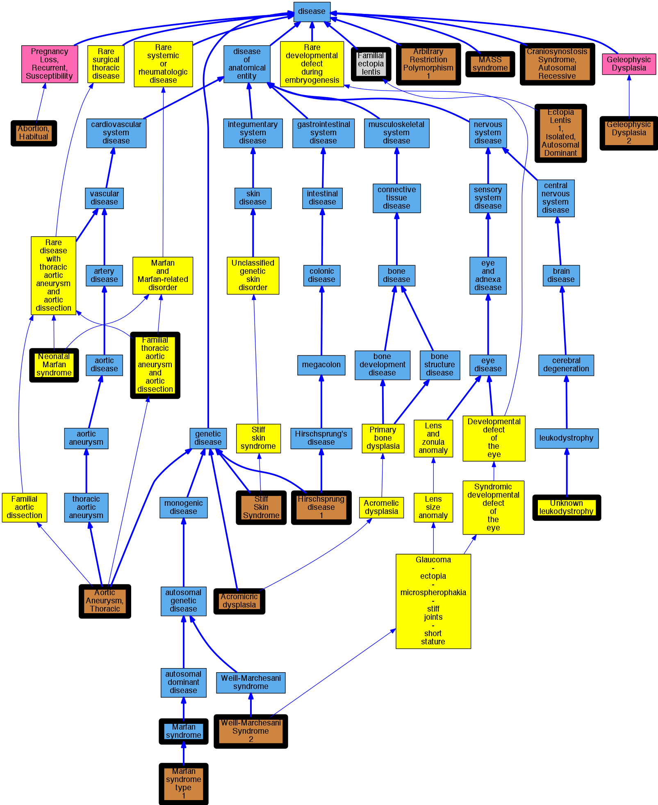

## GENE: FBN1

[matched diseases visual](FBN1.png)  <-- click on raw to zoom

### ACROMICRIC DYSPLASIA
 * [OMIM:102370 Acromicric dysplasia](http://beta.monarchinitiative.org/disease/OMIM:102370) Confidence: high
    * Equiv:[Orphanet:969 Acromicric dysplasia](http://beta.monarchinitiative.org/disease/Orphanet:969)
    * Equiv:[MESH:C535662 Acromicric dysplasia](http://beta.monarchinitiative.org/disease/MESH:C535662)
    * Syn: "ACMICD"
    * Syn: "ACROMICRIC DYSPLASIA; ACMICD"

### ECTOPIA LENTIS 1, ISOLATED, AUTOSOMAL DOMINANT
 * [OMIM:129600 Ectopia Lentis 1, Isolated, Autosomal Dominant](http://beta.monarchinitiative.org/disease/OMIM:129600) Confidence: high
    * Syn: "ECTOL1"
    * Syn: "ECTOPIA LENTIS 1, ISOLATED, AUTOSOMAL DOMINANT; ECTOL1"

### FNB1 POLYMORPHISM
 * [OMIM:107750 Arbitrary Restriction Polymorphism 1](http://beta.monarchinitiative.org/disease/OMIM:107750) Confidence: low/0.0390625
    * Syn: "Anonymous Restriction Polymorphism 1"
    * Syn: "ARBITRARY RESTRICTION POLYMORPHISM 1"
    * Syn: "Arp-14A"
    * Syn: "Restriction Fragment Length Polymorphism 14A"
    * Syn: "Rflp-14A"

### Familial Ectopia Lentis
 * [MESH:C536184 Familial ectopia lentis](http://beta.monarchinitiative.org/disease/MESH:C536184) Confidence: high
    * Equiv:[DC:0000511 -](http://beta.monarchinitiative.org/disease/DC:0000511)

### Familial Thoracic Aortic Aneurysm
 * [OMIM:607086 Aortic Aneurysm, Thoracic](http://beta.monarchinitiative.org/disease/OMIM:607086) Confidence: high
    * Equiv:[MESH:C562834 Aortic Aneurysm, Familial Thoracic 1](http://beta.monarchinitiative.org/disease/MESH:C562834)
    * Equiv:[MESH:D017545 Aortic Aneurysm, Thoracic](http://beta.monarchinitiative.org/disease/MESH:D017545)
    * Syn: "AAT1"
    * Syn: "Aneurysm, Thoracic Aortic"
    * Syn: "Annuloaortic Ectasia"
    * Syn: "Aortic Aneurysm, Familial Thoracic"
    * Syn: "AORTIC ANEURYSM, FAMILIAL THORACIC 1; AAT1"
    * Syn: "Aortic Dissection, Familial"
    * Syn: "Erdheim Cystic Medial Necrosis of Aorta"
    * Syn: "Faa1"

### GELEOPHYSIC DYSPLASIA 2
 * [OMIM:614185 Geleophysic Dysplasia 2](http://beta.monarchinitiative.org/disease/OMIM:614185) Confidence: high
    * Syn: "GELEOPHYSIC DYSPLASIA 2; GPHYSD2"
    * Syn: "GPHYSD2"

### Hirschsprung disease 1
 * [OMIM:142623 Hirschsprung disease 1](http://beta.monarchinitiative.org/disease/OMIM:142623) Confidence: high
    * Equiv:[MESH:C538540 Hirschsprung disease 1](http://beta.monarchinitiative.org/disease/MESH:C538540)
    * Syn: "Aganglionic Megacolon"
    * Syn: "Hirschsprung Disease"
    * Syn: "HIRSCHSPRUNG DISEASE, SUSCEPTIBILITY TO, 1; HSCR1"
    * Syn: "HSCR1"
    * Syn: "Megacolon, Aganglionic"

### MARFAN SYNDROME
 * [DOID:14323 Marfan syndrome](http://beta.monarchinitiative.org/disease/DOID:14323) Confidence: high
    * Syn: "Marfan's syndrome"

### MARFAN SYNDROME, ATYPICAL
 * [OMIM:154700 Marfan syndrome type 1](http://beta.monarchinitiative.org/disease/OMIM:154700) Confidence: low/0.1388888888888889
    * Equiv:[Orphanet:284963 Marfan syndrome type 1](http://beta.monarchinitiative.org/disease/Orphanet:284963)
    * Equiv:[MESH:D008382 Marfan Syndrome](http://beta.monarchinitiative.org/disease/MESH:D008382)
    * Syn: "Marfan Syndrome, Type 1"
    * Syn: "MARFAN SYNDROME; MFS"
    * Syn: "MFS"

### MARFAN SYNDROME, AUTOSOMAL RECESSIVE
 * [OMIM:606529 Craniosynostosis Syndrome, Autosomal Recessive](http://beta.monarchinitiative.org/disease/OMIM:606529) Confidence: low/0.1640625
    * Equiv:[MESH:C564700 Craniosynostosis Syndrome, Autosomal Recessive](http://beta.monarchinitiative.org/disease/MESH:C564700)
    * Syn: "CRANIOSYNOSTOSIS SYNDROME, AUTOSOMAL RECESSIVE"

### MARFAN SYNDROME, CLASSIC
 * [OMIM:154700 Marfan syndrome type 1](http://beta.monarchinitiative.org/disease/OMIM:154700) Confidence: low/0.1388888888888889
    * Equiv:[Orphanet:284963 Marfan syndrome type 1](http://beta.monarchinitiative.org/disease/Orphanet:284963)
    * Equiv:[MESH:D008382 Marfan Syndrome](http://beta.monarchinitiative.org/disease/MESH:D008382)
    * Syn: "Marfan Syndrome, Type 1"
    * Syn: "MARFAN SYNDROME; MFS"
    * Syn: "MFS"

### MARFAN SYNDROME, MILD
 * [OMIM:154700 Marfan syndrome type 1](http://beta.monarchinitiative.org/disease/OMIM:154700) Confidence: low/0.1388888888888889
    * Equiv:[Orphanet:284963 Marfan syndrome type 1](http://beta.monarchinitiative.org/disease/Orphanet:284963)
    * Equiv:[MESH:D008382 Marfan Syndrome](http://beta.monarchinitiative.org/disease/MESH:D008382)
    * Syn: "Marfan Syndrome, Type 1"
    * Syn: "MARFAN SYNDROME; MFS"
    * Syn: "MFS"

### MARFAN SYNDROME, MILD VARIABLE
 * [OMIM:154700 Marfan syndrome type 1](http://beta.monarchinitiative.org/disease/OMIM:154700) Confidence: low/0.11458333333333333
    * Equiv:[Orphanet:284963 Marfan syndrome type 1](http://beta.monarchinitiative.org/disease/Orphanet:284963)
    * Equiv:[MESH:D008382 Marfan Syndrome](http://beta.monarchinitiative.org/disease/MESH:D008382)
    * Syn: "Marfan Syndrome, Type 1"
    * Syn: "MARFAN SYNDROME; MFS"
    * Syn: "MFS"

### MARFAN SYNDROME, NEONATAL
 * [Orphanet:284979 Neonatal Marfan syndrome](http://beta.monarchinitiative.org/disease/Orphanet:284979) Confidence: high

### MARFAN SYNDROME, SEVERE CLASSIC
 * [OMIM:154700 Marfan syndrome type 1](http://beta.monarchinitiative.org/disease/OMIM:154700) Confidence: low/0.11458333333333333
    * Equiv:[Orphanet:284963 Marfan syndrome type 1](http://beta.monarchinitiative.org/disease/Orphanet:284963)
    * Equiv:[MESH:D008382 Marfan Syndrome](http://beta.monarchinitiative.org/disease/MESH:D008382)
    * Syn: "Marfan Syndrome, Type 1"
    * Syn: "MARFAN SYNDROME; MFS"
    * Syn: "MFS"

### MARFAN SYNDROME, SUBDIAGNOSTIC VARIANT OF
 * [OMIM:154700 Marfan syndrome type 1](http://beta.monarchinitiative.org/disease/OMIM:154700) Confidence: low/0.10333333333333333
    * Equiv:[Orphanet:284963 Marfan syndrome type 1](http://beta.monarchinitiative.org/disease/Orphanet:284963)
    * Equiv:[MESH:D008382 Marfan Syndrome](http://beta.monarchinitiative.org/disease/MESH:D008382)
    * Syn: "Marfan Syndrome, Type 1"
    * Syn: "MARFAN SYNDROME; MFS"
    * Syn: "MFS"

### MASS SYNDROME
 * [OMIM:604308 MASS syndrome](http://beta.monarchinitiative.org/disease/OMIM:604308) Confidence: high
    * Equiv:[MESH:C536030 MASS syndrome](http://beta.monarchinitiative.org/disease/MESH:C536030)
    * Syn: "Mass Phenotype"
    * Syn: "MASS SYNDROME"
    * Syn: "Overlap Connective Tissue Disease"

### Marfan Syndrome
 * [DOID:14323 Marfan syndrome](http://beta.monarchinitiative.org/disease/DOID:14323) Confidence: high
    * Syn: "Marfan's syndrome"

### Marfan syndrome
 * [DOID:14323 Marfan syndrome](http://beta.monarchinitiative.org/disease/DOID:14323) Confidence: high
    * Syn: "Marfan's syndrome"

### Marfan syndrome, incomplete
 * [DOID:14323 Marfan syndrome](http://beta.monarchinitiative.org/disease/DOID:14323) Confidence: low/0.18055555555555555
    * Syn: "Marfan's syndrome"

### Marfan''s syndrome
 * [DOID:14323 Marfan syndrome](http://beta.monarchinitiative.org/disease/DOID:14323) Confidence: high
    * Syn: "Marfan's syndrome"

### Marfan's syndrome
 * [DOID:14323 Marfan syndrome](http://beta.monarchinitiative.org/disease/DOID:14323) Confidence: high
    * Syn: "Marfan's syndrome"

### Marfanoid habitus
 * [OMIM:614389 Abortion, Habitual](http://beta.monarchinitiative.org/disease/OMIM:614389) Confidence: low/0.09375
    * Equiv:[MESH:D000026 Abortion, Habitual](http://beta.monarchinitiative.org/disease/MESH:D000026)
    * Syn: "Abortion, Spontaneous, Recurrent"
    * Syn: "Embryonic Loss, Recurrent"
    * Syn: "Fetal Loss, Recurrent, Susceptibility to"
    * Syn: "Miscarriage, Recurrent"
    * Syn: "PREGNANCY LOSS, RECURRENT, SUSCEPTIBILITY TO, 1; RPRGL1"
    * Syn: "Rpl"
    * Syn: "Rprgl"
    * Syn: "RPRGL1"
    * Syn: "Stillbirth, Recurrent"

### RECLASSIFIED - VARIANT OF UNKNOWN SIGNIFICANCE
 * [Orphanet:84096 Unknown leukodystrophy](http://beta.monarchinitiative.org/disease/Orphanet:84096) Confidence: low/0.0675

### STIFF SKIN SYNDROME
 * [OMIM:184900 Stiff Skin Syndrome](http://beta.monarchinitiative.org/disease/OMIM:184900) Confidence: high
    * Equiv:[MESH:C566112 Stiff Skin Syndrome](http://beta.monarchinitiative.org/disease/MESH:C566112)
    * Syn: "SSKS"
    * Syn: "STIFF SKIN SYNDROME; SSKS"

### Thoracic aortic aneurysms and aortic dissections
 * [Orphanet:91387 Familial thoracic aortic aneurysm and aortic dissection](http://beta.monarchinitiative.org/disease/Orphanet:91387) Confidence: low/0.19097222222222224

### WEILL-MARCHESANI SYNDROME 2
 * [OMIM:608328 Weill-Marchesani Syndrome 2](http://beta.monarchinitiative.org/disease/OMIM:608328) Confidence: high
    * Syn: "Glaucoma-Lens Ectopia-Microspherophakia-Stiffness-Shortness Syndrome"
    * Syn: "Mesodermal Dysmorphodystrophy, Congenital"
    * Syn: "Spherophakia-Brachymorphia Syndrome"
    * Syn: "WEILL-MARCHESANI SYNDROME 2; WMS2"
    * Syn: "Weill-Marchesani Syndrome, Autosomal Dominant"
    * Syn: "WMS2"
