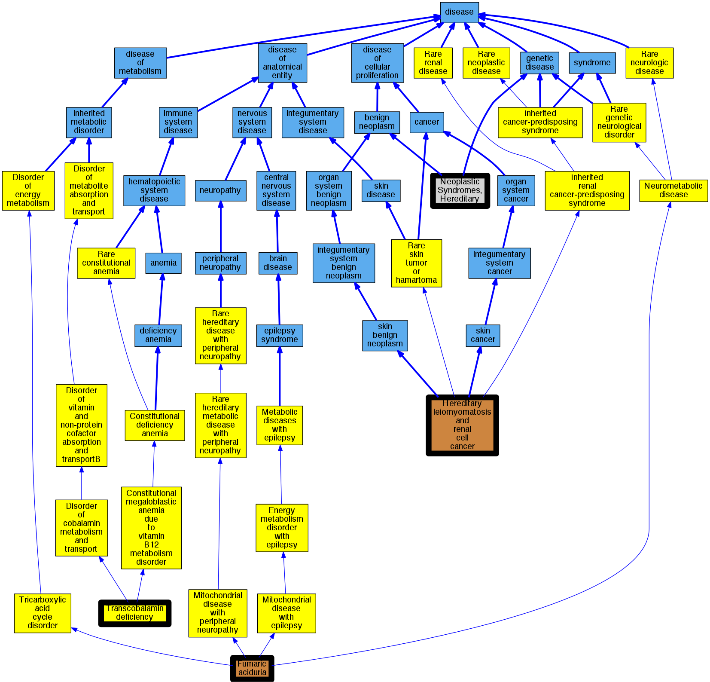

## GENE: FH

[matched diseases visual](FH.png)  <-- click on raw to zoom

### Fumarase deficiency
 * [Orphanet:859 Transcobalamin deficiency](http://beta.monarchinitiative.org/disease/Orphanet:859) Confidence: low/0.09375

### Neoplastic Syndromes, Hereditary
 * [MESH:D009386 Neoplastic Syndromes, Hereditary](http://beta.monarchinitiative.org/disease/MESH:D009386) Confidence: high

### FUMARASE DEFICIENCY
 * [OMIM:606812 Fumaric aciduria](http://beta.monarchinitiative.org/disease/OMIM:606812) Confidence: low/0.1388888888888889
    * Equiv:[Orphanet:24 Fumaric aciduria](http://beta.monarchinitiative.org/disease/Orphanet:24)
    * Equiv:[MESH:C538191 Fumaric aciduria](http://beta.monarchinitiative.org/disease/MESH:C538191)
    * Syn: "FMRD"
    * Syn: "FUMARASE DEFICIENCY; FMRD"
    * Syn: "Fumaric Aciduria"

### Hereditary leiomyomatosis and renal cell cancer
 * [OMIM:150800 Hereditary leiomyomatosis and renal cell cancer](http://beta.monarchinitiative.org/disease/OMIM:150800) Confidence: high
    * Equiv:[Orphanet:523 Hereditary leiomyomatosis and renal cell cancer](http://beta.monarchinitiative.org/disease/Orphanet:523)
    * Syn: "HEREDITARY LEIOMYOMATOSIS AND RENAL CELL CANCER; HLRCC"
    * Syn: "HLRCC"
    * Syn: "Leiomyoma, Multiple Cutaneous"
    * Syn: "Leiomyomatosis and Renal Cell Cancer, Hereditary"
    * Syn: "Multiple Cutaneous and Uterine Leiomyomata 1, With or Without Renal Cell Carcinoma"

### HEREDITARY LEIOMYOMATOSIS AND RENAL CELL CANCER
 * [OMIM:150800 Hereditary leiomyomatosis and renal cell cancer](http://beta.monarchinitiative.org/disease/OMIM:150800) Confidence: high
    * Equiv:[Orphanet:523 Hereditary leiomyomatosis and renal cell cancer](http://beta.monarchinitiative.org/disease/Orphanet:523)
    * Syn: "HEREDITARY LEIOMYOMATOSIS AND RENAL CELL CANCER; HLRCC"
    * Syn: "HLRCC"
    * Syn: "Leiomyoma, Multiple Cutaneous"
    * Syn: "Leiomyomatosis and Renal Cell Cancer, Hereditary"
    * Syn: "Multiple Cutaneous and Uterine Leiomyomata 1, With or Without Renal Cell Carcinoma"
