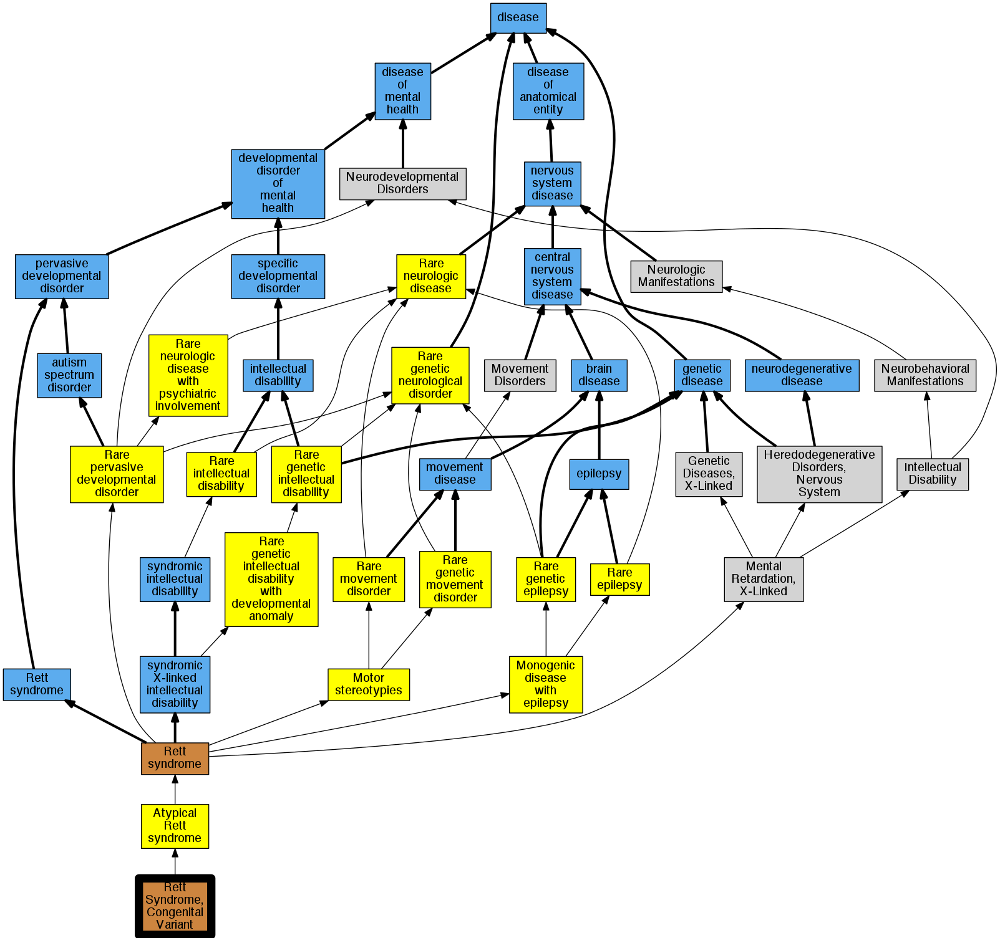

## GENE: FOXG1

[matched diseases visual](FOXG1.png)  <-- click on raw to zoom

### RETT SYNDROME, CONGENITAL VARIANT
 * [OMIM:613454 Rett Syndrome, Congenital Variant](http://beta.monarchinitiative.org/disease/OMIM:613454) Confidence: high
    * Syn: "RETT SYNDROME, CONGENITAL VARIANT"

### Rett syndrome, congenital variant
 * [OMIM:613454 Rett Syndrome, Congenital Variant](http://beta.monarchinitiative.org/disease/OMIM:613454) Confidence: high
    * Syn: "RETT SYNDROME, CONGENITAL VARIANT"
