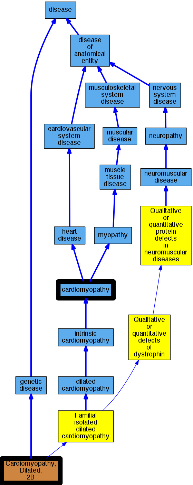

## GENE: GATAD1

[matched diseases visual](GATAD1.png)  <-- click on raw to zoom

### CARDIOMYOPATHY, DILATED, 2B (1 family)
 * [OMIM:614672 Cardiomyopathy, Dilated, 2B](http://beta.monarchinitiative.org/disease/OMIM:614672) Confidence: low/0.15625
    * Syn: "CARDIOMYOPATHY, DILATED, 2B; CMD2B"
    * Syn: "CMD2B"
