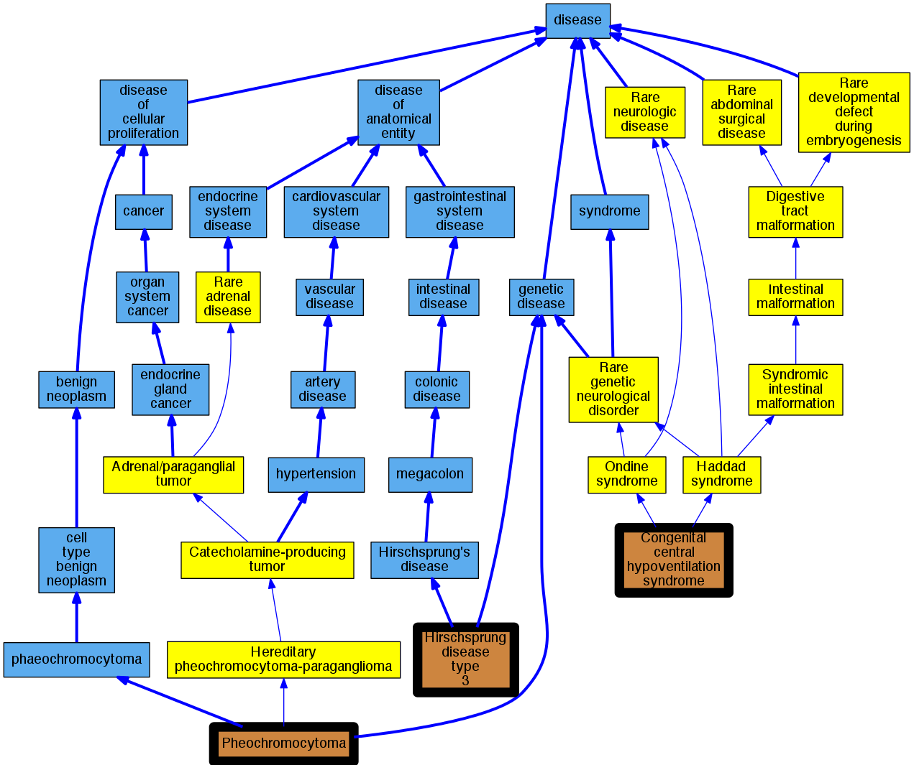

## GENE: GDNF

[matched diseases visual](GDNF.png)  <-- click on raw to zoom

### HIRSCHSPRUNG DISEASE, SUSCEPTIBILITY TO, 3
 * [OMIM:613711 Hirschsprung Disease, Susceptibility To, 3](http://beta.monarchinitiative.org/disease/OMIM:613711) Confidence: high
    * Syn: "HIRSCHSPRUNG DISEASE, SUSCEPTIBILITY TO, 3; HSCR3"
    * Syn: "HSCR3"

### CENTRAL HYPOVENTILATION SYNDROME, CONGENITAL
 * [OMIM:209880 Haddad syndrome](http://beta.monarchinitiative.org/disease/OMIM:209880) Confidence: high
    * Equiv:[Orphanet:99803 Haddad syndrome](http://beta.monarchinitiative.org/disease/Orphanet:99803)
    * Equiv:[MESH:C536209 Congenital central hypoventilation syndrome](http://beta.monarchinitiative.org/disease/MESH:C536209)
    * Syn: "Autonomic Control, Congenital Failure of"
    * Syn: "CCHS"
    * Syn: "Cchs With Hirschsprung Disease"
    * Syn: "Central Hypoventilation Syndrome, Congenital"
    * Syn: "CENTRAL HYPOVENTILATION SYNDROME, CONGENITAL; CCHS"
    * Syn: "Congenital central alveolar hypoventilation - Hirschsprung disease"
    * Syn: "Congenital failure of autonomic control"
    * Syn: "Congenital Ondine curse"
    * Syn: "Haddad Syndrome"
    * Syn: "Idiopathic congenital central alveolar hypoventilation"
    * Syn: "Ondine Curse, Congenital"
    * Syn: "Ondine-Hirschsprung Disease"
    * Syn: "Ondine-Hirschsprung disease"
    * Syn: "Ondine-Hirschsprung syndrome"
    * Syn: "Primary alveolar hypoventilation"

### PHEOCHROMOCYTOMA, MODIFIER OF
 * [Orphanet:276624 Sporadic pheochromocytoma](http://beta.monarchinitiative.org/disease/Orphanet:276624) Confidence: low/0.0763888888888889
