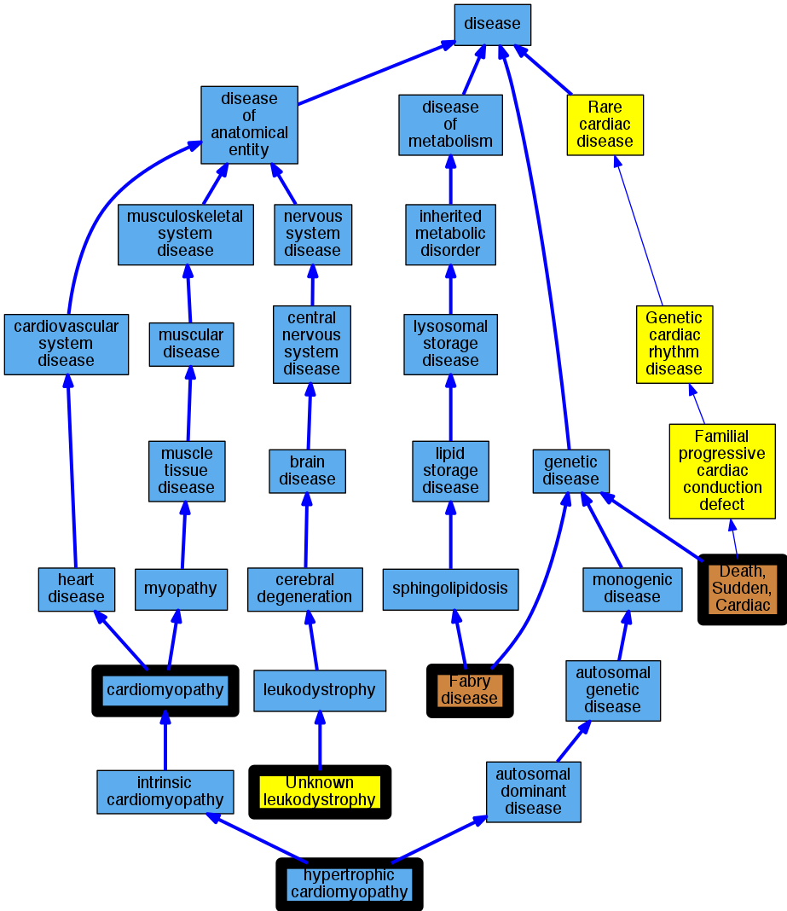

## GENE: GLA

[matched diseases visual](GLA.png)  <-- click on raw to zoom

### Fabry''s disease
 * [OMIM:301500 Fabry disease](http://beta.monarchinitiative.org/disease/OMIM:301500) Confidence: high
    * Equiv:[Orphanet:324 Fabry disease](http://beta.monarchinitiative.org/disease/Orphanet:324)
    * Equiv:[DOID:14499 Fabry disease](http://beta.monarchinitiative.org/disease/DOID:14499)
    * Equiv:[MESH:D000795 Fabry Disease](http://beta.monarchinitiative.org/disease/MESH:D000795)
    * Syn: "alpha Galactosidase A Deficiency"
    * Syn: "alpha Galactosidase A Deficiency Disease"
    * Syn: "alpha galactosidase deficiency"
    * Syn: "Alpha-Galactosidase a Deficiency"
    * Syn: "Alpha-galactosidase A deficiency"
    * Syn: "Alpha-galactosidase A deficiency"
    * Syn: "alpha-Galactosidase A Deficiency"
    * Syn: "alpha-Galactosidase A Deficiency Disease"
    * Syn: "Anderson Fabry Disease"
    * Syn: "Anderson-Fabry Disease"
    * Syn: "Anderson-Fabry disease"
    * Syn: "Angiokeratoma Corporis Diffusum"
    * Syn: "Angiokeratoma Corporis Diffusum"
    * Syn: "Angiokeratoma corporis diffusum"
    * Syn: "Angiokeratoma Diffuse"
    * Syn: "Angiokeratoma, Diffuse"
    * Syn: "Ceramide Trihexosidase Deficiency"
    * Syn: "deficiency of melibiase"
    * Syn: "Deficiency, alpha-Galactosidase A"
    * Syn: "Deficiency, Ceramide Trihexosidase"
    * Syn: "Deficiency, GLA"
    * Syn: "Diffuse Angiokeratoma"
    * Syn: "Diffuse angiokeratoma"
    * Syn: "FABRY DISEASE"
    * Syn: "Fabry Disease, Cardiac Variant"
    * Syn: "Fabry's Disease"
    * Syn: "Fabry's disease"
    * Syn: "Fabry's disease"
    * Syn: "Fabry's disease (disorder)"
    * Syn: "FD"
    * Syn: "GLA Deficiency"
    * Syn: "Gla Deficiency"
    * Syn: "Hereditary Dystopic Lipidosis"
    * Syn: "Lipidosis, Hereditary Dystopic"

### Hypertrophic Cardiomyopathy
 * [DOID:11984 hypertrophic cardiomyopathy](http://beta.monarchinitiative.org/disease/DOID:11984) Confidence: high
    * Equiv:[MESH:D002312 Cardiomyopathy, Hypertrophic](http://beta.monarchinitiative.org/disease/MESH:D002312)
    * Equiv:[Orphanet:217569 Hypertrophic cardiomyopathy](http://beta.monarchinitiative.org/disease/Orphanet:217569)
    * Syn: "Cardiomyopathies, Hypertrophic"
    * Syn: "Cardiomyopathies, Hypertrophic Obstructive"
    * Syn: "Cardiomyopathy, Hypertrophic Obstructive"
    * Syn: "familial hypertrophic cardiomyopathy"
    * Syn: "Hypertrophic Cardiomyopathies"
    * Syn: "Hypertrophic Cardiomyopathy"
    * Syn: "Hypertrophic Obstructive Cardiomyopathies"
    * Syn: "Hypertrophic Obstructive Cardiomyopathy"
    * Syn: "hypertrophic obstructive cardiomyopathy"
    * Syn: "Hypertrophic subaortic stenosis"
    * Syn: "Obstructive Cardiomyopathies, Hypertrophic"
    * Syn: "Obstructive Cardiomyopathy, Hypertrophic"
    * Syn: "Obstructive hypertrophic cardiomyopathy"

### Primary familial hypertrophic cardiomyopathy
 * [DOID:11984 hypertrophic cardiomyopathy](http://beta.monarchinitiative.org/disease/DOID:11984) Confidence: low/0.1953125
    * Equiv:[MESH:D002312 Cardiomyopathy, Hypertrophic](http://beta.monarchinitiative.org/disease/MESH:D002312)
    * Equiv:[Orphanet:217569 Hypertrophic cardiomyopathy](http://beta.monarchinitiative.org/disease/Orphanet:217569)
    * Syn: "Cardiomyopathies, Hypertrophic"
    * Syn: "Cardiomyopathies, Hypertrophic Obstructive"
    * Syn: "Cardiomyopathy, Hypertrophic Obstructive"
    * Syn: "familial hypertrophic cardiomyopathy"
    * Syn: "Hypertrophic Cardiomyopathies"
    * Syn: "Hypertrophic Cardiomyopathy"
    * Syn: "Hypertrophic Obstructive Cardiomyopathies"
    * Syn: "Hypertrophic Obstructive Cardiomyopathy"
    * Syn: "hypertrophic obstructive cardiomyopathy"
    * Syn: "Hypertrophic subaortic stenosis"
    * Syn: "Obstructive Cardiomyopathies, Hypertrophic"
    * Syn: "Obstructive Cardiomyopathy, Hypertrophic"
    * Syn: "Obstructive hypertrophic cardiomyopathy"

### RECLASSIFIED - VARIANT OF UNKNOWN SIGNIFICANCE
 * [Orphanet:84096 Unknown leukodystrophy](http://beta.monarchinitiative.org/disease/Orphanet:84096) Confidence: low/0.0675

### RECLASSIFIED - VARIANT OF UNKNOWN SIGNIFICANCE
 * [Orphanet:84096 Unknown leukodystrophy](http://beta.monarchinitiative.org/disease/Orphanet:84096) Confidence: low/0.0675

### RECLASSIFIED - VARIANT OF UNKNOWN SIGNIFICANCE
 * [Orphanet:84096 Unknown leukodystrophy](http://beta.monarchinitiative.org/disease/Orphanet:84096) Confidence: low/0.0675

### RECLASSIFIED - VARIANT OF UNKNOWN SIGNIFICANCE
 * [Orphanet:84096 Unknown leukodystrophy](http://beta.monarchinitiative.org/disease/Orphanet:84096) Confidence: low/0.0675

### RECLASSIFIED - VARIANT OF UNKNOWN SIGNIFICANCE
 * [Orphanet:84096 Unknown leukodystrophy](http://beta.monarchinitiative.org/disease/Orphanet:84096) Confidence: low/0.0675

### RECLASSIFIED - VARIANT OF UNKNOWN SIGNIFICANCE
 * [Orphanet:84096 Unknown leukodystrophy](http://beta.monarchinitiative.org/disease/Orphanet:84096) Confidence: low/0.0675

### FABRY DISEASE
 * [OMIM:301500 Fabry disease](http://beta.monarchinitiative.org/disease/OMIM:301500) Confidence: high
    * Equiv:[Orphanet:324 Fabry disease](http://beta.monarchinitiative.org/disease/Orphanet:324)
    * Equiv:[DOID:14499 Fabry disease](http://beta.monarchinitiative.org/disease/DOID:14499)
    * Equiv:[MESH:D000795 Fabry Disease](http://beta.monarchinitiative.org/disease/MESH:D000795)
    * Syn: "alpha Galactosidase A Deficiency"
    * Syn: "alpha Galactosidase A Deficiency Disease"
    * Syn: "alpha galactosidase deficiency"
    * Syn: "Alpha-Galactosidase a Deficiency"
    * Syn: "Alpha-galactosidase A deficiency"
    * Syn: "Alpha-galactosidase A deficiency"
    * Syn: "alpha-Galactosidase A Deficiency"
    * Syn: "alpha-Galactosidase A Deficiency Disease"
    * Syn: "Anderson Fabry Disease"
    * Syn: "Anderson-Fabry Disease"
    * Syn: "Anderson-Fabry disease"
    * Syn: "Angiokeratoma Corporis Diffusum"
    * Syn: "Angiokeratoma Corporis Diffusum"
    * Syn: "Angiokeratoma corporis diffusum"
    * Syn: "Angiokeratoma Diffuse"
    * Syn: "Angiokeratoma, Diffuse"
    * Syn: "Ceramide Trihexosidase Deficiency"
    * Syn: "deficiency of melibiase"
    * Syn: "Deficiency, alpha-Galactosidase A"
    * Syn: "Deficiency, Ceramide Trihexosidase"
    * Syn: "Deficiency, GLA"
    * Syn: "Diffuse Angiokeratoma"
    * Syn: "Diffuse angiokeratoma"
    * Syn: "FABRY DISEASE"
    * Syn: "Fabry Disease, Cardiac Variant"
    * Syn: "Fabry's Disease"
    * Syn: "Fabry's disease"
    * Syn: "Fabry's disease"
    * Syn: "Fabry's disease (disorder)"
    * Syn: "FD"
    * Syn: "GLA Deficiency"
    * Syn: "Gla Deficiency"
    * Syn: "Hereditary Dystopic Lipidosis"
    * Syn: "Lipidosis, Hereditary Dystopic"

### FABRY DISEASE, CARDIAC VARIANT
 * [MESH:C567062 Fabry Disease, Cardiac Variant](http://beta.monarchinitiative.org/disease/MESH:C567062) Confidence: high

### Fabry's disease
 * [OMIM:301500 Fabry disease](http://beta.monarchinitiative.org/disease/OMIM:301500) Confidence: high
    * Equiv:[Orphanet:324 Fabry disease](http://beta.monarchinitiative.org/disease/Orphanet:324)
    * Equiv:[DOID:14499 Fabry disease](http://beta.monarchinitiative.org/disease/DOID:14499)
    * Equiv:[MESH:D000795 Fabry Disease](http://beta.monarchinitiative.org/disease/MESH:D000795)
    * Syn: "alpha Galactosidase A Deficiency"
    * Syn: "alpha Galactosidase A Deficiency Disease"
    * Syn: "alpha galactosidase deficiency"
    * Syn: "Alpha-Galactosidase a Deficiency"
    * Syn: "Alpha-galactosidase A deficiency"
    * Syn: "Alpha-galactosidase A deficiency"
    * Syn: "alpha-Galactosidase A Deficiency"
    * Syn: "alpha-Galactosidase A Deficiency Disease"
    * Syn: "Anderson Fabry Disease"
    * Syn: "Anderson-Fabry Disease"
    * Syn: "Anderson-Fabry disease"
    * Syn: "Angiokeratoma Corporis Diffusum"
    * Syn: "Angiokeratoma Corporis Diffusum"
    * Syn: "Angiokeratoma corporis diffusum"
    * Syn: "Angiokeratoma Diffuse"
    * Syn: "Angiokeratoma, Diffuse"
    * Syn: "Ceramide Trihexosidase Deficiency"
    * Syn: "deficiency of melibiase"
    * Syn: "Deficiency, alpha-Galactosidase A"
    * Syn: "Deficiency, Ceramide Trihexosidase"
    * Syn: "Deficiency, GLA"
    * Syn: "Diffuse Angiokeratoma"
    * Syn: "Diffuse angiokeratoma"
    * Syn: "FABRY DISEASE"
    * Syn: "Fabry Disease, Cardiac Variant"
    * Syn: "Fabry's Disease"
    * Syn: "Fabry's disease"
    * Syn: "Fabry's disease"
    * Syn: "Fabry's disease (disorder)"
    * Syn: "FD"
    * Syn: "GLA Deficiency"
    * Syn: "Gla Deficiency"
    * Syn: "Hereditary Dystopic Lipidosis"
    * Syn: "Lipidosis, Hereditary Dystopic"

### Hypertrophic Cardiomyopathy
 * [DOID:11984 hypertrophic cardiomyopathy](http://beta.monarchinitiative.org/disease/DOID:11984) Confidence: high
    * Equiv:[MESH:D002312 Cardiomyopathy, Hypertrophic](http://beta.monarchinitiative.org/disease/MESH:D002312)
    * Equiv:[Orphanet:217569 Hypertrophic cardiomyopathy](http://beta.monarchinitiative.org/disease/Orphanet:217569)
    * Syn: "Cardiomyopathies, Hypertrophic"
    * Syn: "Cardiomyopathies, Hypertrophic Obstructive"
    * Syn: "Cardiomyopathy, Hypertrophic Obstructive"
    * Syn: "familial hypertrophic cardiomyopathy"
    * Syn: "Hypertrophic Cardiomyopathies"
    * Syn: "Hypertrophic Cardiomyopathy"
    * Syn: "Hypertrophic Obstructive Cardiomyopathies"
    * Syn: "Hypertrophic Obstructive Cardiomyopathy"
    * Syn: "hypertrophic obstructive cardiomyopathy"
    * Syn: "Hypertrophic subaortic stenosis"
    * Syn: "Obstructive Cardiomyopathies, Hypertrophic"
    * Syn: "Obstructive Cardiomyopathy, Hypertrophic"
    * Syn: "Obstructive hypertrophic cardiomyopathy"

### RECLASSIFIED - VARIANT OF UNKNOWN SIGNIFICANCE
 * [Orphanet:84096 Unknown leukodystrophy](http://beta.monarchinitiative.org/disease/Orphanet:84096) Confidence: low/0.0675

### RECLASSIFIED - VARIANT OF UNKNOWN SIGNIFICANCE
 * [Orphanet:84096 Unknown leukodystrophy](http://beta.monarchinitiative.org/disease/Orphanet:84096) Confidence: low/0.0675

### RECLASSIFIED - VARIANT OF UNKNOWN SIGNIFICANCE
 * [Orphanet:84096 Unknown leukodystrophy](http://beta.monarchinitiative.org/disease/Orphanet:84096) Confidence: low/0.0675

### Cardiomyopathy
 * [DOID:0050700 cardiomyopathy](http://beta.monarchinitiative.org/disease/DOID:0050700) Confidence: high
    * Equiv:[MESH:D009202 Cardiomyopathies](http://beta.monarchinitiative.org/disease/MESH:D009202)
    * Equiv:[Orphanet:167848 Cardiomyopathy](http://beta.monarchinitiative.org/disease/Orphanet:167848)
    * Syn: "Cardiomyopathies"
    * Syn: "Cardiomyopathies, Primary"
    * Syn: "Cardiomyopathies, Secondary"
    * Syn: "Cardiomyopathy"
    * Syn: "Cardiomyopathy, Primary"
    * Syn: "Cardiomyopathy, Secondary"
    * Syn: "Disease, Myocardial"
    * Syn: "Disease, Primary Myocardial"
    * Syn: "Disease, Secondary Myocardial"
    * Syn: "Diseases, Myocardial"
    * Syn: "Diseases, Primary Myocardial"
    * Syn: "Diseases, Secondary Myocardial"
    * Syn: "Myocardial Disease"
    * Syn: "Myocardial Disease, Primary"
    * Syn: "Myocardial Disease, Secondary"
    * Syn: "Myocardial Diseases"
    * Syn: "Myocardial Diseases, Primary"
    * Syn: "Myocardial Diseases, Secondary"
    * Syn: "Myocardiopathies"
    * Syn: "Myocardiopathy"
    * Syn: "Primary Cardiomyopathies"
    * Syn: "Primary Cardiomyopathy"
    * Syn: "Primary Myocardial Disease"
    * Syn: "Primary Myocardial Diseases"
    * Syn: "Secondary Cardiomyopathies"
    * Syn: "Secondary Cardiomyopathy"
    * Syn: "Secondary Myocardial Disease"
    * Syn: "Secondary Myocardial Diseases"

### Cardiomyopathy
 * [DOID:0050700 cardiomyopathy](http://beta.monarchinitiative.org/disease/DOID:0050700) Confidence: high
    * Equiv:[MESH:D009202 Cardiomyopathies](http://beta.monarchinitiative.org/disease/MESH:D009202)
    * Equiv:[Orphanet:167848 Cardiomyopathy](http://beta.monarchinitiative.org/disease/Orphanet:167848)
    * Syn: "Cardiomyopathies"
    * Syn: "Cardiomyopathies, Primary"
    * Syn: "Cardiomyopathies, Secondary"
    * Syn: "Cardiomyopathy"
    * Syn: "Cardiomyopathy, Primary"
    * Syn: "Cardiomyopathy, Secondary"
    * Syn: "Disease, Myocardial"
    * Syn: "Disease, Primary Myocardial"
    * Syn: "Disease, Secondary Myocardial"
    * Syn: "Diseases, Myocardial"
    * Syn: "Diseases, Primary Myocardial"
    * Syn: "Diseases, Secondary Myocardial"
    * Syn: "Myocardial Disease"
    * Syn: "Myocardial Disease, Primary"
    * Syn: "Myocardial Disease, Secondary"
    * Syn: "Myocardial Diseases"
    * Syn: "Myocardial Diseases, Primary"
    * Syn: "Myocardial Diseases, Secondary"
    * Syn: "Myocardiopathies"
    * Syn: "Myocardiopathy"
    * Syn: "Primary Cardiomyopathies"
    * Syn: "Primary Cardiomyopathy"
    * Syn: "Primary Myocardial Disease"
    * Syn: "Primary Myocardial Diseases"
    * Syn: "Secondary Cardiomyopathies"
    * Syn: "Secondary Cardiomyopathy"
    * Syn: "Secondary Myocardial Disease"
    * Syn: "Secondary Myocardial Diseases"

### Fabry disease
 * [OMIM:301500 Fabry disease](http://beta.monarchinitiative.org/disease/OMIM:301500) Confidence: high
    * Equiv:[Orphanet:324 Fabry disease](http://beta.monarchinitiative.org/disease/Orphanet:324)
    * Equiv:[DOID:14499 Fabry disease](http://beta.monarchinitiative.org/disease/DOID:14499)
    * Equiv:[MESH:D000795 Fabry Disease](http://beta.monarchinitiative.org/disease/MESH:D000795)
    * Syn: "alpha Galactosidase A Deficiency"
    * Syn: "alpha Galactosidase A Deficiency Disease"
    * Syn: "alpha galactosidase deficiency"
    * Syn: "Alpha-Galactosidase a Deficiency"
    * Syn: "Alpha-galactosidase A deficiency"
    * Syn: "Alpha-galactosidase A deficiency"
    * Syn: "alpha-Galactosidase A Deficiency"
    * Syn: "alpha-Galactosidase A Deficiency Disease"
    * Syn: "Anderson Fabry Disease"
    * Syn: "Anderson-Fabry Disease"
    * Syn: "Anderson-Fabry disease"
    * Syn: "Angiokeratoma Corporis Diffusum"
    * Syn: "Angiokeratoma Corporis Diffusum"
    * Syn: "Angiokeratoma corporis diffusum"
    * Syn: "Angiokeratoma Diffuse"
    * Syn: "Angiokeratoma, Diffuse"
    * Syn: "Ceramide Trihexosidase Deficiency"
    * Syn: "deficiency of melibiase"
    * Syn: "Deficiency, alpha-Galactosidase A"
    * Syn: "Deficiency, Ceramide Trihexosidase"
    * Syn: "Deficiency, GLA"
    * Syn: "Diffuse Angiokeratoma"
    * Syn: "Diffuse angiokeratoma"
    * Syn: "FABRY DISEASE"
    * Syn: "Fabry Disease, Cardiac Variant"
    * Syn: "Fabry's Disease"
    * Syn: "Fabry's disease"
    * Syn: "Fabry's disease"
    * Syn: "Fabry's disease (disorder)"
    * Syn: "FD"
    * Syn: "GLA Deficiency"
    * Syn: "Gla Deficiency"
    * Syn: "Hereditary Dystopic Lipidosis"
    * Syn: "Lipidosis, Hereditary Dystopic"

### Primary familial hypertrophic cardiomyopathy
 * [DOID:11984 hypertrophic cardiomyopathy](http://beta.monarchinitiative.org/disease/DOID:11984) Confidence: low/0.1953125
    * Equiv:[MESH:D002312 Cardiomyopathy, Hypertrophic](http://beta.monarchinitiative.org/disease/MESH:D002312)
    * Equiv:[Orphanet:217569 Hypertrophic cardiomyopathy](http://beta.monarchinitiative.org/disease/Orphanet:217569)
    * Syn: "Cardiomyopathies, Hypertrophic"
    * Syn: "Cardiomyopathies, Hypertrophic Obstructive"
    * Syn: "Cardiomyopathy, Hypertrophic Obstructive"
    * Syn: "familial hypertrophic cardiomyopathy"
    * Syn: "Hypertrophic Cardiomyopathies"
    * Syn: "Hypertrophic Cardiomyopathy"
    * Syn: "Hypertrophic Obstructive Cardiomyopathies"
    * Syn: "Hypertrophic Obstructive Cardiomyopathy"
    * Syn: "hypertrophic obstructive cardiomyopathy"
    * Syn: "Hypertrophic subaortic stenosis"
    * Syn: "Obstructive Cardiomyopathies, Hypertrophic"
    * Syn: "Obstructive Cardiomyopathy, Hypertrophic"
    * Syn: "Obstructive hypertrophic cardiomyopathy"

### Primary familial hypertrophic cardiomyopathy
 * [DOID:11984 hypertrophic cardiomyopathy](http://beta.monarchinitiative.org/disease/DOID:11984) Confidence: low/0.1953125
    * Equiv:[MESH:D002312 Cardiomyopathy, Hypertrophic](http://beta.monarchinitiative.org/disease/MESH:D002312)
    * Equiv:[Orphanet:217569 Hypertrophic cardiomyopathy](http://beta.monarchinitiative.org/disease/Orphanet:217569)
    * Syn: "Cardiomyopathies, Hypertrophic"
    * Syn: "Cardiomyopathies, Hypertrophic Obstructive"
    * Syn: "Cardiomyopathy, Hypertrophic Obstructive"
    * Syn: "familial hypertrophic cardiomyopathy"
    * Syn: "Hypertrophic Cardiomyopathies"
    * Syn: "Hypertrophic Cardiomyopathy"
    * Syn: "Hypertrophic Obstructive Cardiomyopathies"
    * Syn: "Hypertrophic Obstructive Cardiomyopathy"
    * Syn: "hypertrophic obstructive cardiomyopathy"
    * Syn: "Hypertrophic subaortic stenosis"
    * Syn: "Obstructive Cardiomyopathies, Hypertrophic"
    * Syn: "Obstructive Cardiomyopathy, Hypertrophic"
    * Syn: "Obstructive hypertrophic cardiomyopathy"

### RECLASSIFIED - VARIANT OF UNKNOWN SIGNIFICANCE
 * [Orphanet:84096 Unknown leukodystrophy](http://beta.monarchinitiative.org/disease/Orphanet:84096) Confidence: low/0.0675

### RECLASSIFIED - VARIANT OF UNKNOWN SIGNIFICANCE
 * [Orphanet:84096 Unknown leukodystrophy](http://beta.monarchinitiative.org/disease/Orphanet:84096) Confidence: low/0.0675

### Sudden unexplained death
 * [MESH:D016757 Death, Sudden, Cardiac](http://beta.monarchinitiative.org/disease/MESH:D016757) Confidence: low/0.1388888888888889
    * Syn: "Arrest, Sudden Cardiac"
    * Syn: "Cardiac Arrest, Sudden"
    * Syn: "Cardiac Arrests, Sudden"
    * Syn: "Cardiac Death, Sudden"
    * Syn: "Cardiac Sudden Death"
    * Syn: "Death, Cardiac Sudden"
    * Syn: "Death, Sudden Cardiac"
    * Syn: "Sudden Cardiac Arrest"
    * Syn: "Sudden Cardiac Death"
    * Syn: "Sudden Death, Cardiac"
