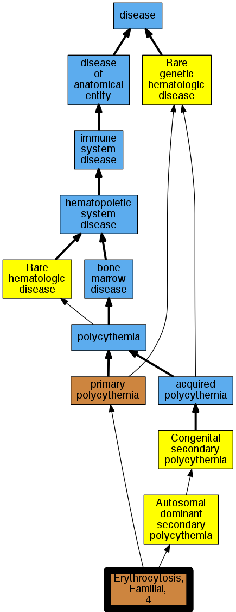

## GENE: HIF2A/EPAS1

[matched diseases visual](HIF2A-EPAS1.png)  <-- click on raw to zoom

### ERYTHROCYTOSIS, FAMILIAL, 4
 * [OMIM:611783 Erythrocytosis, Familial, 4](http://beta.monarchinitiative.org/disease/OMIM:611783) Confidence: high
    * Equiv:[MESH:C567086 Erythrocytosis, Familial, 4](http://beta.monarchinitiative.org/disease/MESH:C567086)
    * Syn: "ECYT4"
    * Syn: "ERYTHROCYTOSIS, FAMILIAL, 4; ECYT4"
