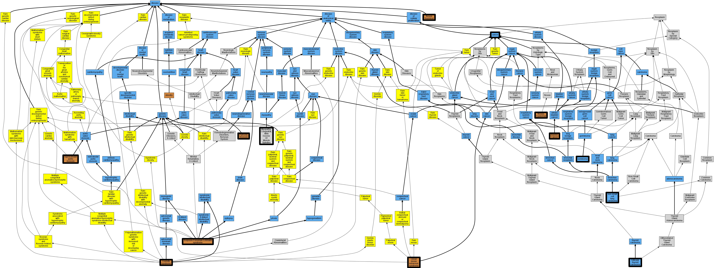

## GENE: HRAS

[matched diseases visual](HRAS.png)  <-- click on raw to zoom

### BLADDER CANCER, SOMATIC
 * [OMIM:109800 Bladder Cancer](http://beta.monarchinitiative.org/disease/OMIM:109800) Confidence: low/0.18055555555555555
    * Syn: "BLADDER CANCER"

### COSTELLO SYNDROME
 * [OMIM:218040 Costello syndrome](http://beta.monarchinitiative.org/disease/OMIM:218040) Confidence: high
    * Equiv:[Orphanet:3071 Costello syndrome](http://beta.monarchinitiative.org/disease/Orphanet:3071)
    * Equiv:[DOID:0050469 Costello syndrome](http://beta.monarchinitiative.org/disease/DOID:0050469)
    * Equiv:[MESH:D056685 Costello Syndrome](http://beta.monarchinitiative.org/disease/MESH:D056685)
    * Syn: "COSTELLO SYNDROME; CSTLO"
    * Syn: "CSTLO"
    * Syn: "Faciocutaneoskeletal Syndrome"
    * Syn: "Faciocutaneoskeletal Syndrome"
    * Syn: "Faciocutaneoskeletal syndrome"
    * Syn: "Faciocutaneoskeletal Syndromes"
    * Syn: "FCS SYNDROME"
    * Syn: "FCS Syndrome"
    * Syn: "FCS syndrome"
    * Syn: "Fcs Syndrome"
    * Syn: "FCS Syndromes"
    * Syn: "Myopathy, Congenital, With Excess of Muscle Spindles"
    * Syn: "Syndrome, Costello"
    * Syn: "Syndrome, Faciocutaneoskeletal"
    * Syn: "Syndrome, FCS"
    * Syn: "Syndromes, Faciocutaneoskeletal"
    * Syn: "Syndromes, FCS"

### COSTELLO SYNDROME, SEVERE
 * [OMIM:301900 Borjeson-Forssman-Lehmann syndrome](http://beta.monarchinitiative.org/disease/OMIM:301900) Confidence: low/0.0763888888888889
    * Equiv:[Orphanet:127 Borjeson-Forssman-Lehmann syndrome](http://beta.monarchinitiative.org/disease/Orphanet:127)
    * Equiv:[DOID:0050681 Borjeson-Forssman-Lehmann syndrome](http://beta.monarchinitiative.org/disease/DOID:0050681)
    * Equiv:[MESH:C536575 Borjeson-Forssman-Lehmann syndrome](http://beta.monarchinitiative.org/disease/MESH:C536575)
    * Syn: "BFLS"
    * Syn: "BFLS"
    * Syn: "BORJESON SYNDROME"
    * Syn: "Borjeson Syndrome"
    * Syn: "BORJESON-FORSSMAN-LEHMANN SYNDROME; BFLS"
    * Syn: "Intellectual deficiency - epilepsy - endocrine disorders"
    * Syn: "Mental deficiency, epilepsy and endocrine disorders"
    * Syn: "Mental Deficiency, Epilepsy, And Endocrine Disorders"
    * Syn: "Mental Retardation, Epilepsy, and Endocrine Disorders"
    * Syn: "Mental Retardation, X-Linked, Syndromic, Borjeson-Forssman-Lehmann Type"

### EPIDERMAL NEVUS, SOMATIC
 * [OMIM:162900 Woolly hair nevus](http://beta.monarchinitiative.org/disease/OMIM:162900) Confidence: low/0.09027777777777778
    * Equiv:[Orphanet:79414 Woolly hair nevus](http://beta.monarchinitiative.org/disease/Orphanet:79414)
    * Equiv:[MESH:C580062 Epidermal Nevus](http://beta.monarchinitiative.org/disease/MESH:C580062)
    * Syn: "Epidermal Naevus"
    * Syn: "Nevus Sebaceous"
    * Syn: "NEVUS, EPIDERMAL"
    * Syn: "Nevus, Epidermal"
    * Syn: "Nevus, Keratinocytic, Nonepidermolytic"
    * Syn: "Nevus, Woolly Hair"
    * Syn: "Wooly hair nevus"

### Rasopathy

### SCHIMMELPENNING-FEUERSTEIN-MIMS SYNDROME, SOMATIC MOSAIC
 * [OMIM:163200 Linear nevus sebaceus syndrome](http://beta.monarchinitiative.org/disease/OMIM:163200) Confidence: low/0.07777777777777778
    * Equiv:[Orphanet:2612 Linear nevus sebaceus syndrome](http://beta.monarchinitiative.org/disease/Orphanet:2612)
    * Syn: "Epidermal Nevus Syndrome, Formerly"
    * Syn: "Jadassohn Nevus Phakomatosis"
    * Syn: "Linear Sebaceous Nevus Syndrome"
    * Syn: "Nevus Sebaceus of Jadassohn"
    * Syn: "Nevus sebaceus of Jadassohn"
    * Syn: "Nevus sebaceus syndrome"
    * Syn: "Organoid Nevus Phakomatosis"
    * Syn: "Organoid nevus syndrome"
    * Syn: "Schimmelpenning syndrome"
    * Syn: "SCHIMMELPENNING-FEUERSTEIN-MIMS SYNDROME; SFM"
    * Syn: "Sebaceous Nevus Syndrome, Linear"
    * Syn: "SFM"
    * Syn: "Sfm Syndrome"
    * Syn: "Solomon syndrome"

### THYROID CARCINOMA, FOLLICULAR, SOMATIC
 * [DOID:3962 follicular thyroid carcinoma](http://beta.monarchinitiative.org/disease/DOID:3962) Confidence: low/0.1953125
    * Equiv:[MESH:D018263 Adenocarcinoma, Follicular](http://beta.monarchinitiative.org/disease/MESH:D018263)
    * Syn: "Adenocarcinomas, Follicular"
    * Syn: "Carcinoma, Follicular Thyroid"
    * Syn: "Carcinomas, Follicular Thyroid"
    * Syn: "Follicular Adenocarcinoma"
    * Syn: "Follicular adenocarcinoma (morphologic abnormality)"
    * Syn: "Follicular adenocarcinoma, well differentiated (morphologic abnormality)"
    * Syn: "Follicular Adenocarcinomas"
    * Syn: "Follicular carcinoma"
    * Syn: "Follicular carcinoma of the Thyroid gland"
    * Syn: "Follicular Thyroid Carcinoma"
    * Syn: "Follicular thyroid carcinoma (disorder)"
    * Syn: "Follicular Thyroid Carcinomas"
    * Syn: "Thyroid adenocarcinoma"
    * Syn: "Thyroid Carcinoma, Follicular"
    * Syn: "Thyroid Carcinomas, Follicular"

### MYOPATHY, CONGENITAL, WITH EXCESS OF MUSCLE SPINDLES
 * [MESH:C566896 Myopathy, Congenital, With Excess Of Muscle Spindles](http://beta.monarchinitiative.org/disease/MESH:C566896) Confidence: high

### NEVUS SPILUS, SOMATIC
 * [OMIM:163050 Nevus Anemicus](http://beta.monarchinitiative.org/disease/OMIM:163050) Confidence: low/0.03819444444444445
    * Syn: "NEVUS ANEMICUS"

### Pulmonic stenosis
 * [OMIM:265500 Pulmonic Stenosis](http://beta.monarchinitiative.org/disease/OMIM:265500) Confidence: high
    * Syn: "PULMONIC STENOSIS"

### SPITZ NEVUS, SOMATIC
 * [OMIM:163050 Nevus Anemicus](http://beta.monarchinitiative.org/disease/OMIM:163050) Confidence: low/0.03819444444444445
    * Syn: "NEVUS ANEMICUS"

### Costello Syndrome
 * [OMIM:218040 Costello syndrome](http://beta.monarchinitiative.org/disease/OMIM:218040) Confidence: high
    * Equiv:[Orphanet:3071 Costello syndrome](http://beta.monarchinitiative.org/disease/Orphanet:3071)
    * Equiv:[DOID:0050469 Costello syndrome](http://beta.monarchinitiative.org/disease/DOID:0050469)
    * Equiv:[MESH:D056685 Costello Syndrome](http://beta.monarchinitiative.org/disease/MESH:D056685)
    * Syn: "COSTELLO SYNDROME; CSTLO"
    * Syn: "CSTLO"
    * Syn: "Faciocutaneoskeletal Syndrome"
    * Syn: "Faciocutaneoskeletal Syndrome"
    * Syn: "Faciocutaneoskeletal syndrome"
    * Syn: "Faciocutaneoskeletal Syndromes"
    * Syn: "FCS SYNDROME"
    * Syn: "FCS Syndrome"
    * Syn: "FCS syndrome"
    * Syn: "Fcs Syndrome"
    * Syn: "FCS Syndromes"
    * Syn: "Myopathy, Congenital, With Excess of Muscle Spindles"
    * Syn: "Syndrome, Costello"
    * Syn: "Syndrome, Faciocutaneoskeletal"
    * Syn: "Syndrome, FCS"
    * Syn: "Syndromes, Faciocutaneoskeletal"
    * Syn: "Syndromes, FCS"

### Costello syndrome
 * [OMIM:218040 Costello syndrome](http://beta.monarchinitiative.org/disease/OMIM:218040) Confidence: high
    * Equiv:[Orphanet:3071 Costello syndrome](http://beta.monarchinitiative.org/disease/Orphanet:3071)
    * Equiv:[DOID:0050469 Costello syndrome](http://beta.monarchinitiative.org/disease/DOID:0050469)
    * Equiv:[MESH:D056685 Costello Syndrome](http://beta.monarchinitiative.org/disease/MESH:D056685)
    * Syn: "COSTELLO SYNDROME; CSTLO"
    * Syn: "CSTLO"
    * Syn: "Faciocutaneoskeletal Syndrome"
    * Syn: "Faciocutaneoskeletal Syndrome"
    * Syn: "Faciocutaneoskeletal syndrome"
    * Syn: "Faciocutaneoskeletal Syndromes"
    * Syn: "FCS SYNDROME"
    * Syn: "FCS Syndrome"
    * Syn: "FCS syndrome"
    * Syn: "Fcs Syndrome"
    * Syn: "FCS Syndromes"
    * Syn: "Myopathy, Congenital, With Excess of Muscle Spindles"
    * Syn: "Syndrome, Costello"
    * Syn: "Syndrome, Faciocutaneoskeletal"
    * Syn: "Syndrome, FCS"
    * Syn: "Syndromes, Faciocutaneoskeletal"
    * Syn: "Syndromes, FCS"

### EPIDERMAL NEVUS WITH UROTHELIAL CANCER, SOMATIC
 * [DOID:162 cancer](http://beta.monarchinitiative.org/disease/DOID:162) Confidence: low/0.1284722222222222
    * Equiv:[MESH:D009369 Neoplasms](http://beta.monarchinitiative.org/disease/MESH:D009369)
    * Syn: "Benign Neoplasm"
    * Syn: "Benign Neoplasms"
    * Syn: "Cancer"
    * Syn: "Cancers"
    * Syn: "malignant neoplasm"
    * Syn: "malignant tumor "
    * Syn: "Neoplasia"
    * Syn: "Neoplasm"
    * Syn: "Neoplasm, Benign"
    * Syn: "Neoplasms, Benign"
    * Syn: "primary cancer"
    * Syn: "Tumor"
    * Syn: "Tumors"

### NEVUS SEBACEOUS, SOMATIC
 * [OMIM:163050 Nevus Anemicus](http://beta.monarchinitiative.org/disease/OMIM:163050) Confidence: low/0.03819444444444445
    * Syn: "NEVUS ANEMICUS"

### SPERMATOCYTIC SEMINOMA, SOMATIC
 * [DOID:4440 seminoma](http://beta.monarchinitiative.org/disease/DOID:4440) Confidence: low/0.1388888888888889
    * Equiv:[MESH:D018239 Seminoma](http://beta.monarchinitiative.org/disease/MESH:D018239)
    * Syn: "Seminoma, Pure"
    * Syn: "Seminomas"

### Supravalvar aortic stenosis
 * [OMIM:185500 supravalvular aortic stenosis](http://beta.monarchinitiative.org/disease/OMIM:185500) Confidence: high
    * Equiv:[Orphanet:3193 Supravalvular aortic stenosis](http://beta.monarchinitiative.org/disease/Orphanet:3193)
    * Equiv:[MESH:D021921 Aortic Stenosis, Supravalvular](http://beta.monarchinitiative.org/disease/MESH:D021921)
    * Syn: "Aortic Supravalvular Stenoses"
    * Syn: "Aortic Supravalvular Stenosis"
    * Syn: "Stenoses, Aortic Supravalvular"
    * Syn: "Stenosis, Aortic Supravalvular"
    * Syn: "Stenosis, Supravalvular Aortic"
    * Syn: "Supra-valvular aortic stenosis"
    * Syn: "Supra-valvular aortic stenosis"
    * Syn: "Supravalvar Aortic Stenosis"
    * Syn: "Supravalvar aortic stenosis"
    * Syn: "Supravalvar aortic stenosis (disorder)"
    * Syn: "Supravalvar Aortic Stenosis, Eisenberg Type"
    * Syn: "Supravalvular Aortic Stenosis"
    * Syn: "SUPRAVALVULAR AORTIC STENOSIS; SVAS"
    * Syn: "Supravalvular Stenoses, Aortic"
    * Syn: "Supravalvular Stenosis, Aortic"
    * Syn: "SVAS"
    * Syn: "SVAS"

### NEVUS, WOOLLY HAIR
 * [OMIM:162900 Woolly hair nevus](http://beta.monarchinitiative.org/disease/OMIM:162900) Confidence: high
    * Equiv:[Orphanet:79414 Woolly hair nevus](http://beta.monarchinitiative.org/disease/Orphanet:79414)
    * Equiv:[MESH:C580062 Epidermal Nevus](http://beta.monarchinitiative.org/disease/MESH:C580062)
    * Syn: "Epidermal Naevus"
    * Syn: "Nevus Sebaceous"
    * Syn: "NEVUS, EPIDERMAL"
    * Syn: "Nevus, Epidermal"
    * Syn: "Nevus, Keratinocytic, Nonepidermolytic"
    * Syn: "Nevus, Woolly Hair"
    * Syn: "Wooly hair nevus"

### Non-Small Cell Lung Cancer
 * [DOID:3908 non-small cell lung carcinoma](http://beta.monarchinitiative.org/disease/DOID:3908) Confidence: high
    * Equiv:[MESH:D002289 Carcinoma, Non-Small-Cell Lung](http://beta.monarchinitiative.org/disease/MESH:D002289)
    * Syn: "Carcinoma, Non Small Cell Lung"
    * Syn: "Carcinoma, Non-Small Cell Lung"
    * Syn: "Carcinomas, Non-Small-Cell Lung"
    * Syn: "Lung Carcinoma, Non-Small-Cell"
    * Syn: "Lung Carcinomas, Non-Small-Cell"
    * Syn: "Non Small Cell Lung Carcinoma"
    * Syn: "Non-Small Cell Lung Cancer"
    * Syn: "Non-small cell lung cancer (disorder)"
    * Syn: "Non-Small-Cell Lung Carcinoma"
    * Syn: "Non-Small-Cell Lung Carcinomas"
    * Syn: "Nonsmall Cell Lung Cancer"
    * Syn: "NSCLC"
    * Syn: "NSCLC"

### Non-Small Cell Lung Cancer
 * [DOID:3908 non-small cell lung carcinoma](http://beta.monarchinitiative.org/disease/DOID:3908) Confidence: high
    * Equiv:[MESH:D002289 Carcinoma, Non-Small-Cell Lung](http://beta.monarchinitiative.org/disease/MESH:D002289)
    * Syn: "Carcinoma, Non Small Cell Lung"
    * Syn: "Carcinoma, Non-Small Cell Lung"
    * Syn: "Carcinomas, Non-Small-Cell Lung"
    * Syn: "Lung Carcinoma, Non-Small-Cell"
    * Syn: "Lung Carcinomas, Non-Small-Cell"
    * Syn: "Non Small Cell Lung Carcinoma"
    * Syn: "Non-Small Cell Lung Cancer"
    * Syn: "Non-small cell lung cancer (disorder)"
    * Syn: "Non-Small-Cell Lung Carcinoma"
    * Syn: "Non-Small-Cell Lung Carcinomas"
    * Syn: "Nonsmall Cell Lung Cancer"
    * Syn: "NSCLC"
    * Syn: "NSCLC"

### Pulmonic stenosis
 * [OMIM:265500 Pulmonic Stenosis](http://beta.monarchinitiative.org/disease/OMIM:265500) Confidence: high
    * Syn: "PULMONIC STENOSIS"

### Supravalvar aortic stenosis
 * [OMIM:185500 supravalvular aortic stenosis](http://beta.monarchinitiative.org/disease/OMIM:185500) Confidence: high
    * Equiv:[Orphanet:3193 Supravalvular aortic stenosis](http://beta.monarchinitiative.org/disease/Orphanet:3193)
    * Equiv:[MESH:D021921 Aortic Stenosis, Supravalvular](http://beta.monarchinitiative.org/disease/MESH:D021921)
    * Syn: "Aortic Supravalvular Stenoses"
    * Syn: "Aortic Supravalvular Stenosis"
    * Syn: "Stenoses, Aortic Supravalvular"
    * Syn: "Stenosis, Aortic Supravalvular"
    * Syn: "Stenosis, Supravalvular Aortic"
    * Syn: "Supra-valvular aortic stenosis"
    * Syn: "Supra-valvular aortic stenosis"
    * Syn: "Supravalvar Aortic Stenosis"
    * Syn: "Supravalvar aortic stenosis"
    * Syn: "Supravalvar aortic stenosis (disorder)"
    * Syn: "Supravalvar Aortic Stenosis, Eisenberg Type"
    * Syn: "Supravalvular Aortic Stenosis"
    * Syn: "SUPRAVALVULAR AORTIC STENOSIS; SVAS"
    * Syn: "Supravalvular Stenoses, Aortic"
    * Syn: "Supravalvular Stenosis, Aortic"
    * Syn: "SVAS"
    * Syn: "SVAS"
