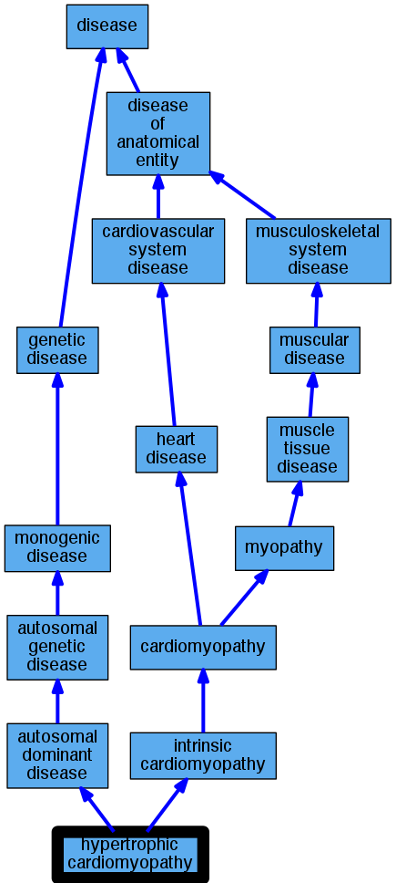

## GENE: ILK

[matched diseases visual](ILK.png)  <-- click on raw to zoom

### Cardiomyopathy
 * [DOID:0050700 cardiomyopathy](http://beta.monarchinitiative.org/disease/DOID:0050700) Confidence: high
    * Equiv:[MESH:D009202 Cardiomyopathies](http://beta.monarchinitiative.org/disease/MESH:D009202)
    * Equiv:[Orphanet:167848 Cardiomyopathy](http://beta.monarchinitiative.org/disease/Orphanet:167848)
    * Syn: "Cardiomyopathies"
    * Syn: "Cardiomyopathies, Primary"
    * Syn: "Cardiomyopathies, Secondary"
    * Syn: "Cardiomyopathy"
    * Syn: "Cardiomyopathy, Primary"
    * Syn: "Cardiomyopathy, Secondary"
    * Syn: "Disease, Myocardial"
    * Syn: "Disease, Primary Myocardial"
    * Syn: "Disease, Secondary Myocardial"
    * Syn: "Diseases, Myocardial"
    * Syn: "Diseases, Primary Myocardial"
    * Syn: "Diseases, Secondary Myocardial"
    * Syn: "Myocardial Disease"
    * Syn: "Myocardial Disease, Primary"
    * Syn: "Myocardial Disease, Secondary"
    * Syn: "Myocardial Diseases"
    * Syn: "Myocardial Diseases, Primary"
    * Syn: "Myocardial Diseases, Secondary"
    * Syn: "Myocardiopathies"
    * Syn: "Myocardiopathy"
    * Syn: "Primary Cardiomyopathies"
    * Syn: "Primary Cardiomyopathy"
    * Syn: "Primary Myocardial Disease"
    * Syn: "Primary Myocardial Diseases"
    * Syn: "Secondary Cardiomyopathies"
    * Syn: "Secondary Cardiomyopathy"
    * Syn: "Secondary Myocardial Disease"
    * Syn: "Secondary Myocardial Diseases"

### Primary familial hypertrophic cardiomyopathy
 * [DOID:11984 hypertrophic cardiomyopathy](http://beta.monarchinitiative.org/disease/DOID:11984) Confidence: low/0.1953125
    * Equiv:[MESH:D002312 Cardiomyopathy, Hypertrophic](http://beta.monarchinitiative.org/disease/MESH:D002312)
    * Equiv:[Orphanet:217569 Hypertrophic cardiomyopathy](http://beta.monarchinitiative.org/disease/Orphanet:217569)
    * Syn: "Cardiomyopathies, Hypertrophic"
    * Syn: "Cardiomyopathies, Hypertrophic Obstructive"
    * Syn: "Cardiomyopathy, Hypertrophic Obstructive"
    * Syn: "familial hypertrophic cardiomyopathy"
    * Syn: "Hypertrophic Cardiomyopathies"
    * Syn: "Hypertrophic Cardiomyopathy"
    * Syn: "Hypertrophic Obstructive Cardiomyopathies"
    * Syn: "Hypertrophic Obstructive Cardiomyopathy"
    * Syn: "hypertrophic obstructive cardiomyopathy"
    * Syn: "Hypertrophic subaortic stenosis"
    * Syn: "Obstructive Cardiomyopathies, Hypertrophic"
    * Syn: "Obstructive Cardiomyopathy, Hypertrophic"
    * Syn: "Obstructive hypertrophic cardiomyopathy"

### Primary familial hypertrophic cardiomyopathy
 * [DOID:11984 hypertrophic cardiomyopathy](http://beta.monarchinitiative.org/disease/DOID:11984) Confidence: low/0.1953125
    * Equiv:[MESH:D002312 Cardiomyopathy, Hypertrophic](http://beta.monarchinitiative.org/disease/MESH:D002312)
    * Equiv:[Orphanet:217569 Hypertrophic cardiomyopathy](http://beta.monarchinitiative.org/disease/Orphanet:217569)
    * Syn: "Cardiomyopathies, Hypertrophic"
    * Syn: "Cardiomyopathies, Hypertrophic Obstructive"
    * Syn: "Cardiomyopathy, Hypertrophic Obstructive"
    * Syn: "familial hypertrophic cardiomyopathy"
    * Syn: "Hypertrophic Cardiomyopathies"
    * Syn: "Hypertrophic Cardiomyopathy"
    * Syn: "Hypertrophic Obstructive Cardiomyopathies"
    * Syn: "Hypertrophic Obstructive Cardiomyopathy"
    * Syn: "hypertrophic obstructive cardiomyopathy"
    * Syn: "Hypertrophic subaortic stenosis"
    * Syn: "Obstructive Cardiomyopathies, Hypertrophic"
    * Syn: "Obstructive Cardiomyopathy, Hypertrophic"
    * Syn: "Obstructive hypertrophic cardiomyopathy"

### Cardiomyopathy
 * [DOID:0050700 cardiomyopathy](http://beta.monarchinitiative.org/disease/DOID:0050700) Confidence: high
    * Equiv:[MESH:D009202 Cardiomyopathies](http://beta.monarchinitiative.org/disease/MESH:D009202)
    * Equiv:[Orphanet:167848 Cardiomyopathy](http://beta.monarchinitiative.org/disease/Orphanet:167848)
    * Syn: "Cardiomyopathies"
    * Syn: "Cardiomyopathies, Primary"
    * Syn: "Cardiomyopathies, Secondary"
    * Syn: "Cardiomyopathy"
    * Syn: "Cardiomyopathy, Primary"
    * Syn: "Cardiomyopathy, Secondary"
    * Syn: "Disease, Myocardial"
    * Syn: "Disease, Primary Myocardial"
    * Syn: "Disease, Secondary Myocardial"
    * Syn: "Diseases, Myocardial"
    * Syn: "Diseases, Primary Myocardial"
    * Syn: "Diseases, Secondary Myocardial"
    * Syn: "Myocardial Disease"
    * Syn: "Myocardial Disease, Primary"
    * Syn: "Myocardial Disease, Secondary"
    * Syn: "Myocardial Diseases"
    * Syn: "Myocardial Diseases, Primary"
    * Syn: "Myocardial Diseases, Secondary"
    * Syn: "Myocardiopathies"
    * Syn: "Myocardiopathy"
    * Syn: "Primary Cardiomyopathies"
    * Syn: "Primary Cardiomyopathy"
    * Syn: "Primary Myocardial Disease"
    * Syn: "Primary Myocardial Diseases"
    * Syn: "Secondary Cardiomyopathies"
    * Syn: "Secondary Cardiomyopathy"
    * Syn: "Secondary Myocardial Disease"
    * Syn: "Secondary Myocardial Diseases"

### Primary familial hypertrophic cardiomyopathy
 * [DOID:11984 hypertrophic cardiomyopathy](http://beta.monarchinitiative.org/disease/DOID:11984) Confidence: low/0.1953125
    * Equiv:[MESH:D002312 Cardiomyopathy, Hypertrophic](http://beta.monarchinitiative.org/disease/MESH:D002312)
    * Equiv:[Orphanet:217569 Hypertrophic cardiomyopathy](http://beta.monarchinitiative.org/disease/Orphanet:217569)
    * Syn: "Cardiomyopathies, Hypertrophic"
    * Syn: "Cardiomyopathies, Hypertrophic Obstructive"
    * Syn: "Cardiomyopathy, Hypertrophic Obstructive"
    * Syn: "familial hypertrophic cardiomyopathy"
    * Syn: "Hypertrophic Cardiomyopathies"
    * Syn: "Hypertrophic Cardiomyopathy"
    * Syn: "Hypertrophic Obstructive Cardiomyopathies"
    * Syn: "Hypertrophic Obstructive Cardiomyopathy"
    * Syn: "hypertrophic obstructive cardiomyopathy"
    * Syn: "Hypertrophic subaortic stenosis"
    * Syn: "Obstructive Cardiomyopathies, Hypertrophic"
    * Syn: "Obstructive Cardiomyopathy, Hypertrophic"
    * Syn: "Obstructive hypertrophic cardiomyopathy"
