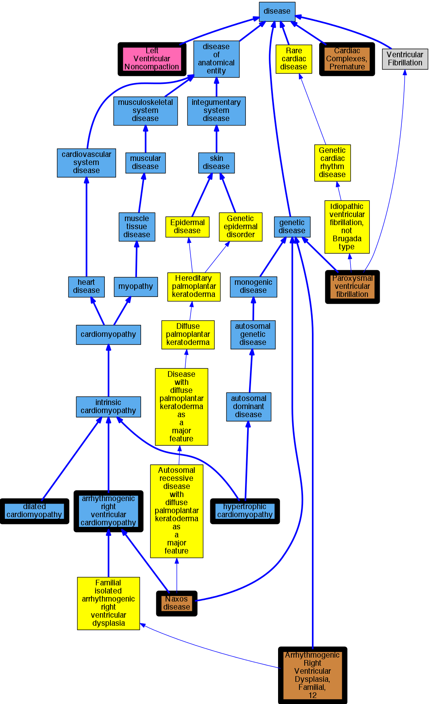

## GENE: JUP

[matched diseases visual](JUP.png)  <-- click on raw to zoom

### ARRHYTHMOGENIC RIGHT VENTRICULAR DYSPLASIA, FAMILIAL, 12
 * [OMIM:611528 Arrhythmogenic Right Ventricular Dysplasia, Familial, 12](http://beta.monarchinitiative.org/disease/OMIM:611528) Confidence: high
    * Equiv:[MESH:C566925 Arrhythmogenic Right Ventricular Dysplasia, Familial, 12](http://beta.monarchinitiative.org/disease/MESH:C566925)
    * Syn: "Arrhythmogenic Right Ventricular Cardiomyopathy 12"
    * Syn: "ARRHYTHMOGENIC RIGHT VENTRICULAR DYSPLASIA, FAMILIAL, 12; ARVD12"
    * Syn: "ARVD12"

### Arrhythmia
 * [OMIM:115000 Cardiac Complexes, Premature](http://beta.monarchinitiative.org/disease/OMIM:115000) Confidence: low/0.09375
    * Equiv:[MESH:D001145 Arrhythmias, Cardiac](http://beta.monarchinitiative.org/disease/MESH:D001145)
    * Equiv:[MESH:D005117 Cardiac Complexes, Premature](http://beta.monarchinitiative.org/disease/MESH:D005117)
    * Syn: "CARDIAC ARRHYTHMIA"
    * Syn: "Extrasystoles"

### Arrhythmogenic right ventricular cardiomyopathy
 * [DOID:0050431 arrhythmogenic right ventricular cardiomyopathy](http://beta.monarchinitiative.org/disease/DOID:0050431) Confidence: high
    * Equiv:[MESH:D019571 Arrhythmogenic Right Ventricular Dysplasia](http://beta.monarchinitiative.org/disease/MESH:D019571)
    * Syn: "arrhythmogenic right ventricular dysplasia"
    * Syn: "arrhythmogenic right ventricular dysplasia/cardiomyopathy"
    * Syn: "ARVC"
    * Syn: "ARVC cardiomyopathy"
    * Syn: "ARVD"

### Left ventricular noncompaction cardiomyopathy
 * [DC:0000237 Left Ventricular Noncompaction](http://beta.monarchinitiative.org/disease/DC:0000237) Confidence: low/0.1953125

### NAXOS DISEASE
 * [OMIM:601214 Naxos disease](http://beta.monarchinitiative.org/disease/OMIM:601214) Confidence: high
    * Equiv:[Orphanet:34217 Naxos disease](http://beta.monarchinitiative.org/disease/Orphanet:34217)
    * Equiv:[MESH:C538346 Naxos disease](http://beta.monarchinitiative.org/disease/MESH:C538346)
    * Syn: "Keratosis Palmoplantaris With Arrhythmogenic Cardiomyopathy"
    * Syn: "Mal De Naxos"
    * Syn: "NAXOS DISEASE"
    * Syn: "Palmoplantar Keratoderma With Arrhythmogenic Right Ventricular Cardiomyopathy and Woolly Hair"
    * Syn: "Woolly Hair, Palmoplantar Keratoderma, and Cardiac Abnormalities"

### Paroxysmal familial ventricular fibrillation
 * [OMIM:612956 Paroxysmal ventricular fibrillation](http://beta.monarchinitiative.org/disease/OMIM:612956) Confidence: low/0.1953125
    * Equiv:[MESH:C537182 Paroxysmal ventricular fibrillation](http://beta.monarchinitiative.org/disease/MESH:C537182)
    * Equiv:[MESH:C567841 Ventricular Fibrillation, Paroxysmal Familial, 2](http://beta.monarchinitiative.org/disease/MESH:C567841)
    * Syn: "VENTRICULAR FIBRILLATION, PAROXYSMAL FAMILIAL, 2; VF2"
    * Syn: "VF2"

### Primary dilated cardiomyopathy
 * [DOID:12930 dilated cardiomyopathy](http://beta.monarchinitiative.org/disease/DOID:12930) Confidence: high
    * Syn: "Congestive cardiomyopathy"
    * Syn: "Familial dilated cardiomyopathy"
    * Syn: "Idiopathic dilation cardiomyopathy"
    * Syn: "primary dilated cardiomyopathy"

### Primary familial hypertrophic cardiomyopathy
 * [DOID:11984 hypertrophic cardiomyopathy](http://beta.monarchinitiative.org/disease/DOID:11984) Confidence: low/0.1953125
    * Equiv:[MESH:D002312 Cardiomyopathy, Hypertrophic](http://beta.monarchinitiative.org/disease/MESH:D002312)
    * Equiv:[MESH:D024741 Cardiomyopathy, Hypertrophic, Familial](http://beta.monarchinitiative.org/disease/MESH:D024741)
    * Syn: "familial hypertrophic cardiomyopathy"
    * Syn: "hypertrophic obstructive cardiomyopathy"
