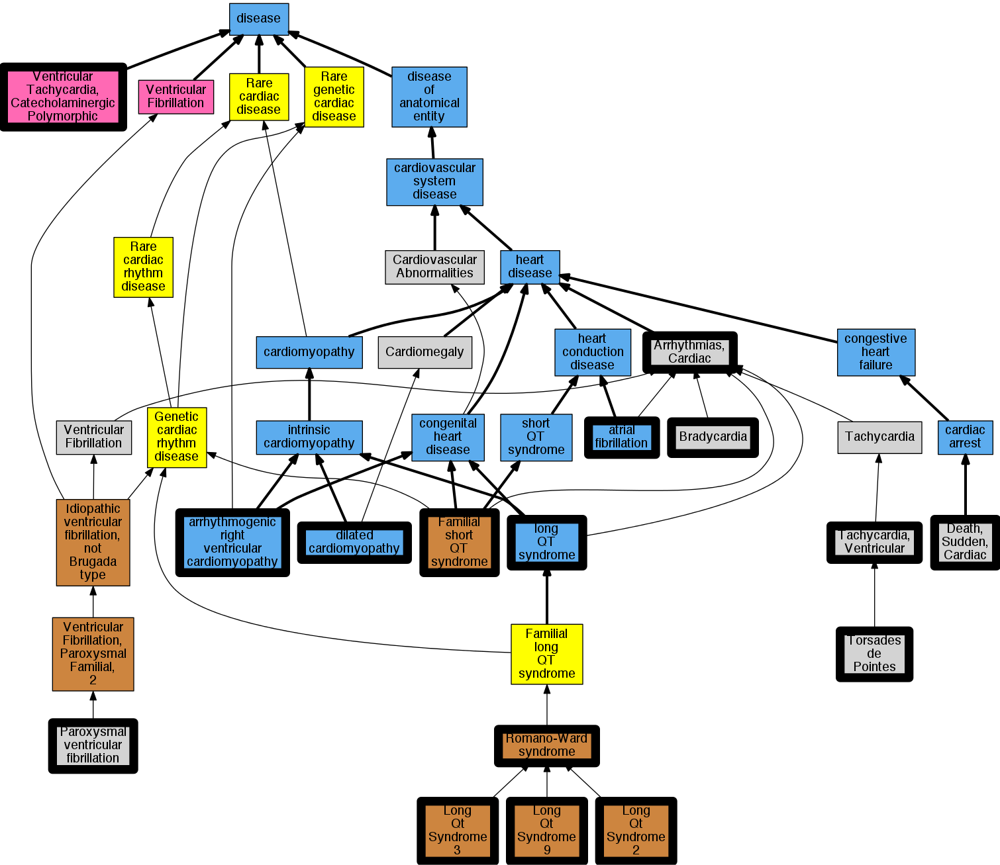

## GENE: KCNH2

[matched diseases visual](KCNH2.png)  <-- click on raw to zoom

### LONG QT SYNDROME 2/3, DIGENIC
 * [OMIM:603830 Long Qt Syndrome 3](http://beta.monarchinitiative.org/disease/OMIM:603830) Confidence: high
    * Equiv:[MESH:C537034 Long QT syndrome type 3](http://beta.monarchinitiative.org/disease/MESH:C537034)
    * Syn: "Long Qt Syndrome 2/3, Digenic"
    * Syn: "Long Qt Syndrome 3, Acquired, Susceptibility to"
    * Syn: "Long Qt Syndrome 3/6, Digenic"
    * Syn: "LONG QT SYNDROME 3; LQT3"
    * Syn: "LQT3"

### Long QT syndrome
 * [DOID:2843 long QT syndrome](http://beta.monarchinitiative.org/disease/DOID:2843) Confidence: high
    * Equiv:[MESH:D008133 Long QT Syndrome](http://beta.monarchinitiative.org/disease/MESH:D008133)
    * Syn: "long Q-T syndrome"
    * Syn: "LQT"
    * Syn: "Romano-Ward syndrome"
    * Syn: "Romano-Ward syndrome (disorder)"

### Long QT syndrome
 * [DOID:2843 long QT syndrome](http://beta.monarchinitiative.org/disease/DOID:2843) Confidence: high
    * Equiv:[MESH:D008133 Long QT Syndrome](http://beta.monarchinitiative.org/disease/MESH:D008133)
    * Syn: "long Q-T syndrome"
    * Syn: "LQT"
    * Syn: "Romano-Ward syndrome"
    * Syn: "Romano-Ward syndrome (disorder)"

### Paroxysmal familial ventricular fibrillation
 * [MESH:C537182 Paroxysmal ventricular fibrillation](http://beta.monarchinitiative.org/disease/MESH:C537182) Confidence: high
    * Syn: "Idiopathic ventricular fibrillation"
    * Syn: "Paroxysmal familial ventricular fibrillation"
    * Syn: "Ventricular fibrillation, paroxysmal familial"

### Primary dilated cardiomyopathy
 * [DOID:12930 dilated cardiomyopathy](http://beta.monarchinitiative.org/disease/DOID:12930) Confidence: high
    * Equiv:[Orphanet:217604 Dilated cardiomyopathy](http://beta.monarchinitiative.org/disease/Orphanet:217604)
    * Syn: "1A, Dilated cardiomyopathy"
    * Syn: "1As, Dilated cardiomyopathy"
    * Syn: "Cardiomyopathies, Congestive"
    * Syn: "Cardiomyopathies, Dilated"
    * Syn: "Cardiomyopathies, Familial Idiopathic"
    * Syn: "Cardiomyopathies, Idiopathic Dilated"
    * Syn: "cardiomyopathy 1A, Dilated"
    * Syn: "cardiomyopathy 1As, Dilated"
    * Syn: "Cardiomyopathy, Congestive"
    * Syn: "Cardiomyopathy, Dilated, 1a"
    * Syn: "Cardiomyopathy, Dilated, Autosomal Recessive"
    * Syn: "Cardiomyopathy, Dilated, CMD1A"
    * Syn: "Cardiomyopathy, Dilated, LMNA"
    * Syn: "Cardiomyopathy, Dilated, With Conduction Defect 1"
    * Syn: "Cardiomyopathy, Dilated, with Conduction Deffect1"
    * Syn: "Cardiomyopathy, Familial Idiopathic"
    * Syn: "Cardiomyopathy, Idiopathic Dilated"
    * Syn: "Congestive Cardiomyopathies"
    * Syn: "Congestive Cardiomyopathy"
    * Syn: "Congestive cardiomyopathy"
    * Syn: "Dilated Cardiomyopathies"
    * Syn: "Dilated Cardiomyopathies, Idiopathic"
    * Syn: "Dilated Cardiomyopathy"
    * Syn: "Dilated cardiomyopathy 1A"
    * Syn: "Dilated cardiomyopathy 1As"
    * Syn: "Dilated Cardiomyopathy, Idiopathic"
    * Syn: "Familial dilated cardiomyopathy"
    * Syn: "Familial Idiopathic Cardiomyopathies"
    * Syn: "Familial Idiopathic Cardiomyopathy"
    * Syn: "Idiopathic Cardiomyopathies, Familial"
    * Syn: "Idiopathic Cardiomyopathy, Familial"
    * Syn: "Idiopathic Dilated Cardiomyopathies"
    * Syn: "Idiopathic Dilated Cardiomyopathy"
    * Syn: "Idiopathic dilation cardiomyopathy"
    * Syn: "primary dilated cardiomyopathy"

### Ventricular tachycardia
 * [MESH:D017180 Tachycardia, Ventricular](http://beta.monarchinitiative.org/disease/MESH:D017180) Confidence: high
    * Syn: "Tachycardias, Ventricular"
    * Syn: "Ventricular Tachycardia"
    * Syn: "Ventricular Tachycardias"

### Brugada syndrome, phenotype modifier ?
 * [DOID:0050451 Brugada syndrome](http://beta.monarchinitiative.org/disease/DOID:0050451) Confidence: low/0.14500000000000002
    * Equiv:[MESH:D053840 Brugada Syndrome](http://beta.monarchinitiative.org/disease/MESH:D053840)
    * Equiv:[Orphanet:130 Brugada syndrome](http://beta.monarchinitiative.org/disease/Orphanet:130)
    * Syn: "Bangungut"
    * Syn: "Brugada ECG Pattern"
    * Syn: "Brugada Syndrome 1"
    * Syn: "Brugada Type ECG Pattern"
    * Syn: "Dream disease"
    * Syn: "ECG Pattern, Brugada"
    * Syn: "Idiopathic ventricular fibrillation, Brugada type"
    * Syn: "Pokkuri death syndrome"
    * Syn: "Right Bundle Branch Block, St Segment Elevation, And Sudden Death Syndrome"
    * Syn: "Sudden Unexplained Death Syndrome"
    * Syn: "Sudden Unexplained Nocturnal Death Syndrome"
    * Syn: "Sudden unexplained nocturnal death syndrome"
    * Syn: "Sudden Unexplained Nocturnal Death Syndrome (SUNDS)"
    * Syn: "SUNDS"

### LONG QT SYNDROME 1/2, DIGENIC
 * [OMIM:192500 Romano-Ward syndrome](http://beta.monarchinitiative.org/disease/OMIM:192500) Confidence: high
    * Equiv:[Orphanet:101016 Romano-Ward syndrome](http://beta.monarchinitiative.org/disease/Orphanet:101016)
    * Equiv:[MESH:D029597 Romano-Ward Syndrome](http://beta.monarchinitiative.org/disease/MESH:D029597)
    * Syn: "Long QT Syndrome 1"
    * Syn: "Long Qt Syndrome 1, Acquired, Susceptibility to"
    * Syn: "Long Qt Syndrome 1/2, Digenic"
    * Syn: "LONG QT SYNDROME 1; LQT1"
    * Syn: "Long QT Syndrome Type 1"
    * Syn: "LQT1"
    * Syn: "Romano Ward Syndrome"
    * Syn: "Romano-Ward long QT syndrome"
    * Syn: "Romano-Ward Syndrome"
    * Syn: "Syndrome, Romano-Ward"
    * Syn: "Syndrome, Ward-Romano"
    * Syn: "Ventricular Fibrillation With Prolonged Qt Interval"
    * Syn: "Ventricular Fibrillation with Prolonged QT Interval"
    * Syn: "Ward Romano Syndrome"
    * Syn: "Ward-Romano Syndrome"

### LONG QT SYNDROME 2
 * [OMIM:613688 Long Qt Syndrome 2](http://beta.monarchinitiative.org/disease/OMIM:613688) Confidence: high
    * Equiv:[MESH:C563614 Long Qt Syndrome 2](http://beta.monarchinitiative.org/disease/MESH:C563614)
    * Syn: "Long Qt Syndrome 1/2, Digenic"
    * Syn: "Long Qt Syndrome 2, Acquired, Susceptibility to"
    * Syn: "Long Qt Syndrome 2/3, Digenic"
    * Syn: "Long Qt Syndrome 2/5, Digenic"
    * Syn: "Long Qt Syndrome 2/9, Digenic"
    * Syn: "LONG QT SYNDROME 2; LQT2"
    * Syn: "LQT2"

### LONG QT SYNDROME 2, ACQUIRED, SUSCEPTIBILITY TO
 * [OMIM:613688 Long Qt Syndrome 2](http://beta.monarchinitiative.org/disease/OMIM:613688) Confidence: high
    * Equiv:[MESH:C563614 Long Qt Syndrome 2](http://beta.monarchinitiative.org/disease/MESH:C563614)
    * Syn: "Long Qt Syndrome 1/2, Digenic"
    * Syn: "Long Qt Syndrome 2, Acquired, Susceptibility to"
    * Syn: "Long Qt Syndrome 2/3, Digenic"
    * Syn: "Long Qt Syndrome 2/5, Digenic"
    * Syn: "Long Qt Syndrome 2/9, Digenic"
    * Syn: "LONG QT SYNDROME 2; LQT2"
    * Syn: "LQT2"

### Paroxysmal familial ventricular fibrillation
 * [MESH:C537182 Paroxysmal ventricular fibrillation](http://beta.monarchinitiative.org/disease/MESH:C537182) Confidence: high
    * Syn: "Idiopathic ventricular fibrillation"
    * Syn: "Paroxysmal familial ventricular fibrillation"
    * Syn: "Ventricular fibrillation, paroxysmal familial"

### Primary dilated cardiomyopathy
 * [DOID:12930 dilated cardiomyopathy](http://beta.monarchinitiative.org/disease/DOID:12930) Confidence: high
    * Equiv:[Orphanet:217604 Dilated cardiomyopathy](http://beta.monarchinitiative.org/disease/Orphanet:217604)
    * Syn: "1A, Dilated cardiomyopathy"
    * Syn: "1As, Dilated cardiomyopathy"
    * Syn: "Cardiomyopathies, Congestive"
    * Syn: "Cardiomyopathies, Dilated"
    * Syn: "Cardiomyopathies, Familial Idiopathic"
    * Syn: "Cardiomyopathies, Idiopathic Dilated"
    * Syn: "cardiomyopathy 1A, Dilated"
    * Syn: "cardiomyopathy 1As, Dilated"
    * Syn: "Cardiomyopathy, Congestive"
    * Syn: "Cardiomyopathy, Dilated, 1a"
    * Syn: "Cardiomyopathy, Dilated, Autosomal Recessive"
    * Syn: "Cardiomyopathy, Dilated, CMD1A"
    * Syn: "Cardiomyopathy, Dilated, LMNA"
    * Syn: "Cardiomyopathy, Dilated, With Conduction Defect 1"
    * Syn: "Cardiomyopathy, Dilated, with Conduction Deffect1"
    * Syn: "Cardiomyopathy, Familial Idiopathic"
    * Syn: "Cardiomyopathy, Idiopathic Dilated"
    * Syn: "Congestive Cardiomyopathies"
    * Syn: "Congestive Cardiomyopathy"
    * Syn: "Congestive cardiomyopathy"
    * Syn: "Dilated Cardiomyopathies"
    * Syn: "Dilated Cardiomyopathies, Idiopathic"
    * Syn: "Dilated Cardiomyopathy"
    * Syn: "Dilated cardiomyopathy 1A"
    * Syn: "Dilated cardiomyopathy 1As"
    * Syn: "Dilated Cardiomyopathy, Idiopathic"
    * Syn: "Familial dilated cardiomyopathy"
    * Syn: "Familial Idiopathic Cardiomyopathies"
    * Syn: "Familial Idiopathic Cardiomyopathy"
    * Syn: "Idiopathic Cardiomyopathies, Familial"
    * Syn: "Idiopathic Cardiomyopathy, Familial"
    * Syn: "Idiopathic Dilated Cardiomyopathies"
    * Syn: "Idiopathic Dilated Cardiomyopathy"
    * Syn: "Idiopathic dilation cardiomyopathy"
    * Syn: "primary dilated cardiomyopathy"

### SHORT QT SYNDROME 1
 * [OMIM:609620 Short Qt Syndrome 1](http://beta.monarchinitiative.org/disease/OMIM:609620) Confidence: high
    * Equiv:[MESH:C566506 Short QT Syndrome 1](http://beta.monarchinitiative.org/disease/MESH:C566506)
    * Syn: "SHORT QT SYNDROME 1; SQT1"
    * Syn: "SQT1"

### Ventricular tachycardia
 * [MESH:D017180 Tachycardia, Ventricular](http://beta.monarchinitiative.org/disease/MESH:D017180) Confidence: high
    * Syn: "Tachycardias, Ventricular"
    * Syn: "Ventricular Tachycardia"
    * Syn: "Ventricular Tachycardias"

### Arrhythmia
 * [MESH:D001145 Arrhythmias, Cardiac](http://beta.monarchinitiative.org/disease/MESH:D001145) Confidence: high
    * Syn: "Arrhythmia"
    * Syn: "Arrhythmia, Cardiac"
    * Syn: "Arrythmia"
    * Syn: "Cardiac Arrhythmia"
    * Syn: "Cardiac Arrhythmias"
    * Syn: "Cardiac Dysrhythmia"
    * Syn: "Dysrhythmia, Cardiac"

### Arrhythmogenic right ventricular cardiomyopathy
 * [DOID:0050431 arrhythmogenic right ventricular cardiomyopathy](http://beta.monarchinitiative.org/disease/DOID:0050431) Confidence: high
    * Equiv:[MESH:D019571 Arrhythmogenic Right Ventricular Dysplasia](http://beta.monarchinitiative.org/disease/MESH:D019571)
    * Equiv:[Orphanet:247 Arrhythmogenic right ventricular dysplasia](http://beta.monarchinitiative.org/disease/Orphanet:247)
    * Syn: "Arrhythmogenic Right Ventricular Cardiomyopathy"
    * Syn: "Arrhythmogenic Right Ventricular Cardiomyopathy Dysplasia"
    * Syn: "Arrhythmogenic Right Ventricular Cardiomyopathy-Dysplasia"
    * Syn: "Arrhythmogenic right ventricular dysplasia"
    * Syn: "arrhythmogenic right ventricular dysplasia"
    * Syn: "Arrhythmogenic Right Ventricular Dysplasia-Cardiomyopathy"
    * Syn: "arrhythmogenic right ventricular dysplasia/cardiomyopathy"
    * Syn: "ARVC"
    * Syn: "ARVC cardiomyopathy"
    * Syn: "ARVD"
    * Syn: "Right Ventricular Dysplasia, Arrhythmogenic"
    * Syn: "Ventricular Dysplasia, Right, Arrhythmogenic"

### LONG QT SYNDROME 2/5, DIGENIC
 * [OMIM:613688 Long Qt Syndrome 2](http://beta.monarchinitiative.org/disease/OMIM:613688) Confidence: high
    * Equiv:[MESH:C563614 Long Qt Syndrome 2](http://beta.monarchinitiative.org/disease/MESH:C563614)
    * Syn: "Long Qt Syndrome 1/2, Digenic"
    * Syn: "Long Qt Syndrome 2, Acquired, Susceptibility to"
    * Syn: "Long Qt Syndrome 2/3, Digenic"
    * Syn: "Long Qt Syndrome 2/5, Digenic"
    * Syn: "Long Qt Syndrome 2/9, Digenic"
    * Syn: "LONG QT SYNDROME 2; LQT2"
    * Syn: "LQT2"

### Atrial fibrillation, association with
 * [DOID:0060224 atrial fibrillation](http://beta.monarchinitiative.org/disease/DOID:0060224) Confidence: low/0.15625
    * Equiv:[MESH:D001281 Atrial Fibrillation](http://beta.monarchinitiative.org/disease/MESH:D001281)
    * Syn: "A-fib"
    * Syn: "Atrial Fibrillations"
    * Syn: "Auricular Fibrillation"
    * Syn: "Auricular Fibrillations"
    * Syn: "Familial Atrial Fibrillation"
    * Syn: "Fibrillation, Atrial"
    * Syn: "Fibrillation, Auricular"
    * Syn: "Fibrillations, Atrial"
    * Syn: "Fibrillations, Auricular"

### LONG QT SYNDROME, BRADYCARDIA-INDUCED
 * [MESH:D001919 Bradycardia](http://beta.monarchinitiative.org/disease/MESH:D001919) Confidence: low/0.13
    * Syn: "Bradyarrhythmia"
    * Syn: "Bradyarrhythmias"
    * Syn: "Bradycardias"

### Long QT syndrome 2
 * [OMIM:613688 Long Qt Syndrome 2](http://beta.monarchinitiative.org/disease/OMIM:613688) Confidence: high
    * Equiv:[MESH:C563614 Long Qt Syndrome 2](http://beta.monarchinitiative.org/disease/MESH:C563614)
    * Syn: "Long Qt Syndrome 1/2, Digenic"
    * Syn: "Long Qt Syndrome 2, Acquired, Susceptibility to"
    * Syn: "Long Qt Syndrome 2/3, Digenic"
    * Syn: "Long Qt Syndrome 2/5, Digenic"
    * Syn: "Long Qt Syndrome 2/9, Digenic"
    * Syn: "LONG QT SYNDROME 2; LQT2"
    * Syn: "LQT2"

### Primary dilated cardiomyopathy
 * [DOID:12930 dilated cardiomyopathy](http://beta.monarchinitiative.org/disease/DOID:12930) Confidence: high
    * Equiv:[Orphanet:217604 Dilated cardiomyopathy](http://beta.monarchinitiative.org/disease/Orphanet:217604)
    * Syn: "1A, Dilated cardiomyopathy"
    * Syn: "1As, Dilated cardiomyopathy"
    * Syn: "Cardiomyopathies, Congestive"
    * Syn: "Cardiomyopathies, Dilated"
    * Syn: "Cardiomyopathies, Familial Idiopathic"
    * Syn: "Cardiomyopathies, Idiopathic Dilated"
    * Syn: "cardiomyopathy 1A, Dilated"
    * Syn: "cardiomyopathy 1As, Dilated"
    * Syn: "Cardiomyopathy, Congestive"
    * Syn: "Cardiomyopathy, Dilated, 1a"
    * Syn: "Cardiomyopathy, Dilated, Autosomal Recessive"
    * Syn: "Cardiomyopathy, Dilated, CMD1A"
    * Syn: "Cardiomyopathy, Dilated, LMNA"
    * Syn: "Cardiomyopathy, Dilated, With Conduction Defect 1"
    * Syn: "Cardiomyopathy, Dilated, with Conduction Deffect1"
    * Syn: "Cardiomyopathy, Familial Idiopathic"
    * Syn: "Cardiomyopathy, Idiopathic Dilated"
    * Syn: "Congestive Cardiomyopathies"
    * Syn: "Congestive Cardiomyopathy"
    * Syn: "Congestive cardiomyopathy"
    * Syn: "Dilated Cardiomyopathies"
    * Syn: "Dilated Cardiomyopathies, Idiopathic"
    * Syn: "Dilated Cardiomyopathy"
    * Syn: "Dilated cardiomyopathy 1A"
    * Syn: "Dilated cardiomyopathy 1As"
    * Syn: "Dilated Cardiomyopathy, Idiopathic"
    * Syn: "Familial dilated cardiomyopathy"
    * Syn: "Familial Idiopathic Cardiomyopathies"
    * Syn: "Familial Idiopathic Cardiomyopathy"
    * Syn: "Idiopathic Cardiomyopathies, Familial"
    * Syn: "Idiopathic Cardiomyopathy, Familial"
    * Syn: "Idiopathic Dilated Cardiomyopathies"
    * Syn: "Idiopathic Dilated Cardiomyopathy"
    * Syn: "Idiopathic dilation cardiomyopathy"
    * Syn: "primary dilated cardiomyopathy"

### Torsades de Pointes, drugNot providedinduced, association with
 * [MESH:D016171 Torsades de Pointes](http://beta.monarchinitiative.org/disease/MESH:D016171) Confidence: low/0.14795918367346939
    * Syn: "de Pointes, Torsade"
    * Syn: "de Pointes, Torsades"
    * Syn: "Pointes, Torsade de"
    * Syn: "Pointes, Torsades de"
    * Syn: "Torsade de Pointes"

### Catecholaminergic polymorphic ventricular tachycardia
 * [DC:0000665 Ventricular Tachycardia, Catecholaminergic Polymorphic](http://beta.monarchinitiative.org/disease/DC:0000665) Confidence: high

### LONG QT SYNDROME 2/9, DIGENIC
 * [OMIM:611818 Long Qt Syndrome 9](http://beta.monarchinitiative.org/disease/OMIM:611818) Confidence: high
    * Equiv:[MESH:C567515 Long Qt Syndrome 9](http://beta.monarchinitiative.org/disease/MESH:C567515)
    * Syn: "Long Qt Syndrome 2-9"
    * Syn: "Long Qt Syndrome 2/9, Digenic"
    * Syn: "Long Qt Syndrome 9, Acquired, Susceptibility to"
    * Syn: "LONG QT SYNDROME 9; LQT9"
    * Syn: "LQT9"

### Long QT syndrome
 * [DOID:2843 long QT syndrome](http://beta.monarchinitiative.org/disease/DOID:2843) Confidence: high
    * Equiv:[MESH:D008133 Long QT Syndrome](http://beta.monarchinitiative.org/disease/MESH:D008133)
    * Syn: "long Q-T syndrome"
    * Syn: "LQT"
    * Syn: "Romano-Ward syndrome"
    * Syn: "Romano-Ward syndrome (disorder)"

### Primary dilated cardiomyopathy
 * [DOID:12930 dilated cardiomyopathy](http://beta.monarchinitiative.org/disease/DOID:12930) Confidence: high
    * Equiv:[Orphanet:217604 Dilated cardiomyopathy](http://beta.monarchinitiative.org/disease/Orphanet:217604)
    * Syn: "1A, Dilated cardiomyopathy"
    * Syn: "1As, Dilated cardiomyopathy"
    * Syn: "Cardiomyopathies, Congestive"
    * Syn: "Cardiomyopathies, Dilated"
    * Syn: "Cardiomyopathies, Familial Idiopathic"
    * Syn: "Cardiomyopathies, Idiopathic Dilated"
    * Syn: "cardiomyopathy 1A, Dilated"
    * Syn: "cardiomyopathy 1As, Dilated"
    * Syn: "Cardiomyopathy, Congestive"
    * Syn: "Cardiomyopathy, Dilated, 1a"
    * Syn: "Cardiomyopathy, Dilated, Autosomal Recessive"
    * Syn: "Cardiomyopathy, Dilated, CMD1A"
    * Syn: "Cardiomyopathy, Dilated, LMNA"
    * Syn: "Cardiomyopathy, Dilated, With Conduction Defect 1"
    * Syn: "Cardiomyopathy, Dilated, with Conduction Deffect1"
    * Syn: "Cardiomyopathy, Familial Idiopathic"
    * Syn: "Cardiomyopathy, Idiopathic Dilated"
    * Syn: "Congestive Cardiomyopathies"
    * Syn: "Congestive Cardiomyopathy"
    * Syn: "Congestive cardiomyopathy"
    * Syn: "Dilated Cardiomyopathies"
    * Syn: "Dilated Cardiomyopathies, Idiopathic"
    * Syn: "Dilated Cardiomyopathy"
    * Syn: "Dilated cardiomyopathy 1A"
    * Syn: "Dilated cardiomyopathy 1As"
    * Syn: "Dilated Cardiomyopathy, Idiopathic"
    * Syn: "Familial dilated cardiomyopathy"
    * Syn: "Familial Idiopathic Cardiomyopathies"
    * Syn: "Familial Idiopathic Cardiomyopathy"
    * Syn: "Idiopathic Cardiomyopathies, Familial"
    * Syn: "Idiopathic Cardiomyopathy, Familial"
    * Syn: "Idiopathic Dilated Cardiomyopathies"
    * Syn: "Idiopathic Dilated Cardiomyopathy"
    * Syn: "Idiopathic dilation cardiomyopathy"
    * Syn: "primary dilated cardiomyopathy"

### Sudden unexplained death
 * [MESH:D016757 Death, Sudden, Cardiac](http://beta.monarchinitiative.org/disease/MESH:D016757) Confidence: low/0.1388888888888889
    * Syn: "Arrest, Sudden Cardiac"
    * Syn: "Cardiac Arrest, Sudden"
    * Syn: "Cardiac Arrests, Sudden"
    * Syn: "Cardiac Death, Sudden"
    * Syn: "Cardiac Sudden Death"
    * Syn: "Death, Cardiac Sudden"
    * Syn: "Death, Sudden Cardiac"
    * Syn: "Sudden Cardiac Arrest"
    * Syn: "Sudden Cardiac Death"
    * Syn: "Sudden Death, Cardiac"

### Ventricular tachycardia
 * [MESH:D017180 Tachycardia, Ventricular](http://beta.monarchinitiative.org/disease/MESH:D017180) Confidence: high
    * Syn: "Tachycardias, Ventricular"
    * Syn: "Ventricular Tachycardia"
    * Syn: "Ventricular Tachycardias"
