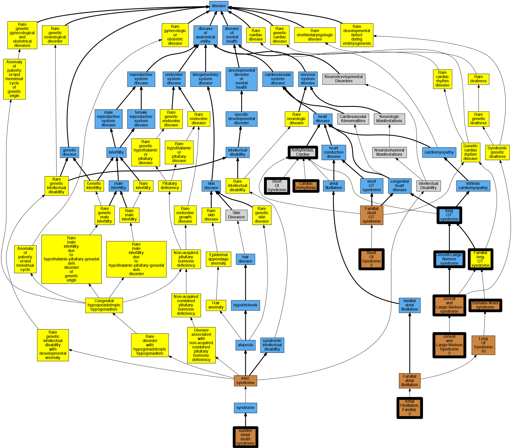

## GENE: KCNQ1

[matched diseases visual](KCNQ1.png)  <-- click on raw to zoom

### ATRIAL FIBRILLATION, FAMILIAL, 3
 * [OMIM:607554 Atrial Fibrillation, Familial, 3](http://beta.monarchinitiative.org/disease/OMIM:607554) Confidence: high
    * Equiv:[MESH:C563817 Atrial Fibrillation, Familial, 3](http://beta.monarchinitiative.org/disease/MESH:C563817)
    * Syn: "ATFB3"
    * Syn: "ATRIAL FIBRILLATION, FAMILIAL, 3; ATFB3"

### Arrhythmia
 * [OMIM:115000 Cardiac Complexes, Premature](http://beta.monarchinitiative.org/disease/OMIM:115000) Confidence: low/0.09375
    * Equiv:[MESH:D001145 Arrhythmias, Cardiac](http://beta.monarchinitiative.org/disease/MESH:D001145)
    * Equiv:[MESH:D005117 Cardiac Complexes, Premature](http://beta.monarchinitiative.org/disease/MESH:D005117)
    * Syn: "CARDIAC ARRHYTHMIA"
    * Syn: "Extrasystoles"

### JERVELL AND LANGE-NIELSEN SYNDROME 1
 * [OMIM:220400 Jervell-Lange Nielsen Syndrome](http://beta.monarchinitiative.org/disease/OMIM:220400) Confidence: low/0.1989795918367347
    * Equiv:[MESH:D029593 Jervell-Lange Nielsen Syndrome](http://beta.monarchinitiative.org/disease/MESH:D029593)
    * Syn: "Cardioauditory Syndrome of Jervell and Lange-Nielsen"
    * Syn: "Deafness, Congenital, and Functional Heart Disease"
    * Syn: "JERVELL AND LANGE-NIELSEN SYNDROME 1; JLNS1"
    * Syn: "JLNS1"
    * Syn: "Prolonged Qt Interval 1N Ekg and Sudden Death"
    * Syn: "Surdo-Cardiac Syndrome"

### Jervell and Lange-Nielsen syndrome
 * [OMIM:220400 Jervell-Lange Nielsen Syndrome](http://beta.monarchinitiative.org/disease/OMIM:220400) Confidence: low/0.20500000000000002
    * Equiv:[MESH:D029593 Jervell-Lange Nielsen Syndrome](http://beta.monarchinitiative.org/disease/MESH:D029593)
    * Syn: "Cardioauditory Syndrome of Jervell and Lange-Nielsen"
    * Syn: "Deafness, Congenital, and Functional Heart Disease"
    * Syn: "JERVELL AND LANGE-NIELSEN SYNDROME 1; JLNS1"
    * Syn: "JLNS1"
    * Syn: "Prolonged Qt Interval 1N Ekg and Sudden Death"
    * Syn: "Surdo-Cardiac Syndrome"

### Jervell and Lange-Nielsen syndrome, Long QT syndrome 1
 * [OMIM:220400 Jervell-Lange Nielsen Syndrome](http://beta.monarchinitiative.org/disease/OMIM:220400) Confidence: low/0.15625
    * Equiv:[MESH:D029593 Jervell-Lange Nielsen Syndrome](http://beta.monarchinitiative.org/disease/MESH:D029593)
    * Syn: "Cardioauditory Syndrome of Jervell and Lange-Nielsen"
    * Syn: "Deafness, Congenital, and Functional Heart Disease"
    * Syn: "JERVELL AND LANGE-NIELSEN SYNDROME 1; JLNS1"
    * Syn: "JLNS1"
    * Syn: "Prolonged Qt Interval 1N Ekg and Sudden Death"
    * Syn: "Surdo-Cardiac Syndrome"

### KCNQ1-related Jervell and Lange-Nielsen syndrome
 * [OMIM:612347 Jervell And Lange-Nielsen Syndrome 2](http://beta.monarchinitiative.org/disease/OMIM:612347) Confidence: low/0.1679421768707483
    * Equiv:[MESH:C567343 Jervell And Lange-Nielsen Syndrome 2](http://beta.monarchinitiative.org/disease/MESH:C567343)
    * Syn: "JERVELL AND LANGE-NIELSEN SYNDROME 2; JLNS2"
    * Syn: "JLNS2"

### KCNQ1-related acquired long QT syndrome
 * [DOID:2843 long QT syndrome](http://beta.monarchinitiative.org/disease/DOID:2843) Confidence: low/0.15625
    * Equiv:[MESH:D008133 Long QT Syndrome](http://beta.monarchinitiative.org/disease/MESH:D008133)
    * Syn: "long Q-T syndrome"
    * Syn: "LQT"
    * Syn: "Romano-Ward syndrome"
    * Syn: "Romano-Ward syndrome (disorder)"

### KCNQ1-related short QT syndrome
 * [DOID:0050793 short QT syndrome](http://beta.monarchinitiative.org/disease/DOID:0050793) Confidence: low/0.16999999999999998
    * Equiv:[MESH:C580439 Short Qt Syndrome](http://beta.monarchinitiative.org/disease/MESH:C580439)

### LONG QT SYNDROME 1
 * [OMIM:192500 Romano-Ward Syndrome](http://beta.monarchinitiative.org/disease/OMIM:192500) Confidence: low/0.18000000000000002
    * Equiv:[MESH:D029597 Romano-Ward Syndrome](http://beta.monarchinitiative.org/disease/MESH:D029597)
    * Syn: "Long Qt Syndrome 1, Acquired, Susceptibility to"
    * Syn: "Long Qt Syndrome 1/2, Digenic"
    * Syn: "LONG QT SYNDROME 1; LQT1"
    * Syn: "LQT1"
    * Syn: "Romano-Ward Syndrome"
    * Syn: "Ventricular Fibrillation With Prolonged Qt Interval"
    * Syn: "Ward-Romano Syndrome"

### LONG QT SYNDROME 1, ACQUIRED, SUSCEPTIBILITY TO
 * [OMIM:192500 Romano-Ward Syndrome](http://beta.monarchinitiative.org/disease/OMIM:192500) Confidence: high
    * Equiv:[MESH:D029597 Romano-Ward Syndrome](http://beta.monarchinitiative.org/disease/MESH:D029597)
    * Syn: "Long Qt Syndrome 1, Acquired, Susceptibility to"
    * Syn: "Long Qt Syndrome 1/2, Digenic"
    * Syn: "LONG QT SYNDROME 1; LQT1"
    * Syn: "LQT1"
    * Syn: "Romano-Ward Syndrome"
    * Syn: "Ventricular Fibrillation With Prolonged Qt Interval"
    * Syn: "Ward-Romano Syndrome"

### LONG QT SYNDROME 1, RECESSIVE
 * [OMIM:192500 Romano-Ward Syndrome](http://beta.monarchinitiative.org/disease/OMIM:192500) Confidence: low/0.18000000000000002
    * Equiv:[MESH:D029597 Romano-Ward Syndrome](http://beta.monarchinitiative.org/disease/MESH:D029597)
    * Syn: "Long Qt Syndrome 1, Acquired, Susceptibility to"
    * Syn: "Long Qt Syndrome 1/2, Digenic"
    * Syn: "LONG QT SYNDROME 1; LQT1"
    * Syn: "LQT1"
    * Syn: "Romano-Ward Syndrome"
    * Syn: "Ventricular Fibrillation With Prolonged Qt Interval"
    * Syn: "Ward-Romano Syndrome"

### LONG QT SYNDROME 1/2, DIGENIC
 * [OMIM:192500 Romano-Ward Syndrome](http://beta.monarchinitiative.org/disease/OMIM:192500) Confidence: high
    * Equiv:[MESH:D029597 Romano-Ward Syndrome](http://beta.monarchinitiative.org/disease/MESH:D029597)
    * Syn: "Long Qt Syndrome 1, Acquired, Susceptibility to"
    * Syn: "Long Qt Syndrome 1/2, Digenic"
    * Syn: "LONG QT SYNDROME 1; LQT1"
    * Syn: "LQT1"
    * Syn: "Romano-Ward Syndrome"
    * Syn: "Ventricular Fibrillation With Prolonged Qt Interval"
    * Syn: "Ward-Romano Syndrome"

### LONG QT SYNDROME 11
 * [OMIM:611820 Long Qt Syndrome 11](http://beta.monarchinitiative.org/disease/OMIM:611820) Confidence: high
    * Equiv:[MESH:C567513 Long Qt Syndrome 11](http://beta.monarchinitiative.org/disease/MESH:C567513)
    * Syn: "LONG QT SYNDROME 11; LQT11"
    * Syn: "LQT11"

### Long QT Syndrome
 * [DOID:2843 long QT syndrome](http://beta.monarchinitiative.org/disease/DOID:2843) Confidence: high
    * Equiv:[MESH:D008133 Long QT Syndrome](http://beta.monarchinitiative.org/disease/MESH:D008133)
    * Syn: "long Q-T syndrome"
    * Syn: "LQT"
    * Syn: "Romano-Ward syndrome"
    * Syn: "Romano-Ward syndrome (disorder)"

### Long QT syndrome
 * [DOID:2843 long QT syndrome](http://beta.monarchinitiative.org/disease/DOID:2843) Confidence: high
    * Equiv:[MESH:D008133 Long QT Syndrome](http://beta.monarchinitiative.org/disease/MESH:D008133)
    * Syn: "long Q-T syndrome"
    * Syn: "LQT"
    * Syn: "Romano-Ward syndrome"
    * Syn: "Romano-Ward syndrome (disorder)"

### Long QT syndrome ?,Long QT syndrome
 * [DOID:2843 long QT syndrome](http://beta.monarchinitiative.org/disease/DOID:2843) Confidence: low/0.1953125
    * Equiv:[MESH:D008133 Long QT Syndrome](http://beta.monarchinitiative.org/disease/MESH:D008133)
    * Syn: "long Q-T syndrome"
    * Syn: "LQT"
    * Syn: "Romano-Ward syndrome"
    * Syn: "Romano-Ward syndrome (disorder)"

### Long QT syndrome, LQT1 subtype
 * [DOID:2843 long QT syndrome](http://beta.monarchinitiative.org/disease/DOID:2843) Confidence: low/0.16999999999999998
    * Equiv:[MESH:D008133 Long QT Syndrome](http://beta.monarchinitiative.org/disease/MESH:D008133)
    * Syn: "long Q-T syndrome"
    * Syn: "LQT"
    * Syn: "Romano-Ward syndrome"
    * Syn: "Romano-Ward syndrome (disorder)"

### Long QT syndrome,Long QT syndrome
 * [DOID:2843 long QT syndrome](http://beta.monarchinitiative.org/disease/DOID:2843) Confidence: high
    * Equiv:[MESH:D008133 Long QT Syndrome](http://beta.monarchinitiative.org/disease/MESH:D008133)
    * Syn: "long Q-T syndrome"
    * Syn: "LQT"
    * Syn: "Romano-Ward syndrome"
    * Syn: "Romano-Ward syndrome (disorder)"

### SHORT QT SYNDROME 2
 * [OMIM:609621 Short QT Syndrome 2](http://beta.monarchinitiative.org/disease/OMIM:609621) Confidence: high
    * Equiv:[MESH:C566505 Short QT Syndrome 2](http://beta.monarchinitiative.org/disease/MESH:C566505)
    * Syn: "SHORT QT SYNDROME 2; SQT2"
    * Syn: "SQT2"

### Sudden infant death syndrome
 * [OMIM:272120 sudden infant death syndrome](http://beta.monarchinitiative.org/disease/OMIM:272120) Confidence: high
    * Equiv:[DOID:9007 sudden infant death syndrome](http://beta.monarchinitiative.org/disease/DOID:9007)
    * Equiv:[MESH:D013398 Sudden Infant Death](http://beta.monarchinitiative.org/disease/MESH:D013398)
    * Syn: "Cot death"
    * Syn: "Cot death (context-dependent category)"
    * Syn: "Crib death (context-dependent category)"
    * Syn: "SIDS"
    * Syn: "Sids"
    * Syn: "Sudden death of nonspecific cause in infancy"
    * Syn: "SUDDEN INFANT DEATH SYNDROME"
    * Syn: "Sudden infant death syndrome (context-dependent category)"
    * Syn: "Sudden infant death syndrome (finding)"
    * Syn: "Sudden infant death syndrome NOS (context-dependent category)"
