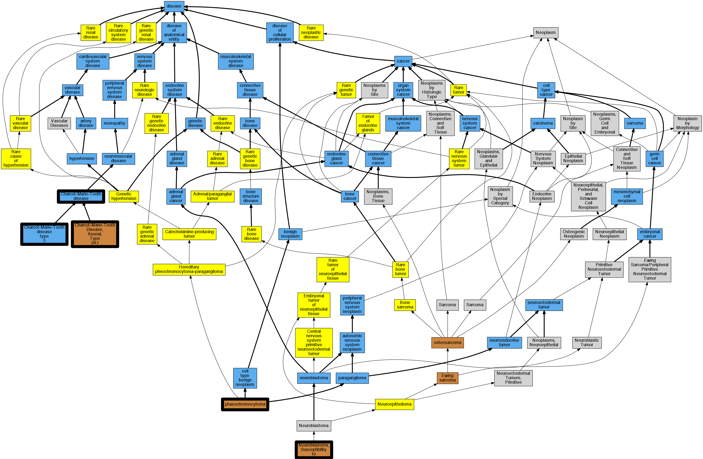

## GENE: KIF1B

[matched diseases visual](KIF1B.png)  <-- click on raw to zoom

### Charcot-Marie-Tooth disease
 * [DOID:10595 Charcot-Marie-Tooth disease](http://beta.monarchinitiative.org/disease/DOID:10595) Confidence: high
    * Equiv:[Orphanet:166 Charcot-Marie-Tooth disease](http://beta.monarchinitiative.org/disease/Orphanet:166)
    * Syn: "Areflexic Dystasia, Hereditary"
    * Syn: "Areflexic Dystasias, Hereditary"
    * Syn: "Atrophies, Peroneal Muscular"
    * Syn: "Atrophy, Muscular, Peroneal"
    * Syn: "Atrophy, Peroneal Muscular"
    * Syn: "Charcot Marie Disease"
    * Syn: "Charcot Marie Tooth Disease"
    * Syn: "Charcot Marie Tooth Disease, Type 1A"
    * Syn: "Charcot Marie Tooth Disease, Type 1B"
    * Syn: "Charcot Marie Tooth Disease, Type I"
    * Syn: "Charcot Marie Tooth Disease, Type IA"
    * Syn: "Charcot Marie Tooth Disease, Type IB"
    * Syn: "Charcot Marie Tooth Disease, Type II"
    * Syn: "Charcot Marie Tooth Hereditary Neuropathy"
    * Syn: "Charcot Marie Tooth muscular atrophy"
    * Syn: "Charcot Marie Tooth Neuropathy, Type 1A"
    * Syn: "Charcot Marie Tooth Neuropathy, Type 1B"
    * Syn: "Charcot Marie Tooth Syndrome"
    * Syn: "Charcot-Marie Disease"
    * Syn: "Charcot-Marie-Tooth Disease, Autosomal Dominant, With Focally Folded Myelin Sheaths, Type 1A"
    * Syn: "Charcot-Marie-Tooth Disease, Autosomal Dominant, with Focally Folded Myelin Sheaths, Type 1B"
    * Syn: "Charcot-Marie-Tooth Disease, Demyelinating, Type 1A"
    * Syn: "Charcot-Marie-Tooth Disease, Demyelinating, Type 1B"
    * Syn: "Charcot-Marie-Tooth Disease, Slow Nerve Conduction Type, Linked To Duffy"
    * Syn: "Charcot-Marie-Tooth Disease, Type 1A"
    * Syn: "Charcot-Marie-Tooth Disease, Type 1B"
    * Syn: "Charcot-Marie-Tooth Disease, Type I"
    * Syn: "Charcot-Marie-Tooth Disease, Type IA"
    * Syn: "Charcot-Marie-Tooth Disease, Type IB"
    * Syn: "Charcot-Marie-Tooth Disease, Type II"
    * Syn: "Charcot-Marie-Tooth Hereditary Neuropathy"
    * Syn: "Charcot-Marie-Tooth hereditary neuropathy"
    * Syn: "Charcot-Marie-Tooth Neuropathy, Type 1A"
    * Syn: "Charcot-Marie-Tooth Neuropathy, Type 1B"
    * Syn: "Charcot-Marie-Tooth Syndrome"
    * Syn: "CMT"
    * Syn: "CMT - Charcot-Marie-Tooth disease"
    * Syn: "Dystasia, Hereditary Areflexic"
    * Syn: "Dystasias, Hereditary Areflexic"
    * Syn: "Hereditary Areflexic Dystasia"
    * Syn: "Hereditary Areflexic Dystasias"
    * Syn: "Hereditary Motor and Sensory Neuropathy 1A"
    * Syn: "Hereditary Motor and Sensory Neuropathy 1B"
    * Syn: "Hereditary Motor and Sensory Neuropathy IA"
    * Syn: "Hereditary Motor And Sensory Neuropathy IB"
    * Syn: "Hereditary Motor and Sensory Neuropathy Type II"
    * Syn: "Hereditary Motor and Sensory-Neuropathy Type II"
    * Syn: "Hereditary Motor, and Sensory Neuropathy Type I"
    * Syn: "Hereditary Neuropathy, Charcot-Marie-Tooth"
    * Syn: "Hereditary Type I Motor and Sensory Neuropathy"
    * Syn: "HMN Distal Type I"
    * Syn: "HMSN Type I"
    * Syn: "HMSN Type II"
    * Syn: "Muscular Atrophies, Peroneal"
    * Syn: "Muscular Atrophy, Peroneal"
    * Syn: "Neuropathy, Type I Hereditary Motor and Sensory"
    * Syn: "Neuropathy, Type II Hereditary Motor and Sensory"
    * Syn: "Peroneal Muscular Atrophies"
    * Syn: "Peroneal Muscular Atrophy"
    * Syn: "Peroneal muscular atrophy"
    * Syn: "Roussy Levy Disease"
    * Syn: "Roussy Levy Hereditary Areflexic Dystasia"
    * Syn: "Roussy Levy Syndrome"
    * Syn: "Roussy-Levy Disease"
    * Syn: "Roussy-Levy Hereditary Areflexic Dystasia"
    * Syn: "Roussy-Levy Syndrome"
    * Syn: "Syndrome, Charcot-Marie-Tooth"
    * Syn: "Syndrome, Roussy-Levy"

### CHARCOT-MARIE-TOOTH DISEASE, AXONAL, TYPE 2A1
 * [OMIM:118210 Charcot-Marie-Tooth Disease, Axonal, Type 2A1](http://beta.monarchinitiative.org/disease/OMIM:118210) Confidence: high
    * Equiv:[MESH:C566138 Charcot-Marie-Tooth Disease, Axonal, Type 2a1](http://beta.monarchinitiative.org/disease/MESH:C566138)
    * Syn: "Charcot-Marie-Tooth Disease, Axonal, Autosomal Dominant, Type 2A1"
    * Syn: "Charcot-Marie-Tooth Disease, Axonal, Autosomal Dominant, Type 2a1"
    * Syn: "CHARCOT-MARIE-TOOTH DISEASE, AXONAL, TYPE 2A1; CMT2A1"
    * Syn: "Charcot-Marie-Tooth Disease, Neuronal, Type 2A1"
    * Syn: "Charcot-Marie-Tooth Disease, Neuronal, Type 2a1"
    * Syn: "Charcot-Marie-Tooth Neuropathy, Type 2A1"
    * Syn: "CMT2A1"
    * Syn: "Hereditary Motor And Sensory Neuropathy IIA1"
    * Syn: "Hereditary Motor and Sensory Neuropathy Iia1"
    * Syn: "Hmsn Iia1"
    * Syn: "Hmsn2A1"

### NEUROBLASTOMA, SUSCEPTIBILITY TO, 1
 * [OMIM:256700 Neuroblastoma, Susceptibility to](http://beta.monarchinitiative.org/disease/OMIM:256700) Confidence: high
    * Syn: "NEUROBLASTOMA, SUSCEPTIBILITY TO"
    * Syn: "Neuroblastoma, Susceptibility To, 1"

### Charcot-Marie-Tooth disease, type 2
 * [DOID:0050539 Charcot-Marie-Tooth disease type 2](http://beta.monarchinitiative.org/disease/DOID:0050539) Confidence: high
    * Equiv:[Orphanet:64746 Autosomal dominant Charcot-Marie-Tooth disease type 2](http://beta.monarchinitiative.org/disease/Orphanet:64746)
    * Syn: "Autosomal dominant axonal Charcot-Marie-Tooth disease"
    * Syn: "CMT2"
    * Syn: "hereditary motor and sensory neuropathy Guadalajara neuronal type"
    * Syn: "hereditary motor and sensory neuropathy Okinawa type"
    * Syn: "Hereditary motor and sensory neuropathy type 2"
    * Syn: "hereditary motor and sensory neuropathy type 2"

### PHEOCHROMOCYTOMA
 * [OMIM:171300 phaeochromocytoma](http://beta.monarchinitiative.org/disease/OMIM:171300) Confidence: high
    * Equiv:[DOID:0050771 phaeochromocytoma](http://beta.monarchinitiative.org/disease/DOID:0050771)
    * Equiv:[MESH:D010673 Pheochromocytoma](http://beta.monarchinitiative.org/disease/MESH:D010673)
    * Syn: "Extra-Adrenal Pheochromocytoma"
    * Syn: "Extra-Adrenal Pheochromocytomas"
    * Syn: "PHEOCHROMOCYTOMA"
    * Syn: "Pheochromocytoma, Extra Adrenal"
    * Syn: "Pheochromocytoma, Extra-Adrenal"
    * Syn: "Pheochromocytoma, Susceptibility to"
    * Syn: "Pheochromocytomas"
    * Syn: "Pheochromocytomas, Extra-Adrenal"
