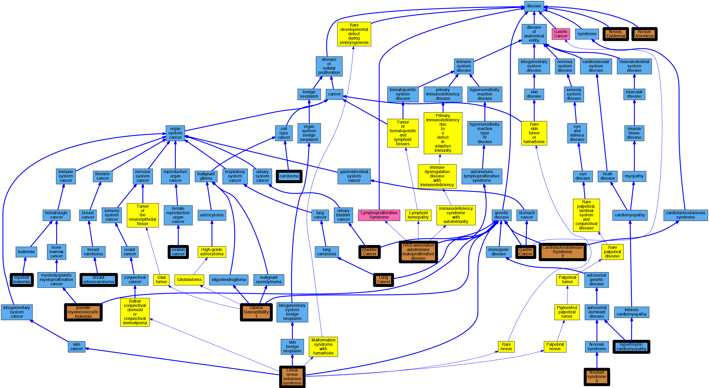

## GENE: KRAS

[matched diseases visual](KRAS.png)  <-- click on raw to zoom

### Juvenile myelomonocytic leukemia
 * [OMIM:607785 juvenile myelomonocytic leukemia](http://beta.monarchinitiative.org/disease/OMIM:607785) Confidence: high
    * Equiv:[Orphanet:86834 Juvenile myelomonocytic leukemia](http://beta.monarchinitiative.org/disease/Orphanet:86834)
    * Equiv:[DOID:0050458 juvenile myelomonocytic leukemia](http://beta.monarchinitiative.org/disease/DOID:0050458)
    * Equiv:[MESH:D054429 Leukemia, Myelomonocytic, Juvenile](http://beta.monarchinitiative.org/disease/MESH:D054429)
    * Syn: "JMML"
    * Syn: "Juvenile Chronic Myelogenous Leukemia"
    * Syn: "Juvenile chronic myelomonocytic leukemia"
    * Syn: "Juvenile Myelomonocytic Leukemia"
    * Syn: "JUVENILE MYELOMONOCYTIC LEUKEMIA; JMML"
    * Syn: "Juvenile Myelomonocytic Leukemias"
    * Syn: "Leukemia, Chronic Myelomonocytic"
    * Syn: "Leukemia, Juvenile Myelomonocytic"
    * Syn: "Myelomonocytic Leukemia, Juvenile"
    * Syn: "Myelomonocytic Leukemias, Juvenile"

### LUNG CANCER, SOMATIC
 * [OMIM:211980 Lung Cancer](http://beta.monarchinitiative.org/disease/OMIM:211980) Confidence: low/0.18055555555555555
    * Syn: "Adenocarcinoma of Lung"
    * Syn: "Alveolar Cell Carcinoma"
    * Syn: "LUNG CANCER"
    * Syn: "Lung Cancer, Protection Against"
    * Syn: "Nonsmall Cell Lung Cancer"

### NOONAN SYNDROME 3
 * [OMIM:609942 Noonan Syndrome 3](http://beta.monarchinitiative.org/disease/OMIM:609942) Confidence: high
    * Equiv:[MESH:C537847 Noonan syndrome 3](http://beta.monarchinitiative.org/disease/MESH:C537847)
    * Syn: "NOONAN SYNDROME 3; NS3"
    * Syn: "NS3"

### Non-Small Cell Lung Cancer
 * [DOID:3908 non-small cell lung carcinoma](http://beta.monarchinitiative.org/disease/DOID:3908) Confidence: high
    * Equiv:[MESH:D002289 Carcinoma, Non-Small-Cell Lung](http://beta.monarchinitiative.org/disease/MESH:D002289)
    * Syn: "Carcinoma, Non Small Cell Lung"
    * Syn: "Carcinoma, Non-Small Cell Lung"
    * Syn: "Carcinomas, Non-Small-Cell Lung"
    * Syn: "Lung Carcinoma, Non-Small-Cell"
    * Syn: "Lung Carcinomas, Non-Small-Cell"
    * Syn: "Non Small Cell Lung Carcinoma"
    * Syn: "Non-Small Cell Lung Cancer"
    * Syn: "Non-small cell lung cancer (disorder)"
    * Syn: "Non-Small-Cell Lung Carcinoma"
    * Syn: "Non-Small-Cell Lung Carcinomas"
    * Syn: "Nonsmall Cell Lung Cancer"
    * Syn: "NSCLC"
    * Syn: "NSCLC"

### Noonan syndrome 3
 * [OMIM:609942 Noonan Syndrome 3](http://beta.monarchinitiative.org/disease/OMIM:609942) Confidence: high
    * Equiv:[MESH:C537847 Noonan syndrome 3](http://beta.monarchinitiative.org/disease/MESH:C537847)
    * Syn: "NOONAN SYNDROME 3; NS3"
    * Syn: "NS3"

### BLADDER CANCER, SOMATIC
 * [OMIM:109800 Bladder Cancer](http://beta.monarchinitiative.org/disease/OMIM:109800) Confidence: low/0.18055555555555555
    * Syn: "BLADDER CANCER"

### Cardiofaciocutaneous syndrome 2
 * [OMIM:615278 Cardiofaciocutaneous Syndrome 2](http://beta.monarchinitiative.org/disease/OMIM:615278) Confidence: high
    * Syn: "CARDIOFACIOCUTANEOUS SYNDROME 2; CFC2"
    * Syn: "CFC2"

### EPIDERMAL NEVUS, SOMATIC
 * [OMIM:162900 Woolly hair nevus](http://beta.monarchinitiative.org/disease/OMIM:162900) Confidence: low/0.09027777777777778
    * Equiv:[Orphanet:79414 Woolly hair nevus](http://beta.monarchinitiative.org/disease/Orphanet:79414)
    * Equiv:[MESH:C580062 Epidermal Nevus](http://beta.monarchinitiative.org/disease/MESH:C580062)
    * Syn: "Epidermal Naevus"
    * Syn: "Nevus Sebaceous"
    * Syn: "NEVUS, EPIDERMAL"
    * Syn: "Nevus, Epidermal"
    * Syn: "Nevus, Keratinocytic, Nonepidermolytic"
    * Syn: "Nevus, Woolly Hair"
    * Syn: "Wooly hair nevus"

### Non-Small Cell Lung Cancer
 * [DOID:3908 non-small cell lung carcinoma](http://beta.monarchinitiative.org/disease/DOID:3908) Confidence: high
    * Equiv:[MESH:D002289 Carcinoma, Non-Small-Cell Lung](http://beta.monarchinitiative.org/disease/MESH:D002289)
    * Syn: "Carcinoma, Non Small Cell Lung"
    * Syn: "Carcinoma, Non-Small Cell Lung"
    * Syn: "Carcinomas, Non-Small-Cell Lung"
    * Syn: "Lung Carcinoma, Non-Small-Cell"
    * Syn: "Lung Carcinomas, Non-Small-Cell"
    * Syn: "Non Small Cell Lung Carcinoma"
    * Syn: "Non-Small Cell Lung Cancer"
    * Syn: "Non-small cell lung cancer (disorder)"
    * Syn: "Non-Small-Cell Lung Carcinoma"
    * Syn: "Non-Small-Cell Lung Carcinomas"
    * Syn: "Nonsmall Cell Lung Cancer"
    * Syn: "NSCLC"
    * Syn: "NSCLC"

### Ovarian Cancer
 * [DOID:2394 ovarian cancer](http://beta.monarchinitiative.org/disease/DOID:2394) Confidence: high
    * Equiv:[MESH:D010051 Ovarian Neoplasms](http://beta.monarchinitiative.org/disease/MESH:D010051)
    * Equiv:[Orphanet:213500 Rare ovarian cancer](http://beta.monarchinitiative.org/disease/Orphanet:213500)
    * Syn: "Cancer of Ovary"
    * Syn: "Cancer of the Ovary"
    * Syn: "Cancer, Ovarian"
    * Syn: "Cancer, Ovary"
    * Syn: "Cancers, Ovarian"
    * Syn: "Cancers, Ovary"
    * Syn: "malignant Ovarian tumor"
    * Syn: "malignant tumour of ovary"
    * Syn: "Neoplasm, Ovarian"
    * Syn: "Neoplasm, Ovary"
    * Syn: "Neoplasms, Ovarian"
    * Syn: "Neoplasms, Ovary"
    * Syn: "Ovarian Cancer"
    * Syn: "Ovarian Cancers"
    * Syn: "Ovarian malignant tumor"
    * Syn: "Ovarian Neoplasm"
    * Syn: "ovarian neoplasm"
    * Syn: "Ovary Cancer"
    * Syn: "Ovary Cancers"
    * Syn: "Ovary Neoplasm"
    * Syn: "ovary neoplasm"
    * Syn: "Ovary Neoplasms"
    * Syn: "primary ovarian cancer"
    * Syn: "tumor of the Ovary"

### PANCREATIC CARCINOMA, SOMATIC
 * [MESH:D002277 Carcinoma](http://beta.monarchinitiative.org/disease/MESH:D002277) Confidence: low/0.1388888888888889
    * Syn: "Anaplastic Carcinoma"
    * Syn: "Anaplastic Carcinomas"
    * Syn: "Carcinoma, Anaplastic"
    * Syn: "Carcinoma, Spindle Cell"
    * Syn: "Carcinoma, Spindle-Cell"
    * Syn: "Carcinoma, Undifferentiated"
    * Syn: "Carcinomas"
    * Syn: "Carcinomas, Anaplastic"
    * Syn: "Carcinomas, Spindle-Cell"
    * Syn: "Carcinomas, Undifferentiated"
    * Syn: "Carcinomatoses"
    * Syn: "Carcinomatosis"
    * Syn: "Epithelial Neoplasm, Malignant"
    * Syn: "Epithelial Neoplasms, Malignant"
    * Syn: "Epithelial Tumor, Malignant"
    * Syn: "Epithelial Tumors, Malignant"
    * Syn: "Epithelioma"
    * Syn: "Epitheliomas"
    * Syn: "Malignant Epithelial Neoplasm"
    * Syn: "Malignant Epithelial Neoplasms"
    * Syn: "Malignant Epithelial Tumor"
    * Syn: "Malignant Epithelial Tumors"
    * Syn: "Neoplasm, Malignant Epithelial"
    * Syn: "Neoplasms, Malignant Epithelial"
    * Syn: "Spindle-Cell Carcinoma"
    * Syn: "Spindle-Cell Carcinomas"
    * Syn: "Tumor, Malignant Epithelial"
    * Syn: "Tumors, Malignant Epithelial"
    * Syn: "Undifferentiated Carcinoma"
    * Syn: "Undifferentiated Carcinomas"

### Primary familial hypertrophic cardiomyopathy
 * [DOID:11984 hypertrophic cardiomyopathy](http://beta.monarchinitiative.org/disease/DOID:11984) Confidence: low/0.1953125
    * Equiv:[MESH:D002312 Cardiomyopathy, Hypertrophic](http://beta.monarchinitiative.org/disease/MESH:D002312)
    * Equiv:[Orphanet:217569 Hypertrophic cardiomyopathy](http://beta.monarchinitiative.org/disease/Orphanet:217569)
    * Syn: "Cardiomyopathies, Hypertrophic"
    * Syn: "Cardiomyopathies, Hypertrophic Obstructive"
    * Syn: "Cardiomyopathy, Hypertrophic Obstructive"
    * Syn: "familial hypertrophic cardiomyopathy"
    * Syn: "Hypertrophic Cardiomyopathies"
    * Syn: "Hypertrophic Cardiomyopathy"
    * Syn: "Hypertrophic Obstructive Cardiomyopathies"
    * Syn: "Hypertrophic Obstructive Cardiomyopathy"
    * Syn: "hypertrophic obstructive cardiomyopathy"
    * Syn: "Hypertrophic subaortic stenosis"
    * Syn: "Obstructive Cardiomyopathies, Hypertrophic"
    * Syn: "Obstructive Cardiomyopathy, Hypertrophic"
    * Syn: "Obstructive hypertrophic cardiomyopathy"

### Primary familial hypertrophic cardiomyopathy
 * [DOID:11984 hypertrophic cardiomyopathy](http://beta.monarchinitiative.org/disease/DOID:11984) Confidence: low/0.1953125
    * Equiv:[MESH:D002312 Cardiomyopathy, Hypertrophic](http://beta.monarchinitiative.org/disease/MESH:D002312)
    * Equiv:[Orphanet:217569 Hypertrophic cardiomyopathy](http://beta.monarchinitiative.org/disease/Orphanet:217569)
    * Syn: "Cardiomyopathies, Hypertrophic"
    * Syn: "Cardiomyopathies, Hypertrophic Obstructive"
    * Syn: "Cardiomyopathy, Hypertrophic Obstructive"
    * Syn: "familial hypertrophic cardiomyopathy"
    * Syn: "Hypertrophic Cardiomyopathies"
    * Syn: "Hypertrophic Cardiomyopathy"
    * Syn: "Hypertrophic Obstructive Cardiomyopathies"
    * Syn: "Hypertrophic Obstructive Cardiomyopathy"
    * Syn: "hypertrophic obstructive cardiomyopathy"
    * Syn: "Hypertrophic subaortic stenosis"
    * Syn: "Obstructive Cardiomyopathies, Hypertrophic"
    * Syn: "Obstructive Cardiomyopathy, Hypertrophic"
    * Syn: "Obstructive hypertrophic cardiomyopathy"

### RAS-ASSOCIATED AUTOIMMUNE LEUKOPROLIFERATIVE DISORDER, SOMATIC
 * [OMIM:614470 RAS-associated autoimmune leukoproliferative disease](http://beta.monarchinitiative.org/disease/OMIM:614470) Confidence: low/0.09548611111111112
    * Equiv:[Orphanet:268114 RAS-associated autoimmune leukoproliferative disease](http://beta.monarchinitiative.org/disease/Orphanet:268114)
    * Syn: "ALPS type 4"
    * Syn: "ALPS type IV"
    * Syn: "Autoimmune lymphoproliferative syndrome type 4"
    * Syn: "Autoimmune lymphoproliferative syndrome type IV"
    * Syn: "Autoimmune Lymphoproliferative Syndrome, Type 4"
    * Syn: "RALD"
    * Syn: "RALD"
    * Syn: "RAS-ASSOCIATED AUTOIMMUNE LEUKOPROLIFERATIVE DISORDER; RALD"

### SCHIMMELPENNING-FEUERSTEIN-MIMS SYNDROME, SOMATIC MOSAIC
 * [OMIM:163200 Linear nevus sebaceus syndrome](http://beta.monarchinitiative.org/disease/OMIM:163200) Confidence: low/0.07777777777777778
    * Equiv:[Orphanet:2612 Linear nevus sebaceus syndrome](http://beta.monarchinitiative.org/disease/Orphanet:2612)
    * Syn: "Epidermal Nevus Syndrome, Formerly"
    * Syn: "Jadassohn Nevus Phakomatosis"
    * Syn: "Linear Sebaceous Nevus Syndrome"
    * Syn: "Nevus Sebaceus of Jadassohn"
    * Syn: "Nevus sebaceus of Jadassohn"
    * Syn: "Nevus sebaceus syndrome"
    * Syn: "Organoid Nevus Phakomatosis"
    * Syn: "Organoid nevus syndrome"
    * Syn: "Schimmelpenning syndrome"
    * Syn: "SCHIMMELPENNING-FEUERSTEIN-MIMS SYNDROME; SFM"
    * Syn: "Sebaceous Nevus Syndrome, Linear"
    * Syn: "SFM"
    * Syn: "Sfm Syndrome"
    * Syn: "Solomon syndrome"

### BLADDER CANCER, TRANSITIONAL CELL, SOMATIC
 * [OMIM:109800 Bladder Cancer](http://beta.monarchinitiative.org/disease/OMIM:109800) Confidence: low/0.14500000000000002
    * Syn: "BLADDER CANCER"

### BREAST ADENOCARCINOMA, SOMATIC
 * [DOID:3458 breast adenocarcinoma](http://beta.monarchinitiative.org/disease/DOID:3458) Confidence: low/0.18055555555555555
    * Syn: "adenocarcinoma of breast"
    * Syn: "Mammary adenocarcinoma"

### JUVENILE MYELOMONOCYTIC LEUKEMIA, SOMATIC
 * [DOID:1240 leukemia](http://beta.monarchinitiative.org/disease/DOID:1240) Confidence: low/0.1328125
    * Equiv:[MESH:D007938 Leukemia](http://beta.monarchinitiative.org/disease/MESH:D007938)
    * Syn: "Leucocythaemia"
    * Syn: "Leucocythaemias"
    * Syn: "Leucocythemia"
    * Syn: "Leucocythemias"
    * Syn: "Leukemias"

### Juvenile myelomonocytic leukemia
 * [OMIM:607785 juvenile myelomonocytic leukemia](http://beta.monarchinitiative.org/disease/OMIM:607785) Confidence: high
    * Equiv:[Orphanet:86834 Juvenile myelomonocytic leukemia](http://beta.monarchinitiative.org/disease/Orphanet:86834)
    * Equiv:[DOID:0050458 juvenile myelomonocytic leukemia](http://beta.monarchinitiative.org/disease/DOID:0050458)
    * Equiv:[MESH:D054429 Leukemia, Myelomonocytic, Juvenile](http://beta.monarchinitiative.org/disease/MESH:D054429)
    * Syn: "JMML"
    * Syn: "Juvenile Chronic Myelogenous Leukemia"
    * Syn: "Juvenile chronic myelomonocytic leukemia"
    * Syn: "Juvenile Myelomonocytic Leukemia"
    * Syn: "JUVENILE MYELOMONOCYTIC LEUKEMIA; JMML"
    * Syn: "Juvenile Myelomonocytic Leukemias"
    * Syn: "Leukemia, Chronic Myelomonocytic"
    * Syn: "Leukemia, Juvenile Myelomonocytic"
    * Syn: "Myelomonocytic Leukemia, Juvenile"
    * Syn: "Myelomonocytic Leukemias, Juvenile"

### LEUKEMIA, ACUTE MYELOGENOUS, SOMATIC
 * [DOID:8692 myeloid leukemia](http://beta.monarchinitiative.org/disease/DOID:8692) Confidence: low/0.15625
    * Equiv:[MESH:D007951 Leukemia, Myeloid](http://beta.monarchinitiative.org/disease/MESH:D007951)
    * Syn: "Chronic Monocytic Leukemia"
    * Syn: "Chronic Monocytic Leukemias"
    * Syn: "Granulocytic Leukemia"
    * Syn: "Granulocytic Leukemias"
    * Syn: "LEUKEMIA MYELOGENOUS"
    * Syn: "Leukemia, Chronic Monocytic"
    * Syn: "Leukemia, Granulocytic"
    * Syn: "Leukemia, Monocytic, Chronic"
    * Syn: "Leukemia, Myelocytic"
    * Syn: "Leukemia, Myelogenous"
    * Syn: "Leukemias, Chronic Monocytic"
    * Syn: "Leukemias, Granulocytic"
    * Syn: "Leukemias, Myelocytic"
    * Syn: "Leukemias, Myelogenous"
    * Syn: "Leukemias, Myeloid"
    * Syn: "Monocytic Leukemia, Chronic"
    * Syn: "Monocytic Leukemias, Chronic"
    * Syn: "Myelocytic Leukemia"
    * Syn: "Myelocytic Leukemias"
    * Syn: "Myelogenous Leukemia"
    * Syn: "Myelogenous Leukemia in Remission"
    * Syn: "Myelogenous Leukemias"
    * Syn: "myeloid granulocytic leukemia"
    * Syn: "Myeloid leukaemia"
    * Syn: "Myeloid leukaemia"
    * Syn: "Myeloid leukaemia (category)"
    * Syn: "Myeloid Leukemia"
    * Syn: "Myeloid leukemia"
    * Syn: "Myeloid leukemia (disorder)"
    * Syn: "Myeloid leukemia in remission (disorder)"
    * Syn: "Myeloid leukemia NOS (disorder)"
    * Syn: "Myeloid leukemia, disease (disorder)"
    * Syn: "Myeloid leukemia, disease [Ambiguous]"
    * Syn: "Myeloid leukemia, no ICD-O subtype (morphologic abnormality)"
    * Syn: "Myeloid leukemia, NOS, without mention of remission"
    * Syn: "Myeloid Leukemias"
    * Syn: "Myeloid leukemias (morphologic abnormality)"
    * Syn: "Non-Lymphocytic Leukemia"
    * Syn: "Other myeloid leukemia"
    * Syn: "Other myeloid leukemia (disorder)"
    * Syn: "Other myeloid leukemia (morphologic abnormality)"
    * Syn: "Other myeloid leukemia in remission"
    * Syn: "Other myeloid leukemia NOS (disorder)"
    * Syn: "Other myeloid leukemia NOS (morphologic abnormality)"
    * Syn: "Other myeloid leukemia without mention of remission"
    * Syn: "Unspecified myeloid leukemia in remission"
    * Syn: "Unspecified myeloid leukemia without mention of remission"

### CARDIOFACIOCUTANEOUS SYNDROME 2
 * [OMIM:615278 Cardiofaciocutaneous Syndrome 2](http://beta.monarchinitiative.org/disease/OMIM:615278) Confidence: high
    * Syn: "CARDIOFACIOCUTANEOUS SYNDROME 2; CFC2"
    * Syn: "CFC2"

### GASTRIC CANCER, SOMATIC
 * [OMIM:613659 Gastric Cancer](http://beta.monarchinitiative.org/disease/OMIM:613659) Confidence: low/0.18055555555555555
    * Syn: "GASTRIC CANCER"
    * Syn: "Gastric Cancer, Intestinal"

### LUNG CANCER, SQUAMOUS CELL, SOMATIC
 * [OMIM:211980 Lung Cancer](http://beta.monarchinitiative.org/disease/OMIM:211980) Confidence: low/0.14500000000000002
    * Syn: "Adenocarcinoma of Lung"
    * Syn: "Alveolar Cell Carcinoma"
    * Syn: "LUNG CANCER"
    * Syn: "Lung Cancer, Protection Against"
    * Syn: "Nonsmall Cell Lung Cancer"

### NEVUS SEBACEOUS, SOMATIC
 * [OMIM:163050 Nevus Anemicus](http://beta.monarchinitiative.org/disease/OMIM:163050) Confidence: low/0.03819444444444445
    * Syn: "NEVUS ANEMICUS"

### PILOCYTIC ASTROCYTOMA, SOMATIC
 * [DOID:3069 astrocytoma](http://beta.monarchinitiative.org/disease/DOID:3069) Confidence: low/0.1388888888888889
    * Equiv:[Orphanet:94 Astrocytoma](http://beta.monarchinitiative.org/disease/Orphanet:94)
    * Syn: "Anaplastic Astrocytoma"
    * Syn: "Anaplastic Astrocytomas"
    * Syn: "Astrocytic Glioma"
    * Syn: "Astrocytic Gliomas"
    * Syn: "Astrocytic tumor"
    * Syn: "astrocytoma of brain (disorder)"
    * Syn: "astrocytoma of Cerebrum"
    * Syn: "Astrocytoma, Anaplastic"
    * Syn: "Astrocytoma, Cerebral"
    * Syn: "Astrocytoma, Childhood Cerebral"
    * Syn: "Astrocytoma, Fibrillary"
    * Syn: "Astrocytoma, Gemistocytic"
    * Syn: "Astrocytoma, Grade I"
    * Syn: "Astrocytoma, Grade II"
    * Syn: "Astrocytoma, Grade III"
    * Syn: "Astrocytoma, Intracranial"
    * Syn: "Astrocytoma, Juvenile Pilocytic"
    * Syn: "astrocytoma, no ICD-O subtype (morphologic abnormality)"
    * Syn: "Astrocytoma, Pilocytic"
    * Syn: "Astrocytoma, Protoplasmic"
    * Syn: "Astrocytoma, Subependymal Giant Cell"
    * Syn: "Astrocytomas"
    * Syn: "Astrocytomas, Anaplastic"
    * Syn: "Astrocytomas, Cerebral"
    * Syn: "Astrocytomas, Childhood Cerebral"
    * Syn: "Astrocytomas, Fibrillary"
    * Syn: "Astrocytomas, Gemistocytic"
    * Syn: "Astrocytomas, Grade I"
    * Syn: "Astrocytomas, Grade II"
    * Syn: "Astrocytomas, Grade III"
    * Syn: "Astrocytomas, Intracranial"
    * Syn: "Astrocytomas, Juvenile Pilocytic"
    * Syn: "Astrocytomas, Pilocytic"
    * Syn: "Astrocytomas, Protoplasmic"
    * Syn: "Astroglioma"
    * Syn: "astroglioma"
    * Syn: "Astrogliomas"
    * Syn: "Cerebral Astrocytoma"
    * Syn: "cerebral astrocytoma"
    * Syn: "Cerebral Astrocytoma, Childhood"
    * Syn: "Cerebral Astrocytomas"
    * Syn: "Cerebral Astrocytomas, Childhood"
    * Syn: "Childhood Cerebral Astrocytoma"
    * Syn: "Childhood Cerebral Astrocytomas"
    * Syn: "Fibrillary Astrocytoma"
    * Syn: "Fibrillary Astrocytomas"
    * Syn: "Gemistocytic Astrocytoma"
    * Syn: "Gemistocytic Astrocytomas"
    * Syn: "Glioma, Astrocytic"
    * Syn: "Gliomas, Astrocytic"
    * Syn: "Grade I Astrocytoma"
    * Syn: "Grade I Astrocytomas"
    * Syn: "Grade II Astrocytoma"
    * Syn: "Grade II Astrocytomas"
    * Syn: "Grade III Astrocytoma"
    * Syn: "Grade III Astrocytomas"
    * Syn: "Intracranial Astrocytoma"
    * Syn: "Intracranial Astrocytomas"
    * Syn: "Juvenile Pilocytic Astrocytoma"
    * Syn: "Juvenile Pilocytic Astrocytomas"
    * Syn: "Mixed Oligoastrocytoma"
    * Syn: "Mixed Oligoastrocytomas"
    * Syn: "Oligoastrocytoma, Mixed"
    * Syn: "Oligoastrocytomas, Mixed"
    * Syn: "Pilocytic Astrocytoma"
    * Syn: "Pilocytic Astrocytoma, Juvenile"
    * Syn: "Pilocytic Astrocytomas"
    * Syn: "Pilocytic Astrocytomas, Juvenile"
    * Syn: "Protoplasmic Astrocytoma"
    * Syn: "Protoplasmic Astrocytomas"
    * Syn: "Subependymal Giant Cell Astrocytoma"

### Primary familial hypertrophic cardiomyopathy
 * [DOID:11984 hypertrophic cardiomyopathy](http://beta.monarchinitiative.org/disease/DOID:11984) Confidence: low/0.1953125
    * Equiv:[MESH:D002312 Cardiomyopathy, Hypertrophic](http://beta.monarchinitiative.org/disease/MESH:D002312)
    * Equiv:[Orphanet:217569 Hypertrophic cardiomyopathy](http://beta.monarchinitiative.org/disease/Orphanet:217569)
    * Syn: "Cardiomyopathies, Hypertrophic"
    * Syn: "Cardiomyopathies, Hypertrophic Obstructive"
    * Syn: "Cardiomyopathy, Hypertrophic Obstructive"
    * Syn: "familial hypertrophic cardiomyopathy"
    * Syn: "Hypertrophic Cardiomyopathies"
    * Syn: "Hypertrophic Cardiomyopathy"
    * Syn: "Hypertrophic Obstructive Cardiomyopathies"
    * Syn: "Hypertrophic Obstructive Cardiomyopathy"
    * Syn: "hypertrophic obstructive cardiomyopathy"
    * Syn: "Hypertrophic subaortic stenosis"
    * Syn: "Obstructive Cardiomyopathies, Hypertrophic"
    * Syn: "Obstructive Cardiomyopathy, Hypertrophic"
    * Syn: "Obstructive hypertrophic cardiomyopathy"

### Rasopathy
