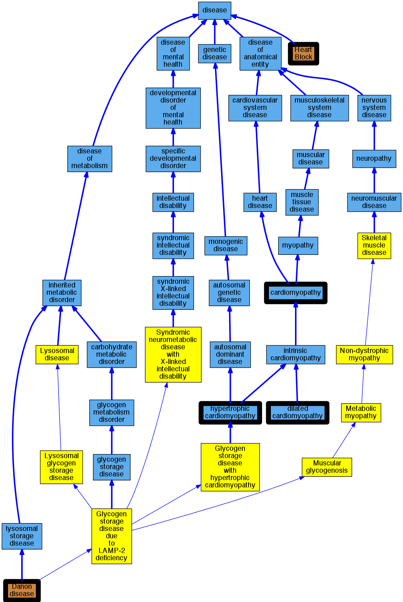

## GENE: LAMP2

[matched diseases visual](LAMP2.png)  <-- click on raw to zoom

### Dannon Disease
 * [disease -](http://beta.monarchinitiative.org/disease/disease) Confidence: low/0.15625

### Hypertrophic Cardiomyopathy
 * [DOID:11984 hypertrophic cardiomyopathy](http://beta.monarchinitiative.org/disease/DOID:11984) Confidence: high
    * Equiv:[MESH:D002312 Cardiomyopathy, Hypertrophic](http://beta.monarchinitiative.org/disease/MESH:D002312)
    * Equiv:[MESH:D024741 Cardiomyopathy, Hypertrophic, Familial](http://beta.monarchinitiative.org/disease/MESH:D024741)
    * Syn: "familial hypertrophic cardiomyopathy"
    * Syn: "hypertrophic obstructive cardiomyopathy"

### Primary familial hypertrophic cardiomyopathy
 * [DOID:11984 hypertrophic cardiomyopathy](http://beta.monarchinitiative.org/disease/DOID:11984) Confidence: low/0.1953125
    * Equiv:[MESH:D002312 Cardiomyopathy, Hypertrophic](http://beta.monarchinitiative.org/disease/MESH:D002312)
    * Equiv:[MESH:D024741 Cardiomyopathy, Hypertrophic, Familial](http://beta.monarchinitiative.org/disease/MESH:D024741)
    * Syn: "familial hypertrophic cardiomyopathy"
    * Syn: "hypertrophic obstructive cardiomyopathy"

### Danon disease
 * [OMIM:300257 Danon disease](http://beta.monarchinitiative.org/disease/OMIM:300257) Confidence: high
    * Equiv:[DOID:0050437 Danon disease](http://beta.monarchinitiative.org/disease/DOID:0050437)
    * Equiv:[MESH:D052120 Glycogen Storage Disease Type IIb](http://beta.monarchinitiative.org/disease/MESH:D052120)
    * Syn: "ANTOPOL DISEASE"
    * Syn: "Antopol Disease"
    * Syn: "DANON DISEASE"
    * Syn: "Glycogen Storage Disease Iib"
    * Syn: "Gsd Iib, Formerly"
    * Syn: "Lysosomal Glycogen Storage Disease Without Acid Maltase Deficiency, Formerly"
    * Syn: "Pseudoglycogenosis 2"
    * Syn: "PSEUDOGLYCOGENOSIS II"
    * Syn: "Vacuolar Cardiomyopathy and Myopathy, X-Linked"

### Primary dilated cardiomyopathy
 * [DOID:12930 dilated cardiomyopathy](http://beta.monarchinitiative.org/disease/DOID:12930) Confidence: high
    * Syn: "Congestive cardiomyopathy"
    * Syn: "Familial dilated cardiomyopathy"
    * Syn: "Idiopathic dilation cardiomyopathy"
    * Syn: "primary dilated cardiomyopathy"

### Trifascicular block on electrocardiogram
 * [OMIM:209600 Heart Block](http://beta.monarchinitiative.org/disease/OMIM:209600) Confidence: low/0.0703125
    * Equiv:[MESH:D006327 Heart Block](http://beta.monarchinitiative.org/disease/MESH:D006327)
    * Syn: "A-V Dissociation"
    * Syn: "ATRIOVENTRICULAR DISSOCIATION"

### cardiomyopathy
 * [DOID:0050700 cardiomyopathy](http://beta.monarchinitiative.org/disease/DOID:0050700) Confidence: high
    * Equiv:[MESH:D009202 Cardiomyopathies](http://beta.monarchinitiative.org/disease/MESH:D009202)
    * Syn: "Cardiomyopathies"

### DANON DISEASE
 * [OMIM:300257 Danon disease](http://beta.monarchinitiative.org/disease/OMIM:300257) Confidence: high
    * Equiv:[DOID:0050437 Danon disease](http://beta.monarchinitiative.org/disease/DOID:0050437)
    * Equiv:[MESH:D052120 Glycogen Storage Disease Type IIb](http://beta.monarchinitiative.org/disease/MESH:D052120)
    * Syn: "ANTOPOL DISEASE"
    * Syn: "Antopol Disease"
    * Syn: "DANON DISEASE"
    * Syn: "Glycogen Storage Disease Iib"
    * Syn: "Gsd Iib, Formerly"
    * Syn: "Lysosomal Glycogen Storage Disease Without Acid Maltase Deficiency, Formerly"
    * Syn: "Pseudoglycogenosis 2"
    * Syn: "PSEUDOGLYCOGENOSIS II"
    * Syn: "Vacuolar Cardiomyopathy and Myopathy, X-Linked"

### Primary dilated cardiomyopathy
 * [DOID:12930 dilated cardiomyopathy](http://beta.monarchinitiative.org/disease/DOID:12930) Confidence: high
    * Syn: "Congestive cardiomyopathy"
    * Syn: "Familial dilated cardiomyopathy"
    * Syn: "Idiopathic dilation cardiomyopathy"
    * Syn: "primary dilated cardiomyopathy"

### Primary dilated cardiomyopathy
 * [DOID:12930 dilated cardiomyopathy](http://beta.monarchinitiative.org/disease/DOID:12930) Confidence: high
    * Syn: "Congestive cardiomyopathy"
    * Syn: "Familial dilated cardiomyopathy"
    * Syn: "Idiopathic dilation cardiomyopathy"
    * Syn: "primary dilated cardiomyopathy"

### Primary familial hypertrophic cardiomyopathy
 * [DOID:11984 hypertrophic cardiomyopathy](http://beta.monarchinitiative.org/disease/DOID:11984) Confidence: low/0.1953125
    * Equiv:[MESH:D002312 Cardiomyopathy, Hypertrophic](http://beta.monarchinitiative.org/disease/MESH:D002312)
    * Equiv:[MESH:D024741 Cardiomyopathy, Hypertrophic, Familial](http://beta.monarchinitiative.org/disease/MESH:D024741)
    * Syn: "familial hypertrophic cardiomyopathy"
    * Syn: "hypertrophic obstructive cardiomyopathy"

### Primary familial hypertrophic cardiomyopathy
 * [DOID:11984 hypertrophic cardiomyopathy](http://beta.monarchinitiative.org/disease/DOID:11984) Confidence: low/0.1953125
    * Equiv:[MESH:D002312 Cardiomyopathy, Hypertrophic](http://beta.monarchinitiative.org/disease/MESH:D002312)
    * Equiv:[MESH:D024741 Cardiomyopathy, Hypertrophic, Familial](http://beta.monarchinitiative.org/disease/MESH:D024741)
    * Syn: "familial hypertrophic cardiomyopathy"
    * Syn: "hypertrophic obstructive cardiomyopathy"

### Dannon Disease
 * [disease -](http://beta.monarchinitiative.org/disease/disease) Confidence: low/0.15625

### Hypertrophic Cardiomyopathy
 * [DOID:11984 hypertrophic cardiomyopathy](http://beta.monarchinitiative.org/disease/DOID:11984) Confidence: high
    * Equiv:[MESH:D002312 Cardiomyopathy, Hypertrophic](http://beta.monarchinitiative.org/disease/MESH:D002312)
    * Equiv:[MESH:D024741 Cardiomyopathy, Hypertrophic, Familial](http://beta.monarchinitiative.org/disease/MESH:D024741)
    * Syn: "familial hypertrophic cardiomyopathy"
    * Syn: "hypertrophic obstructive cardiomyopathy"

### Primary dilated cardiomyopathy
 * [DOID:12930 dilated cardiomyopathy](http://beta.monarchinitiative.org/disease/DOID:12930) Confidence: high
    * Syn: "Congestive cardiomyopathy"
    * Syn: "Familial dilated cardiomyopathy"
    * Syn: "Idiopathic dilation cardiomyopathy"
    * Syn: "primary dilated cardiomyopathy"

### cardiomyopathy
 * [DOID:0050700 cardiomyopathy](http://beta.monarchinitiative.org/disease/DOID:0050700) Confidence: high
    * Equiv:[MESH:D009202 Cardiomyopathies](http://beta.monarchinitiative.org/disease/MESH:D009202)
    * Syn: "Cardiomyopathies"
