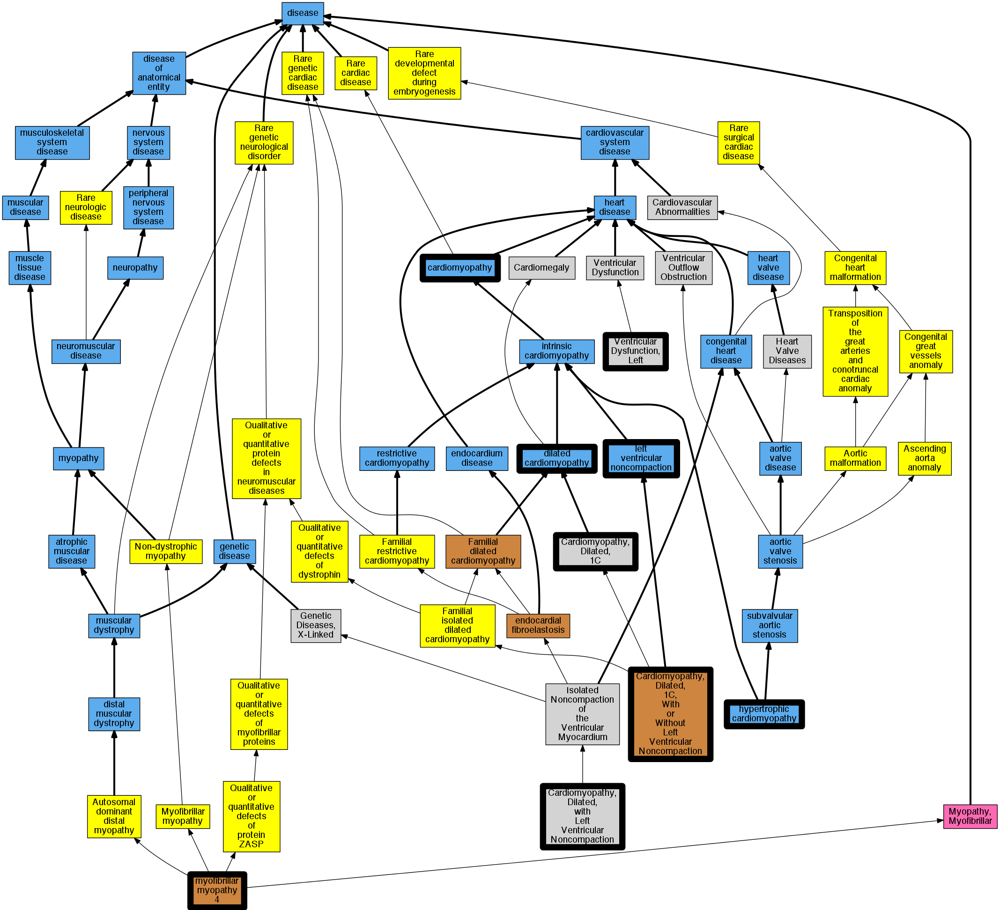

## GENE: LDB3

[matched diseases visual](LDB3.png)  <-- click on raw to zoom

### CARDIOMYOPATHY, DILATED, 1C, WITH LEFT VENTRICULAR NONCOMPACTION
 * [OMIM:601493 Cardiomyopathy, Dilated, 1C](http://beta.monarchinitiative.org/disease/OMIM:601493) Confidence: low/0.15702479338842976
    * Equiv:[MESH:C563307 Cardiomyopathy, Dilated, 1C](http://beta.monarchinitiative.org/disease/MESH:C563307)
    * Syn: "CARDIOMYOPATHY, DILATED, 1C, WITH OR WITHOUT LEFT VENTRICULAR NONCOMPACTION; CMD1C"
    * Syn: "Cardiomyopathy, Familial Hypertrophic, 24"
    * Syn: "CMD1C"
    * Syn: "Left Ventricular Noncompaction 3"

### CARDIOMYOPATHY, FAMILIAL HYPERTROPHIC, 24
 * [OMIM:601493 Cardiomyopathy, Dilated, 1C](http://beta.monarchinitiative.org/disease/OMIM:601493) Confidence: high
    * Equiv:[MESH:C563307 Cardiomyopathy, Dilated, 1C](http://beta.monarchinitiative.org/disease/MESH:C563307)
    * Syn: "CARDIOMYOPATHY, DILATED, 1C, WITH OR WITHOUT LEFT VENTRICULAR NONCOMPACTION; CMD1C"
    * Syn: "Cardiomyopathy, Familial Hypertrophic, 24"
    * Syn: "CMD1C"
    * Syn: "Left Ventricular Noncompaction 3"

### Cardiomyopathy
 * [DOID:0050700 cardiomyopathy](http://beta.monarchinitiative.org/disease/DOID:0050700) Confidence: high
    * Equiv:[MESH:D009202 Cardiomyopathies](http://beta.monarchinitiative.org/disease/MESH:D009202)
    * Syn: "Cardiomyopathies"

### Cardiomyopathy, dilated
 * [DOID:12930 dilated cardiomyopathy](http://beta.monarchinitiative.org/disease/DOID:12930) Confidence: high
    * Syn: "Congestive cardiomyopathy"
    * Syn: "Familial dilated cardiomyopathy"
    * Syn: "Idiopathic dilation cardiomyopathy"
    * Syn: "primary dilated cardiomyopathy"

### Cardiomyopathy, dilated
 * [DOID:12930 dilated cardiomyopathy](http://beta.monarchinitiative.org/disease/DOID:12930) Confidence: high
    * Syn: "Congestive cardiomyopathy"
    * Syn: "Familial dilated cardiomyopathy"
    * Syn: "Idiopathic dilation cardiomyopathy"
    * Syn: "primary dilated cardiomyopathy"

### Dilated Cardiomyopathy with Left Ventricular Noncompaction
 * [MESH:C565277 Cardiomyopathy, Dilated, with Left Ventricular Noncompaction](http://beta.monarchinitiative.org/disease/MESH:C565277) Confidence: high

### MYOPATHY, MYOFIBRILLAR, 4
 * [OMIM:609452 Myopathy, Myofibrillar, 4](http://beta.monarchinitiative.org/disease/OMIM:609452) Confidence: high
    * Syn: "MFM4"
    * Syn: "MYOPATHY, MYOFIBRILLAR, 4; MFM4"

### Primary familial hypertrophic cardiomyopathy
 * [DOID:11984 hypertrophic cardiomyopathy](http://beta.monarchinitiative.org/disease/DOID:11984) Confidence: low/0.1953125
    * Equiv:[MESH:D002312 Cardiomyopathy, Hypertrophic](http://beta.monarchinitiative.org/disease/MESH:D002312)
    * Equiv:[MESH:D024741 Cardiomyopathy, Hypertrophic, Familial](http://beta.monarchinitiative.org/disease/MESH:D024741)
    * Syn: "familial hypertrophic cardiomyopathy"
    * Syn: "hypertrophic obstructive cardiomyopathy"

### Dilated Cardiomyopathy
 * [DOID:12930 dilated cardiomyopathy](http://beta.monarchinitiative.org/disease/DOID:12930) Confidence: high
    * Syn: "Congestive cardiomyopathy"
    * Syn: "Familial dilated cardiomyopathy"
    * Syn: "Idiopathic dilation cardiomyopathy"
    * Syn: "primary dilated cardiomyopathy"

### Dilated Cardiomyopathy with Left Ventricular Noncompaction
 * [MESH:C565277 Cardiomyopathy, Dilated, with Left Ventricular Noncompaction](http://beta.monarchinitiative.org/disease/MESH:C565277) Confidence: high

### LEFT VENTRICULAR NONCOMPACTION 3
 * [OMIM:601493 Cardiomyopathy, Dilated, 1C](http://beta.monarchinitiative.org/disease/OMIM:601493) Confidence: high
    * Equiv:[MESH:C563307 Cardiomyopathy, Dilated, 1C](http://beta.monarchinitiative.org/disease/MESH:C563307)
    * Syn: "CARDIOMYOPATHY, DILATED, 1C, WITH OR WITHOUT LEFT VENTRICULAR NONCOMPACTION; CMD1C"
    * Syn: "Cardiomyopathy, Familial Hypertrophic, 24"
    * Syn: "CMD1C"
    * Syn: "Left Ventricular Noncompaction 3"

### Cardiomyopathy, dilated 1C
 * [OMIM:601493 Cardiomyopathy, Dilated, 1C](http://beta.monarchinitiative.org/disease/OMIM:601493) Confidence: high
    * Equiv:[MESH:C563307 Cardiomyopathy, Dilated, 1C](http://beta.monarchinitiative.org/disease/MESH:C563307)
    * Syn: "CARDIOMYOPATHY, DILATED, 1C, WITH OR WITHOUT LEFT VENTRICULAR NONCOMPACTION; CMD1C"
    * Syn: "Cardiomyopathy, Familial Hypertrophic, 24"
    * Syn: "CMD1C"
    * Syn: "Left Ventricular Noncompaction 3"

### Dilated Cardiomyopathy
 * [DOID:12930 dilated cardiomyopathy](http://beta.monarchinitiative.org/disease/DOID:12930) Confidence: high
    * Syn: "Congestive cardiomyopathy"
    * Syn: "Familial dilated cardiomyopathy"
    * Syn: "Idiopathic dilation cardiomyopathy"
    * Syn: "primary dilated cardiomyopathy"

### Primary familial hypertrophic cardiomyopathy
 * [DOID:11984 hypertrophic cardiomyopathy](http://beta.monarchinitiative.org/disease/DOID:11984) Confidence: low/0.1953125
    * Equiv:[MESH:D002312 Cardiomyopathy, Hypertrophic](http://beta.monarchinitiative.org/disease/MESH:D002312)
    * Equiv:[MESH:D024741 Cardiomyopathy, Hypertrophic, Familial](http://beta.monarchinitiative.org/disease/MESH:D024741)
    * Syn: "familial hypertrophic cardiomyopathy"
    * Syn: "hypertrophic obstructive cardiomyopathy"

### CARDIOMYOPATHY, DILATED, 1C
 * [OMIM:601493 Cardiomyopathy, Dilated, 1C](http://beta.monarchinitiative.org/disease/OMIM:601493) Confidence: high
    * Equiv:[MESH:C563307 Cardiomyopathy, Dilated, 1C](http://beta.monarchinitiative.org/disease/MESH:C563307)
    * Syn: "CARDIOMYOPATHY, DILATED, 1C, WITH OR WITHOUT LEFT VENTRICULAR NONCOMPACTION; CMD1C"
    * Syn: "Cardiomyopathy, Familial Hypertrophic, 24"
    * Syn: "CMD1C"
    * Syn: "Left Ventricular Noncompaction 3"

### Cardiomyopathy
 * [DOID:0050700 cardiomyopathy](http://beta.monarchinitiative.org/disease/DOID:0050700) Confidence: high
    * Equiv:[MESH:D009202 Cardiomyopathies](http://beta.monarchinitiative.org/disease/MESH:D009202)
    * Syn: "Cardiomyopathies"

### Left ventricular noncompaction cardiomyopathy
 * [DC:0000237 Left Ventricular Noncompaction](http://beta.monarchinitiative.org/disease/DC:0000237) Confidence: low/0.1953125

### Primary familial hypertrophic cardiomyopathy
 * [DOID:11984 hypertrophic cardiomyopathy](http://beta.monarchinitiative.org/disease/DOID:11984) Confidence: low/0.1953125
    * Equiv:[MESH:D002312 Cardiomyopathy, Hypertrophic](http://beta.monarchinitiative.org/disease/MESH:D002312)
    * Equiv:[MESH:D024741 Cardiomyopathy, Hypertrophic, Familial](http://beta.monarchinitiative.org/disease/MESH:D024741)
    * Syn: "familial hypertrophic cardiomyopathy"
    * Syn: "hypertrophic obstructive cardiomyopathy"
