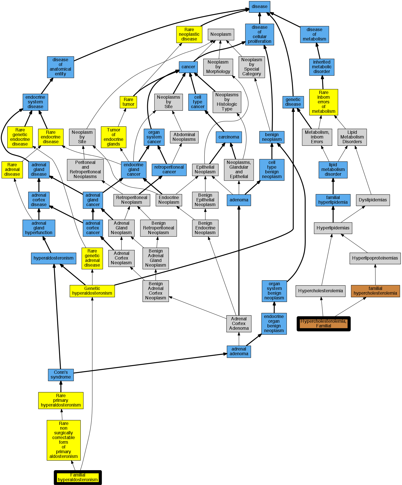

## GENE: LDLR

[matched diseases visual](LDLR.png)  <-- click on raw to zoom

### FH BALTIMORE-1
 * [OMIM:613677 Familial hyperaldosteronism type III](http://beta.monarchinitiative.org/disease/OMIM:613677) Confidence: low/0.0763888888888889
    * Equiv:[Orphanet:251274 Familial hyperaldosteronism type III](http://beta.monarchinitiative.org/disease/Orphanet:251274)
    * Syn: "Fh 3"
    * Syn: "HYPERALDOSTERONISM, FAMILIAL, TYPE III"

### FH DENVER 2
 * [OMIM:613677 Familial hyperaldosteronism type III](http://beta.monarchinitiative.org/disease/OMIM:613677) Confidence: low/0.0763888888888889
    * Equiv:[Orphanet:251274 Familial hyperaldosteronism type III](http://beta.monarchinitiative.org/disease/Orphanet:251274)
    * Syn: "Fh 3"
    * Syn: "HYPERALDOSTERONISM, FAMILIAL, TYPE III"

### FH DRUZE
 * [OMIM:613677 Familial hyperaldosteronism type III](http://beta.monarchinitiative.org/disease/OMIM:613677) Confidence: low/0.09375
    * Equiv:[Orphanet:251274 Familial hyperaldosteronism type III](http://beta.monarchinitiative.org/disease/Orphanet:251274)
    * Syn: "Fh 3"
    * Syn: "HYPERALDOSTERONISM, FAMILIAL, TYPE III"

### FH ELVERUM
 * [OMIM:613677 Familial hyperaldosteronism type III](http://beta.monarchinitiative.org/disease/OMIM:613677) Confidence: low/0.09375
    * Equiv:[Orphanet:251274 Familial hyperaldosteronism type III](http://beta.monarchinitiative.org/disease/Orphanet:251274)
    * Syn: "Fh 3"
    * Syn: "HYPERALDOSTERONISM, FAMILIAL, TYPE III"

### FH GLASCO
 * [OMIM:613677 Familial hyperaldosteronism type III](http://beta.monarchinitiative.org/disease/OMIM:613677) Confidence: low/0.09375
    * Equiv:[Orphanet:251274 Familial hyperaldosteronism type III](http://beta.monarchinitiative.org/disease/Orphanet:251274)
    * Syn: "Fh 3"
    * Syn: "HYPERALDOSTERONISM, FAMILIAL, TYPE III"

### FH ICELAND
 * [OMIM:613677 Familial hyperaldosteronism type III](http://beta.monarchinitiative.org/disease/OMIM:613677) Confidence: low/0.09375
    * Equiv:[Orphanet:251274 Familial hyperaldosteronism type III](http://beta.monarchinitiative.org/disease/Orphanet:251274)
    * Syn: "Fh 3"
    * Syn: "HYPERALDOSTERONISM, FAMILIAL, TYPE III"

### FH KUWAIT
 * [OMIM:613677 Familial hyperaldosteronism type III](http://beta.monarchinitiative.org/disease/OMIM:613677) Confidence: low/0.09375
    * Equiv:[Orphanet:251274 Familial hyperaldosteronism type III](http://beta.monarchinitiative.org/disease/Orphanet:251274)
    * Syn: "Fh 3"
    * Syn: "HYPERALDOSTERONISM, FAMILIAL, TYPE III"

### FH LEBANESE
 * [OMIM:613677 Familial hyperaldosteronism type III](http://beta.monarchinitiative.org/disease/OMIM:613677) Confidence: low/0.09375
    * Equiv:[Orphanet:251274 Familial hyperaldosteronism type III](http://beta.monarchinitiative.org/disease/Orphanet:251274)
    * Syn: "Fh 3"
    * Syn: "HYPERALDOSTERONISM, FAMILIAL, TYPE III"

### FH PARIS 3
 * [OMIM:614205 Three M Syndrome 3](http://beta.monarchinitiative.org/disease/OMIM:614205) Confidence: low/0.0763888888888889
    * Syn: "3M Syndrome 3"
    * Syn: "3M3"
    * Syn: "THREE M SYNDROME 3; 3M3"

### FH PAVIA
 * [OMIM:613677 Familial hyperaldosteronism type III](http://beta.monarchinitiative.org/disease/OMIM:613677) Confidence: low/0.09375
    * Equiv:[Orphanet:251274 Familial hyperaldosteronism type III](http://beta.monarchinitiative.org/disease/Orphanet:251274)
    * Syn: "Fh 3"
    * Syn: "HYPERALDOSTERONISM, FAMILIAL, TYPE III"

### FH PISCATAWAY
 * [OMIM:613677 Familial hyperaldosteronism type III](http://beta.monarchinitiative.org/disease/OMIM:613677) Confidence: low/0.09375
    * Equiv:[Orphanet:251274 Familial hyperaldosteronism type III](http://beta.monarchinitiative.org/disease/Orphanet:251274)
    * Syn: "Fh 3"
    * Syn: "HYPERALDOSTERONISM, FAMILIAL, TYPE III"

### FH PORTUGAL
 * [OMIM:613677 Familial hyperaldosteronism type III](http://beta.monarchinitiative.org/disease/OMIM:613677) Confidence: low/0.09375
    * Equiv:[Orphanet:251274 Familial hyperaldosteronism type III](http://beta.monarchinitiative.org/disease/Orphanet:251274)
    * Syn: "Fh 3"
    * Syn: "HYPERALDOSTERONISM, FAMILIAL, TYPE III"

### FH VANCOUVER 3
 * [OMIM:614205 Three M Syndrome 3](http://beta.monarchinitiative.org/disease/OMIM:614205) Confidence: low/0.0763888888888889
    * Syn: "3M Syndrome 3"
    * Syn: "3M3"
    * Syn: "THREE M SYNDROME 3; 3M3"

### FH VANCOUVER 4
 * [OMIM:613677 Familial hyperaldosteronism type III](http://beta.monarchinitiative.org/disease/OMIM:613677) Confidence: low/0.0763888888888889
    * Equiv:[Orphanet:251274 Familial hyperaldosteronism type III](http://beta.monarchinitiative.org/disease/Orphanet:251274)
    * Syn: "Fh 3"
    * Syn: "HYPERALDOSTERONISM, FAMILIAL, TYPE III"

### Familial hypercholesterolemia
 * [DOID:13810 familial hypercholesterolemia](http://beta.monarchinitiative.org/disease/DOID:13810) Confidence: high
    * Syn: "familial hyperbetalipoproteinaemia"
    * Syn: "familial hypercholesteremia"
    * Syn: "Fredrickson type IIa hyperlipoproteinemia"
    * Syn: "Fredrickson type IIa lipidaemia"
    * Syn: "hyperbetalipoproteinemia"
    * Syn: "type II hyperlipidemia"

### Hypercholesterolaemia
 * [DOID:2487 -](http://beta.monarchinitiative.org/disease/DOID:2487) Confidence: high
    * Syn: "hypercholesteremia"
    * Syn: "hypercholesterolaemia"

### FH AFRIKANER 3
 * [OMIM:614205 Three M Syndrome 3](http://beta.monarchinitiative.org/disease/OMIM:614205) Confidence: low/0.0763888888888889
    * Syn: "3M Syndrome 3"
    * Syn: "3M3"
    * Syn: "THREE M SYNDROME 3; 3M3"

### FH AFRIKANER 4
 * [OMIM:613677 Familial hyperaldosteronism type III](http://beta.monarchinitiative.org/disease/OMIM:613677) Confidence: low/0.0763888888888889
    * Equiv:[Orphanet:251274 Familial hyperaldosteronism type III](http://beta.monarchinitiative.org/disease/Orphanet:251274)
    * Syn: "Fh 3"
    * Syn: "HYPERALDOSTERONISM, FAMILIAL, TYPE III"

### FH ALGERIA
 * [OMIM:613677 Familial hyperaldosteronism type III](http://beta.monarchinitiative.org/disease/OMIM:613677) Confidence: low/0.09375
    * Equiv:[Orphanet:251274 Familial hyperaldosteronism type III](http://beta.monarchinitiative.org/disease/Orphanet:251274)
    * Syn: "Fh 3"
    * Syn: "HYPERALDOSTERONISM, FAMILIAL, TYPE III"

### FH BARI
 * [OMIM:613677 Familial hyperaldosteronism type III](http://beta.monarchinitiative.org/disease/OMIM:613677) Confidence: low/0.09375
    * Equiv:[Orphanet:251274 Familial hyperaldosteronism type III](http://beta.monarchinitiative.org/disease/Orphanet:251274)
    * Syn: "Fh 3"
    * Syn: "HYPERALDOSTERONISM, FAMILIAL, TYPE III"

### FH BOLOGNA 2
 * [OMIM:613677 Familial hyperaldosteronism type III](http://beta.monarchinitiative.org/disease/OMIM:613677) Confidence: low/0.0763888888888889
    * Equiv:[Orphanet:251274 Familial hyperaldosteronism type III](http://beta.monarchinitiative.org/disease/Orphanet:251274)
    * Syn: "Fh 3"
    * Syn: "HYPERALDOSTERONISM, FAMILIAL, TYPE III"

### FH CAPE TOWN 2
 * [OMIM:613677 Familial hyperaldosteronism type III](http://beta.monarchinitiative.org/disease/OMIM:613677) Confidence: low/0.0703125
    * Equiv:[Orphanet:251274 Familial hyperaldosteronism type III](http://beta.monarchinitiative.org/disease/Orphanet:251274)
    * Syn: "Fh 3"
    * Syn: "HYPERALDOSTERONISM, FAMILIAL, TYPE III"

### FH FRENCH CANADIAN 5
 * [OMIM:613677 Familial hyperaldosteronism type III](http://beta.monarchinitiative.org/disease/OMIM:613677) Confidence: low/0.0703125
    * Equiv:[Orphanet:251274 Familial hyperaldosteronism type III](http://beta.monarchinitiative.org/disease/Orphanet:251274)
    * Syn: "Fh 3"
    * Syn: "HYPERALDOSTERONISM, FAMILIAL, TYPE III"

### FH LONDON 2
 * [OMIM:613677 Familial hyperaldosteronism type III](http://beta.monarchinitiative.org/disease/OMIM:613677) Confidence: low/0.0763888888888889
    * Equiv:[Orphanet:251274 Familial hyperaldosteronism type III](http://beta.monarchinitiative.org/disease/Orphanet:251274)
    * Syn: "Fh 3"
    * Syn: "HYPERALDOSTERONISM, FAMILIAL, TYPE III"

### FH OSAKA 3
 * [OMIM:614205 Three M Syndrome 3](http://beta.monarchinitiative.org/disease/OMIM:614205) Confidence: low/0.0763888888888889
    * Syn: "3M Syndrome 3"
    * Syn: "3M3"
    * Syn: "THREE M SYNDROME 3; 3M3"

### FH PARIS 1
 * [OMIM:613677 Familial hyperaldosteronism type III](http://beta.monarchinitiative.org/disease/OMIM:613677) Confidence: low/0.0763888888888889
    * Equiv:[Orphanet:251274 Familial hyperaldosteronism type III](http://beta.monarchinitiative.org/disease/Orphanet:251274)
    * Syn: "Fh 3"
    * Syn: "HYPERALDOSTERONISM, FAMILIAL, TYPE III"

### FH PARIS 2
 * [OMIM:613677 Familial hyperaldosteronism type III](http://beta.monarchinitiative.org/disease/OMIM:613677) Confidence: low/0.0763888888888889
    * Equiv:[Orphanet:251274 Familial hyperaldosteronism type III](http://beta.monarchinitiative.org/disease/Orphanet:251274)
    * Syn: "Fh 3"
    * Syn: "HYPERALDOSTERONISM, FAMILIAL, TYPE III"

### FH REYKJAVIK
 * [OMIM:613677 Familial hyperaldosteronism type III](http://beta.monarchinitiative.org/disease/OMIM:613677) Confidence: low/0.09375
    * Equiv:[Orphanet:251274 Familial hyperaldosteronism type III](http://beta.monarchinitiative.org/disease/Orphanet:251274)
    * Syn: "Fh 3"
    * Syn: "HYPERALDOSTERONISM, FAMILIAL, TYPE III"

### FH TURKEY
 * [OMIM:613677 Familial hyperaldosteronism type III](http://beta.monarchinitiative.org/disease/OMIM:613677) Confidence: low/0.09375
    * Equiv:[Orphanet:251274 Familial hyperaldosteronism type III](http://beta.monarchinitiative.org/disease/Orphanet:251274)
    * Syn: "Fh 3"
    * Syn: "HYPERALDOSTERONISM, FAMILIAL, TYPE III"

### FH VANCOUVER 2
 * [OMIM:613677 Familial hyperaldosteronism type III](http://beta.monarchinitiative.org/disease/OMIM:613677) Confidence: low/0.0763888888888889
    * Equiv:[Orphanet:251274 Familial hyperaldosteronism type III](http://beta.monarchinitiative.org/disease/Orphanet:251274)
    * Syn: "Fh 3"
    * Syn: "HYPERALDOSTERONISM, FAMILIAL, TYPE III"

### FH ZAMBIA
 * [OMIM:613677 Familial hyperaldosteronism type III](http://beta.monarchinitiative.org/disease/OMIM:613677) Confidence: low/0.09375
    * Equiv:[Orphanet:251274 Familial hyperaldosteronism type III](http://beta.monarchinitiative.org/disease/Orphanet:251274)
    * Syn: "Fh 3"
    * Syn: "HYPERALDOSTERONISM, FAMILIAL, TYPE III"

### FH AFRIKANER 1
 * [OMIM:613677 Familial hyperaldosteronism type III](http://beta.monarchinitiative.org/disease/OMIM:613677) Confidence: low/0.0763888888888889
    * Equiv:[Orphanet:251274 Familial hyperaldosteronism type III](http://beta.monarchinitiative.org/disease/Orphanet:251274)
    * Syn: "Fh 3"
    * Syn: "HYPERALDOSTERONISM, FAMILIAL, TYPE III"

### FH AFRIKANER 2
 * [OMIM:613677 Familial hyperaldosteronism type III](http://beta.monarchinitiative.org/disease/OMIM:613677) Confidence: low/0.0763888888888889
    * Equiv:[Orphanet:251274 Familial hyperaldosteronism type III](http://beta.monarchinitiative.org/disease/Orphanet:251274)
    * Syn: "Fh 3"
    * Syn: "HYPERALDOSTERONISM, FAMILIAL, TYPE III"

### FH FRENCH CANADIAN 1
 * [OMIM:613677 Familial hyperaldosteronism type III](http://beta.monarchinitiative.org/disease/OMIM:613677) Confidence: low/0.0703125
    * Equiv:[Orphanet:251274 Familial hyperaldosteronism type III](http://beta.monarchinitiative.org/disease/Orphanet:251274)
    * Syn: "Fh 3"
    * Syn: "HYPERALDOSTERONISM, FAMILIAL, TYPE III"

### FH FRENCH CANADIAN 2
 * [OMIM:613677 Familial hyperaldosteronism type III](http://beta.monarchinitiative.org/disease/OMIM:613677) Confidence: low/0.0703125
    * Equiv:[Orphanet:251274 Familial hyperaldosteronism type III](http://beta.monarchinitiative.org/disease/Orphanet:251274)
    * Syn: "Fh 3"
    * Syn: "HYPERALDOSTERONISM, FAMILIAL, TYPE III"

### FH FRENCH CANADIAN 4
 * [OMIM:613677 Familial hyperaldosteronism type III](http://beta.monarchinitiative.org/disease/OMIM:613677) Confidence: low/0.0703125
    * Equiv:[Orphanet:251274 Familial hyperaldosteronism type III](http://beta.monarchinitiative.org/disease/Orphanet:251274)
    * Syn: "Fh 3"
    * Syn: "HYPERALDOSTERONISM, FAMILIAL, TYPE III"

### FH LONDON 1
 * [OMIM:613677 Familial hyperaldosteronism type III](http://beta.monarchinitiative.org/disease/OMIM:613677) Confidence: low/0.0763888888888889
    * Equiv:[Orphanet:251274 Familial hyperaldosteronism type III](http://beta.monarchinitiative.org/disease/Orphanet:251274)
    * Syn: "Fh 3"
    * Syn: "HYPERALDOSTERONISM, FAMILIAL, TYPE III"

### FH LONDON 4
 * [OMIM:613677 Familial hyperaldosteronism type III](http://beta.monarchinitiative.org/disease/OMIM:613677) Confidence: low/0.0763888888888889
    * Equiv:[Orphanet:251274 Familial hyperaldosteronism type III](http://beta.monarchinitiative.org/disease/Orphanet:251274)
    * Syn: "Fh 3"
    * Syn: "HYPERALDOSTERONISM, FAMILIAL, TYPE III"

### FH NORTH KARELIA
 * [OMIM:613677 Familial hyperaldosteronism type III](http://beta.monarchinitiative.org/disease/OMIM:613677) Confidence: low/0.0763888888888889
    * Equiv:[Orphanet:251274 Familial hyperaldosteronism type III](http://beta.monarchinitiative.org/disease/Orphanet:251274)
    * Syn: "Fh 3"
    * Syn: "HYPERALDOSTERONISM, FAMILIAL, TYPE III"

### FH POTENZA
 * [OMIM:613677 Familial hyperaldosteronism type III](http://beta.monarchinitiative.org/disease/OMIM:613677) Confidence: low/0.09375
    * Equiv:[Orphanet:251274 Familial hyperaldosteronism type III](http://beta.monarchinitiative.org/disease/Orphanet:251274)
    * Syn: "Fh 3"
    * Syn: "HYPERALDOSTERONISM, FAMILIAL, TYPE III"

### FH ROCHESTER
 * [OMIM:613677 Familial hyperaldosteronism type III](http://beta.monarchinitiative.org/disease/OMIM:613677) Confidence: low/0.09375
    * Equiv:[Orphanet:251274 Familial hyperaldosteronism type III](http://beta.monarchinitiative.org/disease/Orphanet:251274)
    * Syn: "Fh 3"
    * Syn: "HYPERALDOSTERONISM, FAMILIAL, TYPE III"

### FH ST. LOUIS
 * [OMIM:613677 Familial hyperaldosteronism type III](http://beta.monarchinitiative.org/disease/OMIM:613677) Confidence: low/0.0763888888888889
    * Equiv:[Orphanet:251274 Familial hyperaldosteronism type III](http://beta.monarchinitiative.org/disease/Orphanet:251274)
    * Syn: "Fh 3"
    * Syn: "HYPERALDOSTERONISM, FAMILIAL, TYPE III"

### FH VANCOUVER 6
 * [OMIM:613677 Familial hyperaldosteronism type III](http://beta.monarchinitiative.org/disease/OMIM:613677) Confidence: low/0.0763888888888889
    * Equiv:[Orphanet:251274 Familial hyperaldosteronism type III](http://beta.monarchinitiative.org/disease/Orphanet:251274)
    * Syn: "Fh 3"
    * Syn: "HYPERALDOSTERONISM, FAMILIAL, TYPE III"

### HYPERCHOLESTEROLEMIA, FAMILIAL
 * [DOID:13810 familial hypercholesterolemia](http://beta.monarchinitiative.org/disease/DOID:13810) Confidence: high
    * Syn: "familial hyperbetalipoproteinaemia"
    * Syn: "familial hypercholesteremia"
    * Syn: "Fredrickson type IIa hyperlipoproteinemia"
    * Syn: "Fredrickson type IIa lipidaemia"
    * Syn: "hyperbetalipoproteinemia"
    * Syn: "type II hyperlipidemia"

### FH AARHUS
 * [OMIM:613677 Familial hyperaldosteronism type III](http://beta.monarchinitiative.org/disease/OMIM:613677) Confidence: low/0.09375
    * Equiv:[Orphanet:251274 Familial hyperaldosteronism type III](http://beta.monarchinitiative.org/disease/Orphanet:251274)
    * Syn: "Fh 3"
    * Syn: "HYPERALDOSTERONISM, FAMILIAL, TYPE III"

### FH BAHRAIN
 * [OMIM:613677 Familial hyperaldosteronism type III](http://beta.monarchinitiative.org/disease/OMIM:613677) Confidence: low/0.09375
    * Equiv:[Orphanet:251274 Familial hyperaldosteronism type III](http://beta.monarchinitiative.org/disease/Orphanet:251274)
    * Syn: "Fh 3"
    * Syn: "HYPERALDOSTERONISM, FAMILIAL, TYPE III"

### FH CAPE TOWN 1
 * [OMIM:613677 Familial hyperaldosteronism type III](http://beta.monarchinitiative.org/disease/OMIM:613677) Confidence: low/0.0703125
    * Equiv:[Orphanet:251274 Familial hyperaldosteronism type III](http://beta.monarchinitiative.org/disease/Orphanet:251274)
    * Syn: "Fh 3"
    * Syn: "HYPERALDOSTERONISM, FAMILIAL, TYPE III"

### FH GENOA
 * [OMIM:613677 Familial hyperaldosteronism type III](http://beta.monarchinitiative.org/disease/OMIM:613677) Confidence: low/0.09375
    * Equiv:[Orphanet:251274 Familial hyperaldosteronism type III](http://beta.monarchinitiative.org/disease/Orphanet:251274)
    * Syn: "Fh 3"
    * Syn: "HYPERALDOSTERONISM, FAMILIAL, TYPE III"

### FH LEIDEN 3
 * [OMIM:614205 Three M Syndrome 3](http://beta.monarchinitiative.org/disease/OMIM:614205) Confidence: low/0.0763888888888889
    * Syn: "3M Syndrome 3"
    * Syn: "3M3"
    * Syn: "THREE M SYNDROME 3; 3M3"

### FH LONDON 3
 * [OMIM:614205 Three M Syndrome 3](http://beta.monarchinitiative.org/disease/OMIM:614205) Confidence: low/0.0763888888888889
    * Syn: "3M Syndrome 3"
    * Syn: "3M3"
    * Syn: "THREE M SYNDROME 3; 3M3"

### FH MEXICO
 * [OMIM:613677 Familial hyperaldosteronism type III](http://beta.monarchinitiative.org/disease/OMIM:613677) Confidence: low/0.09375
    * Equiv:[Orphanet:251274 Familial hyperaldosteronism type III](http://beta.monarchinitiative.org/disease/Orphanet:251274)
    * Syn: "Fh 3"
    * Syn: "HYPERALDOSTERONISM, FAMILIAL, TYPE III"

### FH NAPLES
 * [OMIM:613677 Familial hyperaldosteronism type III](http://beta.monarchinitiative.org/disease/OMIM:613677) Confidence: low/0.09375
    * Equiv:[Orphanet:251274 Familial hyperaldosteronism type III](http://beta.monarchinitiative.org/disease/Orphanet:251274)
    * Syn: "Fh 3"
    * Syn: "HYPERALDOSTERONISM, FAMILIAL, TYPE III"

### FH NASHVILLE
 * [OMIM:613677 Familial hyperaldosteronism type III](http://beta.monarchinitiative.org/disease/OMIM:613677) Confidence: low/0.09375
    * Equiv:[Orphanet:251274 Familial hyperaldosteronism type III](http://beta.monarchinitiative.org/disease/Orphanet:251274)
    * Syn: "Fh 3"
    * Syn: "HYPERALDOSTERONISM, FAMILIAL, TYPE III"

### FH OSAKA 2
 * [OMIM:613677 Familial hyperaldosteronism type III](http://beta.monarchinitiative.org/disease/OMIM:613677) Confidence: low/0.0763888888888889
    * Equiv:[Orphanet:251274 Familial hyperaldosteronism type III](http://beta.monarchinitiative.org/disease/Orphanet:251274)
    * Syn: "Fh 3"
    * Syn: "HYPERALDOSTERONISM, FAMILIAL, TYPE III"

### FH PORI
 * [OMIM:613677 Familial hyperaldosteronism type III](http://beta.monarchinitiative.org/disease/OMIM:613677) Confidence: low/0.09375
    * Equiv:[Orphanet:251274 Familial hyperaldosteronism type III](http://beta.monarchinitiative.org/disease/Orphanet:251274)
    * Syn: "Fh 3"
    * Syn: "HYPERALDOSTERONISM, FAMILIAL, TYPE III"

### FH PUERTO RICO
 * [OMIM:613677 Familial hyperaldosteronism type III](http://beta.monarchinitiative.org/disease/OMIM:613677) Confidence: low/0.0763888888888889
    * Equiv:[Orphanet:251274 Familial hyperaldosteronism type III](http://beta.monarchinitiative.org/disease/Orphanet:251274)
    * Syn: "Fh 3"
    * Syn: "HYPERALDOSTERONISM, FAMILIAL, TYPE III"

### FH PYRGOS
 * [OMIM:613677 Familial hyperaldosteronism type III](http://beta.monarchinitiative.org/disease/OMIM:613677) Confidence: low/0.09375
    * Equiv:[Orphanet:251274 Familial hyperaldosteronism type III](http://beta.monarchinitiative.org/disease/Orphanet:251274)
    * Syn: "Fh 3"
    * Syn: "HYPERALDOSTERONISM, FAMILIAL, TYPE III"

### FH SAINT OMER
 * [OMIM:613677 Familial hyperaldosteronism type III](http://beta.monarchinitiative.org/disease/OMIM:613677) Confidence: low/0.0763888888888889
    * Equiv:[Orphanet:251274 Familial hyperaldosteronism type III](http://beta.monarchinitiative.org/disease/Orphanet:251274)
    * Syn: "Fh 3"
    * Syn: "HYPERALDOSTERONISM, FAMILIAL, TYPE III"

### FH TONAMI 1
 * [OMIM:613677 Familial hyperaldosteronism type III](http://beta.monarchinitiative.org/disease/OMIM:613677) Confidence: low/0.0763888888888889
    * Equiv:[Orphanet:251274 Familial hyperaldosteronism type III](http://beta.monarchinitiative.org/disease/Orphanet:251274)
    * Syn: "Fh 3"
    * Syn: "HYPERALDOSTERONISM, FAMILIAL, TYPE III"

### FH TSUKUBA 2
 * [OMIM:613677 Familial hyperaldosteronism type III](http://beta.monarchinitiative.org/disease/OMIM:613677) Confidence: low/0.0763888888888889
    * Equiv:[Orphanet:251274 Familial hyperaldosteronism type III](http://beta.monarchinitiative.org/disease/Orphanet:251274)
    * Syn: "Fh 3"
    * Syn: "HYPERALDOSTERONISM, FAMILIAL, TYPE III"

### FH TURKU
 * [OMIM:613677 Familial hyperaldosteronism type III](http://beta.monarchinitiative.org/disease/OMIM:613677) Confidence: low/0.09375
    * Equiv:[Orphanet:251274 Familial hyperaldosteronism type III](http://beta.monarchinitiative.org/disease/Orphanet:251274)
    * Syn: "Fh 3"
    * Syn: "HYPERALDOSTERONISM, FAMILIAL, TYPE III"

### Familial Hypercholesterolemia
 * [DOID:13810 familial hypercholesterolemia](http://beta.monarchinitiative.org/disease/DOID:13810) Confidence: high
    * Syn: "familial hyperbetalipoproteinaemia"
    * Syn: "familial hypercholesteremia"
    * Syn: "Fredrickson type IIa hyperlipoproteinemia"
    * Syn: "Fredrickson type IIa lipidaemia"
    * Syn: "hyperbetalipoproteinemia"
    * Syn: "type II hyperlipidemia"
