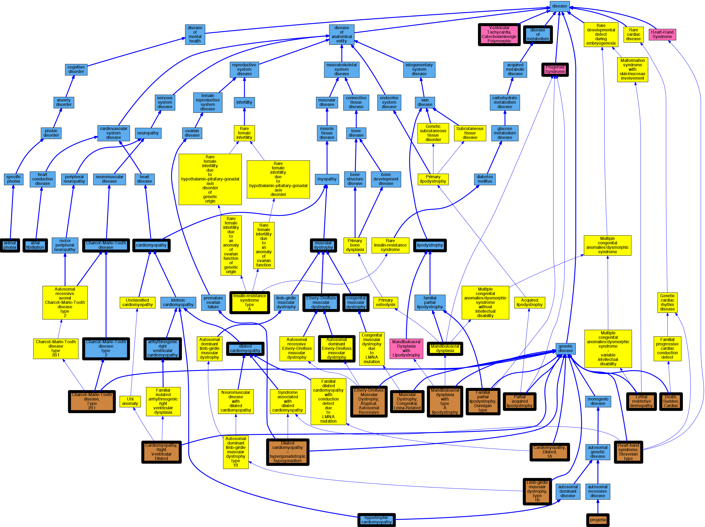

blip-findall -debug matcher -consult matcher.pro -debug index -goal ix -u metadata_nlp -i all_labels.pro -r mondoe -i clingen.pro -goal t

## GENE: LMNA

[matched diseases visual](LMNA.png)

### Arrhythmogenic right ventricular cardiomyopathy
 * [DOID:0050431 arrhythmogenic right ventricular cardiomyopathy](http://beta.monarchinitiative.org/disease/DOID:0050431) Confidence: high
    * Equiv:[MESH:D019571 Arrhythmogenic Right Ventricular Dysplasia](http://beta.monarchinitiative.org/disease/MESH:D019571)
    * Syn: "arrhythmogenic right ventricular dysplasia"
    * Syn: "arrhythmogenic right ventricular dysplasia/cardiomyopathy"
    * Syn: "ARVC"
    * Syn: "ARVC cardiomyopathy"
    * Syn: "ARVD"

### CARDIOMYOPATHY, DILATED, 1A
 * [OMIM:115200 Cardiomyopathy, Dilated, 1A](http://beta.monarchinitiative.org/disease/OMIM:115200) Confidence: high
    * Syn: "Cardiomyopathy, Congestive"
    * Syn: "CARDIOMYOPATHY, DILATED, 1A; CMD1A"
    * Syn: "Cardiomyopathy, Dilated, With Conduction Defect 1"
    * Syn: "Cardiomyopathy, Familial Idiopathic"
    * Syn: "Cardiomyopathy, Idiopathic Dilated"
    * Syn: "CMD1A"

### CARDIOMYOPATHY, DILATED, WITH HYPERGONADOTRIPIC HYPOGONADISM
 * [OMIM:212112 Dilated cardiomyopathy - hypergonadotropic hypogonadism](http://beta.monarchinitiative.org/disease/OMIM:212112) Confidence: low/0.18000000000000002
    * Equiv:[Orphanet:2229 Dilated cardiomyopathy - hypergonadotropic hypogonadism](http://beta.monarchinitiative.org/disease/Orphanet:2229)
    * Equiv:[MESH:C535580 Najjar syndrome](http://beta.monarchinitiative.org/disease/MESH:C535580)
    * Equiv:[MESH:C535703 Malouf syndrome](http://beta.monarchinitiative.org/disease/MESH:C535703)
    * Syn: "Cardiogenital Syndrome"
    * Syn: "Cardiomyopathy With Primary Testicular Failure"
    * Syn: "Cardiomyopathy, Congestive, With Hypergonadotropic Hypogonadism"
    * Syn: "CARDIOMYOPATHY, DILATED, WITH HYPERGONADOTROPIC HYPOGONADISM"
    * Syn: "Cardiomyopathy, Dilated, With Premature Ovarian Failure"
    * Syn: "Genital Anomaly With Cardiomyopathy"
    * Syn: "Malouf Syndrome"
    * Syn: "Najjar Syndrome"

### CHARCOT-MARIE-TOOTH DISEASE, AXONAL, TYPE 2B1
 * [OMIM:605588 Charcot-Marie-Tooth disease, Type 2B1](http://beta.monarchinitiative.org/disease/OMIM:605588) Confidence: low/0.20987654320987653
    * Equiv:[MESH:C537990 Charcot-Marie-Tooth disease, Type 2B1](http://beta.monarchinitiative.org/disease/MESH:C537990)
    * Syn: "Charcot-Marie-Tooth Disease, Axonal, Autosomal Recessive, 2B1"
    * Syn: "CHARCOT-MARIE-TOOTH DISEASE, AXONAL, TYPE 2B1; CMT2B1"
    * Syn: "Charcot-Marie-Tooth Disease, Neuronal, Type 2B1"
    * Syn: "Charcot-Marie-Tooth Neuropathy, Type 2B1"
    * Syn: "CMT2B1"

### Cardiomyopathy
 * [DOID:0050700 cardiomyopathy](http://beta.monarchinitiative.org/disease/DOID:0050700) Confidence: high
    * Equiv:[MESH:D009202 Cardiomyopathies](http://beta.monarchinitiative.org/disease/MESH:D009202)
    * Syn: "Cardiomyopathies"

### Cardiomyopathy, dilated
 * [DOID:12930 dilated cardiomyopathy](http://beta.monarchinitiative.org/disease/DOID:12930) Confidence: high
    * Syn: "Congestive cardiomyopathy"
    * Syn: "Familial dilated cardiomyopathy"
    * Syn: "Idiopathic dilation cardiomyopathy"
    * Syn: "primary dilated cardiomyopathy"

### Cardiomyopathy, dilated, 1A
 * [OMIM:115200 Cardiomyopathy, Dilated, 1A](http://beta.monarchinitiative.org/disease/OMIM:115200) Confidence: high
    * Syn: "Cardiomyopathy, Congestive"
    * Syn: "CARDIOMYOPATHY, DILATED, 1A; CMD1A"
    * Syn: "Cardiomyopathy, Dilated, With Conduction Defect 1"
    * Syn: "Cardiomyopathy, Familial Idiopathic"
    * Syn: "Cardiomyopathy, Idiopathic Dilated"
    * Syn: "CMD1A"

### Catecholaminergic polymorphic ventricular tachycardia
 * [DC:0000665 Ventricular Tachycardia, Catecholaminergic Polymorphic](http://beta.monarchinitiative.org/disease/DC:0000665) Confidence: high

### Charcot-Marie-Tooth disease
 * [DOID:10595 Charcot-Marie-Tooth disease](http://beta.monarchinitiative.org/disease/DOID:10595) Confidence: high
    * Syn: "Charcot Marie Tooth muscular atrophy"
    * Syn: "CMT - Charcot-Marie-Tooth disease"
    * Syn: "Peroneal muscular atrophy"

### Charcot-Marie-Tooth disease, type 2
 * [DOID:0050539 Charcot-Marie-Tooth disease type 2](http://beta.monarchinitiative.org/disease/DOID:0050539) Confidence: high

### Collapse (finding)
 * [DOID:600 animal phobia](http://beta.monarchinitiative.org/disease/DOID:600) Confidence: low/0.1640625
    * Syn: "Fear of animals (finding)"
    * Syn: "Zoophobia (finding)"

### Dilated Cardiomyopathy
 * [DOID:12930 dilated cardiomyopathy](http://beta.monarchinitiative.org/disease/DOID:12930) Confidence: high
    * Syn: "Congestive cardiomyopathy"
    * Syn: "Familial dilated cardiomyopathy"
    * Syn: "Idiopathic dilation cardiomyopathy"
    * Syn: "primary dilated cardiomyopathy"

### EMERY-DREIFUSS MUSCULAR DYSTROPHY, ATYPICAL, AUTOSOMAL RECESSIVE
 * [OMIM:181350 Emery-Dreifuss Muscular Dystrophy, Atypical, Autosomal Recessive](http://beta.monarchinitiative.org/disease/OMIM:181350) Confidence: high
    * Equiv:[MESH:C567633 Emery-Dreifuss Muscular Dystrophy, Atypical, Autosomal Recessive](http://beta.monarchinitiative.org/disease/MESH:C567633)
    * Syn: "EDMD2"
    * Syn: "Emd2"
    * Syn: "EMERY-DREIFUSS MUSCULAR DYSTROPHY 2, AUTOSOMAL DOMINANT; EDMD2"
    * Syn: "Emery-Dreifuss Muscular Dystrophy 3, Autosomal Recessive"
    * Syn: "Emery-Dreifuss Muscular Dystrophy, Atypical, Autosomal Recessive"
    * Syn: "Emery-Dreifuss Muscular Dystrophy, Autosomal Dominant"
    * Syn: "Hauptmann-Thannhauser Muscular Dystrophy"
    * Syn: "Muscular Dystrophy With Early Contractures and Cardiomyopathy, Autosomal Dominant"
    * Syn: "Scapuloilioperoneal Atrophy With Cardiopathy"

### EMERY-DREIFUSS MUSCULAR DYSTROPHY, AUTOSOMAL DOMINANT
 * [Orphanet:98853 Autosomal dominant Emery-Dreifuss muscular dystrophy](http://beta.monarchinitiative.org/disease/Orphanet:98853) Confidence: high

### HEART-HAND SYNDROME, SLOVENIAN TYPE
 * [OMIM:610140 Heart-hand syndrome, Slovenian type](http://beta.monarchinitiative.org/disease/OMIM:610140) Confidence: high
    * Equiv:[Orphanet:168796 Heart-hand syndrome, Slovenian type](http://beta.monarchinitiative.org/disease/Orphanet:168796)
    * Equiv:[MESH:C535852 Heart-hand syndrome, Slovenian type](http://beta.monarchinitiative.org/disease/MESH:C535852)
    * Syn: "HEART-HAND SYNDROME, SLOVENIAN TYPE"

### HUTCHINSON-GILFORD PROGERIA SYNDROME
 * [OMIM:176670 progeria](http://beta.monarchinitiative.org/disease/OMIM:176670) Confidence: high
    * Equiv:[DOID:3911 progeria](http://beta.monarchinitiative.org/disease/DOID:3911)
    * Equiv:[MESH:C567661 Progeria Syndrome, Childhood-Onset](http://beta.monarchinitiative.org/disease/MESH:C567661)
    * Equiv:[MESH:D011371 Progeria](http://beta.monarchinitiative.org/disease/MESH:D011371)
    * Syn: "HGPS"
    * Syn: "Hutchinson Gilford syndrome"
    * Syn: "Hutchinson-Gilford disease"
    * Syn: "Hutchinson-Gilford Progeria syndrome"
    * Syn: "HUTCHINSON-GILFORD PROGERIA SYNDROME; HGPS"
    * Syn: "Hutchinson-Gilford syndrome (disorder)"
    * Syn: "Progeria"
    * Syn: "Progeria (disorder)"
    * Syn: "Progeria syndrome (disorder) [Ambiguous]"
    * Syn: "Progeria Syndrome, Childhood-Onset"

### HUTCHINSON-GILFORD PROGERIA SYNDROME, ATYPICAL
 * [OMIM:176670 progeria](http://beta.monarchinitiative.org/disease/OMIM:176670) Confidence: low/0.18000000000000002
    * Equiv:[DOID:3911 progeria](http://beta.monarchinitiative.org/disease/DOID:3911)
    * Equiv:[MESH:C567661 Progeria Syndrome, Childhood-Onset](http://beta.monarchinitiative.org/disease/MESH:C567661)
    * Equiv:[MESH:D011371 Progeria](http://beta.monarchinitiative.org/disease/MESH:D011371)
    * Syn: "HGPS"
    * Syn: "Hutchinson Gilford syndrome"
    * Syn: "Hutchinson-Gilford disease"
    * Syn: "Hutchinson-Gilford Progeria syndrome"
    * Syn: "HUTCHINSON-GILFORD PROGERIA SYNDROME; HGPS"
    * Syn: "Hutchinson-Gilford syndrome (disorder)"
    * Syn: "Progeria"
    * Syn: "Progeria (disorder)"
    * Syn: "Progeria syndrome (disorder) [Ambiguous]"
    * Syn: "Progeria Syndrome, Childhood-Onset"

### HUTCHINSON-GILFORD PROGERIA SYNDROME, CHILDHOOD-ONSET
 * [OMIM:176670 progeria](http://beta.monarchinitiative.org/disease/OMIM:176670) Confidence: low/0.15555555555555556
    * Equiv:[DOID:3911 progeria](http://beta.monarchinitiative.org/disease/DOID:3911)
    * Equiv:[MESH:C567661 Progeria Syndrome, Childhood-Onset](http://beta.monarchinitiative.org/disease/MESH:C567661)
    * Equiv:[MESH:D011371 Progeria](http://beta.monarchinitiative.org/disease/MESH:D011371)
    * Syn: "HGPS"
    * Syn: "Hutchinson Gilford syndrome"
    * Syn: "Hutchinson-Gilford disease"
    * Syn: "Hutchinson-Gilford Progeria syndrome"
    * Syn: "HUTCHINSON-GILFORD PROGERIA SYNDROME; HGPS"
    * Syn: "Hutchinson-Gilford syndrome (disorder)"
    * Syn: "Progeria"
    * Syn: "Progeria (disorder)"
    * Syn: "Progeria syndrome (disorder) [Ambiguous]"
    * Syn: "Progeria Syndrome, Childhood-Onset"

### History of Sudden Cardiac Death
 * [OMIM:115080 Death, Sudden, Cardiac](http://beta.monarchinitiative.org/disease/OMIM:115080) Confidence: low/0.16999999999999998
    * Equiv:[MESH:C562490 Cardiac Conduction Defect](http://beta.monarchinitiative.org/disease/MESH:C562490)
    * Equiv:[MESH:C566172 Familial Sudden Death](http://beta.monarchinitiative.org/disease/MESH:C566172)
    * Equiv:[MESH:D003645 Death, Sudden](http://beta.monarchinitiative.org/disease/MESH:D003645)
    * Equiv:[MESH:D016757 Death, Sudden, Cardiac](http://beta.monarchinitiative.org/disease/MESH:D016757)
    * Syn: "CARDIAC CONDUCTION DEFECT"
    * Syn: "Familial Sudden Death"
    * Syn: "Sudden Cardiac Death"

### Hutchinson-Gilford syndrome
 * [OMIM:176670 progeria](http://beta.monarchinitiative.org/disease/OMIM:176670) Confidence: high
    * Equiv:[DOID:3911 progeria](http://beta.monarchinitiative.org/disease/DOID:3911)
    * Equiv:[MESH:C567661 Progeria Syndrome, Childhood-Onset](http://beta.monarchinitiative.org/disease/MESH:C567661)
    * Equiv:[MESH:D011371 Progeria](http://beta.monarchinitiative.org/disease/MESH:D011371)
    * Syn: "HGPS"
    * Syn: "Hutchinson Gilford syndrome"
    * Syn: "Hutchinson-Gilford disease"
    * Syn: "Hutchinson-Gilford Progeria syndrome"
    * Syn: "HUTCHINSON-GILFORD PROGERIA SYNDROME; HGPS"
    * Syn: "Hutchinson-Gilford syndrome (disorder)"
    * Syn: "Progeria"
    * Syn: "Progeria (disorder)"
    * Syn: "Progeria syndrome (disorder) [Ambiguous]"
    * Syn: "Progeria Syndrome, Childhood-Onset"

### Insulin resistance syndrome, type A
 * [Orphanet:2297 Insulin-resistance syndrome type A](http://beta.monarchinitiative.org/disease/Orphanet:2297) Confidence: high

### LIPODYSTROPHY, FAMILIAL PARTIAL, TYPE 2
 * [OMIM:151660 Familial partial lipodystrophy, Dunnigan type](http://beta.monarchinitiative.org/disease/OMIM:151660) Confidence: low/0.19097222222222224
    * Equiv:[Orphanet:2348 Familial partial lipodystrophy, Dunnigan type](http://beta.monarchinitiative.org/disease/Orphanet:2348)
    * Syn: "Fpl2"
    * Syn: "FPLD2"
    * Syn: "Lipoatrophic Diabetes"
    * Syn: "Lipodystrophy, Familial Partial, Dunnigan Type"
    * Syn: "LIPODYSTROPHY, FAMILIAL PARTIAL, TYPE 2; FPLD2"
    * Syn: "Lipodystrophy, Familial, of Limbs and Lower Trunk"
    * Syn: "Lipodystrophy, Reverse Partial"

### Lamin A-related Congenital Muscular Dystrophy
 * [DOID:0050557 congenital muscular dystrophy](http://beta.monarchinitiative.org/disease/DOID:0050557) Confidence: low/0.15625

### MANDIBULOACRAL DYSPLASIA WITH TYPE A LIPODYSTROPHY
 * [OMIM:248370 Mandibuloacral dysplasia with type A lipodystrophy](http://beta.monarchinitiative.org/disease/OMIM:248370) Confidence: high
    * Equiv:[Orphanet:90153 Mandibuloacral dysplasia with type A lipodystrophy](http://beta.monarchinitiative.org/disease/Orphanet:90153)
    * Equiv:[MESH:C535705 Mandibuloacral dysplasia with type A lipodystrophy](http://beta.monarchinitiative.org/disease/MESH:C535705)
    * Syn: "Craniomandibular Dermatodysostosis"
    * Syn: "Lipodystrophy, Type A, Associated With Mandibuloacral Dysplasia"
    * Syn: "MADA"
    * Syn: "Mandibuloacral Dysplasia With Type a Lipodystrophy, Atypical"
    * Syn: "MANDIBULOACRAL DYSPLASIA WITH TYPE A LIPODYSTROPHY; MADA"

### MANDIBULOACRAL DYSPLASIA WITH TYPE A LIPODYSTROPHY, ATYPICAL
 * [OMIM:248370 Mandibuloacral dysplasia with type A lipodystrophy](http://beta.monarchinitiative.org/disease/OMIM:248370) Confidence: high
    * Equiv:[Orphanet:90153 Mandibuloacral dysplasia with type A lipodystrophy](http://beta.monarchinitiative.org/disease/Orphanet:90153)
    * Equiv:[MESH:C535705 Mandibuloacral dysplasia with type A lipodystrophy](http://beta.monarchinitiative.org/disease/MESH:C535705)
    * Syn: "Craniomandibular Dermatodysostosis"
    * Syn: "Lipodystrophy, Type A, Associated With Mandibuloacral Dysplasia"
    * Syn: "MADA"
    * Syn: "Mandibuloacral Dysplasia With Type a Lipodystrophy, Atypical"
    * Syn: "MANDIBULOACRAL DYSPLASIA WITH TYPE A LIPODYSTROPHY; MADA"

### MUSCULAR DYSTROPHY, CONGENITAL, LMNA-RELATED
 * [OMIM:613205 Muscular Dystrophy, Congenital, Lmna-Related](http://beta.monarchinitiative.org/disease/OMIM:613205) Confidence: high
    * Equiv:[MESH:C567708 Muscular Dystrophy, Congenital, Lmna-Related](http://beta.monarchinitiative.org/disease/MESH:C567708)
    * Syn: "Mdcl"
    * Syn: "MUSCULAR DYSTROPHY, CONGENITAL, LMNA-RELATED"

### MUSCULAR DYSTROPHY, LIMB-GIRDLE, TYPE 1B
 * [OMIM:159001 Limb-girdle muscular dystrophy, type 1B](http://beta.monarchinitiative.org/disease/OMIM:159001) Confidence: high
    * Equiv:[MESH:C535898 Limb-girdle muscular dystrophy, type 1B](http://beta.monarchinitiative.org/disease/MESH:C535898)
    * Syn: "LGMD1B"
    * Syn: "MUSCULAR DYSTROPHY, LIMB-GIRDLE, TYPE 1B; LGMD1B"
    * Syn: "Muscular Dystrophy, Proximal, Type 1B"

### Mandibuloacral dysplasia
 * [Orphanet:2457 Mandibuloacral dysplasia](http://beta.monarchinitiative.org/disease/Orphanet:2457) Confidence: high

### Mandibuloacral dysplasia & progeria syndrome
 * [Orphanet:2457 Mandibuloacral dysplasia](http://beta.monarchinitiative.org/disease/Orphanet:2457) Confidence: low/0.14500000000000002

### Metabolic disease
 * [DOID:0014667 disease of metabolism](http://beta.monarchinitiative.org/disease/DOID:0014667) Confidence: high
    * Equiv:[MESH:D008659 Metabolic Diseases](http://beta.monarchinitiative.org/disease/MESH:D008659)
    * Syn: "metabolic disease "

### Muscular dystrophy, Emery-Dreifuss
 * [DOID:11726 Emery-Dreifuss muscular dystrophy](http://beta.monarchinitiative.org/disease/DOID:11726) Confidence: high
    * Syn: "EDMD"

### Muscular dystrophy, EmeryNot providedDreifuss
 * [DOID:9884 muscular dystrophy](http://beta.monarchinitiative.org/disease/DOID:9884) Confidence: low/0.15625
    * Equiv:[MESH:D009136 Muscular Dystrophies](http://beta.monarchinitiative.org/disease/MESH:D009136)

### Muscular dystrophy, congenital
 * [DOID:0050557 congenital muscular dystrophy](http://beta.monarchinitiative.org/disease/DOID:0050557) Confidence: high

### Muscular dystrophy, limb-girdle, type 1B
 * [OMIM:159001 Limb-girdle muscular dystrophy, type 1B](http://beta.monarchinitiative.org/disease/OMIM:159001) Confidence: high
    * Equiv:[MESH:C535898 Limb-girdle muscular dystrophy, type 1B](http://beta.monarchinitiative.org/disease/MESH:C535898)
    * Syn: "LGMD1B"
    * Syn: "MUSCULAR DYSTROPHY, LIMB-GIRDLE, TYPE 1B; LGMD1B"
    * Syn: "Muscular Dystrophy, Proximal, Type 1B"

### Paroxysmal atrial fibrillation
 * [DOID:0060224 atrial fibrillation](http://beta.monarchinitiative.org/disease/DOID:0060224) Confidence: low/0.18055555555555555
    * Syn: "A-fib"

### Partial lipodystrophy, Dunnigan
 * [OMIM:608709 Partial acquired lipodystrophy](http://beta.monarchinitiative.org/disease/OMIM:608709) Confidence: low/0.1388888888888889
    * Equiv:[Orphanet:79087 Partial acquired lipodystrophy](http://beta.monarchinitiative.org/disease/Orphanet:79087)
    * Equiv:[MESH:C562448 Lipodystrophy, Partial, Acquired](http://beta.monarchinitiative.org/disease/MESH:C562448)
    * Syn: "APLD"
    * Syn: "Apld, Susceptibility to"
    * Syn: "Barraquer-Simons Syndrome"
    * Syn: "Lipodystrophy, Cephalothoracic Type"
    * Syn: "LIPODYSTROPHY, PARTIAL, ACQUIRED, SUSCEPTIBILITY TO; APLD"
    * Syn: "Lipodystrophy, Partial, Progressive"

### Primary dilated cardiomyopathy
 * [DOID:12930 dilated cardiomyopathy](http://beta.monarchinitiative.org/disease/DOID:12930) Confidence: high
    * Syn: "Congestive cardiomyopathy"
    * Syn: "Familial dilated cardiomyopathy"
    * Syn: "Idiopathic dilation cardiomyopathy"
    * Syn: "primary dilated cardiomyopathy"

### Primary familial hypertrophic cardiomyopathy
 * [DOID:11984 hypertrophic cardiomyopathy](http://beta.monarchinitiative.org/disease/DOID:11984) Confidence: low/0.1953125
    * Equiv:[MESH:D002312 Cardiomyopathy, Hypertrophic](http://beta.monarchinitiative.org/disease/MESH:D002312)
    * Equiv:[MESH:D024741 Cardiomyopathy, Hypertrophic, Familial](http://beta.monarchinitiative.org/disease/MESH:D024741)
    * Syn: "familial hypertrophic cardiomyopathy"
    * Syn: "hypertrophic obstructive cardiomyopathy"

### Progeria Syndrome, Childhood-Onset
 * [OMIM:176670 progeria](http://beta.monarchinitiative.org/disease/OMIM:176670) Confidence: high
    * Equiv:[DOID:3911 progeria](http://beta.monarchinitiative.org/disease/DOID:3911)
    * Equiv:[MESH:C567661 Progeria Syndrome, Childhood-Onset](http://beta.monarchinitiative.org/disease/MESH:C567661)
    * Equiv:[MESH:D011371 Progeria](http://beta.monarchinitiative.org/disease/MESH:D011371)
    * Syn: "HGPS"
    * Syn: "Hutchinson Gilford syndrome"
    * Syn: "Hutchinson-Gilford disease"
    * Syn: "Hutchinson-Gilford Progeria syndrome"
    * Syn: "HUTCHINSON-GILFORD PROGERIA SYNDROME; HGPS"
    * Syn: "Hutchinson-Gilford syndrome (disorder)"
    * Syn: "Progeria"
    * Syn: "Progeria (disorder)"
    * Syn: "Progeria syndrome (disorder) [Ambiguous]"
    * Syn: "Progeria Syndrome, Childhood-Onset"

### Progerin-producing progeroid laminopathy
 * [DC:0000583 Progeroid Syndrome](http://beta.monarchinitiative.org/disease/DC:0000583) Confidence: low/0.0703125

### Progeroid laminopathies
 * [DC:0000583 Progeroid Syndrome](http://beta.monarchinitiative.org/disease/DC:0000583) Confidence: low/0.09375

### RESTRICTIVE DERMOPATHY, LETHAL
 * [OMIM:275210 Lethal restrictive dermopathy](http://beta.monarchinitiative.org/disease/OMIM:275210) Confidence: high
    * Equiv:[Orphanet:1662 Restrictive dermopathy](http://beta.monarchinitiative.org/disease/Orphanet:1662)
    * Equiv:[MESH:C536920 Tight skin contracture syndrome, lethal](http://beta.monarchinitiative.org/disease/MESH:C536920)
    * Syn: "Fetal Hypokinesia Sequence Due to Restrictive Dermopathy"
    * Syn: "Hyperkeratosis-Contracture Syndrome"
    * Syn: "RESTRICTIVE DERMOPATHY, LETHAL"
    * Syn: "Tight Skin Contracture Syndrome, Lethal"

### Right ventricular cardiomyopathy
 * [OMIM:107970 Cardiomyopathy, Right Ventricular Dilated](http://beta.monarchinitiative.org/disease/OMIM:107970) Confidence: low/0.1640625
    * Equiv:[MESH:C536932 Uhl anomaly](http://beta.monarchinitiative.org/disease/MESH:C536932)
    * Equiv:[MESH:C566254 Arrhythmogenic Right Ventricular Dysplasia, Familial, 1](http://beta.monarchinitiative.org/disease/MESH:C566254)
    * Equiv:[MESH:C566255 Cardiomyopathy, Right Ventricular Dilated](http://beta.monarchinitiative.org/disease/MESH:C566255)
    * Syn: "Arrhythmogenic Right Ventricular Cardiomyopathy 1"
    * Syn: "ARRHYTHMOGENIC RIGHT VENTRICULAR DYSPLASIA, FAMILIAL, 1; ARVD1"
    * Syn: "ARVD1"
    * Syn: "Cardiomyopathy, Right Ventricular Dilated"
    * Syn: "Uhl Anomaly"

### lipodystrophy
 * [DOID:811 lipodystrophy](http://beta.monarchinitiative.org/disease/DOID:811) Confidence: high
    * Equiv:[MESH:D008060 Lipodystrophy](http://beta.monarchinitiative.org/disease/MESH:D008060)
