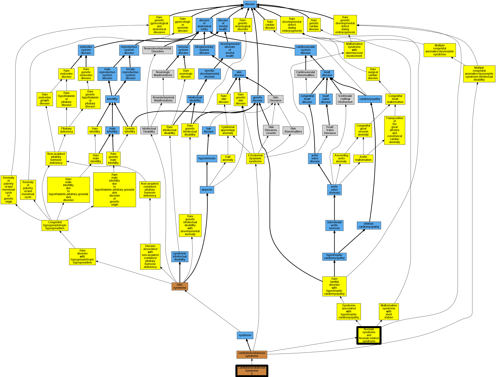

## GENE: MAP2K1

[matched diseases visual](MAP2K1.png)  <-- click on raw to zoom

### CARDIOFACIOCUTANEOUS SYNDROME 3
 * [OMIM:615279 Cardiofaciocutaneous Syndrome 3](http://beta.monarchinitiative.org/disease/OMIM:615279) Confidence: high
    * Syn: "CARDIOFACIOCUTANEOUS SYNDROME 3; CFC3"
    * Syn: "CFC3"

### Cardiofaciocutaneous syndrome 3
 * [OMIM:615279 Cardiofaciocutaneous Syndrome 3](http://beta.monarchinitiative.org/disease/OMIM:615279) Confidence: high
    * Syn: "CARDIOFACIOCUTANEOUS SYNDROME 3; CFC3"
    * Syn: "CFC3"

### Noonan syndrome and Noonan-related syndrome
 * [Orphanet:98733 Noonan syndrome and Noonan-related syndrome](http://beta.monarchinitiative.org/disease/Orphanet:98733) Confidence: high

### Rasopathy
