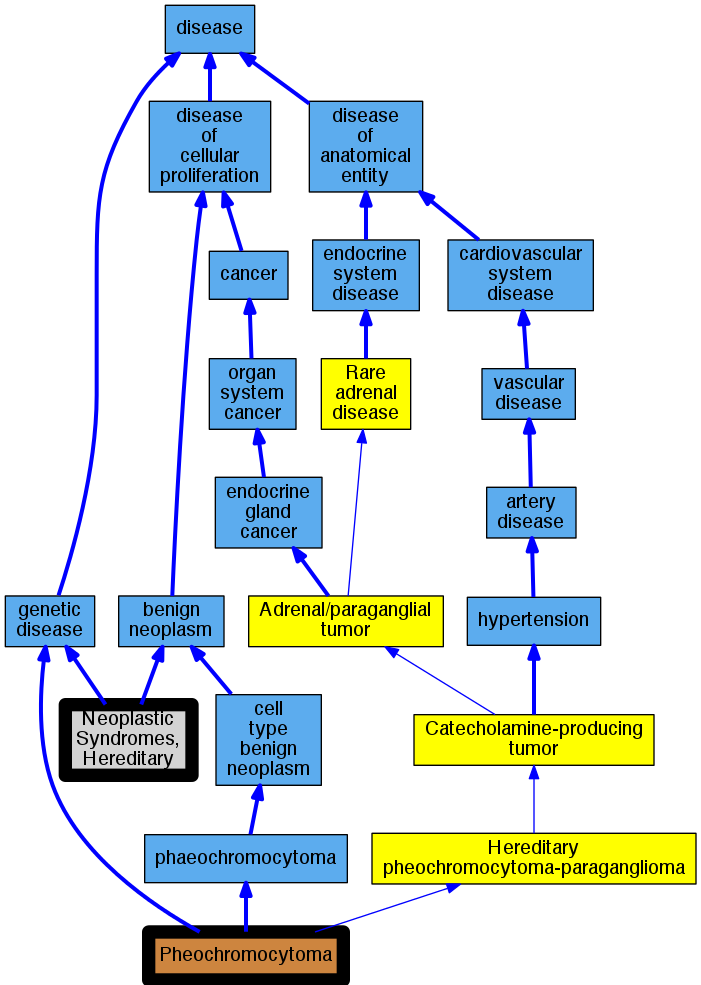

## GENE: MAX

[matched diseases visual](MAX.png)  <-- click on raw to zoom

### Neoplastic Syndromes, Hereditary
 * [MESH:D009386 Neoplastic Syndromes, Hereditary](http://beta.monarchinitiative.org/disease/MESH:D009386) Confidence: high
    * Syn: "Cancer Syndrome, Hereditary"
    * Syn: "Cancer Syndromes, Hereditary"
    * Syn: "Hereditary Cancer Syndrome"
    * Syn: "Hereditary Cancer Syndromes"
    * Syn: "Hereditary Neoplastic Syndrome"
    * Syn: "Hereditary Neoplastic Syndromes"
    * Syn: "Neoplastic Syndrome, Hereditary"
    * Syn: "Syndrome, Hereditary Cancer"
    * Syn: "Syndrome, Hereditary Neoplastic"
    * Syn: "Syndromes, Hereditary Cancer"
    * Syn: "Syndromes, Hereditary Neoplastic"

### PHEOCHROMOCYTOMA, SUSCEPTIBILITY TO
 * [OMIM:171300 phaeochromocytoma](http://beta.monarchinitiative.org/disease/OMIM:171300) Confidence: high
    * Equiv:[DOID:0050771 phaeochromocytoma](http://beta.monarchinitiative.org/disease/DOID:0050771)
    * Equiv:[MESH:D010673 Pheochromocytoma](http://beta.monarchinitiative.org/disease/MESH:D010673)
    * Syn: "Extra-Adrenal Pheochromocytoma"
    * Syn: "Extra-Adrenal Pheochromocytomas"
    * Syn: "PHEOCHROMOCYTOMA"
    * Syn: "Pheochromocytoma, Extra Adrenal"
    * Syn: "Pheochromocytoma, Extra-Adrenal"
    * Syn: "Pheochromocytoma, Susceptibility to"
    * Syn: "Pheochromocytomas"
    * Syn: "Pheochromocytomas, Extra-Adrenal"
