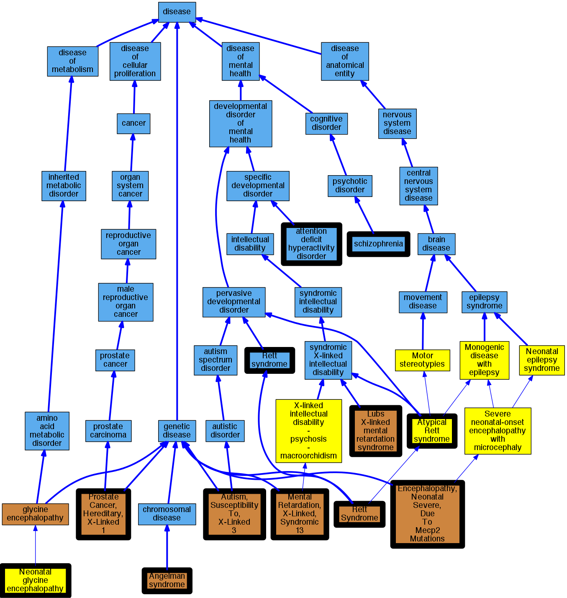

## GENE: MECP2

[matched diseases visual](MECP2.png)  <-- click on raw to zoom

### MENTAL RETARDATION, X-LINKED, SYNDROMIC 13
 * [OMIM:300055 Mental Retardation, X-Linked, Syndromic 13](http://beta.monarchinitiative.org/disease/OMIM:300055) Confidence: high
    * Equiv:[MESH:C563139 Mental Retardation, X-Linked 16](http://beta.monarchinitiative.org/disease/MESH:C563139)
    * Equiv:[MESH:C564724 Mental Retardation with Psychosis, Pyramidal Signs, and Macroorchidism](http://beta.monarchinitiative.org/disease/MESH:C564724)
    * Equiv:[MESH:C566875 Mental Retardation, X-Linked, Syndromic 13](http://beta.monarchinitiative.org/disease/MESH:C566875)
    * Equiv:[MESH:C566876 Mental Retardation, X-Linked 79](http://beta.monarchinitiative.org/disease/MESH:C566876)
    * Equiv:[MESH:C566877 Mental Retardation, X-Linked, With Spasticity](http://beta.monarchinitiative.org/disease/MESH:C566877)
    * Syn: "Mental Retardation With Psychosis, Pyramidal Signs, and Macroorchidism"
    * Syn: "Mental Retardation, X-Linked 16"
    * Syn: "Mental Retardation, X-Linked 79"
    * Syn: "MENTAL RETARDATION, X-LINKED, SYNDROMIC 13; MRXS13"
    * Syn: "Mental Retardation, X-Linked, With Spasticity"
    * Syn: "MRXS13"

### Mental retardation, X-linked, syndromic 13
 * [OMIM:300055 Mental Retardation, X-Linked, Syndromic 13](http://beta.monarchinitiative.org/disease/OMIM:300055) Confidence: high
    * Equiv:[MESH:C563139 Mental Retardation, X-Linked 16](http://beta.monarchinitiative.org/disease/MESH:C563139)
    * Equiv:[MESH:C564724 Mental Retardation with Psychosis, Pyramidal Signs, and Macroorchidism](http://beta.monarchinitiative.org/disease/MESH:C564724)
    * Equiv:[MESH:C566875 Mental Retardation, X-Linked, Syndromic 13](http://beta.monarchinitiative.org/disease/MESH:C566875)
    * Equiv:[MESH:C566876 Mental Retardation, X-Linked 79](http://beta.monarchinitiative.org/disease/MESH:C566876)
    * Equiv:[MESH:C566877 Mental Retardation, X-Linked, With Spasticity](http://beta.monarchinitiative.org/disease/MESH:C566877)
    * Syn: "Mental Retardation With Psychosis, Pyramidal Signs, and Macroorchidism"
    * Syn: "Mental Retardation, X-Linked 16"
    * Syn: "Mental Retardation, X-Linked 79"
    * Syn: "MENTAL RETARDATION, X-LINKED, SYNDROMIC 13; MRXS13"
    * Syn: "Mental Retardation, X-Linked, With Spasticity"
    * Syn: "MRXS13"

### Rett syndrome
 * [DOID:1206 Rett syndrome](http://beta.monarchinitiative.org/disease/DOID:1206) Confidence: high
    * Syn: "cerebroatrophic hyperammonemia"
    * Syn: "Rett's disorder"

### AUTISM, SUSCEPTIBILITY TO, X-LINKED 3
 * [OMIM:300496 Autism, Susceptibility To, X-Linked 3](http://beta.monarchinitiative.org/disease/OMIM:300496) Confidence: high
    * Syn: "AUTISM, SUSCEPTIBILITY TO, X-LINKED 3; AUTSX3"
    * Syn: "AUTSX3"

### Angelman syndrome
 * [OMIM:105830 Angelman syndrome](http://beta.monarchinitiative.org/disease/OMIM:105830) Confidence: high
    * Equiv:[DOID:1932 Angelman syndrome](http://beta.monarchinitiative.org/disease/DOID:1932)
    * Equiv:[MESH:D017204 Angelman Syndrome](http://beta.monarchinitiative.org/disease/MESH:D017204)
    * Syn: "Angelman Syndrome Chromosome Region"
    * Syn: "ANGELMAN SYNDROME; AS"
    * Syn: "AS"
    * Syn: "happy puppet syndrome"
    * Syn: "Happy Puppet Syndrome, Formerly"
    * Syn: "puppetlike syndrome"

### Encephalopathy, neonatal severe
 * [Orphanet:289857 Neonatal glycine encephalopathy](http://beta.monarchinitiative.org/disease/Orphanet:289857) Confidence: low/0.1388888888888889

### Encephalopathy, neonatal severeMental retardation, X-linked, syndromic 13Rett syndrome
 * [OMIM:300055 Mental Retardation, X-Linked, Syndromic 13](http://beta.monarchinitiative.org/disease/OMIM:300055) Confidence: low/0.14274691358024694
    * Equiv:[MESH:C563139 Mental Retardation, X-Linked 16](http://beta.monarchinitiative.org/disease/MESH:C563139)
    * Equiv:[MESH:C564724 Mental Retardation with Psychosis, Pyramidal Signs, and Macroorchidism](http://beta.monarchinitiative.org/disease/MESH:C564724)
    * Equiv:[MESH:C566875 Mental Retardation, X-Linked, Syndromic 13](http://beta.monarchinitiative.org/disease/MESH:C566875)
    * Equiv:[MESH:C566876 Mental Retardation, X-Linked 79](http://beta.monarchinitiative.org/disease/MESH:C566876)
    * Equiv:[MESH:C566877 Mental Retardation, X-Linked, With Spasticity](http://beta.monarchinitiative.org/disease/MESH:C566877)
    * Syn: "Mental Retardation With Psychosis, Pyramidal Signs, and Macroorchidism"
    * Syn: "Mental Retardation, X-Linked 16"
    * Syn: "Mental Retardation, X-Linked 79"
    * Syn: "MENTAL RETARDATION, X-LINKED, SYNDROMIC 13; MRXS13"
    * Syn: "Mental Retardation, X-Linked, With Spasticity"
    * Syn: "MRXS13"

### LUBS X-LINKED MENTAL RETARDATION SYNDROME
 * [OMIM:300260 Lubs X-linked mental retardation syndrome](http://beta.monarchinitiative.org/disease/OMIM:300260) Confidence: high
    * Equiv:[MESH:C537723 Lubs X-linked mental retardation syndrome](http://beta.monarchinitiative.org/disease/MESH:C537723)
    * Syn: "LUBS X-LINKED MENTAL RETARDATION SYNDROME; MRXSL"
    * Syn: "Mecp2 Duplication Syndrome"
    * Syn: "Mental Retardation, X-Linked, Syndromic, Lubs Type"
    * Syn: "Mental Retardation, X-Linked, With Recurrent Respiratory Infections"
    * Syn: "MRXSL"

### Rett Syndrome
 * [DOID:1206 Rett syndrome](http://beta.monarchinitiative.org/disease/DOID:1206) Confidence: high
    * Syn: "cerebroatrophic hyperammonemia"
    * Syn: "Rett's disorder"

### Attention deficit hyperactivity disorder
 * [DOID:1094 attention deficit hyperactivity disorder](http://beta.monarchinitiative.org/disease/DOID:1094) Confidence: high
    * Syn: "ADHD"
    * Syn: "attention deficit disorder"
    * Syn: "hyperkinetic disorder"

### ENCEPHALOPATHY, NEONATAL SEVERE, DUE TO MECP2 MUTATION
 * [OMIM:300673 Encephalopathy, Neonatal Severe, Due To Mecp2 Mutations](http://beta.monarchinitiative.org/disease/OMIM:300673) Confidence: low/0.15306122448979592
    * Equiv:[MESH:C566878 Encephalopathy, Neonatal Severe, Due To Mecp2 Mutations](http://beta.monarchinitiative.org/disease/MESH:C566878)
    * Syn: "ENCEPHALOPATHY, NEONATAL SEVERE, DUE TO MECP2 MUTATIONS"

### RETT SYNDROME
 * [DOID:1206 Rett syndrome](http://beta.monarchinitiative.org/disease/DOID:1206) Confidence: high
    * Syn: "cerebroatrophic hyperammonemia"
    * Syn: "Rett's disorder"

### Schizophrenia
 * [DOID:5419 schizophrenia](http://beta.monarchinitiative.org/disease/DOID:5419) Confidence: high
    * Syn: "schizophrenia-1"

### Austism susceptibility, X-linked
 * [OMIM:300147 Prostate Cancer, Hereditary, X-Linked 1](http://beta.monarchinitiative.org/disease/OMIM:300147) Confidence: low/0.12
    * Syn: "HPCX1"
    * Syn: "Prostate Cancer Susceptibility, X-Linked"
    * Syn: "PROSTATE CANCER, HEREDITARY, X-LINKED 1; HPCX1"

### RETT SYNDROME, ATYPICAL
 * [Orphanet:3095 Atypical Rett syndrome](http://beta.monarchinitiative.org/disease/Orphanet:3095) Confidence: high

### RETT SYNDROME, ZAPPELLA VARIANT
 * [OMIM:312750 Rett Syndrome](http://beta.monarchinitiative.org/disease/OMIM:312750) Confidence: high
    * Equiv:[MESH:C564063 Rett Syndrome, Preserved Speech Variant](http://beta.monarchinitiative.org/disease/MESH:C564063)
    * Equiv:[MESH:C567442 Rett Syndrome, Zappella Variant](http://beta.monarchinitiative.org/disease/MESH:C567442)
    * Equiv:[MESH:C567576 Rett Syndrome, Atypical](http://beta.monarchinitiative.org/disease/MESH:C567576)
    * Equiv:[MESH:D015518 Rett Syndrome](http://beta.monarchinitiative.org/disease/MESH:D015518)
    * Syn: "Autism, Dementia, Ataxia, and Loss of Purposeful Hand Use"
    * Syn: "Rett Syndrome, Atypical"
    * Syn: "Rett Syndrome, Preserved Speech Variant"
    * Syn: "Rett Syndrome, Zappella Variant"
    * Syn: "RETT SYNDROME; RTT"
    * Syn: "Rts"
    * Syn: "RTT"

### Rett's disorder
 * [DOID:1206 Rett syndrome](http://beta.monarchinitiative.org/disease/DOID:1206) Confidence: high
    * Syn: "cerebroatrophic hyperammonemia"
    * Syn: "Rett's disorder"
