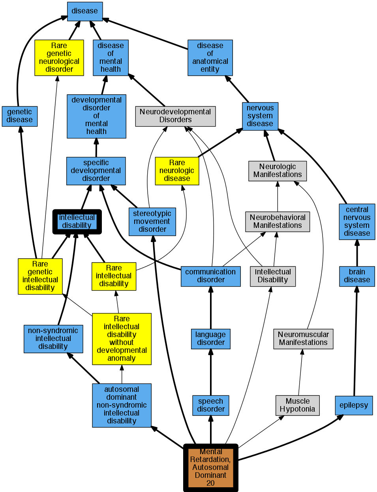

## GENE: MEF2C

[matched diseases visual](MEF2C.png)  <-- click on raw to zoom

### MENTAL RETARDATION, AUTOSOMAL DOMINANT 20
 * [DOID:1059 intellectual disability](http://beta.monarchinitiative.org/disease/DOID:1059) Confidence: low/0.12
    * Equiv:[MESH:D008607 Intellectual Disability](http://beta.monarchinitiative.org/disease/MESH:D008607)
    * Syn: "Deficiencies, Mental"
    * Syn: "Deficiency, Mental"
    * Syn: "Development Disorder, Intellectual"
    * Syn: "Development Disorders, Intellectual"
    * Syn: "Disabilities, Intellectual"
    * Syn: "Disability, Intellectual"
    * Syn: "Disorder, Intellectual Development"
    * Syn: "Disorders, Intellectual Development"
    * Syn: "Idiocy"
    * Syn: "Intellectual Development Disorder"
    * Syn: "Intellectual Development Disorders"
    * Syn: "Intellectual Disabilities"
    * Syn: "Mental Deficiencies"
    * Syn: "Mental Deficiency"
    * Syn: "Mental Retardation"
    * Syn: "mental retardation"
    * Syn: "MENTAL RETARDATION, AUTOSOMAL RECESSIVE 15"
    * Syn: "Mental Retardation, Psychosocial"
    * Syn: "Mental Retardations, Psychosocial"
    * Syn: "Psychosocial Mental Retardation"
    * Syn: "Psychosocial Mental Retardations"
    * Syn: "Retardation, Mental"
    * Syn: "Retardation, Psychosocial Mental"
    * Syn: "Retardations, Psychosocial Mental"

### Mental retardation, stereotypic movements, epilepsy, and/or cerebral malformations
 * [OMIM:613443 5q14.3 microdeletion syndrome](http://beta.monarchinitiative.org/disease/OMIM:613443) Confidence: high
    * Equiv:[Orphanet:228384 5q14.3 microdeletion syndrome](http://beta.monarchinitiative.org/disease/Orphanet:228384)
    * Syn: "Chromosome 5Q14.3 Deletion Syndrome, Proximal"
    * Syn: "Del(5)(q14.3)"
    * Syn: "MENTAL RETARDATION, AUTOSOMAL DOMINANT 20; MRD20"
    * Syn: "Mental Retardation, Stereotypic Movements, Epilepsy, And/Or Cerebral Malformations"
    * Syn: "Monosomy 5q14.3"
    * Syn: "MRD20"
