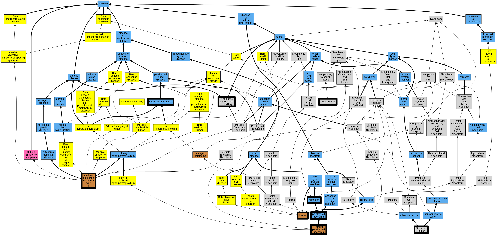

## GENE: MEN1

[matched diseases visual](MEN1.png)  <-- click on raw to zoom

### ADRENAL ADENOMA, SOMATIC
 * [MESH:D000236 Adenoma](http://beta.monarchinitiative.org/disease/MESH:D000236) Confidence: low/0.1388888888888889

### ANGIOFIBROMA, SOMATIC
 * [MESH:D018322 Angiofibroma](http://beta.monarchinitiative.org/disease/MESH:D018322) Confidence: low/0.15625

### CARCINOID TUMOR OF LUNG
 * [OMIM:114900 Carcinoid Tumors, Intestinal](http://beta.monarchinitiative.org/disease/OMIM:114900) Confidence: low/0.11458333333333333
    * Equiv:[MESH:C562842 Carcinoid Tumors, Intestinal](http://beta.monarchinitiative.org/disease/MESH:C562842)
    * Syn: "CARCINOID TUMORS, INTESTINAL"

### HYPERPARATHYROIDISM, FAMILIAL ISOLATED PRIMARY
 * [OMIM:145000 Hyperparathyroidism 1](http://beta.monarchinitiative.org/disease/OMIM:145000) Confidence: high
    * Equiv:[MESH:C564166 Hyperparathyroidism 1](http://beta.monarchinitiative.org/disease/MESH:C564166)
    * Syn: "HRPT1"
    * Syn: "HYPERPARATHYROIDISM 1; HRPT1"
    * Syn: "Hyperparathyroidism, Familial Isolated Primary"
    * Syn: "Parathyroid Adenoma, Familial"

### Hyperparathyroidism
 * [DOID:13543 hyperparathyroidism](http://beta.monarchinitiative.org/disease/DOID:13543) Confidence: high
    * Equiv:[MESH:D006961 Hyperparathyroidism](http://beta.monarchinitiative.org/disease/MESH:D006961)

### LIPOMA, SOMATIC
 * [OMIM:151900 Lipomatosis, Multiple](http://beta.monarchinitiative.org/disease/OMIM:151900) Confidence: low/0.15625
    * Syn: "Lipoma"
    * Syn: "Lipomatosis, Familial Multiple"
    * Syn: "LIPOMATOSIS, MULTIPLE"

### MULTIPLE ENDOCRINE NEOPLASIA, TYPE I
 * [OMIM:131100 multiple endocrine neoplasia type 1](http://beta.monarchinitiative.org/disease/OMIM:131100) Confidence: low/0.19097222222222224
    * Equiv:[DOID:10017 multiple endocrine neoplasia type 1](http://beta.monarchinitiative.org/disease/DOID:10017)
    * Equiv:[MESH:D018761 Multiple Endocrine Neoplasia Type 1](http://beta.monarchinitiative.org/disease/MESH:D018761)
    * Syn: "Endocrine Adenomatosis, Multiple"
    * Syn: "Mea 1"
    * Syn: "Men 1"
    * Syn: "MEN type I"
    * Syn: "MEN1"
    * Syn: "Men1 Somatic Mutations"
    * Syn: "multiple endocrine neoplasia type 1"
    * Syn: "MULTIPLE ENDOCRINE NEOPLASIA, TYPE I; MEN1"
    * Syn: "Wermer Syndrome"
    * Syn: "Wermer syndrome"
    * Syn: "Wermer's syndrome"

### Multiple Endocrine Neoplasia Type 1
 * [OMIM:131100 multiple endocrine neoplasia type 1](http://beta.monarchinitiative.org/disease/OMIM:131100) Confidence: high
    * Equiv:[DOID:10017 multiple endocrine neoplasia type 1](http://beta.monarchinitiative.org/disease/DOID:10017)
    * Equiv:[MESH:D018761 Multiple Endocrine Neoplasia Type 1](http://beta.monarchinitiative.org/disease/MESH:D018761)
    * Syn: "Endocrine Adenomatosis, Multiple"
    * Syn: "Mea 1"
    * Syn: "Men 1"
    * Syn: "MEN type I"
    * Syn: "MEN1"
    * Syn: "Men1 Somatic Mutations"
    * Syn: "multiple endocrine neoplasia type 1"
    * Syn: "MULTIPLE ENDOCRINE NEOPLASIA, TYPE I; MEN1"
    * Syn: "Wermer Syndrome"
    * Syn: "Wermer syndrome"
    * Syn: "Wermer's syndrome"

### Multiple endocrine neoplasia, type 1
 * [OMIM:131100 multiple endocrine neoplasia type 1](http://beta.monarchinitiative.org/disease/OMIM:131100) Confidence: high
    * Equiv:[DOID:10017 multiple endocrine neoplasia type 1](http://beta.monarchinitiative.org/disease/DOID:10017)
    * Equiv:[MESH:D018761 Multiple Endocrine Neoplasia Type 1](http://beta.monarchinitiative.org/disease/MESH:D018761)
    * Syn: "Endocrine Adenomatosis, Multiple"
    * Syn: "Mea 1"
    * Syn: "Men 1"
    * Syn: "MEN type I"
    * Syn: "MEN1"
    * Syn: "Men1 Somatic Mutations"
    * Syn: "multiple endocrine neoplasia type 1"
    * Syn: "MULTIPLE ENDOCRINE NEOPLASIA, TYPE I; MEN1"
    * Syn: "Wermer Syndrome"
    * Syn: "Wermer syndrome"
    * Syn: "Wermer's syndrome"

### Neoplastic Syndromes, Hereditary
 * [MESH:D009386 Neoplastic Syndromes, Hereditary](http://beta.monarchinitiative.org/disease/MESH:D009386) Confidence: high

### PARATHYROID ADENOMA, SOMATIC
 * [DOID:7608 parathyroid adenoma](http://beta.monarchinitiative.org/disease/DOID:7608) Confidence: low/0.18055555555555555
    * Syn: "adenoma of parathyroid"
    * Syn: "adenoma of the Parathyroid gland"
